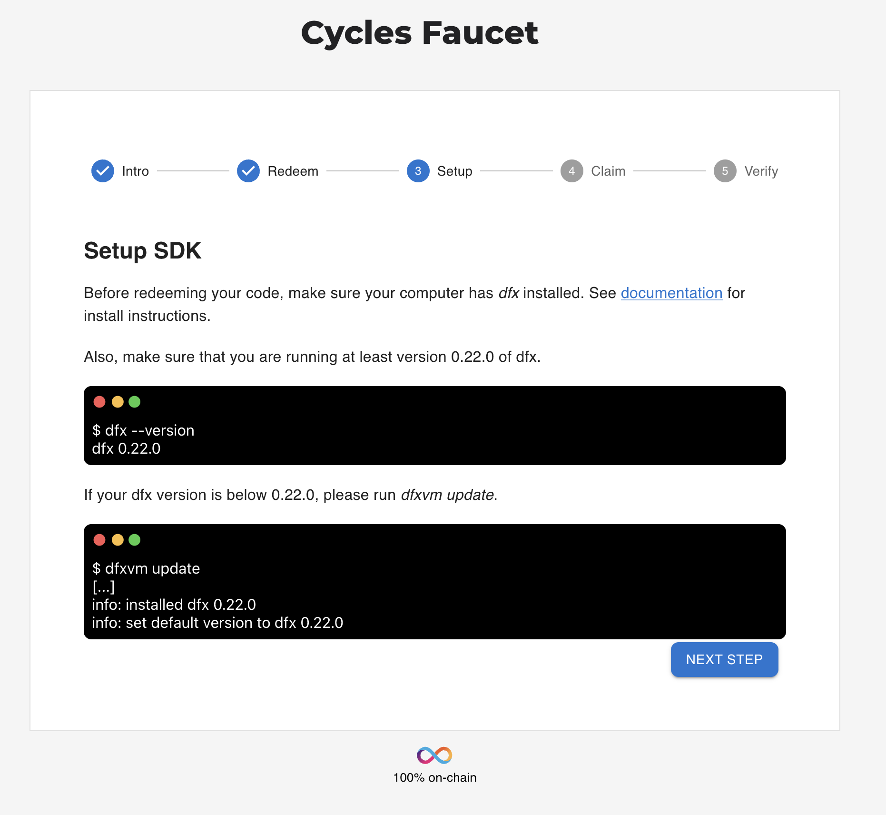
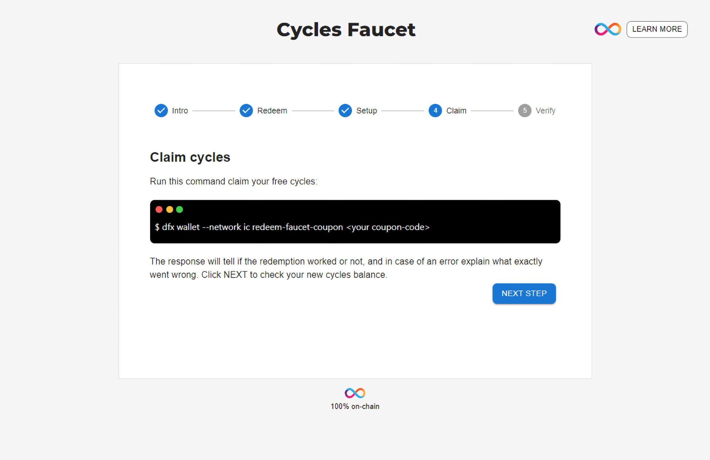
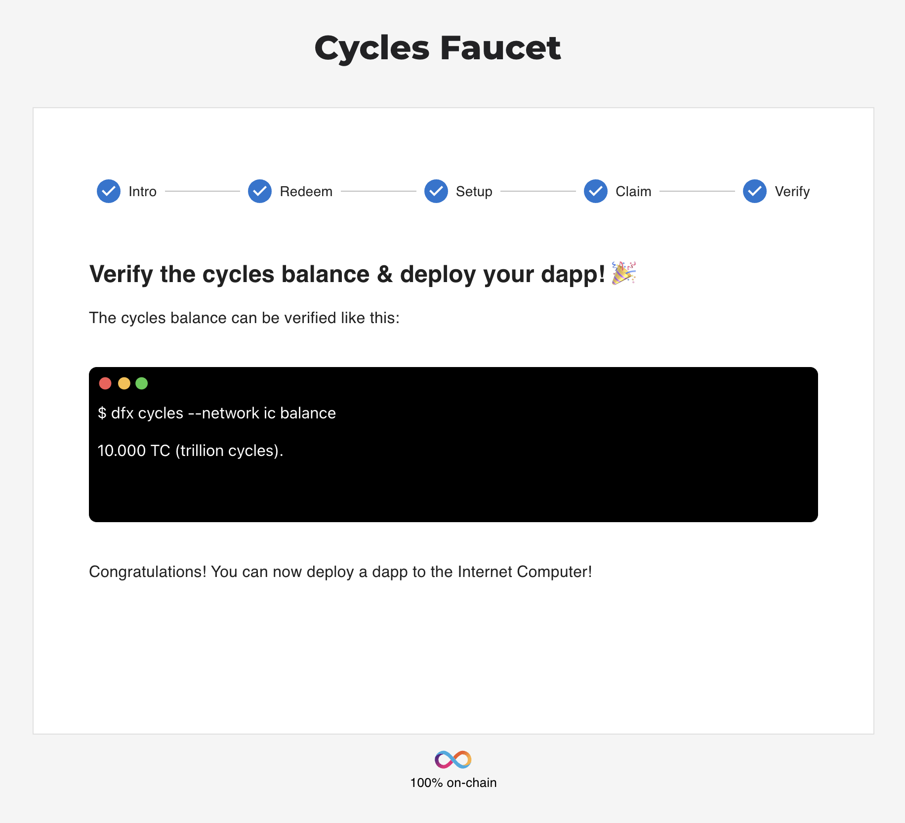

import { MarkdownChipRow } from "/src/components/Chip/MarkdownChipRow";
import { GlossaryTooltip } from "/src/components/Tooltip/GlossaryTooltip";

# Getting started with free cycles

<MarkdownChipRow labels={["Beginner", "Tutorial"]} />

## What are ICP cycles?
The Internet Computer Protocol runs on a network of nodes owned and operated by a growing community of independent node providers (NPs) distributed across the globe. NPs spend money for running nodes, e.g. they purchase hardware and require electricity and network bandwidth. The Internet Computer Protocol compensates NPs on a monthly basis by minting and distributing rewards in the form of ICP tokens.

To make ICP sustainable, <GlossaryTooltip>canisters</GlossaryTooltip> are required to pay for the resources they consume, e.g. storage and compute. Resource consumption is not paid in ICP tokens but **cycles**. It’s typically the canister’s developer who charges the canister with cycles. As the canister is used, its cycles balance is continuously reduced. Eventually, the canister needs to be “topped up” with more cycles. The default way to get cycles is to convert ICP tokens to cycles. When doing so, the protocol burns the ICP tokens.

## Why are cycles different from ICP tokens?

While the value of an ICP token is volatile, cycles are not. They are pegged to [XDR](https://en.wikipedia.org/wiki/Special_drawing_rights), a basket of fiat currencies. This has the benefit that resource consumption, e.g. smart contract executions, on ICP has a somewhat stable price.

:::info
Cycles are measured in very large numbers, such as billions and trillions. When you talk about cycle transfers and replenishment, you will usually operate with trillions of cycles.
:::

This guide explains how to use **cycles faucet** to acquire your first amount of 10T free cycles that could be used to deploy your dapps on the mainnet.

## Prerequisites

- [x] Install Internet Computer SDK following [this guide](/docs/current/developer-docs/getting-started/install/).

## Step 1: Get a coupon.

First, you will need to navigate to /<https://faucet.dfinity.org/>. You will need to put in a request for cycles on the [DFINITY dev official Discord](https://discord.gg/jnjVVQaE2C) server. You can click on the **REQUEST CYCLES** button on the faucet page to join the Discord server.


## Step 2: Once inside the Discord server, navigate into the `#cycles-faucet` channel.


## Step 3: In this channel, execute the following slash command:

> /request

## Step 4: After you send this message, you are prompted to fill out a survey.

## Step 5: Once completed, our team will review your submission. If accepted, the faucet bot will send you a private message with a coupon code.

:::caution
Please ensure that your Discord settings are set to allow direct messages from other users. If you do not have this setting enabled, you will not receive a direct message from the faucet bot.
:::

## Step 6: Head back to the <https://faucet.dfinity.org> webpage.

Now, click **NEXT STEP** to continue.

## Step 7: Redeem the coupon.

Now that you have a coupon code, enter your coupon code within the faucet UI.


Click **NEXT STEP** to continue.

## Step 8: Setup the IC SDK.

Next, confirm your computer has `dfx` installed. Run this command to check the version of `dfx` on your computer:

    dfx --version

If your `dfx` version is below 0.12.0, please run this command:

    dfx upgrade



Click **NEXT STEP** to continue.

## Step 9: Create a new identity to claim your cycles.

To create a new identity, use the command:

```
dfx identity new MyNewIdentity
```

Your identity's seed phrase will be returned. Be sure to save this in a secure location.

Then, set this identity to be used by default:

```
dfx identity use MyNewIdentity
```

## Step 10: Now, claim your cycles.

You will need to claim your free cycles by running this command:

```
dfx cycles --network ic redeem-faucet-coupon <your-coupon-code>
```

:::info
This workflow utilizes the **cycles ledger** feature. If you'd like to use the **cycles wallet** instead, [view the cycles wallet documentation](/docs/current/developer-docs/getting-started/cycles/cycles-wallet).

Please note that the cycles wallet will be removed from dfx in a future release.
:::



Click **NEXT STEP** to continue.

## Step 11: Verify your balance

The last step is to verify the coupon was redeemed correctly by checking your balance using the `dfx cycles --network ic balance` command:



## Conclusion

Now you are ready to deploy a canister on the mainnet!

## Resources
To further explore cycle management please see the following articles:
- **[Using a cycles wallet](/docs/current/developer-docs/getting-started/cycles/cycles-wallet)**.
- **[Getting free cycles from DFINITY cycles faucet](/docs/current/developer-docs/getting-started/cycles/cycles-faucet)**.
- **[Converting ICP tokens into cycles](/docs/current/developer-docs/getting-started/cycles/converting_icp_tokens_into_cycles)**.


