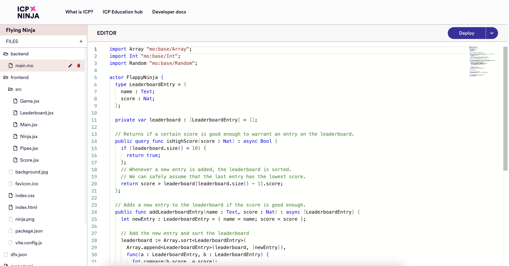
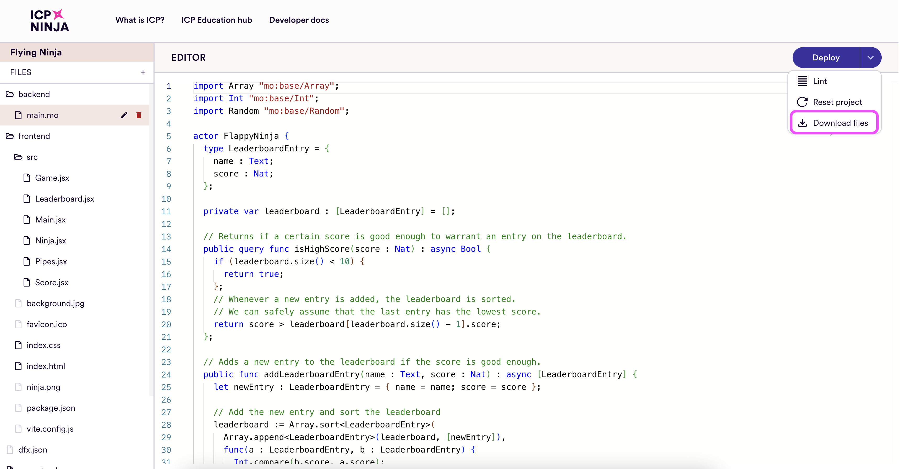

import TabItem from "@theme/TabItem";
import { AdornedTabs } from "/src/components/Tabs/AdornedTabs";
import CodeBlock from "@theme/CodeBlock";
import { MarkdownChipRow } from "/src/components/Chip/MarkdownChipRow";
import { GlossaryTooltip } from "/src/components/Tooltip/GlossaryTooltip";

# Explore examples

<MarkdownChipRow labels={["Beginner", "Getting started", "Tutorial"]} />

## Overview

[ICP Ninja](https://icp.ninja) is a web-based integrated development environment (IDE) for creating and deploying decentralized applications (dapps) on the Internet Computer (ICP). To develop a dapp on ICP, you will need to create <GlossaryTooltip>canisters</GlossaryTooltip>, an advanced type of smart contract that can host an application's frontend, backend, and data.



ICP Ninja serves as an introduction to developing on ICP and learning about:

- [ICP terminology](/docs/current/references/glossary), such as **canister**, **Motoko**, **principal**, **HTTPS outcalls**, and more.

- How ICP dapps can be structured.

- How dapps are deployed to ICP.

- ICP's unique features, such as [randomness](/docs/current/developer-docs/smart-contracts/advanced-features/randomness), [timers](/docs/current/developer-docs/smart-contracts/advanced-features/periodic-tasks), and [HTTPS outcalls](/docs/current/developer-docs/smart-contracts/advanced-features/https-outcalls/https-outcalls-overview).

ICP Ninja provides a gallery of example projects you can explore to learn about different application types, architectures, and use cases. Example projects can be edited, then deployed to ICP directly from your web browser. Once deployed, you can open the application's frontend in your browser, share the public link with friends to show them your new onchain dapp, or make calls directly to the backend through the [Candid UI](/docs/current/developer-docs/smart-contracts/candid/candid-concepts).

## Using ICP Ninja

From the [ICP Ninja homepage](https://icp.ninja), select an example project to get started. You can filter the project gallery by project type, language, and skill level. Project variations are available for Motoko and Rust backend source code. Each ICP Ninja project, regardless of backend language, uses the JavaScript React framework for the application frontend.

The "Hello, World!" example is the most beginner-oriented project available. It resembles the default project template available through the command-line tool [`dfx`](/docs/current/developer-docs/getting-started/install).

### Exploring the project's code

Once a project is open in the ICP Ninja code editor, you can:

- Learn more about the project's functionality, features, and structure by reading the project's `README.md` file.

- Make revisions to the project's frontend by editing files in the `frontend` folder. Some files will be immutable and grayed out.

- Review or edit the backend code in the `backend/main.mo` (Motoko projects) or `backend/lib.rs` (Rust projects) file.

### Deploying to ICP

To deploy the project onto the ICP mainnet, select the "Deploy" button. At the bottom of the screen, the "Build log" tab will show output that describes the project's deployment progress, such as:

```
→ Reserving canisters
→ Building backend
→ Generating backend declarations
→ Building frontend
...
```

Once deployed, you will receive two URLs:

```
Backend canister smart contract:
https://a4gq6-oaaaa-aaaab-qaa4q-cai.icp1.io/?id=ts425-saaaa-aaaab-qbksq-cai
🥷🚀🎉 Frontend is available at:
https://2drrs-wqaaa-aaaab-qblbq-cai.icp1.io
```

The **backend canister** URL will open the [Candid UI](/docs/current/developer-docs/smart-contracts/candid/candid-concepts) which can be used to interact directly with the backend canister's methods. A **method** is a function exposed by the canister that can be called by a user, another canister, or the application's frontend.

The **frontend** URL will open the application's frontend user interface. To create this frontend, the project's React files (shown in the ICP Ninja code editor within the `frontend/` folder) have been compiled and deployed as an [asset canister](/docs/current/developer-docs/web-apps/application-frontends/default-frontend).

This application will be live for 20 minutes. After 20 minutes, it will expire, and the URLs will become invalid. The project code will still be accessible, and you can redeploy the application at any time to view it for another 20 minutes.

To make edits to the project after it has been deployed, simply edit the code within the ICP Ninja code editor, then select "Redeploy." Redeploying the project will reset the 20-minute deployment timer and apply any changes you made to the project's files since the last deployment.

## Limitations

Projects deployed to ICP through ICP Ninja are temporary and will expire after 20 minutes. It also implements limitations in regards to available ICP features and project structure. This is because ICP Ninja is designed as a tool to educate developers on the basics of ICP and allow them to get some experience with the development workflow and structure. It is not designed to develop complex applications and replace tooling such as `dfx`.

## Learn more about ICP Ninja

To learn more about ICP Ninja and its available features, refer to the [ICP Ninja documentation](https://icp.ninja/what-is-icp#faq).

## ICP Ninja developer path

ICP Ninja is an educational tool that provides a low-friction way to build and deploy applications **temporarily** to ICP. Once you are ready to either deploy your ICP Ninja project longer than the temporary allocated time or start building more complex, advanced projects, you will need to follow these steps:

1. [Download the ICP Ninja project's files](#downloading-the-projects-files) if you want to continue building with them. If you'd like to create a new project from scratch, continue to the next step.

2. [Install `dfx`](/docs/current/developer-docs/getting-started/install).

3. Create a [developer identity](/docs/current/developer-docs/getting-started/identities).

4. Learn about [tokens and cycles](/docs/current/developer-docs/getting-started/tokens-and-cycles).

5. [Write new code or continue editing the downloaded ICP Ninja project files](/docs/current/developer-docs/getting-started/writing-smart-contracts).

6. Learn how to [deploy and manage](/docs/current/developer-docs/getting-started/deploy-and-manage) your project for long-term, professional development.

## Next steps

When you are ready to begin developing locally, either:

- Proceed to the next step, [install tools](/docs/current/developer-docs/getting-started/install), to install `dfx` and set up your local developer environment.
    - **Choose this option if you'd like to start a new project from scratch**.

- Download your ICP Ninja project files by selecting the dropdown menu next to the "Deploy" button, then select "Download files." Then, proceed to the next step, [install tools](/docs/current/developer-docs/getting-started/install).
    - **Choose this option if you'd like to continue building with your ICP Ninja project.**

