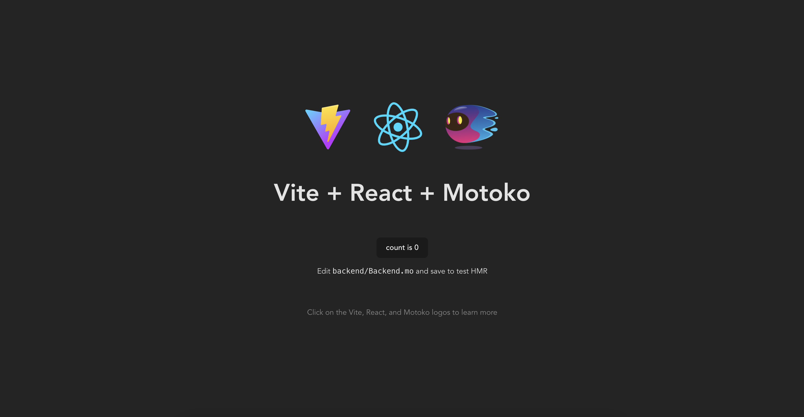

import DfxNewSnippet from "/src/components/Snippets/DfxNewSnippet.mdx";
import { MarkdownChipRow } from "/src/components/Chip/MarkdownChipRow";
import { GlossaryTooltip } from "/src/components/Tooltip/GlossaryTooltip";


# Quickstart for React developers

<MarkdownChipRow labels={["Beginner", "Getting started", "Quickstart"]} />

## Overview

On ICP, frontend UIs for decentralized applications can be hosted in a <GlossaryTooltip>canister</GlossaryTooltip>, often referred to as the dapp's frontend canister or asset canister. Frontend canisters host the code and assets for a dapp's user interface, which typically includes HTML, CSS, JavaScript, or React code.

One key feature of ICP is its ability to serve canister assets directly in a web browser using the canister's mainnet URL. This means that when a frontend canister is deployed on the mainnet, users from around the world can access it using only the canister's URL, without requiring that the developer set up a domain name or other web service configuration.

When developing on ICP, the primary tool used by developers is the [IC SDK](/docs/current/developer-docs/getting-started/install/). The IC SDK includes the tool `dfx`, which is a CLI tool used to create, manage, and deploy dapps. When a new project is created with `dfx`, by default the project includes a frontend and backend canister that creates a simple 'Hello, world!' dapp. You can learn more about `dfx` in the documentation [here](/docs/current/tutorials/developer-journey/level-0/intro-dfx).

## Creating a new ICP project

To create your own dapp, you can either edit the default template created by `dfx` which provides a framework for a backend canister and frontend canister, use an example or boilerplate project repository, or create a project from scratch.

To create a new project with `dfx`, first assure you have downloaded and installed the [IC SDK](/docs/current/developer-docs/getting-started/install/). Then, you can run the command:

<DfxNewSnippet />

By default, the dapp's frontend assets are stored in the `src/my_project_frontend` subdirectory, which contains an `assets` directory used to store frontend assets and a `src` directory used to store the frontend code. To customize your dapp's frontend, you can make changes to the files in the `src/my_project_frontend/assets` and `src/my_project_frontend/src` subdirectories.

## Creating custom frontend code and assets

When developing frontend UIs, there are several frontend frameworks that can be used, such as [JavaScript](/docs/current/developer-docs/web-apps/application-frontends/overview), [Svelte](/docs/current/developer-docs/web-apps/application-frontends/overview), and [Vue](/docs/current/developer-docs/web-apps/application-frontends/overview).

Another popular choice is React. React is a library used for creating native or web user interfaces. It uses JavaScript functions to facilitate the creation of React components, which can be used to receive data from an app's backend and return the output to the frontend UI. React is designed to create a framework for seamlessly combining components written by all different people, organizations, or teams. It is a popular choice for building the frontend of dapps, as it is versatile and has a rich ecosystem of packages that can be utilized by developers.

On ICP, there are several boilerplate dapp templates that use React, such as the [React frontend example](/docs/current/developer-docs/web-apps/application-frontends/overview). In this guide, you will explore two other boilerplate templates that can be used for creating frontend UIs with React.

## Creating a React dapp with a button

In this example project, you will use the Motoko React TypeScript template to create a React frontend dapp on ICP that uses a simple `counter` method to increment a value when a button on the frontend UI is clicked.

### Prerequisites

Before you start, verify the following:

- [x] You have an internet connection.

- [x] You have a command line interface (CLI) window open. This window is also referred to as the 'terminal' window.

- [x] You have downloaded and installed the IC SDK package as described in the [installing the IC SDK](/docs/current/developer-docs/getting-started/install/) page.

- [x] You have a code editor installed. The [VSCode IDE](https://code.visualstudio.com/download) is a popular choice.

### Step 1: Download the Motoko React template.

:::info
This example uses Typescript. If you're looking for a JavaScript example, check out our documentation [here](/docs/current/developer-docs/web-apps/application-frontends/overview).
:::

To download the Motoko React template project, first create a new, empty directory, then download the project template using the commands:

```
mkdir react-project
cd react-project
npx degit rvanasa/vite-react-motoko
```

You can view the template's GitHub repo [here](https://github.com/rvanasa/vite-react-motoko/tree/main/src).

In this project, there is a frontend canister that provides a UI using React code stored in the `src/App.tsx` file, CSS styling code stored in `src/App.css`, and an index page stored at `src/index.html`. This project also contains a backend canister with code stored in the `backend/Backend.mo` file, which the frontend canister interacts with.

The `src/App.tsx` file by default contains the following content:

```typescript
import { useEffect, useState } from 'react';
import './App.css';
import motokoLogo from './assets/motoko_moving.png';
import motokoShadowLogo from './assets/motoko_shadow.png';
import reactLogo from './assets/react.svg';
import viteLogo from './assets/vite.svg';
import { backend } from './declarations/backend';

function App() {
  const [count, setCount] = useState<number | undefined>();
  const [loading, setLoading] = useState(false);

  // Get the current counter value
  const fetchCount = async () => {
    try {
      setLoading(true);
      const count = await backend.get();
      setCount(+count.toString()); // Convert BigInt to number
    } catch (err) {
      console.error(err);
    } finally {
      setLoading(false);
    }
  };

  const increment = async () => {
    if (loading) return; // Cancel if waiting for a new count
    try {
      setLoading(true);
      await backend.inc(); // Increment the count by 1
      await fetchCount(); // Fetch the new count
    } finally {
      setLoading(false);
    }
  };

  // Fetch the count on page load
  useEffect(() => {
    fetchCount();
  }, []);

  return (
    <div className="App">
      <div>
        <a href="https://vitejs.dev" target="_blank">
          
        </a>
        <a href="https://reactjs.org" target="_blank">
          
        </a>
        <a
          href="/docs/current/developer-docs/build/cdks/motoko-dfinity/motoko/"
          target="_blank"
        >
          <span className="logo-stack">
            
            
          </span>
        </a>
      </div>
      <h1>Vite + React + Motoko</h1>
      <div className="card">
        <button onClick={increment} style={{ opacity: loading ? 0.5 : 1 }}>
          count is {count}
        </button>
        <p>
          Edit <code>backend/Backend.mo</code> and save to test HMR
        </p>
      </div>
      <p className="read-the-docs">
        Click on the Vite, React, and Motoko logos to learn more
      </p>
    </div>
  );
}

export default App;
```

This frontend UI interacts with the backend canister to provide a UI button that increases a counter value when clicked. To provide the counter functionality, the frontend communicates with a simple counter program stored in the backend canister, which contains the following code:

```motoko
actor class Backend() {
  stable var counter = 0;

  // Get the current count
  public query func get() : async Nat {
    counter;
  };

  // Increment the count by one
  public func inc() : async () {
    counter += 1;
  };

  // Add `n` to the current count
  public func add(n : Nat) : async () {
    counter += n;
  };
};
```

### Step 2: Start a local <GlossaryTooltip>replica</GlossaryTooltip>.

Start a local replica with `dfx` using the command:

```
dfx start --clean --background
```

### Step 3: Setup the project using npm.

Next, run the following command to setup the project using npm:

```
npm run setup
```

In the background, this command runs the following processes:

```
npm i && dfx canister create backend && dfx generate backend && dfx deploy
```

The output of this command will return the local <GlossaryTooltip>canister</GlossaryTooltip> URLs for the frontend and backend canisters:

```
Deployed canisters.
URLs:
  Frontend canister via browser
    frontend: http://127.0.0.1:4943/?canisterId=a3shf-5eaaa-aaaaa-qaafa-cai
  Backend canister via Candid interface:
    backend: http://127.0.0.1:4943/?canisterId=a4tbr-q4aaa-aaaaa-qaafq-cai&id=asrmz-lmaaa-aaaaa-qaaeq-cai
```

### Step 4: Start the local development server.

Before interacting with the React interface running in the frontend canister, start the local development server with the command:

```
npm start
```

The output of this command will provide the local development URL, such as `http://127.0.0.1:3001/`:

```
VITE v4.3.9  ready in 206 ms

  ➜  Local:   http://127.0.0.1:3001/
  ➜  Network: use --host to expose
  ➜  press h to show help
11:09:24 AM [mo-dev] backend → http://127.0.0.1:4943?canisterId=a4tbr-q4aaa-aaaaa-qaafq-cai&id=asrmz-lmaaa-aaaaa-qaaeq-cai
11:09:25 AM [mo-dev] generate
11:09:26 AM [mo-dev] deploy backend
```

Navigate to this local URL in a web browser. You'll see the template Motoko React frontend interface:



If you click on the 'count is 0' button, you can increase the counter value:


For example, if you click the button 3 times, the count value will be `3`:


### Creating a React `profile` component

Now that you've explored the sample React template, let's take a look at how to edit the project's `src/App.tsx` create different React components.

First, to create a component that can be used to display a user's profile name and image, replace the `src.App.tsx` code with the following React component:

```typescript
import { useEffect, useState } from 'react';
import './App.css';

const user = {
  name: 'Motoko ghost',
  imageUrl: 'assets/motoko.png',
  imageSize: 90,
};

export default function Profile() {
  return (
    <>
      <h1>{user.name}</h1>
      
    </>
  );
}
```

### Reviewing the dapp's stylesheet

You will notice that the styling of the page has remained the same, despite the content changing. That's because the styling is defined in the `src/App.css` file, which is imported into the code with the line `import ./App.css`. To change the styling, open and edit the `.css` file which will contain the following stylistic definitions:

```css
#root {
  max-width: 1280px;
  margin: 0 auto;
  padding: 2rem;
  text-align: center;
}

.logo {
  height: 6em;
  padding: 1.5em;
  will-change: filter;
}
.logo:hover {
  filter: drop-shadow(0 0 2em #646cffaa);
}
.logo.react:hover {
  filter: drop-shadow(0 0 2em #61dafbaa);
}

@keyframes logo-spin {
  from {
    transform: rotate(0deg);
  }
  to {
    transform: rotate(360deg);
  }
}

@media (prefers-reduced-motion: no-preference) {
  .logo.react {
    animation: logo-spin infinite 60s linear;
  }
}

.logo.motoko:hover {
  filter: drop-shadow(0 0 2em #61dafbaa);
}

.logo-stack {
  display: inline-grid;
}

.logo-stack > * {
  grid-column: 1;
  grid-row: 1;
}

@keyframes logo-swim {
  from {
    transform: rotate(4deg) translateY(0);
  }
  50% {
    transform: rotate(-5deg) translateY(0);
  }
  to {
    transform: rotate(4deg) translateY(0);
  }
}

@media (prefers-reduced-motion: no-preference) {
  .logo.motoko {
    animation: logo-swim 5s ease-in-out infinite;
  }
}

.card {
  padding: 2em;
}

.read-the-docs {
  color: #888;
}
```

## Using other modules with the React framework

To construct different UI components in your project, you might want to add additional React modules using the `npm install` command. For example, to add the `react-router` module, you can use the command:

```
npm install --save react react-router-dom
```

Then, this module can be used to construct a UI navigation component with code such as:

```javascript
import React from 'react';
import { NavLink } from 'react-router-dom';

const Navigation = () => {
  return (
    <nav className="main-nav">
      <ul>
        <li><NavLink to="/myphotos">Remember</NavLink></li>
        <li><NavLink to="/myvids">Watch</NavLink></li>
        <li><NavLink to="/audio">Listen</NavLink></li>
        <li><NavLink to="/articles">Read</NavLink></li>
        <li><NavLink to="/contribute">Write</NavLink></li>
      </ul>
    </nav>
  );
}

export default Navigation;
```

### Using `dfx`'s default frontend templates

By default, the frontend template `dfx` uses for new projects includes a template `index.js` file and `webpack.config.js` file. The `index.js` file is used to import an agent located in the `src/declarations/my_project_frontend` directory, which will be generated when the command `dfx deploy` is run.

The generated code for this agent, stored in the `src/declarations/my_project_frontend/index.js` file, will use the following default content:

```javascript
import { Actor, HttpAgent } from "@dfinity/agent";

// Imports and re-exports candid interface
import { idlFactory } from "./my_project_frontend.did.js";
export { idlFactory } from "./my_project_frontend.did.js";

/* CANISTER_ID is replaced by webpack based on node environment
 * Note: canister environment variable will be standardized as
 * process.env.CANISTER_ID_<CANISTER_NAME_UPPERCASE>
 * beginning in dfx 0.15.0
 */
export const canisterId =
  process.env.CANISTER_ID_my_project_frontend ||
  process.env.my_project_frontend_CANISTER_ID;

export const createActor = (canisterId, options = {}) => {
  const agent = options.agent || new HttpAgent({ ...options.agentOptions });

  if (options.agent && options.agentOptions) {
    console.warn(
      "Detected both agent and agentOptions passed to createActor. Ignoring agentOptions and proceeding with the provided agent."
    );
  }

  // Fetch root key for certificate validation during development
  if (process.env.DFX_NETWORK !== "ic") {
    agent.fetchRootKey().catch((err) => {
      console.warn(
        "Unable to fetch root key. Check to ensure that your local replica is running"
      );
      console.error(err);
    });
  }

  // Creates an actor with using the candid interface and the HttpAgent
  return Actor.createActor(idlFactory, {
    agent,
    canisterId,
    ...options.actorOptions,
  });
};

export const my_project_frontend = createActor(canisterId);
```

Then, in the `src/my_project_frontend/src/index.js` file, you can see that the agent takes the generated actor and uses it to make a call to the backend canister’s `greet` method:

```js
import { my_project_backend } from "../../declarations/my_project_backend";

document.querySelector("form").addEventListener("submit", async (e) => {
  e.preventDefault();
  const button = e.target.querySelector("button");

  const name = document.getElementById("name").value.toString();

  button.setAttribute("disabled", true);

  // Interact with foo actor, calling the greet method
  const greeting = await my_project_backend.greet(name);

  button.removeAttribute("disabled");

  document.getElementById("greeting").innerText = greeting;

  return false;
});
```

For many projects, the code stored in the `src/declarations/hello_frontend/index.js` file can be used without making any edits or changes. However, some projects may have additional requirements, which may require editing the default Webpack configuration.

Webpack is a popular and highly-customizable module bundler for JavaScript applications. By default, new projects created with `dfx` have a default `webpack.config.js` file that makes it easy to add different modules, such as React or Markdown, that the project uses.

The default `webpack.config.js` file can be used without any modification, or you can modify it to add modules, plugins, or other custom configuration to suit the needs of your project. Changes made will depend on the frameworks and tools your project uses.

For example, to add the React module to your project, you can modify the `webpack.config.js` file to include the following configuration:

```javascript
module: {
  rules: [
    { test: /\.(ts|tsx|jsx)$/, loader: "ts-loader" },
    { test: /\.css$/, use: ['style-loader','css-loader'] }
  ]
}
```

:::caution
Since `dfx` projects rely on Webpack to provide the default frontend configuration, you must have [Node.js](https://nodejs.org/en) installed in your development environment.
:::


### Going further

To change the style of the frontend, such as the font family or font size, you can edit the `index.jsx` file such as:

```js
  return (
    <div style={{ "fontFamily": "sans-serif" }}>
      <div style={{ "fontSize": "30px" }}>
```

Additionally, you can customize the frontend further by adding images, videos, or other React components. You can learn more about customizing the frontend in the documentation [here](/docs/current/developer-docs/web-apps/application-frontends/overview).

## Resources

- [React documentation](https://react.dev/learn).

- [Intro to React](https://reactjs.org/tutorial/tutorial.html).

- [React website](https://react.dev/).

- [Frontend canisters](/docs/current/developer-docs/web-apps/application-frontends/overview).
