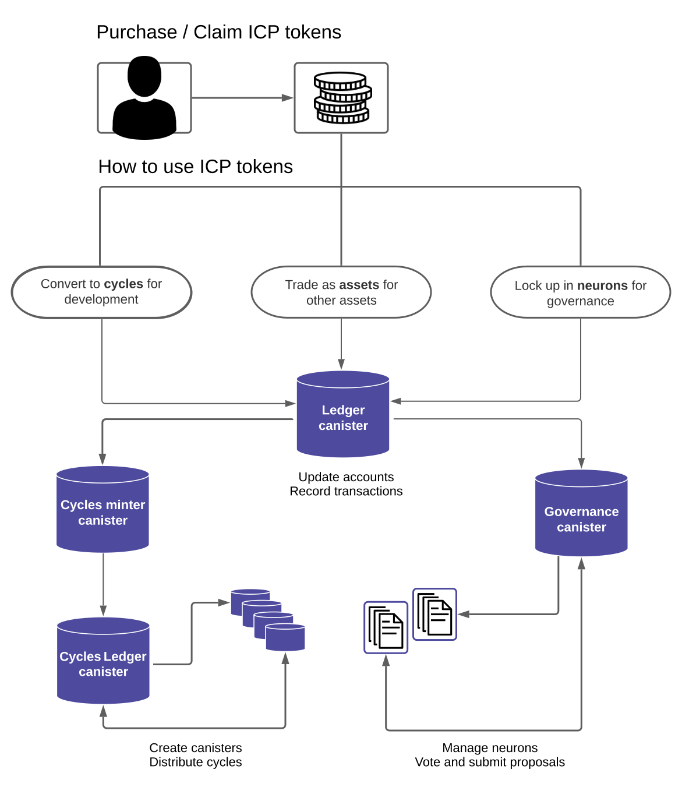

import { MarkdownChipRow } from "/src/components/Chip/MarkdownChipRow";
import { GlossaryTooltip } from "/src/components/Tooltip/GlossaryTooltip";
import LinkArrowDocs from "@site/src/components/Common/Icons/LinkArrowDocs";
import Link from "@docusaurus/Link";

# Tokens and cycles

<MarkdownChipRow labels={["Beginner", "Getting started", "Tutorial"]} />

## Overview

On the Internet Computer, there are three types of token assets: ICP tokens, cycles, and ICRC tokens. The first two, ICP and cycles, are the most important for every developer to understand and use, as they are necessary for deploying and maintaining an application.

ICP tokens are important because they can be converted to cycles that, in turn, are used to pay for resource consumption. Cycles reflect the real costs of operations for applications hosted in the Internet Computer, including resources such physical hardware, rack space, energy, storage devices, and bandwidth.

## ICP tokens

ICP are the Internet Computer's native utility token. Its value is determined on the open market. ICP tokens play a key role in both the governance and the economics of the Internet Computer.

There are three primary ways to use ICP tokens:

- Convert ICP into [cycles](#what-are-cycles), which are required to pay for a <GlossaryTooltip>canister's</GlossaryTooltip> resources. **All dapp developers will need to acquire cycles if they want to deploy their application onto the mainnet.**

- Trade ICP for other assets such as other tokens.

- Stake ICP in a [neuron](/docs/current/developer-docs/daos/nns/concepts/neurons/neuron-overview) in return for network governance participation and rewards.



## Cycles

The Internet Computer runs on a network of nodes owned and operated by a community of independent node providers distributed across the globe. Node providers spend money to run and maintain nodes, such that they purchase hardware and pay for the electricity and network bandwidth used by the node. The Internet Computer compensates these node providers on a monthly basis by minting and distributing rewards in the form of ICP tokens.

To make ICP sustainable, canisters are required to pay for the resources they consume, including storage and compute. Resource consumption is not paid in ICP tokens but **cycles**. As the canister is used, its cycles balance is continuously reduced. Eventually, the canister needs to be "topped up" with more cycles. The canister’s developer is responsible for topping up the canister.

To get cycles, you must convert ICP tokens into cycles, effectively burning the ICP tokens.

### Why are cycles different from ICP tokens?

While the value of an ICP token is volatile, cycles are not. Cycles are pegged to [XDR](https://en.wikipedia.org/wiki/Special_drawing_rights), a group of fiat currencies. This allows resource consumption and canister execution on ICP to be a rather stable price.

## Other token types

The Internet Computer supports creating and deploying your own custom fungible or non-fungible tokens through the ICRC standards. Each ICRC standard defines a set of parameters that must be met to adhere to the standard. Not all ICRC standards are for tokens; some of them are for notifications, architectures, or other network functions.

The most notable ICRC standards for tokens are:

- ICRC-1: Fungible token standard.

- ICRC-2: Fungible token standard with approval function.

- ICRC-7: Non-fungible token standard.

- ICRC-37: Non-fungible token standard with approval function.

Anyone can deploy a custom token that adheres to one of these standards if they deploy a [ledger](/docs/current/developer-docs/defi/tokens/ledger/overview) and [index](/docs/current/developer-docs/defi/tokens/indexes) canister that implement the standard's requirements.

### What is a ledger?

On the Internet Computer, a **ledger** is a system canister used to store accounts and their transactions. Users have a **ledger account identifier**.

Each token on the Internet Computer has its **own** ledger. This means that there are separate ledgers for ICP tokens, cycles, and every ICRC token that has been deployed on the network.

For example, here are a few examples of separate ledgers for different tokens:

- [ICP ledger](https://dashboard.internetcomputer.org/canister/ryjl3-tyaaa-aaaaa-aaaba-cai).

- [ckBTC ledger](https://dashboard.internetcomputer.org/canister/mxzaz-hqaaa-aaaar-qaada-cai) (An [ICRC-2](/docs/current/developer-docs/defi/tokens/token-standards#icrc-2) [chain-key](/docs/current/developer-docs/multi-chain/chain-key-tokens/overview) token).

- [CHAT ledger](https://dashboard.internetcomputer.org/canister/2ouva-viaaa-aaaaq-aaamq-cai) (An [ICRC-2](/docs/current/developer-docs/defi/tokens/token-standards#icrc-2) [SNS DAO](/docs/current/developer-docs/daos/sns/overview) token).

[Learn more about ledgers](/docs/current/developer-docs/defi/tokens/ledger/overview).

## Using tokens and cycles

In a typical developer workflow, you will follow these steps to use tokens and cycles:

1. Obtain ICP tokens and receive them in your developer identity's ledger account.

2. Convert ICP tokens into cycles. The price of cycles is fixed against the price of [XDR](/docs/current/references/glossary#xdr), where 1 trillion cycles equals 1 XDR.

:::info
Cycles are measured in very large numbers, such as billions and trillions. When you talk about cycle transfers and replenishment, you will usually operate with trillions of cycles.
:::

3. Deploy your application on the mainnet. Creating a canister costs 100B cycles.

4. Top up your canister as needed. If a canister runs out of cycles, it will be deleted. To avoid canisters from being deleted, you can set a [freezing threshold] or use a cycles management tool like [CycleOps].

### Getting ICP tokens

There are a few different ways you might acquire ICP tokens:

-   Purchase ICP tokens directly through an exchange that lists ICP tokens available for trade.

-   Convert [rewards](/docs/current/developer-docs/daos/nns/concepts/neurons/staking-voting-rewards) (maturity) obtained for participating in the network's governance into ICP tokens.

-   Receive tokens as remuneration for being a [node provider](/docs/current/references/node-providers/overview) and operating an Internet Computer node.

-   Receive a [grant of tokens](https://dfinity.org/grants) from the DFINITY Foundation.

### Using ICP tokens

After creating a [developer identity](/docs/current/developer-docs/getting-started/identities), you will need to receive ICP in your identity's ledger account.

First, get your account's ledger account ID:

```
dfx identity use IDENTITY_NAME
dfx ledger account-id
```

This will return your account ID on the ICP ledger:

```
e213184a548871a47fb526f3cba24e2ee2fbbc8129c4ab497ef2ce535130a0a4
```

Send your ICP tokens to this ledger account ID. Once you have sent the ICP tokens, you can check the balance using the command:

```
dfx ledger balance --network ic
```

The output should reflect the number of ICP tokens you sent to the account.

### Converting ICP into cycles

Once you have a balance of ICP, you need to convert some or all of it into cycles. To do this, you can use the **cycles ledger**. The cycles ledger is a ledger canister that implements the ICRC-1, ICRC-2, and ICRC-3 standards. Through the cycles ledger, developer identities can directly convert, hold, send, and receive cycles.

To convert ICP into cycles, use the `dfx cycles convert` command:

```
dfx cycles convert --amount AMOUNT --network ic
```

### Calculating how many cycles you need

The amount of cycles that your application will use depends on a variety of factors. Cycles are charged for storage, compute, update messages, special features, and more. To get an approximation, you can view the [detailed cycles cost table](/docs/current/developer-docs/gas-cost) or use the [cycles pricing calculator](/docs/current/developer-docs/cost-estimations-and-examples).

## Using cycles

### Checking your cycles balance

To confirm that your ICP was successfully converted into cycles, check your cycles balance with the command:

```
dfx cycles balance --network ic
```

### Transferring cycles

To transfer cycles to another developer identity, use the command:

```
dfx cycles transfer AMOUNT PRINCIPAL_ID --network ic
```

### Creating a canister with cycles

By default, a canister will have a cycles balance of 0. It costs 100B cycles to create the canister itself, then the canister must be "topped up" or sent cycles to pay for the resources it uses.

Alternatively, you can create a canister with an initial balance of cycles to cover the canister's cost:

```

### Topping up canisters

### Freezing threshold

## Cycles management tools (cycleops, etc)


## Getting started with free cycles

- #### Step 1: Open the cycles faucet.

Navigate to [https://faucet.dfinity.org](https://faucet.dfinity.org).

- #### Step 2: Join the developer Discord server.

You will need to put in a request for cycles on the [Discord](https://discord.internetcomputer.org) server. You can click on the **REQUEST CYCLES** button on the faucet page to join the Discord server.

Once inside the Discord server, navigate into the `#cycles-faucet` channel.

- #### Step 3: Request a coupon.

In this channel, execute the following command:

```
/request
```

- #### Step 4: Complete survey.

After you send this message, you are prompted to fill out a survey.

- #### Step 5: Receive coupon code.

Once completed, the team will review your submission. If accepted, the faucet bot will send you a private message with a coupon code.

:::caution
This step is done manually by a team member. Response times may vary.

Please ensure that your Discord settings are set to allow direct messages from other users. If you do not have this setting enabled, you will not receive a direct message from the faucet bot.
:::

- #### Step 6: Return to the faucet webpage.

Head back to the [https://faucet.dfinity.org](https://faucet.dfinity.org) webpage. Click **NEXT STEP** to continue.

- #### Step 7: Redeem the coupon.

Now that you have a coupon code, enter your coupon code within the faucet UI.

Click **NEXT STEP** to continue.

Confirm you are using the [developer identity](/docs/current/developer-docs/getting-started/identities) you created previously.

```
dfx identity use IDENTITY_NAME
```

- #### Step 8: Claim your cycles.

This workflow utilizes the **cycles ledger** feature. If you'd like to use the **cycles wallet** instead, [view the cycles wallet documentation](/docs/current/developer-docs/defi/cycles/cycles-wallet).

Claim your free cycles by running the command:

```
dfx cycles --network ic redeem-faucet-coupon <your-coupon-code>
```

Click **NEXT STEP** to continue.

- #### Step 9: Verify your balance.

The last step is to verify the coupon was redeemed correctly by checking your balance using the command:

```
dfx cycles --network ic balance
```

## Next steps

Next, its time to write the code for your application.

- [x] Explore examples with ICP Ninja.

- [x] Install tools.

- [x] Create an identity.

- [x] Tokens and cycles.

<LinkArrowDocs />
<Link
href="/docs/current/developer-docs/getting-started/write-smart-contracts"
>
Write smart contracts
</Link>.