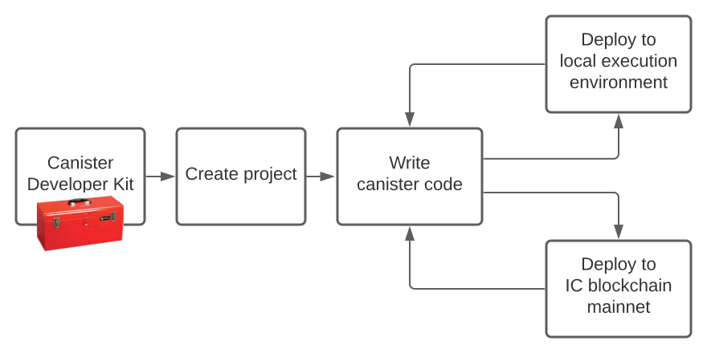

# Introduction

The [Internet Computer blockchain](https://wiki.internetcomputer.org/wiki/Introduction_to_ICP) is poised to help you start a revolution with a new way to design, build, and release dapps.

## Overview

The Internet Computer is a blockchain that runs [canister smart contracts](https://internetcomputer.org/how-it-works/architecture-of-the-internet-computer/#canister-smart-contracts), which are code units bundling together WebAssembly bytecode and the memory pages the bytecode runs in. The Internet Computer is composed of individual [subnet blockchains](https://internetcomputer.org/how-it-works/architecture-of-the-internet-computer/#subnet-architecture) running in parallel and connected together by the use of [chain key cryptography](https://internetcomputer.org/how-it-works/#Chain-key-cryptography). This means that canisters running on a subnet can seamlessly call canisters hosted in any other subnet of the Internet Computer blockchain. Moreover, the governance system of the Internet Computer can dynamically increase the capacity of the Internet Computer by adding new subnets, allowing dapps to scale out.

Developers can thus build new dapps consisting of multiple canisters running in parallel on different subnets and possibly integrate them with existing canisters already running on the Internet Computer.

See [introduction to ICP blockchain](https://wiki.internetcomputer.org/wiki/Introduction_to_ICP) on the ICP wiki.

## Developer workflow at a glance

At a high-level, there are two main possible workflows for developing dapps that run on the Internet Computer blockchain.

- **Local development:** you start a local canister execution environment simulating the Internet Computer blockchain on your computer. Then you write, compile, install and iteratively update your canisters in the local execution environment. This gives you the possibility to test your canisters locally without the need to use cycles to power them.

- **On-chain deployment:** once your dapp is ready you can then deploy it to the Internet Computer blockchain mainnet, making it available for the world to use it. Note that your canisters need to have cycles to be able to run on the Internet Computer blockchain mainnet, as discussed in [tokens and cycles](/concepts/tokens-cycles.md).

Regardless of the development workflow you choose, keep in mind that when you deploy a canister for the first time, either on a local execution environment or on the Internet Computer, a unique [principal identifier](/references/glossary.md#principal) is created for your canister. For example, if you start developing your canister locally and then deploy it to the Internet Computer, then your canister will generally have a different identifier on the local execution environment and on the Internet Computer blockchain mainnet. Note that it is also possible for you to register a principal identifier for your new canister before deploying it or even writing any line of code.

## Gas cost and pricing

The Internet Computer is one of the cheapest blockchains that exist today. 

On the Internet Computer, a "cycle" is the unit of measurement for resources consumed in the form of processing, memory, storage, and network bandwidth. Every canister has a cycles account to which resources consumed by the canister are charged. The Internet Computer’s utility token (ICP) can be converted to cycles and transferred to a canister. Cycles can also be transferred between canisters by attaching them to an inter-canister message.

ICP can always be converted to cycles using the current price of ICP measured in [XDR](https://en.wikipedia.org/wiki/Special_drawing_rights) using the convention that one trillion cycles correspond to one XDR.

**Storing one GB of data costs around 5$ per year, and for just one cent you can perform around 10_000 transactions. **

To see the full cost table, go [here](./gas-cost.md).
