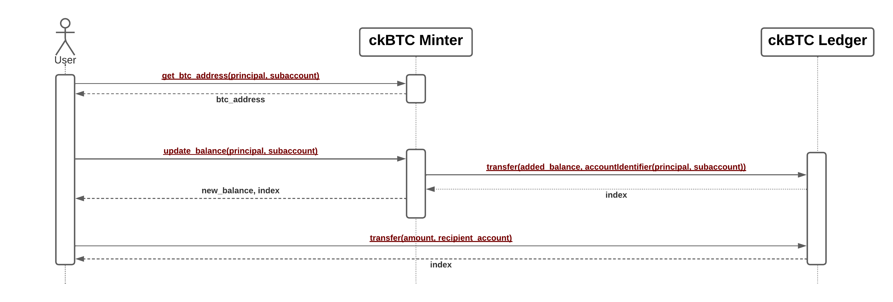

# Chain-key Bitcoin

Chain-key Bitcoin (ckBTC) is an [ICRC-1](https://github.com/dfinity/ICRC-1/blob/aa82e52aaa74cc7c5f6a141e30b708bf42ede1e3/standards/ICRC-1/README.md)-compliant token that
is backed 1:1 by bitcoin held 100% on chain.

The ckBTC functionality is provided through an interplay of two canisters,
the _ckBTC minter_ and the _ckBTC ledger_.

The ckBTC minter is responsible for the minting and burning of ckBTC tokens.
A certain amount of tokens is minted if a user transfers the same amount of bitcoin to a
specific Bitcoin address under the ckBTC minter's control. The Bitcoin address uniquely
identifies the owner of the sent bitcoins, making it possible for the ckBTC minter to
associate the minted ckBTC funds with the correct owner.
Conversely, an owner of ckBTC can request a retrieval of bitcoin to a Bitcoin address of his or
her choosing.
The ckBTC tokens are burned and the corresponding BTC amount is transferred using a regular
Bitcoin transaction.
A detailed description of the ckBTC minter can be found in its [GitHub repository](https://github.com/dfinity/ic/tree/master/rs/bitcoin/ckbtc/minter).

The ckBTC ledger accepts minting and burning requests from the ckBTC minter and records
the ckBTC balances of every account with a positive balance.
Additionally, the ckBTC ledger handles ckBTC transactions.
As mentioned above, the ckBTC ledger adheres to the ICRC-1 token standard.
Technical details can be found on the GitHub repository of the used
[ICRC-1 ledger implementation](https://github.com/dfinity/ic/tree/master/rs/rosetta-api/icrc1).

A simplified overview of the process to mint and transfer ckBTC is depicted in the following figure.

The flow to retrieve bitcoin follows a similar pattern and is explained in detail
in the [ckBTC minter repository](https://github.com/dfinity/ic/tree/master/rs/bitcoin/ckbtc/minter).

## Learn more

If you want to learn more about the inner workings of the ckBTC canister, see the
[ckBTC wiki page](https://wiki.internetcomputer.org/wiki/Chain-key_Bitcoin).
