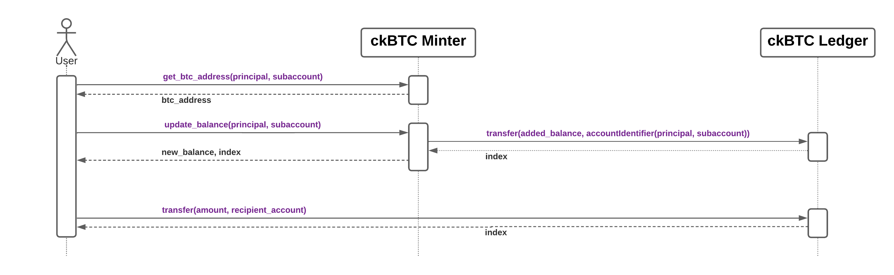

# Chain-key Bitcoin (ckBTC) 

## Overview

Chain-key Bitcoin (ckBTC) is an [ICRC-2](https://github.com/dfinity/ICRC-1/blob/main/standards/ICRC-2/README.md)-compliant token that is backed 1:1 by bitcoins held 100% on the mainnet.

The ckBTC functionality is provided through an interplay of two canisters:
- The **ckBTC minter**.
- The **ckBTC ledger**.

The **ckBTC ledger** is responsible for keeping account balances and for transferring ckBTC between accounts. It provides the following functionality:
- Enables the ckBTC minter to mint and burn ckBTC.
- Facilitates the transfer of ckBTC among users.

The **ckBTC minter** is responsible for the minting and burning of ckBTC tokens. It uses the following workflow:
- Tokens are minted when a user transfers bitcoins to a specific Bitcoin address under the ckBTC minter's control. The Bitcoin address uniquely identifies the owner of the sent bitcoins.
- The ckBTC minter waits for confirmations of all Bitcoin transactions that affect the total supply of ckBTC (because of the lack of finality in Bitcoin). 
- For Bitcoin retrieval requests, the ckBTC minter burns ckBTC before transferring the corresponding BTC amount (minus fees) using a regular Bitcoin transaction.

A detailed description of the ckBTC minter can be found in its [GitHub repository](https://github.com/dfinity/ic/tree/master/rs/bitcoin/ckbtc/minter).

A simplified overview of the process to mint and transfer ckBTC is depicted in the following figure.

Learn more in the [Bitcoin integration technical overview](bitcoin-how-it-works.md).

## Further reading

- [ckBTC API reference](ckbtc-reference.md).

- [Bitcoin integration: technology overview](bitcoin-how-it-works.md).

- [GitHub repository](https://github.com/dfinity/ic/tree/master/rs/bitcoin/ckbtc/minter).

- [Local development workflow](local-development.md).

- [Developer journey: ckBTC and Bitcoin integration](/docs/current/tutorials/developer-journey/level-4/4.3-ckbtc-and-bitcoin).

- [Deploying your first Bitcoin dapp](https://github.com/dfinity/examples/tree/master/motoko/basic_bitcoin).

- [Creating a ckBTC point of sale dapp](https://github.com/dfinity/examples/tree/master/motoko/ic-pos).
