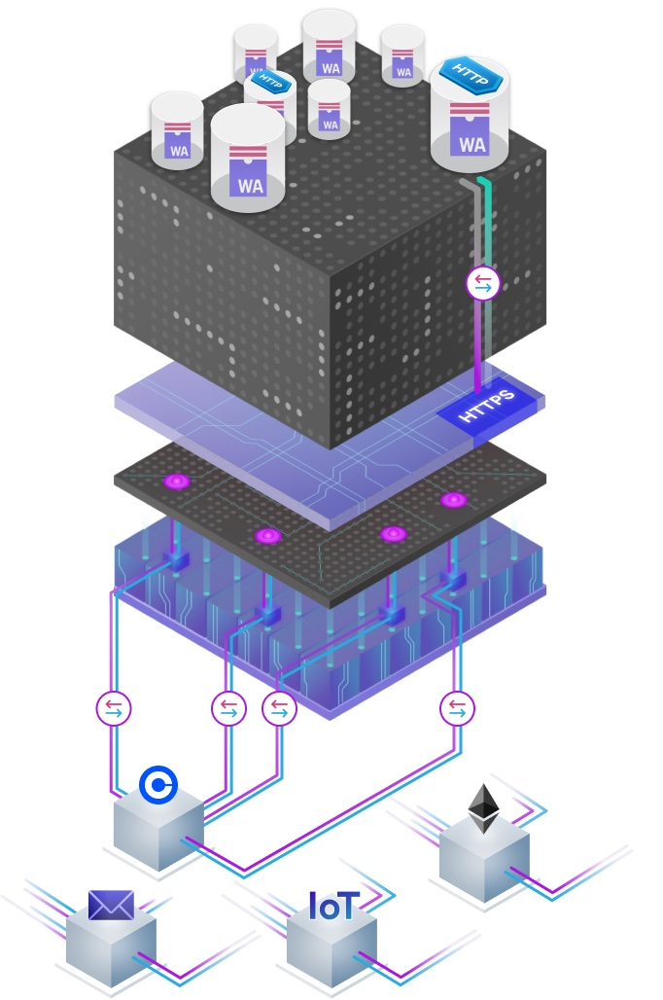

# Technology Overview — How Canister HTTPS Outcalls Work

On this page we provide details on how canister HTTPS outcalls, or canister HTTPS requests, work and important aspects to consider when using the API. We also want to note that there are some limitations and differences  compared to regular (Web 2.0) computer programs making HTTP calls and considerations for programmers for successfully using this feature. Engineers who intend to use this feature are advised to read through this page to get up to speed quickly w.r.t. the feature. The impatient reader who wants to dive into coding right away can skip the conceptual part and jump right away to the [coding section](#coding-https-outcalls) to get started.

## Technology

The HTTPS outcalls feature allows canisters to make outgoing HTTP calls to conventional Web 2.0 HTTP servers. The response of the request can be safely used in computations of the canister, without the risk of state divergence between the replicas of the subnet.

### How an HTTPS Outcall is Processed by the IC

The canister HTTP outcalls feature is implemented as part of the Internet Computer replica and is exposed as an API of the management canister. We next outline, in a simplified form, how a request made by a canister is processed. The HTTP request functionality is realized at the level of subnets, i.e., each subnet handles canister HTTP requests of its canisters independently of other subnets and HTTP requests are never routed to other subnets for execution.
* A canister makes an outgoing HTTP request by calling the management canister API using the `http_request` method.
* The request is stored temporarily in the replicated state of the subnet.
* Periodically (each round) an *adapter* at the networking layer in each replica fetches the pending HTTP outcalls from replicated state. (In fact, a &lsquo;shim&rsquo; layer of the adapter that is inside the replica process does so as the adapter itself is sandboxed into a separate OS-level process for security reasons.)
* The adapter on each replica executes the HTTP request by sending it to the target server.
* The corresponding HTTP response from the server is received by the adapter on each replica of the subnet and provided to a component in the replica process. The adapter limits the network response size to `max_response_bytes` which defaults to $2$ MB and can be set to lower values. It is important to set this as low as reasonably possible for the expected response as it affects the price of the request: The price increases with the size `max_response_bytes` and the actual response size is not considered, only the maximum.
* An optional transformation function implemented as part of the canister is invoked on the respective response on each replica to transform the response. This is done by a component within the replica process.
* The transformed response is handed over to consensus on each replica.
* IC consensus agrees on a response if at least $2/3$ (to be more precise, $2f+1$, where $f$ is the number of faulty replicas tolerated by the protocol) of the replicas have the same response for the request as input. In this case, consensus provides this response back to the management canister API, or an error if no consensus can be reached or in case of other problems.
* The management canister API provides the response or error back to the calling canister.



The above figure shows a high-level view of how a canister interacts with the feature and the communication patterns of the subnet replicas with external servers.

To summarize, to perform an HTTP request, each replica pushes an (optionally-transformed) instance of the received HTTP response from the external Web server through the Internet Computer's consensus layer, so that the replicas of the subnet can agree on the response provided to the canister, based on all server responses received by the replicas. The optional transformation ensures that, if responses received on different replicas from the server are different in some parts, those differences are eliminated and the same transformed response is provided to consensus on every (honest) replica. This guarantees that on every replica the exact same response (or none at all) is used for canister execution, thereby ensuring that divergence does not happen when using this feature and the replicated state machine properties of the subnet are preserved.

As we can see, the transformation function and IC consensus play a crucial role for this feature: The transformation function ensures that differences in the responses received by the replicas are removed and transformed responses on different replicas will be exactly the same, thus enabling consensus to provide the agreed-upon response to the calling canister. By running the responses received by the replicas through consensus, we ensure that every replica provides the same response to the smart contract Wasm execution environment.

### Trust Model and Programming Model

The trust model for canister HTTP outcalls is based on the trust model of the called HTTP server and that of the IC:
* It is assumed that the HTTP service is honest, otherwise, it can provide any responses to any of the calling replicas of the subnet. This is the case also for calls to the service from a Web 2.0 service or an oracle, thus, the situation is the same as in our scenario of a blockchain making the call to the service.
* The trust model of the IC assumes that at least $2/3$ of the replicas are honest. In this case, the honest replicas will obtain the same response (after optional transformation) and consensus will be able to agree on the response so that the response can be provided back to the calling canister.
A dishonest server can easily make requests fail or provide wrong data. Also, $1/3$ or more of dishonest subnet replicas can make requests fail. For providing wrong data, more than $2/3$ of the replicas need to be compromised.

The programming model for this feature is such that the canister making an HTTP outcall acts as *HTTP client*, i.e., needs to, in the general case, interpret various headers and act accordingly. For use cases such as API requests this is rather straightforward and does not require many specific considerations in the standard case. The IC protocol stack can conceptually be simply seen as a communication pipe between the canister and the conventional HTTP server that makes sure that the HTTP response makes it through consensus and all honest replicas receive the exact same response in execution, i.e., the calling canister receives an agreed-upon response.

## HTTPS Outcalls and Oracles Compared

*Blockchain oracles*, or just *oracles*, are external parties that interact with the blockchain by making queries or sending ingress messages, just like any user. They have so far been the main means in the blockchain world of letting smart contracts communicate with traditional Web 2.0 servers.

The basic architecture is that an oracle smart contract is deployed on chain. Users make requests to this oracle contract, which stores the requests temporarily. An oracle, i.e., Web 2.0 server, obtains the stored request from the oracle smart contract through regular means of interacting with it using queries and update calls. Then the oracle executes the request in the Web 2.0 world by means of a regular HTTP call and provides back the response to the oracle smart contract, again using the normal interaction paradigm with the blockchain (update call). Then the oracle smart contract provides back the response to the calling smart contract using a standard on-chain interaction.

In the oracle architecture, a single oracle may fulfill the original request, or a decentralized network of oracles may each issue the request and then provide an agreed-upon response (including evidence) to the oracle contract and ultimately to the calling canister. As we can see, the oracle would effectively achieve the same result as HTTP outcalls, but with a more complex architecture of requiring one or more external parties that want to be paid for their services. Thus, one can assume that HTTP outcalls can replace oracles for many relevant use cases, and do so in a stronger trust model and with lower fees and lower request execution latency.

Oracle services may provide additional functionality or services. One prominent example is using multiple data sources for a given information item, e.g., an asset price, and then providing a normalized response, e.g., the median price, as a result. Another example is keeping a selection of historic prices that have been retrieved available on chain for direct access by smart contracts without any oracle interaction. Both those functionalities can be built with the canister HTTP outcalls feature and do not require oracles.

Overall, the canister HTTP outcalls feature allows us to achieve what oracles or oracle networks do, but in a stronger model without requiring additional parties that are additional points of failure and want to earn fees for their services. With the canister HTTP outcalls feature, interactions with Web 2.0 servers benefit from reduced fees and lower latency due to the simpler architecture.

### Benefits for Developers

For developers, the canister HTTP requests feature has the benefit that they do not need to make a decision on which party (oracle) they want to trust in addition to the IC that they already need to trust anyway. They don't need to decide on whether they want to use a single oracle or multiple oracles to reduce trust assumptions and get better decentralization, but rather they get this out of the box with HTTP outcalls. The cost of the HTTP outcall is likely much lower than paying an established oracle provider for their services and the associated ingress cost, thus we have a clear economic advantage to use HTTP calls. Freed from making all those non-trivial trust decisions, a developer can focus on their business logic and simply make the HTTP call they need (and write a corresponding transform function), which is more natural.

### Benefits for End Users

End users can benefit from HTTP outcalls in various ways as well.
* *Stronger trust model:* They get stronger security by not relying on any additional parties which resemble further points of failure and thereby benefit from better decentralization. The decentralization we get using HTTP outcalls is the best we can achieve as it only involves the subnet replicas and the external service to be called, but no third parties such as oracle services.
* *Lower fees:* Users typically get a cheaper service as oracle middlemen are cut out in the calculation.
* *Lower latency:* The latency of direct HTTP calls is lower than making an (Xnet) request to an oracle contract that then gets polled and serviced by an external oracle service, which materializes in a better user experience when interacting with the canister. This is more pronounced for Xnet requests, which are required unless the oracle provider sets up an oracle smart contract on every relevant subnet, which would somewhat contradict the subnet architecture principle of the IC.

## Known Limitations

The current MVP has some limitations that we need to make explicit s.t. engineers know what they can expect from the feature and whether they can apply it for a given use case. Some of those limitations may be addressed with future extensions of the feature.

### Responses Must be &ldquo;Similar&rdquo;

Responses the replicas of the subnet receive must be &ldquo;similar&rdquo; in the sense that each response can be subjected to the same transformation function and the outcome of the transformation will be equal on every replica. Thus, &ldquo;similar&rdquo; in this context means that some core information we are interested in is equal in all responses and other parts may differ, but are not relevant for the response. A common setting in the world of HTTP APIs is that the responses are structurally equivalent, but contain certain fields that differ in the responses, for example, because of timestamps and identifiers contained in the responses.

### POST Requests Must be Idempotent

The way the feature is implemented implies that every HTTP request must be made by every replica of the subnet. This not only applies to `GET`, but also to `POST`, requests and for the latter creates a challenge that we do not have for `GET` requests: A `GET`, if implemented properly according to basic HTTP principles, is idempotent. Idempotency means that, if a request is made multiple times, it yields the same result and does not change the server's state. Idempotency does not apply to `POST` requests, meaning that, without further precautions, a `POST` made from a canister could result in the request leading to an update on the called server $n$ times, with $n$ the number of replicas in the subnet. This behaviour is clearly not intended, nor would it be acceptable in most scenarios.

One standard solution used in practice for such scenarios is the use of an *idempotency key* in the request. This key is a unique random string in a header sent along with all resulting requests by the different replicas. The server identifies all but one of the requests as duplicates and those are not considered for changing the state on the server, only one of them is. This results in exactly the intended behaviour of the `POST` being applied exactly once by the server. However, note that this single request being processed by the server can actually be the request made by a compromised replica and thus not be the intended request. Also, the compromised replica may change the idempotency key and thus lead to its request and the actual intended request getting processed by the server.

Idempotency keys are supported by some servers, but definitely not by all. The applicability of idempotency keys needs to be evaluated on a case-by-case basis. The challenge of idempotency can, in parts, be mitigated with a future extension of this feature allowing for a *reduced quorum*. That is, the canister could define the quorum size to be 1 and have only 1 replica execute the `POST` request. The issue with dishonest replicas clearly still persists, but the idempotency issue gets solved with this extension.

Making a secure *read back* operation via a `GET` to check whether the request has been properly executed can help mitigate some of the challenges. However, a compromised replica making an update on a completely different portion of the state can not reliably be detected using this approach.

### Compromised Replicas

As already hinted at above, a compromised replica is a more general problem: Such replica can at any point in time make arbitrary `POST` requests that the canister, as implemented by the honest replicas, is not even aware about, to the service. I.e., whenever we have an API key or password stored for authenticating to the external server, we run into the problem that a compromised replica can use the stored plaintext credentials to authenticate to the server.

Note, however, that this problem cannot be easily solved with oracles either: A compromised oracle can do exactly the same as a compromised replica. Multiple oracles do not solve the problem either for `POST`s. Solving this requires either advanced (cryptographic) mechanisms such as threshold TLS being used or some support from the side of the server. E.g., the server could keep a log of all state changes being done for a given API key and the canister can read back this log securely and at least detect calls made by compromised replicas. Tracking the IP address of the requestor may help in identifying the faulty replica and taking legal and other action against it.

One example of securing the write integration between the Internet Computer and Web 2.0 servers is to sign `POST` requests with a subnet signature using chain key cryptography and to have the server check the signature. Such approach requires adaptation of the server, but can resolve the remaining security problems of dishonest replicas making arbitrary requests.

As we have seen, completely removing the impact that dishonest replicas can have on `POST` calls may require support by the HTTP 2.0 service. With such support, seamless and secure interoperability between Web 3.0 and Web 2.0 can be achieved.

### IPv6-Only Support

Currently, as the IC itself is an IPv6-based system, the canister HTTP outcalls feature is therefore an IPv6-only feature. IPv4 support may be added in the future depending on demand from the community. The main reason for not supporting IPv4 now is that we do not have sufficiently many IPv4 addresses such that every replica of the IC could get its own IPv4 address and thus we would need to either route traffic over boundary nodes or use other mechanisms to allow for IPv4 communications. Any of those approaches leads to a reduced decentralization and thus a weaker trust model compared to replicas directly communicating with the Web 2.0 server.

### Rate Limiting by Servers

Most Web servers offering services to the general public implement some sort of rate limiting. Rate limiting means to constrain how many requests can be made from an IPv4 address or IPv6 prefix in a given time interval. Once the quota for an address of prefix is used up, requests from this IP or prefix would not be served, but an according error response would be served instead.

The problem is that all canisters on a subnet share the IPv6 prefixes of the replicas of this subnet and thus the quota at each server that implements rate limiting. Typical quotas of HTTP services for public (unauthenticated) users are in the order of $10$ requests per second. As every replica makes the same request, we have an amplification factor of $n$, where $n$ is the number of replicas in the subnet. Thus, the quotas can get consumed quickly and rate limits may lead to throttling or the replicas being (temporarily) blocked.

Using a registered user and authorizing the requests with an API key can decouple users on the same server and give each of them their own quota, thereby solving the issue with public APIs. Note, however, that the API key is stored in every replica and may be exposed in case a replica is compromised. This needs to be considered in the security model of the smart contract and is specifically relevant for `POST` operations. See the [discussion on compromised replicas](#compromised-replicas) for further information.

We do currently not implement any rate limiting in the IC protocol stack as we think the use of registered users may resolve many if not most or all of the issues with rate limiting of public APIs and all canisters sharing the service's quota.

## Future Extensions

As mentioned already further above, there are multiple possible extensions we are considering to implement in the future, based on demand in the community. The current MVP does not include them as it allows us to go to market faster because of the reduced feature set.
* *IPv4 support:* IPv4 support would help canisters reach servers that are not available on IPv6, but IPv4 only.
* *Reduced quorum:* A canister can define that a reduced quorum should be used for a request, e.g., only $1$ replica of the subnet making the request instead of all $n$ replicas. This trivially helps resolve the idempotency problem with `POST` requests. It may also be interesting for making reads where trust does not matter, but where we want to reduce the request amplification instead, e.g., because of quotas the server has in place.

## Coding HTTPS Outcalls

We next provide important information for engineers who want to use canister HTTP requests in their canister smart contracts. Using canister HTTP requests is somewhat harder in the general case than doing HTTP requests in a regular enterprise application as we need to consider aspects like responses going through consensus and idempotency of `POST` requests. We also refer the reader to the API definition of the feature in [The Internet Computer Interface Specification]/references/ic-interface-spec.md#ic-http_request).

### Recipe for Coding a Canister HTTP Call

The following &ldquo;recipe&rdquo; gives you a blueprint of how to best tackle the implementation of a new canister HTTP outcall type.
* &ldquo;Manually,&rdquo; e.g., using the `curl` tool, make the same HTTP request of interest twice within a short time frame (1-2 seconds) to emulate what would be done by the replicas of a subnet, just with a smaller $n$.
* Diff the two responses to find all the items that differ in the two requests. Both the body and the headers are important to be considered here. Alternatively, identify the core information of interest and how it can be extracted as the response.
* Implement a *transformation function* that transforms responses such that they are equal on each replica based on the observed diff of the responses or the intended response.
* Determine the maximum response size of the server's response for this type of request to populate the `max_response_bytes` parameter with it. This often works well for API calls and is important to not overcharge the requesting canister in terms of cycles. The `HEAD` request type can be used to do this if responses change dynamically in response size considerably.
* Implement the request and try it out in the local SDK environment. However, note that the behaviour of the local environment does not reflect that of the IC as there is only one replica in the local environment and $n$, e.g., $n=13$, replicas on an IC subnet.

:::tip Pro tip

Do not forget to consider response headers when identifying the variable parts of your response because headers sometimes contain variable items such as timestamps which may prevent the responses from passing through consensus.

:::

### Transformation Function

The purpose of the transformation function is to transform each response $r_i$ received by a replica $i$, where the $r_i$ s received by different replicas may be different. The transformation function transforms a response $r_i$ to a transformed response $r'_i$ with the intention that all $r'_i$ s of honest replicas be equal in order to be able to agree on the response as part of IC consensus. The transformation function must be provided by the canister programmer and is exposed by the canister as a query. An arbitrary number of transformation functions can be defined by a canister. When making an `http_request` call to the management canister, a transformation function can be optionally provided as input. Depending on the purpose of the HTTP request being made, there are different approaches to writing the transformation function:
* Extract only the information item(s) of interest. This can, e.g., be a list of pairs each comprising a date and an asset price to be forwarded to the canister, or a single asset price. This approach makes sense if the full HTTP response is not required in the canister, but only specific information items are.
* Remove all variable parts of the request individually and retain all the remaining parts. The canister then extracts the relevant information. This may be useful when the canister still needs the structure of the HTTP request and the headers.

We recommend to go with the first approach whenever possible as it has multiple advantages. Calls to pricing and many other APIs should mostly work with the first approach.
* The resulting response is smaller in size.
* The transformation function may be faster to compute, that is, the function (query) is executing with fewer CPU cycles. Note that queries on the IC are for free currently, but are likely to be charged for in the future.
* The transformation function is often easier to implement, e.g., through a simple or few simple Json operations on the response body.

### Errors and Debugging

There are a number of error cases that can happen when using this feature. The most important ones are listed next.
* *SysFatal - Url needs to specify https scheme:* The feature currently only allows for HTTPS connections and using plain HTTP leads to an error.
* *SysFatal - Timeout expired:* Requests are timed out if not fulfilled within the timeout period. One important instance when this happens is when there are not sufficiently many equal responses to achieve consensus. This happens, for example, when the transformation function is not written accurately to account for all variable parts of responses.
* *SysTransient - Failed to connect: error trying to connect: tcp connect error: Connection refused (os error 111):* This error indicates that a TCP connection could not be established with the other server. This is most likely due to the fact that the server you are calling is not supporting IPv6.
* *CanisterReject - http_request request sent with 0 cycles, but ... cycles are required:* At least the required amount of cycles need to be sent with the request in order for it to get fulfilled by the subnet.
* *CanisterReject - max_response_bytes expected to be in the range [0..2097152], got ...:* This error indicates that the network response received from the server was too large. This happens if the response size is underestimated and the `max_response_bytes` value set too low.
* *SysFatal - Transformed http response exceeds limit: 2045952:* This error indicates that the limit for the transformed response size was reached. This is currently a hard response size limit of the HTTPS outcalls functionality. Note that the response size is computed based on response body and headers.

Developers new to the feature are likely to run into certain problems in the beginning, materializing in one of the following errors. We list the issues we think are the most prominent ones when starting with this feature.
* If a specific type of canister HTTP request works in the local dfx environment, it may still not work on the IC because the local environment runs $1$ replica, whereas the IC runs $n=13$ replicas on the regular application subnets. Problems here are to be expected when developing such calls, particularly when a developer has not yet gained the necessary experience of working with the feature. The main issues to be expected here are with the lack of or problems with the transformation function. Note that this difference between the dfx environment and a deployment on the IC is not going to change any time soon as it results from the way the dfx environment works: It runs a single replica locally, with all the pros and cons during the engineering process.
* Receiving a timeout: If the requests returned by the HTTP server are not &ldquo;similar&rdquo; as required by the feature, this is most likely caused by an error in the transformation function, i.e., the transformed responses are still not equal on sufficiently many honest replicas in order to allow for consensus and thus no response is added to an IC block. Eventually, a timeout removes all artifacts related to this HTTP outcall. This issue is best debugged by diffing multiple requests made to the service and ensuring the transformation function does not retain any of the variable parts in the transformation result.
* Requests consume too many cycles: Canister HTTPS outcalls are charged cycles, but if requests with rather small responses frequently cost very large amounts of cycles, the likely cause is that the `max_response_size` parameter is not set in the request. In this case the system assumes and charges for the maximum response size which is $2$ MB. Always set this parameter to a value as close as possible to the actual maximum expected response size, and make sure it is at least as large and not smaller. The `max_response_size` parameter comprises both the body and the headers and refers to the network response from the server and not the final response to the canister.

### Pricing

The cycles cost for a http outcalls request has a fixed and variable component. The fixed part accounts for the constant overheads associated a http outcall, whereas the variable part charges for the resources consumed during the requests. Just like with other functions, the cost is scaled to account for larger subnets. 

**Formula:** 
```
header_len = header_1.name + header_1.value + ... + header_n.name + header_n.value
request_size = url.len + transform.name.len + transform.context.len + body.len + header_len
http_outcall_cost = 400M + 100k * (request_size + max_response_size)
scaling_factor = subnet_size / 13 
total_cost = scaling_factor * http_outcall_cost
```

The cycles provided with the call must be sufficient for covering the cost of the request, excessive cycles are returned to the caller.

The current pricing is defined to be rather conservative (expensive) and prices may change in the future with the introduction of an update of the pricing model. However, note that an HTTP outcall with a small response, like the ones used for querying financial APIs, only costs fractions of a USD cent, which is substantially cheaper than fees charged for a call by oracles on most blockchains.

## Community Contributions

If you are experiencing issues that are not yet described in the documentation or have other suggestions for improvement of the documentation that may help engineers use the feature more effectively, please let us know about it in the [forum topic](https://forum.dfinity.org/t/enable-canisters-to-make-http-s-requests/9670) for canister HTTP requests.
