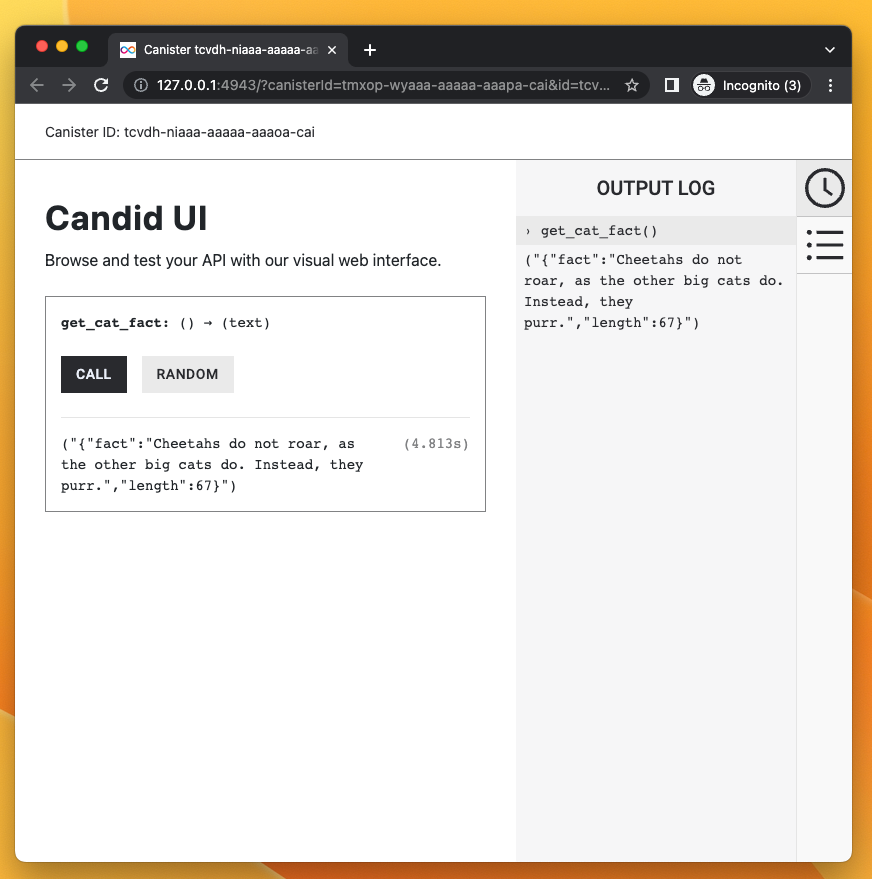

# How to use HTTP outcalls: GET

A minimal example to make a `GET` HTTPS request. The sample code is in both Motoko and Rust. 

This example takes less than 5 minutes to complete.

## Motoko version

### Motoko: Structure of the code

Before we dive in, here is the structure the code we will touch:

Here are `src/backend_canister/main.mo` will look like:

```motoko

//Import some custom types from `src/backend_canister/Types.mo` file
import Types "Types";

actor {

//method that uses the HTTP outcalls feature and returns a string
  public func foo() : async Text {

    //1. DECLARE IC MANAGEMENT CANISTER
    let ic : Types.IC = actor ("aaaaa-aa");

    //2. SETUP ARGUMENTS FOR HTTP GET request
    let request : Types.HttpRequestArgs = {
        //construct the request
    };

    //3. ADD CYCLES TO PAY FOR HTTP REQUEST
    //code to add cycles

    //4. MAKE HTTPS REQUEST AND WAIT FOR RESPONSE
    let response : Types.HttpResponsePayload = await ic.http_request(request);

    //5. DECODE THE RESPONSE
    //code to decode response

    //6. RETURN RESPONSE OF THE BODY
    response
  };
};
```

Here is what `src/backend_canister/Types.mo` will look like:

```motoko
module Types {

    //type declarations for HTTP requests, HTTP responses, IC management canister, etc...

}
```

### Motoko: Step by Step

To create a new project directory for testing access control and switching user identities:

- #### Step 1:  Open a terminal shell on your local computer, if you don’t already have one open.

- #### Step 2:  Change to the folder you are using for your Internet Computer blockchain projects, if you are using one.

- #### Step 3:  Create a new project by running the following command:

```bash
dfx new hello_http
cd hello_http
npm install
```

- #### Step 4:  Open the `src/hello_http_backend/main.mo` file in a text editor and replace content with:

```motoko
//imports we need to make to support the code below
import Debug "mo:base/Debug";
import Blob "mo:base/Blob";
import Cycles "mo:base/ExperimentalCycles";
import Error "mo:base/Error";
import Array "mo:base/Array";
import Nat8 "mo:base/Nat8";
import Text "mo:base/Text";

//import the custom types we will create in the Types.mo file
import Types "Types";

actor {

  //Method: This method sends a GET request to a URL with a free API we can test with
  //In particular, this free API returns a fact about cats.
  //example output: "{"fact":"A happy cat holds her tail high and steady.", "length":43 }"
  public func get_cat_fact() : async Text {

    //1. DECLARE IC MANAGEMENT CANISTER

    //We need this so we can use it to make the HTTP request
    let ic : Types.IC = actor ("aaaaa-aa");


    //2. SETUP ARGUMENTS FOR HTTP GET request

    let url = "https://catfact.ninja/fact";
    //print to the console
    Debug.print("[Backed canister] calling url: " # url);
    let http_request : Types.HttpRequestArgs = {
        url = url;
        max_response_bytes = null; //optional for request
        headers = [];
        body = null; //optional for request
        method = #get;
        transform = null; //optional for request
    };

    //3. ADD CYCLES TO PAY FOR HTTP REQUEST

    //The IC specification spec says, "Cycles to pay for the call must be explicitly transferred with the call"
    //IC management canister will make the HTTP request so it needs cycles
    //See: https://internetcomputer.org/docs/current/motoko/main/cycles
    //The way Cycles.add() works is that it adds those cycles to the next asynchronous call
    //"Function add(amount) indicates the additional amount of cycles to be transferred in the next remote call"
    //See: https://internetcomputer.org/docs/current/references/ic-interface-spec/#ic-http_request
    Cycles.add(17_000_000_000);
    
    //4. MAKE HTTPS REQUEST AND WAIT FOR RESPONSE
    //Since the cycles were added above, we can just call the IC management canister with HTTPS outcalls below
    let http_response : Types.HttpResponsePayload = await ic.http_request(http_request);
    
    //5. DECODE THE RESPONSE

    //As per the type declarations in `src/Types.mo`, the BODY in the HTTP response 
    //comes back as [Nat8s] (e.g. [2, 5, 12, 11, 23]). Type signature:
    
    //public type HttpResponsePayload = {
    //     status : Nat;
    //     headers : [HttpHeader];
    //     body : [Nat8];
    // };

    //We need to decode that [Na8] array that is the body into readable text. 
    //To do this, we:
    //  1. Convert the [Nat8] into a Blob
    //  2. Use Blob.decodeUtf8() method to convert the Blob to a ?Text optional 
    //  3. We use a switch to explicitly call out both cases of decoding the Blob into ?Text
    let response_body: Blob = Blob.fromArray(http_response.body);
    let decoded_text: Text = switch (Text.decodeUtf8(response_body)) {
        case (null) { "No value returned" };
        case (?y) { y };
    };

    //6. RETURN RESPONSE OF THE BODY

    decoded_text
  };

};
```
- `get_cat_fact` is an update call. All methods that make HTTPS outcalls must be update calls because they go through consensus, even if the HTTPS outcalls is a GET.
-  The code above adds `17_000_000_000` cycles. This is typically is enough for GET requests, but this may need to change depending on your use case.
- Code above imports `Types.mo` to separate the custom types from the actor file (as a best practice).

- #### Step 5:  Open the `src/hello_http_backend/Types.mo` file in a text editor and replace content with:

```motoko
module Types {

    //1. Type that describes the Request arguments for an HTTPS outcall
    //See: https://internetcomputer.org/docs/current/references/ic-interface-spec/#ic-http_request
    public type HttpRequestArgs = {
        url : Text;
        max_response_bytes : ?Nat64;
        headers : [HttpHeader];
        body : ?[Nat8];
        method : HttpMethod;
        transform : ?TransformRawResponseFunction;
    };

    public type HttpHeader = {
        name : Text;
        value : Text;
    };

    public type HttpMethod = {
        #get;
        #post;
        #head;
    };

    public type HttpResponsePayload = {
        status : Nat;
        headers : [HttpHeader];
        body : [Nat8];
    };

    //2. HTTPS outcalls have an optional "transform" key. These two types help describe it.
    //"The transform function may, for example, transform the body in any way, add or remove headers, 
    //modify headers, etc. "
    //See: https://internetcomputer.org/docs/current/references/ic-interface-spec/#ic-http_request
    
    //2.1 This type describes a function called "TransformRawResponse" used in line 14 above
    //"If provided, the calling canister itself must export this function." 
    //In this minimal example for a GET request, we declare the type for completeness, but 
    //we do not use this function. We will pass "null" to the HTTP request.
    public type TransformRawResponseFunction = {
        function : shared query TransformArgs -> async HttpResponsePayload;
        context : Blob;
    };

    //2.2 This type describes the arguments the transform function needs
    public type TransformArgs = {
        response : HttpResponsePayload;
        context : Blob;
    };


    //3. Declaring the IC management canister which we use to make the HTTPS outcall
    public type IC = actor {
        http_request : HttpRequestArgs -> async HttpResponsePayload;
    };

}
```

- #### Step 6: Test the dapp locally

Deploy the dapp locally:

```bash
dfx start --background
dfx deploy
```

If successful, the terminal should return canister URLs you can open:

```bash
Deployed canisters.
URLs:
  Frontend canister via browser
    hello_http_frontend: http://127.0.0.1:4943/?canisterId=tqtu6-byaaa-aaaaa-aaana-cai
  Backend canister via Candid interface:
    hello_http_backend: http://127.0.0.1:4943/?canisterId=txssk-maaaa-aaaaa-aaanq-cai&id=tzq7c-xqaaa-aaaaa-aaamq-cai
```

Open the candid web UI for the backend (the `hello_http_backend` one) and call the `get_cat_fact` method:


## Rust version

### Rust: Structure of the code

Here is how the management canister is declared in a Rust canister (e.g. `lib.rs`):

```rust
//1. DECLARE IC MANAGEMENT CANISTER
use ic_cdk::api::management_canister::http_request::{
    http_request, CanisterHttpRequestArgument, HttpHeader, HttpMethod, HttpResponse, TransformArgs,
    TransformContext,
};

//Update method using the HTTPS outcalls feature
#[ic_cdk::update]
async fn foo() {
    //2. SETUP ARGUMENTS FOR HTTP GET request
    let request = CanisterHttpRequestArgument {
        //instantiate the request
    };

    //3. MAKE HTTPS REQUEST AND WAIT FOR RESPONSE
    //Note: in Rust, `http_request()` already sends the cycles needed 
    //so no need for explicit Cycles.add() as in Motoko
    match http_request(request).await {
        
        //4. DECODE AND RETURN THE RESPONSE
        Ok((response,)) => {
            //Ok case 
        }
        Err((r, m)) => {
            //error case
        }
    }
}
```

### Rust: Step by Step

To create a new project directory for testing access control and switching user identities:

- #### Step 1:  Open a terminal shell on your local computer, if you don’t already have one open.

- #### Step 2:  Change to the folder you are using for your Internet Computer blockchain projects, if you are using one.

- #### Step 3:  Create a new project by running the following command:

```bash
dfx new --type=rust hello_http_rust
cd hello_http_rust
npm install
rustup target add wasm32-unknown-unknown
```

- #### Step 4: Open the `/src/hello_http_rust_backend/src/lib.rs` file in a text editor and replace content with:

```rust
//1. DECLARE IC MANAGEMENT CANISTER
//This also includes methods and types needed
use ic_cdk::api::management_canister::http_request::{
    http_request, CanisterHttpRequestArgument, HttpHeader, HttpMethod, HttpResponse, TransformArgs,
    TransformContext,
};

//Update method using the HTTPS outcalls feature
#[ic_cdk::update]
async fn get_cat_fact() -> String {

    //2. SETUP ARGUMENTS FOR HTTP GET request

    let url = "https://catfact.ninja/fact";

    //note "CanisterHttpRequestArgument" and "HttpMethod" are declared in line 4
    let request = CanisterHttpRequestArgument {
        url: url.to_string(),
        method: HttpMethod::GET,
        body: None,
        max_response_bytes: None,
        transform: None,
        headers: vec![],    
    };

    //3. MAKE HTTPS REQUEST AND WAIT FOR RESPONSE
    //Note: in Rust, `http_request()` already sends the cycles needed 
    //so no need for explicit Cycles.add() as in Motoko
    match http_request(request).await {
        
        //4. DECODE AND RETURN THE RESPONSE
    
        //See: https://docs.rs/ic-cdk/latest/ic_cdk/api/management_canister/http_request/fn.http_request.html
        Ok((response,)) => {
            let str_body = String::from_utf8(response.body)
                .expect("Transformed response is not UTF-8 encoded.");
            str_body
        }
        Err((r, m)) => {
            let message =
                format!("The http_request resulted into error. RejectionCode: {r:?}, Error: {m}");
            ic_cdk::api::print(message.clone());
            message
        }
    }
}
```

- `get_cat_fact() -> String` returns a `String`, but this is not necessary. In this tutorial, this is done for easier testing.
- The `lib.rs` file used [http_request](https://docs.rs/ic-cdk/latest/ic_cdk/api/management_canister/http_request/fn.http_request.html) which is a convenient Rust CDK method that already sends cycles to the IC management canister under the hood. It knows how many cycles to send for a 13-node subnet and most cases. If your HTTPS outcall needs more cycles , you should use [http_request_with_cycles()](https://docs.rs/ic-cdk/latest/ic_cdk/api/management_canister/http_request/fn.http_request_with_cycles.html) method and explicitly call the cycles needed. 
- The Rust CDK method `http_request` used above wraps the IC management canister method [`http_request`](../../../referencesic-interface-spec#ic-http_request), but it is not strictly the same.

- #### Step 5: Open the `src/hello_http_rust_backend/hello_http_rust_backend.did` file in a text editor and replace content with:

We update the Candid interface file so it matches the method `get_cat_fact` in `lib.rs`. 

```
service : {
    "get_cat_fact": () -> (text);
}
```

- #### Step 6: Test the dapp locally

Deploy the dapp locally:

```bash
dfx start --background
dfx deploy
```

If successful, the terminal should return canister URLs you can open:

```bash
Deployed canisters.
URLs:
  Frontend canister via browser
    hello_http_rust_frontend: http://127.0.0.1:4943/?canisterId=tfuft-aqaaa-aaaaa-aaaoq-cai
  Backend canister via Candid interface:
    hello_http_rust_backend: http://127.0.0.1:4943/?canisterId=tmxop-wyaaa-aaaaa-aaapa-cai&id=tcvdh-niaaa-aaaaa-aaaoa-cai
```

Open the candid web UI for the backend (the `hello_http_rust_backend` one) and call the `get_cat_fact` method:



:::note
In both the Rust and Motoko minimal examples, we did not create a **transform** function so that it transforms the raw response. This is something we will explore in a following section
:::