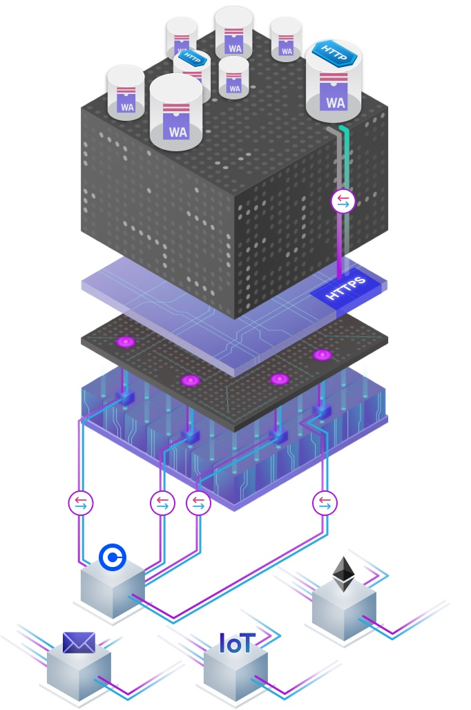

# HTTPS outcalls: technology overview

## Overview

The HTTPS outcalls feature allows canisters to make outgoing HTTP calls to conventional HTTP servers. The response of the request can be safely used in computations of the canister without the risk of state divergence between the replicas of the subnet.

:::info
This documentation may use **HTTP** representative for both **HTTP** and **HTTPS**, referring to the underlying protocol. 
:::

The canister HTTPS outcalls feature is implemented as part of the ICP replica and is exposed as an API. The HTTP request functionality is realized at the level of subnets, such that each subnet handles the HTTP requests of its canisters independently of other subnets. HTTP requests are never routed to other subnets for execution.

HTTP outcalls are processed by ICP using the following workflow:

- #### Step 1: A canister makes an outgoing HTTP request by calling the API using the `http_request` method.
- #### Step 2: The request is stored temporarily in the replicated state of the subnet.
- #### Step 3: Periodically (each round) an **adapter** at the networking layer in each replica fetches the pending HTTP outcalls from replicated state. 
- #### Step 4: The adapter on each replica executes the HTTP request by sending it to the target server.
- #### Step 5: The corresponding HTTP response from the server is received by the adapter on each replica of the subnet.
- #### Step 6: An optional transformation function implemented as part of the canister is invoked on the response. 
- #### Step 7: The transformed response is handed over to consensus on each replica.
- #### Step 8: Consensus agrees on a response if at least $2/3$ of the replicas have the same response for the request as input. 
- #### Step 9: The API provides the response or error back to the calling canister.

## Creating HTTPS outcalls

Using canister HTTP requests may be harder than doing HTTP requests in a regular enterprise application as you need to consider aspects like responses going through consensus and idempotency of `POST` requests. Refer to the API definition of the feature in [the Internet Computer interface specification](/references/ic-interface-spec.md#ic-http_request) for more information.

### Recipe for coding a canister HTTP call

The following "recipe" gives you a blueprint of how to create a canister HTTP call:

- #### Step 1: Using a tool such as curl, manually make the same HTTP request of interest twice within a short time frame (1-2 seconds) to emulate the behavior of the replicas in a subnet.
- #### Step 2: Use `diff` to compare the two responses and find all the items that differ.
Both the body and the headers are important to be considered here. Alternatively, identify the core information of interest and how it can be extracted as the response.
- #### Step 3: Implement a **transformation function** that transforms responses such that they are equal on each replica based on the observed diff of the responses or the intended response.
- #### Step 4: Determine the maximum response size of the server's response for this type of request to populate the `max_response_bytes` parameter with it. 
This often works well for API calls and is important to not overcharge the requesting canister in terms of cycles. The `HEAD` request type can be used to do this if responses change dynamically in response size. If the `max_response_bytes` parameters is not set, the default response size of 2MB is charged.
- #### Step 5: Implement the request and try it out in the local SDK environment. 
The behavior of the local replica environment does not reflect that of the mainnet, as there is only one replica in the local environment and $n$, e.g., $n=13$, replicas on an ICP subnet.

:::info
Do not forget to consider response headers when identifying the variable parts of your response because headers sometimes contain variable items such as timestamps which may prevent the responses from passing through consensus.
:::

:::caution 
If you do not set the optional `max_response_bytes` parameter, a response size of 2MB will be assumed and charged, which is *extremely expensive*. It is recommended to always set the parameter to a reasonable upper bound of the expected network response size to reduce cycles cost of the call. If you are unsure of the response size to be expected, you can make a HEAD request upfront to determine the response size.
:::

### Transformation function

The purpose of the transformation function is to transform each response received by a replica. The transformation function transforms a response into a transformed response with the intention that all transformed responses of honest replicas be equal in order to be able to agree on the response as part of ICP's consensus. The transformation function must be provided by the canister developer and is exposed by the canister as a query. An arbitrary number of transformation functions can be defined by a canister. When making an `http_request` call to the management canister, a transformation function can be optionally provided as input. 

Depending on the purpose of the HTTP request being made, there are different approaches to writing the transformation function:

* **Extract only the information item(s) of interest:**: This may be a list of pairs each comprising a date and an asset price to be forwarded to the canister, or a single asset price. This approach makes sense if the full HTTP response is not required in the canister.

* **Remove all variable parts of the request individually and retain all the remaining parts:** The canister then extracts the relevant information. This may be useful when the canister still needs the structure of the HTTP request and the headers.

It is recommended to go with the first approach whenever possible as it has multiple advantages. Calls to pricing and many other API types should work with the first approach.

* The resulting response is smaller in size.

* The transformation function may be faster to compute (the function (query) is executing with fewer CPU cycles). Note that queries on ICP are for currently free currently.

* The transformation function is often easier to implement, such as through simple JSON operation(s) on the response body.

## Trust and programming models

The trust model for HTTP outcalls is based on the model of the called HTTP server and that of ICP:
* It is assumed that the HTTP service is honest. Otherwise, it can provide any responses to any of the calling replicas of the subnet. 
* The trust model assumes that at least $2/3$ of the replicas are honest. The honest replicas will obtain the same response and agree on it through consensus.

A dishonest server or $1/3$ or more of dishonest subnet replicas can make requests fail. To provide wrong data, more than $2/3$ of the replicas need to be compromised.

The canister making an HTTP outcall acts as **HTTP client** and needs to interpret various headers and act accordingly. For use cases such as API requests, this is rather straightforward and does not require many specific considerations in the standard case. The ICP protocol stack can be seen as a communication pipe between the canister and the conventional HTTP server that makes sure the HTTP response makes it through consensus with an agreed-upon response. 

## Benefits for developers

Canister HTTP requests do not need to make a decision on which party they want to trust other than ICP. A developer can focus on their business logic and simply make the HTTP call they need. 

The cost of the HTTP outcall is likely much lower than paying an established oracle provider for their services and the associated ingress cost. 

## Benefits for end users

End users can benefit from HTTP outcalls in various ways:

* **Stronger trust model:** Stronger security by not relying on any additional parties which resemble further points of failure and thereby benefit from better decentralization. 
* **Lower fees:** Users typically get a cheaper service.
* **Lower latency:** Latency of direct HTTP calls is lower than making an Xnet request to an oracle contract that then gets polled and serviced by an external oracle service. This is more pronounced for Xnet requests, which are required unless the oracle provider sets up an oracle smart contract on every relevant subnet.

## Known limitations

Some limitations that engineers need to know are:

- **Responses must be similar** in the sense that each response can be subjected to the same transformation function and the outcome of the transformation will be equal on every replica. The core information must be equal in all responses and other parts may differ, but are not relevant for the response. This may be that the responses are structurally equivalent, but contain certain fields that differ in the responses.

- **`POST` requests must be idempotent.** Idempotency does not apply to `POST` requests, meaning that without further precautions, a `POST` made from a canister could result in the request leading to an update on the called server $n$ times, with $n$ the number of replicas in the subnet. One standard solution is the use of an **idempotency key** in the request, which is a unique random string in a header sent along with all resulting requests by the different replicas. The server identifies all but one of the requests as duplicates and those are not considered for changing the state on the server, only one of them is. This results in exactly the intended behavior of the `POST` being applied exactly once by the server. However, note that this single request being processed by the server can actually be the request made by a compromised replica and thus not be the intended request. Also, the compromised replica may change the idempotency key and thus lead to its request and the actual intended request getting processed by the server.

- **Compromised replicas:** A replica can at any point in time make arbitrary `POST` requests to the service. If you have an API key or password stored for authenticating to the external server, you run into the problem that a compromised replica can use the stored plaintext credentials to authenticate to the server. One solution is to sign `POST` requests with a subnet signature using chain key cryptography and have the server check the signature. Such approach requires adaptation of the server, but can resolve the remaining security problems of dishonest replicas making arbitrary requests.

- **IPv6-only support:** ICP itself is an IPv6-based system, and therefore the canister HTTP outcalls feature only supports IPv6. 

- **Rate limiting by servers:** Rate limiting means to constrain how many requests can be made from an Ipv4 address or IPv6 prefix in a given time interval. Once the quota for an address of prefix is used up, requests from this IP or prefix would not be served, but an according error response would be served instead. All canisters on a subnet share the IPv6 prefixes of the replicas of this subnet and the quotas can get consumed quickly and rate limits may lead to throttling or the replicas being (temporarily) blocked. Using a registered user and authorizing the requests with an API key can decouple users on the same server and give each of them their own quota can solve this issue with public APIs. 

## Future extensions

There are multiple possible extensions under consideration to be implemented in the future such as:
* **IPv4 support:** Allow canisters to reach servers that are not available on IPv6.
* **Reduced quorum:** Allow canisters to define a reduced quorum should be used for a request such as only $1$ replica of the subnet making the request instead of all $n$ replicas. This trivially helps resolve the idempotency problem with `POST` requests.

## Errors 

There are a number of error cases that can happen when using this feature:

* **SysFatal - Url needs to specify https scheme:** The feature currently only allows for HTTPS connections and using plain HTTP leads to an error.

* **SysFatal - Timeout expired:** Requests are timed out if not fulfilled within the timeout period. This may happen when there are not sufficient equal responses to achieve consensus. This happens when the transformation function is not written accurately to account for all variable parts of responses.

* **SysTransient - Failed to connect: error trying to connect: tcp connect error: Connection refused (os error 111):** This error indicates that a TCP connection could not be established with the other server. This is most likely due to the fact that the server you are calling is not supporting IPv6.

* **CanisterReject - http_request request sent with 0 cycles, but ... cycles are required:** At least the required amount of cycles needs to be sent with the request in order for it to get fulfilled by the subnet.

* **CanisterReject - max_response_bytes expected to be in the range [0..2097152], got ...:** This error indicates that the network response received from the server was too large. This happens if the `max_response_bytes` value set too low.

* **SysFatal - Transformed http response exceeds limit: 2045952:** This error indicates that the limit for the transformed response size was reached. This is currently a hard response size limit of the HTTPS outcalls functionality. Note that the response size is computed based on response body and headers.

## Debugging

Developers new to the feature are likely to run into certain problems materializing in one of the following errors:

* **If a specific type of canister HTTP request works in the local dfx environment, it may still not work on ICP because the local environment runs $1$ replica, whereas ICP runs $n=13$ replicas on the regular application subnets:** Problems here are to be expected when developing such calls, particularly when a developer has not yet gained the necessary experience of working with the feature. This may be due to problems with the transformation function or lack of one. This difference between the dfx environment and a deployment on ICP results from the way the dfx environment works.

* **Receiving a timeout**: If the requests returned by the HTTP server are not similar as required by the feature, this is most likely caused by an error in the transformation function such that the transformed responses are still not equal on a sufficient number of honest replicas in order to allow for consensus. Eventually, a timeout removes all artifacts related to this HTTP outcall. This issue is best debugged by diffing multiple requests made to the service and ensuring the transformation function does not retain any of the variable parts in the transformation result.

* **Requests consume too many cycles:** Canister HTTPS outcalls are charged cycles, but if requests with rather small responses frequently cost very large amounts of cycles, the likely cause is that the `max_response_bytes` parameter is not set in the request. In this case the system assumes and charges for the maximum response size which is $2$ MB. Always set this parameter to a value as close as possible to the actual maximum expected response size, and make sure it is at least as large and not smaller. The `max_response_bytes` parameter comprises both the body and the headers and refers to the network response from the server.

### Pricing

The [cycles cost for a HTTP outcalls request](../../gas-cost.md) has a fixed and variable component. The fixed part accounts for the constant overheads associated a HTTP outcall, whereas the variable part charges for the resources consumed during the requests.

The cycles provided with the call must be sufficient for covering the cost of the request. Excessive cycles are returned to the caller.

An HTTP outcall with a small response only costs fractions of a USD cent, which is substantially cheaper than fees charged by oracles on most blockchains.

## Community contributions

If you are experiencing issues that are not yet described in the documentation or have other suggestions for improvement, please let us know about it in the [forum topic](https://forum.dfinity.org/t/enable-canisters-to-make-http-s-requests/9670).
