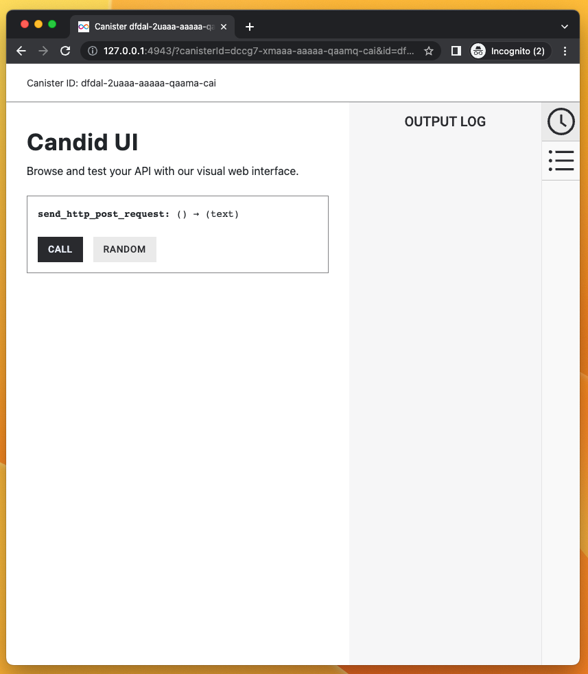
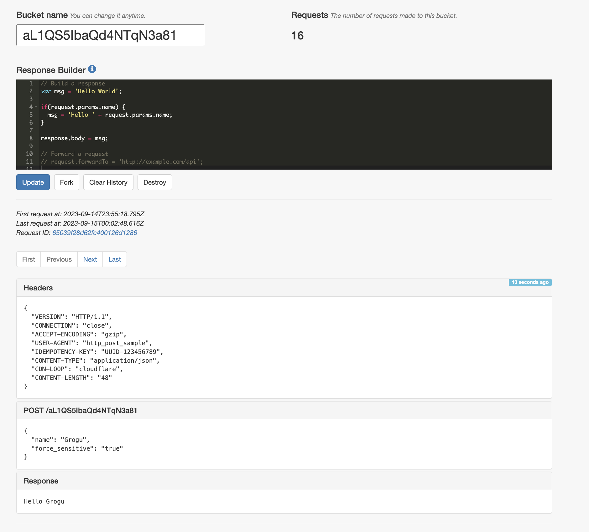

# How to use HTTP outcalls: POST

## Overview
A minimal example to make a `POST` HTTPS request. The purpose of this dapp is only to show how to make HTTP requests from a canister.

The sample code is in both Motoko and Rust. This sample canister sends a `POST` request to a free API where we can verify the headers and body from teh canister are what we expect.


**The main intent of this canister is to show developers how to make idempotent `POST` requests.**

This example takes less than 5 minutes to complete.

## What we are building

### Candid web UI of canister

The canister in this tutorial will have only **one public method** which, when called, will trigger an HTTP `POST` request. The canister will not have a frontend (only a  backend), but like all canisters, we can interact with its public methods via the Candid web UI, which will look like this:



When we call the method, the canister will send an HTTP `POST` request with the following JSON in the response body:

```json
{
    "name": "Grogu",
    "force_sensitive": "true"
}
```


### Verifying the HTTP POST request

In order to verify that our canister sent the HTTP request we expected, this canister is sending HTTP requests to a [public API service](https://public.requestbin.com/r/en8d7aepyq2ko) where the HTTP request can be inspected. As you can see the image below, the `POST` request headers and body can be inspected to make sure it is what the canister sent.



## Important notes on `POST` requests

Because HTTPS outcalls go through consensus, a developer should expect any HTTPs `POST` request from a canister to be sent many times to its destination.
Even if we forget the Web3 component, this is not new in HTTP where it is very common for clients to retry requests for a variety of reasons (e.g. destination server being unavailable).

The recommended way for HTTP `POST` requests is to add the idempotency keys in the header so the destination server knows which `POST` requests from the client are the same. 

Developers should be careful that the destination server understand and use idempotency keys. A canister can be coded to be send idempotency keys, but it is ultimately up to the recipient server to know what to do with then. Here is an [example of an API service that uses idempotency keys](https://stripe.com/docs/api/idempotent_requests).

## Motoko version

### Motoko: Structure of the code

Before we dive in, here is the structure the code we will touch:

Here is how our main file will look like:

```motoko

//Import some custom types from `src/backend_canister/Types.mo` file
import Types "Types";

actor {

//method that uses the HTTP outcalls feature and returns a string
  public func foo() : async Text {

    //1. DECLARE IC MANAGEMENT CANISTER
    let ic : Types.IC = actor ("aaaaa-aa");

    //2. SETUP ARGUMENTS FOR HTTP GET request
    let request : Types.HttpRequestArgs = {
        //construct the request
    };

    //3. ADD CYCLES TO PAY FOR HTTP REQUEST
    //code to add cycles

    //4. MAKE HTTPS REQUEST AND WAIT FOR RESPONSE
    let response : Types.HttpResponsePayload = await ic.http_request(request);

    //5. DECODE THE RESPONSE
    //code to decode response

    //6. RETURN RESPONSE OF THE BODY
    response
  };
};
```

We will also create some custom types in `Types.mo`. This will look like this:

```motoko
module Types {

    //type declarations for HTTP requests, HTTP responses, IC management canister, etc...

}
```

### Motoko: Step by step

To create a new project:

- #### Step 1:  Create a new project by running the following command:

```bash
dfx new send_http_post
cd send_http_post
npm install
```

- #### Step 2:  Open the `src/send_http_post_backend/main.mo` file in a text editor and replace content with:


```motoko
import Debug "mo:base/Debug";
import Blob "mo:base/Blob";
import Cycles "mo:base/ExperimentalCycles";
import Array "mo:base/Array";
import Nat8 "mo:base/Nat8";
import Text "mo:base/Text";

//import the custom types we have in Types.mo
import Types "Types";

actor {

//PULIC METHOD
//This method sends a POST request to a URL with a free API we can test.
  public func send_http_post_request() : async Text {

    //1. DECLARE IC MANAGEMENT CANISTER
    //We need this so we can use it to make the HTTP request
    let ic : Types.IC = actor ("aaaaa-aa");

    //2. SETUP ARGUMENTS FOR HTTP GET request

    // 2.1 Setup the URL and its query parameters
    //This URL is used because it allows us to inspect the HTTP request sent from the canister
    let host : Text = "en8d7aepyq2ko.x.pipedream.net";
    let url = "https://en8d7aepyq2ko.x.pipedream.net/";

    // 2.2 prepare headers for the system http_request call

    //idempotency keys should be unique so we create a function that generates them.
    let idempotency_key: Text = generateUUID();
    let request_headers = [
        { name = "Host"; value = host # ":443" },
        { name = "User-Agent"; value = "http_post_sample" },
        { name= "Content-Type"; value = "application/json" },
        { name= "Idempotency-Key"; value = idempotency_key }
    ];

    // The request body is an array of [Nat8] (see Types.mo) so we do the following:
    // 1. Write a JSON string
    // 2. Convert ?Text optional into a Blob, which is an intermediate reprepresentation before we cast it as an array of [Nat8]
    // 3. Convert the Blob into an array [Nat8]
    let request_body_json: Text = "{ \"name\" : \"Grogu\", \"force_sensitive\" : \"true\" }";
    let request_body_as_Blob: Blob = Text.encodeUtf8(request_body_json); 
    let request_body_as_nat8: [Nat8] = Blob.toArray(request_body_as_Blob); // e.g [34, 34,12, 0]


    // 2.3 The HTTP request
    let http_request : Types.HttpRequestArgs = {
        url = url;
        max_response_bytes = null; //optional for request
        headers = request_headers;
        //note: type of `body` is ?[Nat8] so we pass it here as "?request_body_as_nat8" instead of "request_body_as_nat8"
        body = ?request_body_as_nat8; 
        method = #post;
        transform = null; //optional for request
    };

    //3. ADD CYCLES TO PAY FOR HTTP REQUEST

    //IC management canister will make the HTTP request so it needs cycles
    //See: https://internetcomputer.org/docs/current/motoko/main/cycles
    
    //The way Cycles.add() works is that it adds those cycles to the next asynchronous call
    //See: https://internetcomputer.org/docs/current/references/ic-interface-spec/#ic-http_request
    Cycles.add(17_000_000_000);
    
    //4. MAKE HTTPS REQUEST AND WAIT FOR RESPONSE
    //Since the cycles were added above, we can just call the IC management canister with HTTPS outcalls below
    let http_response : Types.HttpResponsePayload = await ic.http_request(http_request);
    
    //5. DECODE THE RESPONSE

    //As per the type declarations in `Types.mo`, the BODY in the HTTP response 
    //comes back as [Nat8s] (e.g. [2, 5, 12, 11, 23]). Type signature:
    
    //public type HttpResponsePayload = {
    //     status : Nat;
    //     headers : [HttpHeader];
    //     body : [Nat8];
    // };

    //We need to decode that [Na8] array that is the body into readable text. 
    //To do this, we:
    //  1. Convert the [Nat8] into a Blob
    //  2. Use Blob.decodeUtf8() method to convert the Blob to a ?Text optional 
    //  3. We use Motoko syntax "Let... else" to unwrap what is returned from Text.decodeUtf8()
    let response_body: Blob = Blob.fromArray(http_response.body);
    let ?decoded_text = Text.decodeUtf8(response_body) else return "No value returned";

    //6. RETURN RESPONSE OF THE BODY
    let response_url: Text = "https://public.requestbin.com/r/en8d7aepyq2ko/";
    let result: Text = decoded_text # ". See more info of the request sent at at: " # response_url;
    result
  };

  //PRIVATE HELPER FUNCTION
  //Helper method that generates a Universally Unique Identifier
  //this method is used for the idempotency Key used in the request headers of the POST request.
  //For the purposes of this exercise, it returns a constant, but in practice it should return unique identifiers
  func generateUUID() : Text {
    "UUID-123456789";
  }
};
```

- #### Step 3:  Open the `src/send_http_post_backend/Types.mo` file in a text editor and replace content with:

```motoko
module Types {

    //1. Type that describes the Request arguments for an HTTPS outcall
    //See: https://internetcomputer.org/docs/current/references/ic-interface-spec/#ic-http_request
    public type HttpRequestArgs = {
        url : Text;
        max_response_bytes : ?Nat64;
        headers : [HttpHeader];
        body : ?[Nat8];
        method : HttpMethod;
        transform : ?TransformRawResponseFunction;
    };

    public type HttpHeader = {
        name : Text;
        value : Text;
    };

    public type HttpMethod = {
        #get;
        #post;
        #head;
    };

    public type HttpResponsePayload = {
        status : Nat;
        headers : [HttpHeader];
        body : [Nat8];
    };

    //2. HTTPS outcalls have an optional "transform" key. These two types help describe it.
    //"The transform function may, for example, transform the body in any way, add or remove headers, 
    //modify headers, etc. "
    //See: https://internetcomputer.org/docs/current/references/ic-interface-spec/#ic-http_request
    
    //2.1 This type describes a function called "TransformRawResponse" used in line 14 above
    //"If provided, the calling canister itself must export this function." 
    //In this minimal example for a GET request, we declare the type for completeness, but 
    //we do not use this function. We will pass "null" to the HTTP request.
    public type TransformRawResponseFunction = {
        function : shared query TransformArgs -> async HttpResponsePayload;
        context : Blob;
    };

    //2.2 This type describes the arguments the transform function needs
    public type TransformArgs = {
        response : HttpResponsePayload;
        context : Blob;
    };


    //3. Declaring the IC management canister which we use to make the HTTPS outcall
    public type IC = actor {
        http_request : HttpRequestArgs -> async HttpResponsePayload;
    };

}
```

- #### Step 4: Test the dapp locally.

Deploy the dapp locally:

```bash
dfx start --background
dfx deploy
```

If successful, the terminal should return canister URLs you can open:

```bash
Deployed canisters.
URLs:
  Backend canister via Candid interface:
    send_http_post_backend: http://127.0.0.1:4943/?canisterId=dccg7-xmaaa-aaaaa-qaamq-cai&id=dfdal-2uaaa-aaaaa-qaama-cai
```

Open the candid web UI for backend and call the `send_http_post_request()` method:


## Rust version

### Rust: Structure of the code

Here is how the management canister is declared in a Rust canister (e.g. `lib.rs`):

```rust
//1. DECLARE IC MANAGEMENT CANISTER
use ic_cdk::api::management_canister::http_request::{
    http_request, CanisterHttpRequestArgument, HttpHeader, HttpMethod, HttpResponse, TransformArgs,
    TransformContext,
};

//Update method using the HTTPS outcalls feature
#[ic_cdk::update]
async fn foo() {
    //2. SETUP ARGUMENTS FOR HTTP GET request
    let request = CanisterHttpRequestArgument {
        //instantiate the request
    };

    //3. MAKE HTTPS REQUEST AND WAIT FOR RESPONSE
    //Note: in Rust, `http_request()` already sends the cycles needed 
    //so no need for explicit Cycles.add() as in Motoko
    match http_request(request).await {
        
        //4. DECODE AND RETURN THE RESPONSE
        Ok((response,)) => {
            //Ok case 
        }
        Err((r, m)) => {
            //error case
        }
    }
}
```

### Rust: Step by step

- #### Step 1:  Create a new project by running the following command:

```bash
dfx new --type=rust send_http_post_rust
cd send_http_post_rust
npm install
rustup target add wasm32-unknown-unknown
```

- #### Step 2: Open the `/src/send_http_post_rust_backend/src/lib.rs` file in a text editor and replace content with:

```rust
//1. IMPORT IC MANAGEMENT CANISTER
//This includes all methods and types needed
use ic_cdk::api::management_canister::http_request::{
    http_request, CanisterHttpRequestArgument, HttpHeader, HttpMethod, HttpResponse, TransformArgs,
    TransformContext,
};

//Update method using the HTTPS outcalls feature
#[ic_cdk::update]
async fn send_http_post_request() -> String {
    FILL OUT
}
```

- `send_http_post_request() -> String` returns a `String`, but this is not necessary. In this tutorial, this is done for easier testing.
- The `lib.rs` file used [http_request](https://docs.rs/ic-cdk/latest/ic_cdk/api/management_canister/http_request/fn.http_request.html) which is a convenient Rust CDK method that already sends cycles to the IC management canister under the hood. It knows how many cycles to send for a 13-node subnet and most cases. If your HTTPS outcall needs more cycles, you should use [http_request_with_cycles()](https://docs.rs/ic-cdk/latest/ic_cdk/api/management_canister/http_request/fn.http_request_with_cycles.html) method and explicitly call the cycles needed. 
- The Rust CDK method `http_request` used above wraps the IC management canister method [`http_request`](../../../references/ic-interface-spec#ic-http_request), but it is not strictly the same.

- #### Step 3: Open the `src/hello_http_rust_backend/hello_http_rust_backend.did` file in a text editor and replace content with:

We update the Candid interface file so it matches the method `send_http_post_request()` in `lib.rs`. 

```
service : {
    "send_http_post_request": () -> (text);
}
```

- #### Step 4: Test the dapp locally.

Deploy the dapp locally:

```bash
dfx start --background
dfx deploy
```

If successful, the terminal should return canister URLs you can open:

```bash
Deployed canisters.
URLs:
  Backend canister via Candid interface:
    send_http_post_backend: http://127.0.0.1:4943/?canisterId=dccg7-xmaaa-aaaaa-qaamq-cai&id=dfdal-2uaaa-aaaaa-qaama-cai
```

<!--  -->

:::note
In both the Rust and Motoko minimal examples, we did not create a **transform** function so that it transforms the raw response. This is something we will explore in a following section
:::