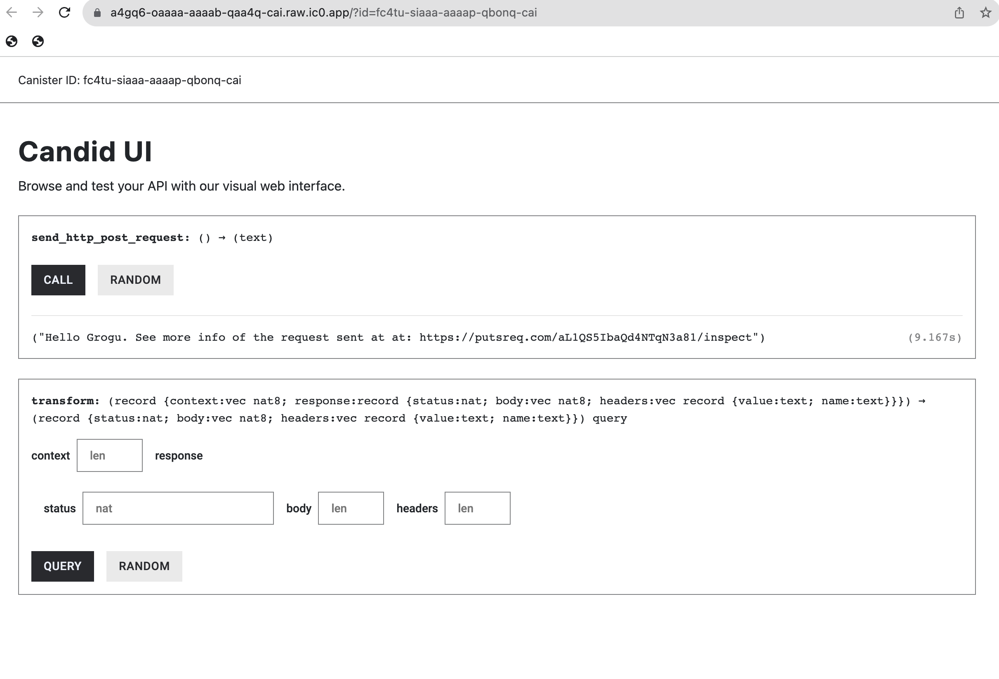

# How to use HTTP outcalls: POST

## Overview

**The main intent of this canister is to show developers how to make idempotent POST requests.**

This example takes less than 5 minutes to complete.

## Sample dapp

[[ADD IMAGE of DAPP]]

[[ADD IMAGE of Request bin]

## Motoko version

### Motoko: Structure of the code

Before we dive in, here is the structure the code we will touch:

Here is how our main file will look like:

```motoko

//Import some custom types from `src/backend_canister/Types.mo` file
import Types "Types";

actor {

//method that uses the HTTP outcalls feature and returns a string
  public func foo() : async Text {

    //1. DECLARE IC MANAGEMENT CANISTER
    let ic : Types.IC = actor ("aaaaa-aa");

    //2. SETUP ARGUMENTS FOR HTTP GET request
    let request : Types.HttpRequestArgs = {
        //construct the request
    };

    //3. ADD CYCLES TO PAY FOR HTTP REQUEST
    //code to add cycles

    //4. MAKE HTTPS REQUEST AND WAIT FOR RESPONSE
    let response : Types.HttpResponsePayload = await ic.http_request(request);

    //5. DECODE THE RESPONSE
    //code to decode response

    //6. RETURN RESPONSE OF THE BODY
    response
  };
};
```

We will also create some custom types in `Types.mo`. This will look like this:

```motoko
module Types {

    //type declarations for HTTP requests, HTTP responses, IC management canister, etc...

}
```

### Motoko: Step by step

To create a new project:

- #### Step 1:  Create a new project by running the following command:

```bash
dfx new hello_http
cd hello_http
npm install
```

- #### Step 2:  Open the `src/hello_http_backend/main.mo` file in a text editor and replace content with:


FILL OUT

- #### Step 3:  Open the `src/hello_http_backend/Types.mo` file in a text editor and replace content with:

```motoko
module Types {

    //1. Type that describes the Request arguments for an HTTPS outcall
    //See: https://internetcomputer.org/docs/current/references/ic-interface-spec/#ic-http_request
    public type HttpRequestArgs = {
        url : Text;
        max_response_bytes : ?Nat64;
        headers : [HttpHeader];
        body : ?[Nat8];
        method : HttpMethod;
        transform : ?TransformRawResponseFunction;
    };

    public type HttpHeader = {
        name : Text;
        value : Text;
    };

    public type HttpMethod = {
        #get;
        #post;
        #head;
    };

    public type HttpResponsePayload = {
        status : Nat;
        headers : [HttpHeader];
        body : [Nat8];
    };

    //2. HTTPS outcalls have an optional "transform" key. These two types help describe it.
    //"The transform function may, for example, transform the body in any way, add or remove headers, 
    //modify headers, etc. "
    //See: https://internetcomputer.org/docs/current/references/ic-interface-spec/#ic-http_request
    
    //2.1 This type describes a function called "TransformRawResponse" used in line 14 above
    //"If provided, the calling canister itself must export this function." 
    //In this minimal example for a GET request, we declare the type for completeness, but 
    //we do not use this function. We will pass "null" to the HTTP request.
    public type TransformRawResponseFunction = {
        function : shared query TransformArgs -> async HttpResponsePayload;
        context : Blob;
    };

    //2.2 This type describes the arguments the transform function needs
    public type TransformArgs = {
        response : HttpResponsePayload;
        context : Blob;
    };


    //3. Declaring the IC management canister which we use to make the HTTPS outcall
    public type IC = actor {
        http_request : HttpRequestArgs -> async HttpResponsePayload;
    };

}
```

- #### Step 4: Test the dapp locally.

Deploy the dapp locally:

```bash
dfx start --background
dfx deploy
```

If successful, the terminal should return canister URLs you can open:

```bash
Deployed canisters.
URLs:
  Backend canister via Candid interface:
    hello_http_backend: http://127.0.0.1:4943/?canisterId=dccg7-xmaaa-aaaaa-qaamq-cai&id=dfdal-2uaaa-aaaaa-qaama-cai
```

Open the candid web UI for hello_http backend and call the `send_http_post_request()` method:



## Rust version

### Rust: Structure of the code

Here is how the management canister is declared in a Rust canister (e.g. `lib.rs`):

### Rust: Step by step

- #### Step 1:  Create a new project by running the following command:

```bash
dfx new --type=rust hello_http_rust
cd hello_http_rust
npm install
rustup target add wasm32-unknown-unknown
```

- #### Step 2: Open the `/src/hello_http_rust_backend/src/lib.rs` file in a text editor and replace content with:

```rust
//1. IMPORT IC MANAGEMENT CANISTER
//This includes all methods and types needed
use ic_cdk::api::management_canister::http_request::{
    http_request, CanisterHttpRequestArgument, HttpHeader, HttpMethod, HttpResponse, TransformArgs,
    TransformContext,
};

//Update method using the HTTPS outcalls feature
#[ic_cdk::update]
async fn send_http_post_request() -> String {

}
```

- `send_http_post_request() -> String` returns a `String`, but this is not necessary. In this tutorial, this is done for easier testing.
- The `lib.rs` file used [http_request](https://docs.rs/ic-cdk/latest/ic_cdk/api/management_canister/http_request/fn.http_request.html) which is a convenient Rust CDK method that already sends cycles to the IC management canister under the hood. It knows how many cycles to send for a 13-node subnet and most cases. If your HTTPS outcall needs more cycles, you should use [http_request_with_cycles()](https://docs.rs/ic-cdk/latest/ic_cdk/api/management_canister/http_request/fn.http_request_with_cycles.html) method and explicitly call the cycles needed. 
- The Rust CDK method `http_request` used above wraps the IC management canister method [`http_request`](../../../references/ic-interface-spec#ic-http_request), but it is not strictly the same.

- #### Step 3: Open the `src/hello_http_rust_backend/hello_http_rust_backend.did` file in a text editor and replace content with:

We update the Candid interface file so it matches the method `send_http_post_request()` in `lib.rs`. 

```
service : {
    "send_http_post_request()": () -> (text);
}
```

- #### Step 4: Test the dapp locally.

Deploy the dapp locally:

```bash
dfx start --background
dfx deploy
```

If successful, the terminal should return canister URLs you can open:

```bash
Deployed canisters.
URLs:
  Frontend canister via browser
    hello_http_rust_frontend: http://127.0.0.1:4943/?canisterId=ajuq4-ruaaa-aaaaa-qaaga-cai
  Backend canister via Candid interface:
    hello_http_rust_backend: http://127.0.0.1:4943/?canisterId=aovwi-4maaa-aaaaa-qaagq-cai&id=a4tbr-q4aaa-aaaaa-qaafq-cai
```

Open the candid web UI for the backend (the `hello_http_rust_backend` one) and call the `send_http_post_request()` method:

<!--  -->

:::note
In both the Rust and Motoko minimal examples, we did not create a **transform** function so that it transforms the raw response. This is something we will explore in a following section
:::