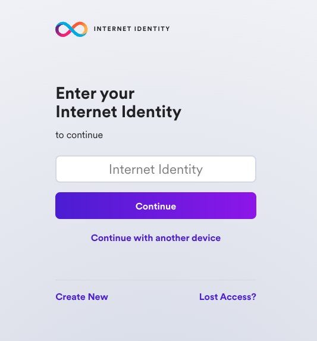
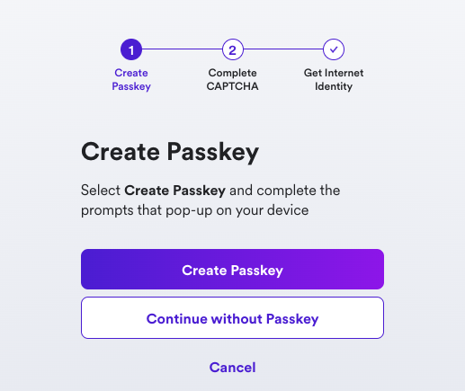

# Internet Identity integration

## Overview
This guide shows how to integrate and test a project with Internet Identity. This project uses the **pullable** version of the Internet identity canister. A pullable canister is a canister that provides a public service at a static canister ID. To learn more about pullable canisters, please see the documentation [here](/docs/current/developer-docs/setup/pulling-canister-dependencies). 

### Prerequisites

Before you start, verify that you have:

- Downloaded and installed [`dfx`](https://github.com/dfinity/sdk/releases/latest) version 0.10.0 or later.
- [Node.js v16+.](https://nodejs.org/en).

### Step 1: To get started, open a terminal window and clone the sample project's repository: 

```
dfx start --clean --background
git clone https://github.com/krpeacock/auth-client-demo.git
cd auth-client-demo
npm install
```

### Step 2: For this project, we'll use a simple 'Who am I?' function that is stored in the `src/whoami/main.mo` file:

```motoko
actor {
    public shared (msg) func whoami() : async Principal {
        msg.caller
    };
};
```

In this actor, there is a single method that responds with the caller's principal. This will show if we make a request from the application's frontend using an authenticated Internet Identity or an AnonymousIdentity. 

This sample project comes with different options for the frontend of the application, such as React and Vue. For simplicity, we'll use the vanilla JavaScript option. 

### Step 3: To see the code for the application's frontend functionality, look at the `src/auth_client_demo_assets/vanilla/index.ts` file. 

This code first, imports the `AuthClient` from `@dfinity/auth-client`:

```typescript
import { AuthClient } from "@dfinity/auth-client";
import { handleAuthenticated, renderIndex } from "./views";
```

Then, it defines some variables used to declare a day in nanoseconds:

```typescript
// One day in nanoseconds
const days = BigInt(1);
const hours = BigInt(24);
const nanoseconds = BigInt(3600000000000);
```

Next the code sets some default options, including `loginOptions`, which allows the `identityProvider` to be either the II mainnet canister if you are using the local environmental variable `DFX_NETWORK` set to `ic`, or the locally deployed II canister. Your local replica will not accept signatures from the mainnet canister. 

```typescript
export const defaultOptions = {
  createOptions: {
    idleOptions: {
      // Set to true if you do not want idle functionality
      disableIdle: true,
    },
  },
  loginOptions: {
    identityProvider:
      process.env.DFX_NETWORK === "ic"
        ? "https://identity.ic0.app/#authorize"
        : `http://localhost:4943?canisterId=rdmx6-jaaaa-aaaaa-aaadq-cai#authorize`,
    // Maximum authorization expiration is 8 days
    maxTimeToLive: days * hours * nanoseconds,
  },
};
```

The code checks to see if the user has previously logged in. If so, their previous identity is verified:

```typescript
const init = async () => {
  const authClient = await AuthClient.create(defaultOptions.createOptions);

  if (await authClient.isAuthenticated()) {
    handleAuthenticated(authClient);
  }
  renderIndex();
  setupToast();
};
```

Lastly, the code executes a function that listens for the button on the frontend to be clicked and initialize the client:

```typescript
async function setupToast() {
  const status = document.getElementById("status");
  const closeButton = status?.querySelector("button");
  closeButton?.addEventListener("click", () => {
    status?.classList.add("hidden");
  });
}


init();
```

### Step 4: Pulling the Internet Identity canister

As mentioned in the introduction, we'll be using the **pullable** version of the Internet Identity canister, which uses the `dfx deps` workflow. The project's `dfx.json` file defines the Internet Identity canister as `"type": "pull"`. 

```json
{
  "canisters": {
    "whoami": {
      "main": "src/whoami/main.mo",
      "type": "motoko",
      "declarations": {
        "node_compatibility": true
      },
      "pullable": {
        "dependencies": [],
        "wasm_url": "https://github.com/krpeacock/auth-client-demo/releases/latest/download/whoami.wasm",
        "wasm_hash": "a5af74d01aec228c5a717dfb43f773917e1a9138e512431aafcd225ad0001a8b",
        "init_guide": "null"
      }
    },
    "internet-identity": {
      "type": "pull",
      "id": "rdmx6-jaaaa-aaaaa-aaadq-cai"
    },
    "auth_client_demo_assets": {
      "dependencies": [
        "whoami",
        "internet-identity"
      ],
      "source": [
        "src/auth_client_demo_assets/vanilla"
      ],
      "type": "assets"
    },
    "svelte": {
      "dependencies": [
        "whoami",
        "internet-identity"
      ],
      "source": [
        "src/auth_client_demo_assets/svelte/build"
      ],
      "type": "assets"
    }
  },
  "defaults": {
    "build": {
      "args": "",
      "packtool": ""
    }
  },
  "output_env_file": ".env",
  "version": 2
}
```

### Step 5: Pull the II canister using `dfx deps`, then deploy the project:

```
dfx deps pull
dfx deps deploy
```

### Step 6: Deploy the project locally.

```
dfx deploy
```

### Step 7: Start the local development server:

```
npm start
```

This command will output the following:

```
  VITE v4.3.6  ready in 137 ms

  ➜  Local:   http://127.0.0.1:5173/
  ➜  Network: use --host to expose
  ➜  press h to show help
```

### Step 8: Navigate to the 'Local' URL in your web browser. You will see the frontend of the app:


### Step 9: Then, select 'Log in'. 

You'll be redirected to the II frontend. Since we're running this locally, this will be using a local, non-production Internet Identity. To create one, follow the on-screen steps.

### Step 10: Create a local Internet Identity

- Select 'Create New' from the UI.



- Next, select 'Create Passkey'.



- When prompted, choose how to create your passkey, either on your current device or you can use another device. 


- Then, enter the CAPTCHA to continue.


Your Internet Identity has been created! It'll be shown on the screen, and it is recommended that you write it down in a safe location to save it. 

This number is your Internet Identity. With this number and your passkey, you will be able to create and securely connect to Internet Computer dapps. If you lose this number, you will lose any accounts that were created with it. This number is not secret, but is unique to you.

Once you save it, select the 'I saved it, continue' button.

### Step 11: Once you are redirected back to the frontend of the app, click the 'Who am I?' button.


### Step 12: Your Internet Identity's principal ID will be returned:


## Resources


