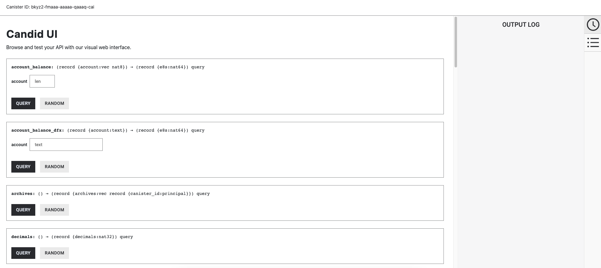

# ICP ledger local setup

## Overview
If you are working in a local development environment, i.e with a local replica instead of the public Internet Computer, you can't access the ICP ledger. In order to test your application that integrates with the ICP ledger locally, you need to deploy a local ledger canister. However, this local ledger canister won't have the history and balances of the live ICP ledger. 

:::info
There are two ways of deploying an ICP ledger locally.
- Use [dfx-nns](/docs/references/cli-reference/dfx-nns.md) to deploy the entire NNS locally. Since the ICP ledger is part of the NNS, this command will also install an ICP ledger with canister ID `ryjl3-tyaaa-aaaaa-aaaba-cai`. This solution is fast and straight forward, but also more heavyweight. 
- Deploy the ICP ledger `wasm` locally. This method is discussed and shown in this guide and it gives you more control over the deployment and also is lightweight.
:::

Deploying an ICP ledger locally gives you certain advantages over the default ledger from `dfx` that is installed with `dfx nns install`. For instance, you can define the `minting account`, you have control over the initialization arguments and you have control over which `wasm` version of the ICP ledger you want to interact with. 

The ICP ledger only exists on the mainnet and the `wasm` that is running on the mainnet is not meant to be used for other token deployments. It needs to be backwards compatible and thus contains a lot of legacy code that should not be used when deploying a new ledger.

If you want to deploy your own token or build an ICRC-1 ledger, have a look at the [guide on setting up an ICRC-1 ledger](/docs/developer-docs/integrations/icrc-1/icrc1-ledger-setup.md).

Follow the steps below to deploy your copy of the ledger canister to a local replica.

### Step 1: Make sure you use a recent version of the [IC SDK](/docs/current/developer-docs/getting-started/install/).
If you don’t have the IC SDK installed, follow instructions on the [installing the IC SDK](/docs/current/developer-docs/getting-started/install/) section to install it.

### Step 2: Create a new dfx project with the command:

```
dfx new icp_ledger_canister
cd icp_ledger_canister
```

### Step 3: Determine the ledger file locations.

Go to the [releases overview](https://dashboard.internetcomputer.org/releases) and copy the latest replica binary revision. At the time of writing, this is `d87954601e4b22972899e9957e800406a0a6b929`.

The URL for the ledger Wasm module is `https://download.dfinity.systems/ic/<REVISION>/canisters/ledger-canister.wasm.gz`, so with the above revision it would be `https://download.dfinity.systems/ic/d87954601e4b22972899e9957e800406a0a6b929/canisters/ledger-canister.wasm.gz`.

The URL for the ledger .did file is `https://raw.githubusercontent.com/dfinity/ic/<REVISION>/rs/rosetta-api/icp_ledger/ledger.did`, so with the above revision it would be `https://raw.githubusercontent.com/dfinity/ic/d87954601e4b22972899e9957e800406a0a6b929/rs/rosetta-api/icp_ledger/ledger.did`.

[OPTIONAL]
If you want to make sure you have the latest ICP ledger files, you can run the following script: 
``` sh
curl -o download_latest_icp_ledger.sh "https://raw.githubusercontent.com/dfinity/ic/00a4ab409e6236d4082cee4a47544a2d87b7190d/rs/rosetta-api/scripts/download_latest_icp_ledger.sh"
chmod +x download_latest_icp_ledger.sh
./download_latest_icp_ledger.sh
```

### Step 4: Configure the `dfx.json` file.

Open the `dfx.json` file in your project's directory. Replace the existing content with the following:

``` json
{
  "canisters": {
    "icp_ledger_canister": {
      "type": "custom",
      "candid": "https://raw.githubusercontent.com/dfinity/ic/d87954601e4b22972899e9957e800406a0a6b929/rs/rosetta-api/icp_ledger/ledger.did",
      "wasm": "https://download.dfinity.systems/ic/d87954601e4b22972899e9957e800406a0a6b929/canisters/ledger-canister.wasm.gz",
      "remote": {
        "id": {
          "ic": "ryjl3-tyaaa-aaaaa-aaaba-cai"
        }
      }
    }
  },
  "defaults": {
    "build": {
      "args": "",
      "packtool": ""
    }
  },
  "output_env_file": ".env",
  "version": 1
}
```

If you chose to download the ICP ledger files with the script you need to replace the candid and wasm file entries:

```json
...
"candid": icp_ledger.did,
"wasm" : icp_ledger.wasm.gz,
  ...
```

In an existing project you would only need to add the `icp_ledger_canister` canister to the `canisters` section.

### Step 5: Start a local replica.

``` sh
dfx start --background --clean
```

### Step 6: Create a new identity that will work as a minting account:

``` sh
dfx identity new minter
dfx identity use minter
export MINTER_ACCOUNT_ID=$(dfx ledger account-id)
```

Transfers from the minting account will create `Mint` transactions. Transfers to the minting account will create `Burn` transactions.

### Step 7: Switch back to your default identity and record its ledger account identifier.

``` sh
dfx identity use default
export DEFAULT_ACCOUNT_ID=$(dfx ledger account-id)
```

### Step 8: Deploy the ledger canister with archiving options:

```
dfx deploy --specified-id ryjl3-tyaaa-aaaaa-aaaba-cai icp_ledger_canister --argument "
  (variant {
    Init = record {
      minting_account = \"$MINTER_ACCOUNT_ID\";
      initial_values = vec {
        record {
          \"$DEFAULT_ACCOUNT_ID\";
          record {
            e8s = 10_000_000_000 : nat64;
          };
        };
      };
      send_whitelist = vec {};
      transfer_fee = opt record {
        e8s = 10_000 : nat64;
      };
      token_symbol = opt \"LICP\";
      token_name = opt \"Local ICP\";
    }
  })
"
```

Take a moment to read the details of the call made above. Not only are you deploying the ICP ledger canister, you are also:
- Deploying the canister to the same canister ID as the mainnet ledger canister. This is to make it easier to switch between local and mainnet deployments.
- Setting the minting account to the account identifier you saved in a previous step (`MINTER_ACCOUNT_ID`).
- Minting 100 ICP tokens to the `DEFAULT_ACCOUNT_ID` (1 ICP is equal to 10^8 e8s, hence the name).
- Setting the transfer fee to 0.0001 ICP.
- Naming the token `Local ICP / LICP`

### Step 9: Interact with the canister.

You can interact with the canister by running CLI commands, such as:

```
dfx canister call icp_ledger_canister name 
```

This command will return the token's name, such as:

```
("Local ICP")
```

Or, you can interact with it using the Candid UI by navigating to the URL provided when the canister was deployed, such as:

```
http://127.0.0.1:4943/?canisterId=bnz7o-iuaaa-aaaaa-qaaaa-cai&id=ryjl3-tyaaa-aaaaa-aaaba-cai
```

After navigating to this URL in a web browser, the Candid UI will resemble the following:



Your local ICP ledger canister is up and running. You can now deploy other canisters that need to communicate with the ledger canister.
