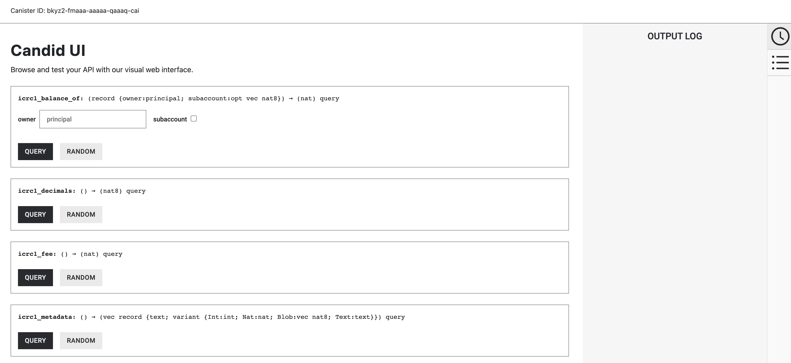

# Ledger local setup

## Overview
If you are working in a local development environment, i.e with a local replica instead of the public Internet Computer, you can't access the ICP ledger. In order to test your application that integrates with the ICP ledger locally, you need to deploy a local ledger canister. However, this local ledger canister won't have the history and balances of the live ICP ledger.

Follow the steps below to deploy your copy of the ledger canister to a local replica.

### Step 1:  Make sure you use a recent version of the [IC SDK](/developer-docs/setup/install/index.mdx).
If you don’t have the IC SDK installed, follow instructions on the [installing the IC SDK](/developer-docs/setup/install/index.mdx) section to install it.

### Step 2: Create a new dfx project with the command:

```
dfx new ledger
cd ledger
```

### Step 3:  Determine ledger file locations

Go to the [releases overview](https://dashboard.internetcomputer.org/releases) and copy the latest replica binary revision. At the time of writing, this is `a17247bd86c7aa4e87742bf74d108614580f216d`.

The URL for the ledger WASM module is `https://download.dfinity.systems/ic/<REVISION>/canisters/ic-icrc1-ledger.wasm.gz`, so with the above revision it would be `https://download.dfinity.systems/ic/a17247bd86c7aa4e87742bf74d108614580f216d/canisters/ic-icrc1-ledger.wasm.gz`.

The URL for the ledger .did file is `https://raw.githubusercontent.com/dfinity/ic/<REVISION>/rs/rosetta-api/icrc1/ledger/ledger.did`, so with the above revision it would be `https://raw.githubusercontent.com/dfinity/ic/a17247bd86c7aa4e87742bf74d108614580f216d/rs/rosetta-api/icrc1/ledger/ledger.did`.

### Step 4:  Open the `dfx.json` file in your project's directory. Replace the existing content with the following:

``` json
{
  "ledger": {
    "type": "custom",
    "candid": "https://raw.githubusercontent.com/dfinity/ic/a17247bd86c7aa4e87742bf74d108614580f216d/rs/rosetta-api/icrc1/ledger/ledger.did",
    "wasm": "https://download.dfinity.systems/ic/a17247bd86c7aa4e87742bf74d108614580f216d/canisters/ic-icrc1-ledger.wasm.gz",
    "remote": {
      "id": {
        "ic": "ryjl3-tyaaa-aaaaa-aaaba-cai"
      }
    }
  },
  "defaults":{
    "replica": {
      "subnet_type":"system"
    }
  }
}
```

### Step 5:  Start a local replica.

``` sh
dfx start --background --clean
```

### Step 6:  Create a new identity that will work as a minting account:

``` sh
dfx identity new minter
dfx identity use minter
export MINT_ACC=$(dfx identity get-principal)
```

Transfers from the minting account will create `Mint` transactions. Transfers to the minting account will create `Burn` transactions.

### Step 7:  Switch back to your default identity and record its ledger account identifier.

``` sh
dfx identity use default
export LEDGER_ACC=$(dfx identity get-principal)
```

### Step 8: Obtain the principal of the identity you use for development. This principal will be the controller of archive canisters.

``` sh
dfx identity use default
export ARCHIVE_CONTROLLER=$(dfx identity get-principal)
```

### Step 9: Deploy the ledger canister with archiving options:

```
dfx canister install ledger --argument "(variant {Init = record { token_name = \"NAME\"; token_symbol = \"SYMB\"; transfer_fee = 1000000; metadata = vec {}; minting_account = record {owner = principal \"$(dfx --identity minter identity get-principal)\";}; initial_balances = vec {}; archive_options = record {num_blocks_to_archive = 1000000; trigger_threshold = 1000000; controller_id = principal \"$(dfx identity get-principal)\"}; }})"
```

The output of this command will resemble the following:

```
Installing code for canister ledger, with canister ID bkyz2-fmaaa-aaaaa-qaaaq-cai
Deployed canisters.
URLs:
  Backend canister via Candid interface:
    ledger: http://127.0.0.1:8080/?canisterId=bd3sg-teaaa-aaaaa-qaaba-cai&id=bkyz2-fmaaa-aaaaa-qaaaq-cai
```

Take note of the canister ID.

You may want to set `trigger_threshold` and `num_blocks_to_archive` options to low values (e.g., 10 and 5) to trigger archivation after only a few blocks.

### Step 10: Interact with the canister.

You can interact with the canister by running CLI commands, such as:

```
dfx canister call ledger icrc1_name 
```

This command will return the token's name, such as:

```
("Token Name")
```

Or, you can interact with it using the Candid UI by navigating to the URL provided when the canister was deployed, such as:

```
http://127.0.0.1:8080/?canisterId=bd3sg-teaaa-aaaaa-qaaba-cai&id=bkyz2-fmaaa-aaaaa-qaaaq-cai
```

After navigating to this URL in a web browser, the Candid UI will resemble the following:



Your local ICP ledger canister is up and running. You can now deploy other canisters that need to communicate with the ledger canister.
