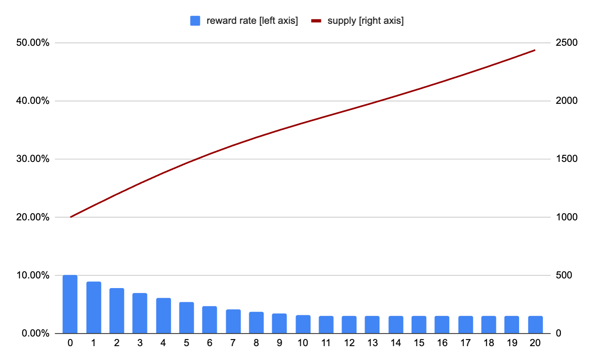

# SNS Rewards

## Background & goal

* The goal of this article is to explain the design of the service nervous system (SNS) reward scheme.
* The full potential of tokenization can be unlocked by a tokenized open governance system, where tokens can be locked to participate in voting. Anyone with locked tokens, including the users that were rewarded with tokens, can submit and vote on governance proposals for the dapp.
* By participating in governance, developers, users, and other investors can collectively decide what new features should be implemented. As their tokens are locked, they will be incentivized to vote taking into consideration the future value of the tokens and the dapp.
* This represents the first simple scheme for SNS rewards. Based on the collected experience from developers and the community, this can be enhanced in the future.
* We consider two categories of rewards
  * Voting rewards to incentivize users to take part in SNS governance.
  * User rewards to incentivize users to become early adopters and active users of the decentralized application (dapp) governed by the SNS.
* The reward scheme is based on the voting rewards used in the [Network Nervous System](https://medium.com/dfinity/the-network-nervous-system-governing-the-internet-computer-1d176605d66a#:~:text=Network%20Nervous%20System%20overview,how%20to%20update%20this%20information.) (NNS) , which however can be flexibly configured by each SNS.

## Recap on NNS voting rewards

The [NNS](/tokenomics/nns/nns-intro.md) is the DAO of the IC. Within the NNS, voting rewards are paid out on a regular basis (currently daily), based on an overall reward pool for that time period. Each neuron receives a pro-rata amount of that pool according to the voting power with which the neuron voted and in how many proposals the neuron participated. More precisely, this works as follows:

* Determination of the total reward pool
  * For a time t between G (genesis time) and G + 8y the annualized reward as a percentage of total supply is R(t) = 5% + 5% [(G + 8y – t)/8y]²
  * For a time t after G+8y, we have R(t) = 5%.
  * The total pool of voting rewards for a given day is calculated as ICP supply (total supply of ICP tokens on that day) * R(t) / 365.25.
* Voting power of neurons
  * Only neurons with a dissolve delay of more than 6 months are eligible for voting. The maximum dissolve delay is 8 years.
  * The voting power of a neuron is computed as neuron_stake * dissolve_delay_bonus * age_bonus
  * In particular the dissolve delay bonus and the age bonus are cumulative.
  * The dissolve delay bonus (ddb) is a value between ddbmin =1 and ddbmax=2 and a linear function of the dissolve delay (capped at eight years).
  * The age bonus (ab) is a value between abmin=1 and abmax=1.25 and a linear function of the age of the neuron (capped at four years). A neuron starts aging when it enters a locked state. Aging is reset to 0 when a neuron enters a dissolving state.
  * The voting power is calculated when the proposal is made, not when the ballot is cast.

* Allocation of reward pool to neurons
  * The reward pool is allocated in proportion to the voting power of proposals that are settled on this day multiplied by the reward weight of the according proposal category.
    * Determine the set of proposals that are included in this reward period (typically a day): these are the proposals that are not yet settled with respect to voting rewards, and no longer open for voting.
    * The total voting power contributed to these proposals by neurons voting to adopt or reject is added up.
    * Each neuron is rewarded in proportion to the voting power it contributed to these proposals multiplied by the reward weight of the according proposal category.
  * When a neuron is rewarded for voting, these rewards are recorded in an attribute of the neuron that is called maturity which is not a tradable asset. If a user wants to generate income from maturity, he/she needs to burn maturity to create new ICP via spawning a neuron which is a non-deterministic process described [here](https://wiki.internetcomputer.org/wiki/Maturity_modulation).

## Design of SNS rewards

### Voting rewards

As highlighted in the background section above, we leverage the NNS voting reward scheme and allow for flexibility to configure the scheme. Hence, in the following we go through the features of the NNS and describe how it is adapted and made configurable for the SNS. Unless otherwise stated, the approach and formula are the same as for the NNS. As for the NNS it is possible to change the SNS configuration by an SNS governance proposal.

#### Determination of the total reward pool
  * The impact of changing the parameters of the reward function can be simulated in this [tool](https://docs.google.com/spreadsheets/d/1cTqgjGcG5rEQ5kRGprpdLvBL7ZdTqUDCuCi0QjClbgk/edit#gid=0). 
  
  
* Reward minimum rmin: rational value greater than or equal to 0. Default value: 0.00.
* Reward maximum rmax: rational value greater than or equal to rmin. Default value: 0.00.
* Start time for paying out rewards tstart: timestamp greater than or equal to genesis time of the SNS. The start time is set to the current time once the reward calculation is switched on.
* Time length tdelta which is greater than or equal to 0 and which determines the time transition length between rmax and rmin. Default value: 0 years.
* For a time t between tstart and tstart+tdelta the annualized reward as a percentage of total supply is R(t) = rmin+ (rmax-rmin) [ (tstart+ tdelta – t) / tdelta ]²
* For a time t after tstart+tdelta, we have R(t) = rmin
* For the special case rmax = rmin the reward function is constant, namely R(t)=rmin
* The total pool of voting rewards for a given day is calculated as SNS supply (total supply of SNS tokens) * R(t) / 365.25.
* Voting rewards are minted, i.e. generating new supply once the according maturity is converted to the SNS token. In case that the SNS would like to stop a token supply increase after tstart+tdelta the SNS should set rmin=0.

#### Voting power of neurons
  * Required minimum dissolve delay for voting ddmin: integer value greater than or equal to zero. Default value: 6 months.
  * Maximum dissolve delay ddmax: integer value greater than or equal to ddmin. Default value: 8 years.
  * Maximum dissolve delay bonus:
    * ddbmax rational value greater than or equal to 1. Default value: 2.
    * The special case ddbmax=1 results in no dissolve delay bonus.
  * Maximum age amax: integer value greater than or equal to 0. Default value: 4 years.
  * Maximum age bonus
    * abmax rational value greater than or equal to 1. Default value: 1.25.
    * The special case abmax=1 results in no age bonus.
#### Allocation of reward pool
  * The reward pool is allocated in proportion to the voting power of proposals that are settled on this day (same as for the NNS).
  * If on a particular day no proposal was submitted then rewards will be carried over to the next day.
  * NNS has reward weights for different proposal types. For the first version of the SNS reward scheme this functionality is not yet available.

There is a flag which activates the calculation and distribution of voting rewards, as an SNS might choose to go through a ramp-up period without voting rewards, or with no voting rewards at all.

### Setting voting reward parameters

Voting reward parameters are defined in the SNS governance canister and can be changed by proposal. Details on the data structure *VotingRewardsParameters* used in the implementation are [here](https://github.com/dfinity/ic/blob/master/rs/sns/governance/proto/ic_sns_governance/pb/v1/governance.proto#L726).

In the following table we provide an overview of all relevant parameters of *VotingRewardsParameters*, linking the notation of this article to full names used in the implementation.

|Parameter|Full name in *VotingRewardsParameters*|
| --- | --- |
|rmin|*initial_reward_rate_basis_points*|
|rmax|*final_reward_rate_basis_points*|
|tstart|*start_timestamp_seconds*|
|tdelta|*reward_rate_transition_duration_seconds*|

When VotingRewardsParameters is not populated, voting rewards are disabled.

In the following we provide an overview of the relevant parameters for the determination of voting power.

|Parameter|Full name in *VotingRewardsParameters*|
| --- | --- |
|ddmin|*neuron_minimum_dissolve_delay_to_vote_seconds*|
|ddmax|*max_dissolve_delay_seconds*|
|ddbmax|To be added, once implemented.|
|amax|*max_neuron_age_for_age_bonus*|
|abmax|To be added, once implemented.|

### User rewards

* The purpose of user rewards is to foster early adoption and active usage of the SNS. Given that the meaning of usage and the according user rewards can vary greatly across individual SNSs we have a very simple set-up at start.
* Some tokens (reserved for user rewards) can be held in an account that is owned by an SNS-controlled canister. This canister can then codify when the rewards are paid out and to whom.
* This solution allows paying out existing (not newly minted) tokens. If it is required that user rewards trigger minting, this could be added in a later phase.
