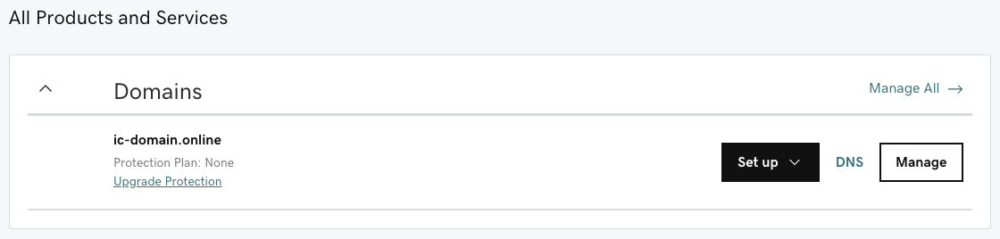
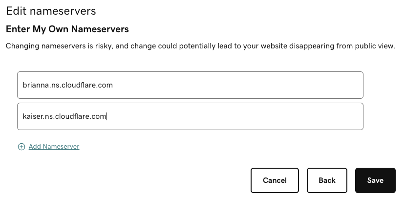
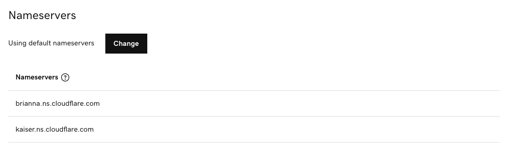

# DNS Configuration Guide

This guide explains how to configure the DNS records of your domain for two popular
registrars: [Namecheap](#namecheap) and [GoDaddy](#godaddy).

## Namecheap

In the following, we outline the steps required to configure the apex of a domain and
a subdomain on Namecheap to be used as a custom domain. To illustrate the required
configuration, we use the domain `ic-domain.live` and the subdomain `example.ic-domain.live`
by configuring it to point to the canister with the ID `y5jqt-wqaaa-aaaam-abcoq-cai`.

* After purchasing your domain on Namecheap, open the management pane of your
domain in the Namecheap dashboard.

* Open the "Advanced DNS" tab.

* _Apex_ - To configure the apex of the domain (e.g., `ic-domain.live`), add the following records by
clicking on "Add new record":
  * Create an `ALIAS` Record for which you set the host field to `@` and the target field to `ic0.app`;
  * Create a `CNAME` Record for which you set the host field to `_acme-challenge` and the target field to `_acme-challenge.ic-domain.live.icp2.io`;
  * Create a `TXT` Record for which you set the host field to `_canister-id` and the value field to the canister ID `y5jqt-wqaaa-aaaam-abcoq-cai`.

  The resulting configuration should look similar to the following screenshot:

  

* _Subdomain_ - To configure a subdomain (e.g., `example.ic-domain.live`), add the following records
by clicking on "Add new record":
  * Create a `CNAME` Record for which you set the host field to `example` and the target field to `ic0.app`;
  * Create a `CNAME` Record for which you set the host field to `_acme-challenge.example` and the target field to `_acme-challenge.example.ic-domain.live.icp2.io`;
  * Create a `TXT` Record for which you set the host field to `_canister-id.example` and the value field to the canister ID `y5jqt-wqaaa-aaaam-abcoq-cai`.

  The resulting configuration should look similar to the following screenshot:

  

* Now, you are all set to register your custom domain with the boundary nodes and
you can continue with step 2 of the [general custom domains instructions](custom-domain.md#custom-domains-on-the-boundary-nodes).

## GoDaddy

In the following, we explain how you can configure your domain on GoDaddy to
be used to point to a canister hosted on the Internet Computer. As an illustration,
we configure the domain `ic-domain.online` and the subdomain `example.ic-domain.online`
to point to the canister with the ID `y5jqt-wqaaa-aaaam-abcoq-cai`.

* After purchasing your domain on GoDaddy, open your account and navigate to
"My Products".

* Click on the "DNS" button next to the domain:

    

* _Apex_ - Unfortunately, GoDaddy does not support to configure a `CNAME` record
(or one of its alternatives, `ALIAS` or `ANAME`) for the apex of the domain, we need
to make use of a workaround.

  There are mainly two approaches:

  1. Directly configuring the IP addresses of the boundary nodes.
  1. Relying on a different DNS provider (e.g., Cloudflare).

  Directly configuring the IP addresses is simpler compared to relying on another
  DNS provider, but is less resilient and performant.

  __Directly configure the IP addresses__

  * First, you need to look up the IP addresses of the boundary nodes. To this
  end, use an online DNS lookup service (e.g., [nslookup.io](https://nsloopup.io))
  and take a note of the IPv4- and IPv6-addresses, the `A` and `AAAA` records, respectively.

    

  * In the "DNS Management" pane in your GoDaddy account, add the following DNS records:

    * Create an `A` record for each IPv4-address by setting the name field
    to "@" and the value field to the IPv4-address (e.g., `147.75.108.42`);
    * Create an `AAAA` record for each IPv6-address by setting the name field
    to "@" and the value field to the IPv6-address (e.g., `2600:c0d:3002:4:5000:3cff:fe6b:8dd2`);
    * Create a `CNAME` record for which you set the name field to `_acme-challenge` and the value field to `_acme-challenge.ic-domain.online.icp2.io`;
    * Create a `TXT` Record for which you set the name field to `_canister-id` and the value field to the canister ID `y5jqt-wqaaa-aaaam-abcoq-cai`.

    The resulting configuration should look similar to the following screenshot:

    

  __Rely on an alternative DNS provider__

  We explain this approach using Cloudflare as DNS provider. It works similar
  with any other DNS provider that supports `CNAME`, `ALIAS`, or `ANAME` records
  for the apex of a domain.

    * Create a free account with Cloudflare, click on "Add site" in the top bar of dashboard.

    * Enter your domain (e.g., `ic-domain.online`) and click "Add site".

    * Choose the free plan and continue.

    * Add the following records to configure your domain:
      * Create a `CNAME` record for which you set the name field to `@` and the
      target field to `ic0.app`;
      * Create a `CNAME` record for which you set the host field to `_acme-challenge` and the target field to `_acme-challenge.ic-domain.online.icp2.io`;
      * Create a `TXT` record for which you set the name field to `_canister-id` and the content field to the canister ID `y5jqt-wqaaa-aaaam-abcoq-cai`.

    The resulting configuration should look similar to the following screenshot:

    

    * In the next step, Cloudflare lists two nameservers that you should configure
    GoDaddy to use. Take note of the two nameservers (e.g., `brianna.ns.cloudflare.com` and `kaiser.ns.cloudflare.com`).

    * In the "DNS Management" pane of GoDaddy, click on the "Change" button in
    the "Nameservers" section.

    * In the dialog that opened, click on "Enter my own nameservers (advanced)" and
    fill in the nameservers from Cloudflare in the provided fields. To finish, click on "Save".

    

    * Confirm in the dialog that you indeed intend to change the nameservers.
    The resulting configuration should look similar to the following screenshot:

        

    * Back in the Cloudflare management portal, click on "Done, check nameservers".
    This step can take several hours and you will be notified by email once it
    succeeded.

* _Subdomain_ - To configure a subdomain (e.g., `example.ic-domain.live`), add the following records
by clicking on "Add new record":
  * Create a `CNAME` Record for which you set the host field to `example` and the target field to `ic0.app`;
  * Create a `CNAME` Record for which you set the host field to `_acme-challenge.example` and the target field to `_acme-challenge.example.ic-domain.online.icp2.io`;
  * Create a `TXT` Record for which you set the host field to `_canister-id.example` and the value field to the canister ID `y5jqt-wqaaa-aaaam-abcoq-cai`.

  The resulting configuration should look similar to the following screenshot:

  

* Now, you are all set to register your custom domain with the boundary nodes and
you can continue with step 2 of the [general custom domains instructions](custom-domain.md#custom-domains-on-the-boundary-nodes).
