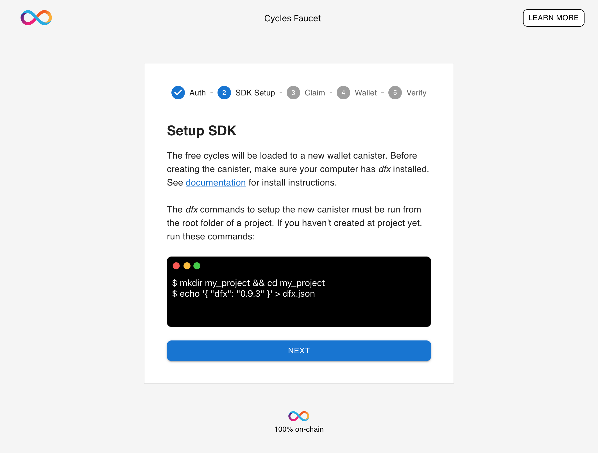

# Cycles Faucet
Ready to deploy your first smart contract on the Internet Computer
blockchain? You can use our Cycles Faucet to get set up with $20 in free
cycles in just a few minutes.

    sh -ci "$(curl -fsSL https://smartcontracts.org/install.sh)"

or following the instructions at <https://smartcontracts.org>.

## Claim your Cycles Wallet

### Step 1: Authenticate

First, you will need to navigate to <https://faucet.dfinity.org>. You
will need to connect an active GitHub account to continue.

### Step 2: Principal ID

Once you have logged in, open up a terminal window and run the command
`dfx identity get-principal`. Paste the output into the text input on
the Step 2 screen. This Principal will uniquely identify your computer,
and will be used to give you access to your Cycles Wallet and any
canister smart contracts you deploy with it. Your Principal will look
like a long series of numbers and letters separated by hyphens.

### Step 3: Deposit method

On the third screen, you have a choice to use an existing Cycles Wallet,
or to Generate a New Cycles Wallet. If you already have created one, you
can select the first option and the faucet will send your existing
canister $20 worth of cycles.

For any first time user, select **Generate New Cycles Wallet** and then
press **Continue​​**.

## Configure your wallet in DFX

Now that you have claimed your wallet, you should see a screen like the
one below:

Now you are ready to host a website on the IC or follow one of our dapp
tutorials.

### Next, people often look at these guides:

-   [Local Development](./local-quickstart.html)

-   [Network Deployment](./network-quickstart.html)
