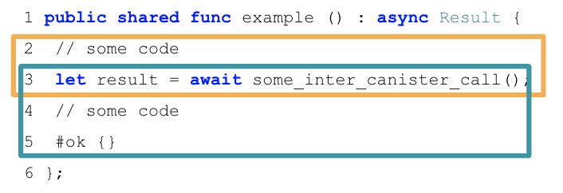
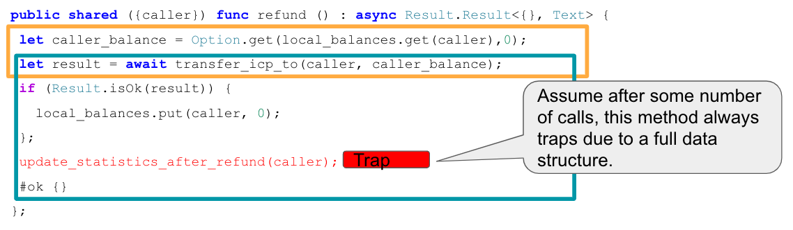

import { MarkdownChipRow } from "/src/components/Chip/MarkdownChipRow";

# Canister development security best practices

<MarkdownChipRow labels={["Security", "Concept"]} />

## Overview

This document contains canister development best practices for both Motoko and Rust.

## Smart contracts canister control

### Use a decentralized governance system like SNS to put dapps under decentralized control

#### Security concerns

If single entities or small groups control canisters, they can apply changes or updates whenever they like. If a canister e.g. holds assets such as ICP, ckBTC or ckETH on a user's behalf, this effectively means that the controller could decide at any time to steal these funds by e.g. updating the canister and transferring the assets to their account.

Furthermore, the controller of canisters serving web content (such as e.g. the [asset canister](../../references/asset-canister)) could maliciously modify the web application to e.g. steal user funds or perform security sensitive actions on the user's behalf. For example, if [Internet Identity](/docs/current/developer-docs/web-apps/user-login/internet-identity/overview) is used, the user principal's private key for the given origin is stored in the browser storage, and a malicious app can therefore fully control the private key and the user's session and any assets controlled by that key.

Dapps are commonly reachable over their own custom domain name instead of ic0.app. These domains are registered with a DNS registrar by one of the developers. The developer can choose to have this domain point at a completely different web application. Even one not hosted on the IC. Users will trust this domain and the app it serves. This could allow such a developer to steal funds, leak data, etc.

A dapp might have privileged features which are only accessible to principals that are on an allow list. For example, minting new tokens, debug functions, permissions management, removing NFTs for digital rights violations, etc. This means that whoever controls that principal (this could e.g. be dapp developers) may have central control over these privileged features.

For performance or privacy reasons, some components of a dapp may be hosted off-chain, e.g. in the cloud. These off-chain components often control principals used to interact with the on-chain components, and are usually controlled by a developer holding credentials to the off-chain cloud environment. On top of that, cloud providers can inspect and manipulate data in this environment if they choose. They could take IC principal private keys out of this environment and call privileged operations on the canisters. Off-chain components can quickly lead to many additional centrally trusted parties. Depending on the value managed by a dapp, these parties could be tempted to act maliciously.

#### Recommendations

In the following list, we first provide recommendations for centralized dapp control, and then move to recommendations for increasingly decentralized settings. From a security perspective, more decentralization is favorable. The following list could also be used as a basis for assessing a dapp's level of decentralization. This is just a set of recommendations and may not be complete.
1. **The dapp uses central, off-chain components:** The application makes use of centralized components that are e.g. running in the cloud. The owners of these cloud services have full control over the application and assets managed by it. Your application should likely be further decentralized by avoiding central components. But while you have them, [securely manage your keys in the cloud](https://cloudsecurityalliance.org/research/topics/cloud-key-management/).
2. **The dapp is controlled by the developer team:** Your project is not under decentralized control, for example because it is in an early development stage or does not (yet) hold significant funds. In that case, it is recommended to manage access to your canisters securely and ideally not letting individuals control the application. To achieve that, consider the following:
    - Require approval by several individuals or parties to perform any canister controller operations.
    - Also require approval by several individuals or parties for any security sensitive changes at the application level that are restricted to privileged principals, such as admin operations including  e.g. permissions management, minting new tokens, removing NFTs for digital rights violations, etc.
    - A helpful tool to achieve either of the above two points is the [threshold canister](https://github.com/dfinity/threshold). Individuals should manage their key material using hardware security modules, such as e.g. [YubyHSM](https://www.yubico.com/ch/store/yubihsm-2-series/) and physically protect these e.g. using safes at different geographical locations. Some of HSMs support threshold signature schemes, which can help to further secure the setup. To increase transparency about the changes made to a dapp, consider using a tool like [LaunchTrail](https://github.com/spinner-cash/launchtrail).
3. **Full decentralization using a DAO**: The dapp is controlled by a decentralized governance system such as the Internet Computer's [Service Nervous System (SNS)](/docs/current/developer-docs/daos/sns), so that any security sensitive changes to the canisters are only executed if the SNS community approves them collectively through a proposal voting mechanism. If an SNS is used:
   - Make sure voting power is distributed over many, independent entities such that there is not one single or a few entities that can decide by themselves how the DAO evolves, see [here](/docs/current/developer-docs/daos/sns/tokenomics/tokenomics-intro#voting-power-and-decentralization).
   - Ensure all components of the dapp are under SNS control, including the canisters serving the web frontends, see [SNS asset canisters](/docs/current/developer-docs/daos/sns/managing/sns-asset-canister).
   - Consider the [SNS preparation checklist](/docs/current/developer-docs/daos/sns/tokenomics/sns-checklist). Important points from a security perspective are e.g. [tokenomics](/docs/current/developer-docs/daos/sns/tokenomics/sns-checklist#11-tokenomics-specification), [disclosing dependencies to off-chain components](/docs/current/developer-docs/daos/sns/tokenomics/sns-checklist#13-disclosure-of-dependencies) and [performing security reviews](/docs/current/developer-docs/daos/sns/tokenomics/sns-checklist#21-security-review).
   - Rather than [self-deploying the SNS code](/docs/current/developer-docs/daos/sns/introduction/dao-alternatives#self-deploy-the-sns-code) or [building your own DAO](/docs/current/developer-docs/daos/sns/introduction/dao-alternatives#build-your-own-dao--use-other-dao-frameworks), consider using the official SNS on the SNS subnet, as this guarantees that the SNS is running an NNS-blessed version and maintained as part of ICP.
   - See also [Verification and trust in a (launched) SNS](https://wiki.internetcomputer.org/wiki/Verification_and_trust_in_a_(launched)_SNS) and [SNS decentralization swap trust](https://wiki.internetcomputer.org/wiki/SNS_decentralization_swap_trust).

An alternative to DAO control (3. above) would be to create an immutable canister smart contract by removing the canister controller completely. However, note that this implies that the canister cannot be upgraded, which may have severe implications in case e.g. a bug were found. The option to use a decentralized governance system and thus being able to upgrade smart contracts is a big advantage of the Internet Computer ecosystem compared to other blockchains.

:::info
Note that, contrary to some other blockchains, also immutable smart contracts need cycles to run, and they can receive cycles.
:::

It is also possible to implement a DAO [decentralized autonomous organization](https://en.wikipedia.org/wiki/Decentralized_autonomous_organization) on ICP from scratch. If you decide to do this (e.g. along the lines of the [basic DAO example](https://internetcomputer.org/docs/current/samples/dao)), be aware that this is security critical and must be security reviewed carefully. Furthermore, users will need to verify that the DAO is controlled by itself.

### Verify the control and level of decentralization of smart contracts you depend on

#### Security concern

If a dapp depends on a third-party canister smart contract (e.g. by making inter-canister calls to it), it is important to verify that the callee satisfies an appropriate level of decentralization. For example:
* If funds or cycles are transferred to a third-party canister, one might require the canister to be controlled by a decentralized governance system, as otherwise these funds are centrally controlled.
* If inter-canister calls are made to a centrally controlled and potentially malicious canister, that canister could DoS the caller or even trigger functional bugs, see [Only make inter-canister calls to trustworthy canisters](#only-make-inter-canister-calls-to-trustworthy-canisters).

#### Recommendation

If you interact with a canister that you require to be decentralized, make sure it is controlled by the NNS, a service nervous system (SNS) or a decentralized governance system, and review under what conditions and by whom the smart contract can be changed.

## Authentication

### Make sure any action that only a specific user should be able to do requires authentication

#### Security concern

If this is not the case, an attacker may be able to perform sensitive actions on behalf of a user, compromising their account.

#### Recommendation

- By design, for every canister call the caller can be identified. The calling [principal](../../references/ic-interface-spec.md#principals) can be accessed using the system API’s methods `ic0.msg_caller_size` and `ic0.msg_caller_copy` (see [here](../../references/ic-interface-spec.md#system-api-imports)). If e.g. Internet Identity is used, the principal is the user identity for this specific origin, see [here](../../references/ii-spec.md#identity-design-and-data-model). If some actions (e.g. access to user’s account data or account specific operations) should be restricted to a principal or a set of principals, then this must be explicitly checked in the canister call, for example as follows in Rust:

<!-- -->

        // Let pk be the public key of a principal that is allowed to perform
        // this operation. This pk could be stored in the canister's state.
        if caller() != Principal::self_authenticating(pk) {  ic_cdk::trap(...) }

        // Alternatively, if the canister keeps data for different principals
        // in e.g. a map such as BTreeMap<Principal, UserData>, then the canister
        // must ensure that each caller can only access and perform operations
        // on their own data:
        if let Some(user_data) = user_data_store.get_mut(&caller()) {
            // perform operations on the user's data
        }

- In Rust, the `ic_cdk` crate can be used to authenticate the caller using `ic_cdk::api::caller`. Make sure the returned principal is of type `Principal::self_authenticating` and identify the user’s account using the public key of that principal, see the example code above.

- Do authentication as early as possible in the call to avoid unauthenticated actions and potentially expensive operations before authentication. It is also a good idea to [deny service to anonymous users](#disallow-the-anonymous-principal-in-authenticated-calls).

- Do not rely on authentication performed during [ingress message inspection](#do-not-rely-on-ingress-message-inspection).

### Disallow the anonymous principal in authenticated calls

#### Security concern

The caller from the system API (e.g. `ic0::api::caller` in Rust) may also return `Principal::anonymous()`. In authenticated calls, this is probably undesired (and could have security implications) since this would behave like a shared account for anyone that does unauthenticated calls.

#### Recommendation

In authenticated calls, make sure the caller is not anonymous and return an error or trap if it is. This could e.g. be done centrally by using a helper method. In Rust it could e.g. look as follows:

    fn caller() -> Result<Principal, String> {
        let caller = ic0::api::caller();
        // The anonymous principal is not allowed to interact with canister.
        if caller == Principal::anonymous() {
            Err(String::from(
                "Anonymous principal not allowed to make calls.",
            ))
        } else {
            Ok(caller)
        }
    }

## Asset certification

### Use HTTP asset certification and avoid serving your dapp through `raw.icp0.io`

#### Security concern

Dapps on ICP can use [asset certification](https://wiki.internetcomputer.org/wiki/HTTP_asset_certification) to make sure the HTTP assets delivered to the browser are authentic (i.e. threshold-signed by the subnet). If an app does not do asset certification, it can only be served insecurely through `raw.icp0.io` , where no asset certification is checked. This is insecure since a single malicious node or boundary node can freely modify the assets delivered to the browser.

If an app is served through `raw.icp0.io` in addition to `icp0.io`, an adversary may trick users (phishing) into using the insecure raw.icp0.io.

#### Recommendation

- Only serve assets through `<canister-id>.icp0.io` where the boundary nodes enforce response verification on the served assets. Do not serve through `<canister-id>.raw.icp0.io`.

- Serve assets using the asset canister (which creates asset certification automatically), or add the `ic-certificate` header including the asset certification as e.g. done in the [NNS dapp](https://github.com/dfinity/nns-dapp) or [Internet Identity](https://github.com/dfinity/internet-identity).

- Check in the canister’s `http_request` method if the request came through raw. If so, return an error and do not serve any assets.

## Canister storage

### Rust: Use `thread_local!` with `Cell/RefCell` for state variables and put all your globals in one basket

#### Security concern

Canisters need global mutable state. In Rust, there are several ways to achieve this. However, some options can lead e.g. to memory corruption.

#### Recommendation

- [Use `thread_local!` with `Cell/RefCell` for state variables](https://mmapped.blog/posts/01-effective-rust-canisters.html#use-threadlocal) (from [effective Rust canisters](https://mmapped.blog/posts/01-effective-rust-canisters.html)).

- [Put all your globals in one basket](https://mmapped.blog/posts/01-effective-rust-canisters.html#clear-state) (from [effective Rust canisters](https://mmapped.blog/posts/01-effective-rust-canisters.html)).

### Limit the amount of data that can be stored in a canister per user

#### Security concern

If a user is able to store a big amount of data on a canister, this may be abused to fill up the canister storage and make the canister unusable.

#### Recommendation

Limit the amount of data that can be stored in a canister per user. This limit has to be checked whenever data is stored for a user in an update call.

### Consider using stable memory, version it, test it

#### Security concern

Canister memory is not persisted across upgrades. If data needs to be kept across upgrades, a natural thing to do is to serialize the canister memory in `pre_upgrade`, and deserialize it in `post_upgrade`. However, the available number of instructions for these methods is limited. If the memory grows too big, the canister can no longer be updated.

#### Recommendation

- Stable memory is persisted across upgrades and can be used to address this issue.

- [Consider using stable memory](https://mmapped.blog/posts/01-effective-rust-canisters.html#stable-memory-main) (from [effective Rust canisters](https://mmapped.blog/posts/01-effective-rust-canisters.html)). See also the disadvantages discussed there.

- [Version stable memory](https://mmapped.blog/posts/01-effective-rust-canisters.html#version-stable-memory) (from [effective Rust canisters](https://mmapped.blog/posts/01-effective-rust-canisters.html)).

- [Test the upgrade hooks](https://mmapped.blog/posts/01-effective-rust-canisters.html#test-upgrades) (from [effective Rust canisters](https://mmapped.blog/posts/01-effective-rust-canisters.html)).

- See also the section on upgrades in [how to audit an Internet Computer canister](https://www.joachim-breitner.de/blog/788-How_to_audit_an_Internet_Computer_canister) (though focused on Motoko).

- Write tests for stable memory to avoid bugs.

- Some libraries (mostly work in progress or partly unfinished) that people work on:

  - <https://github.com/dfinity/stable-structures/>

  - HashMap: <https://github.com/dfinity/stable-structures/pull/1> (currently not production ready.)

  - <https://github.com/seniorjoinu/ic-stable-memory>

- See [current limitations of the Internet Computer](https://wiki.internetcomputer.org/wiki/Current_limitations_of_the_Internet_Computer), sections "Long running upgrades" and "\[de\]serialiser requiring additional wasm memory".

- For example, [Internet Identity](https://github.com/dfinity/internet-identity) uses stable memory directly to store user data.

### Consider encrypting sensitive data on canisters

#### Security concern

By default, canisters provide integrity but not confidentiality. Data stored on canisters can be read by nodes / replicas.

#### Recommendation

- Consider end-to-end encrypting any private or personal data (e.g. user’s personal or private information) on canisters.

- The example dapp [encrypted notes](https://github.com/dfinity/examples/tree/master/motoko/encrypted-notes-dapp) illustrates how end-to-end encryption can be done.

### Create backups

#### Security concern

A canister could be rendered unusable so it could never be upgraded again e.g. due to the following reasons:

- It has a faulty upgrade process (due to some bug from the dapp developer).

- The state becomes inconsistent / corrupt because of a bug in the code that persists data.

#### Recommendation

- Make sure methods used in upgrading are tested or the canister becomes immutable.

- It may be useful to have a disaster recovery strategy that makes it possible to reinstall the canister.

- See the "Backup and recovery" section in [how to audit an Internet Computer canister](https://www.joachim-breitner.de/blog/788-How_to_audit_an_Internet_Computer_canister)

## Inter-canister calls and rollbacks

### Message execution basics

To understand the issues around async inter-canister calls, one needs to understand a few properties about message execution. This is also explained in the [community conversation on security best practices](https://www.youtube.com/watch?v=PneRzDmf_Xw&list=PLuhDt1vhGcrez-f3I0_hvbwGZHZzkZ7Ng&index=2&t=4s).

A **call** is a canister's implementation of either an [update](/references/ic-interface-spec.md#http-call) or [query call](/references/ic-interface-spec.md#http-query) that it exposes. For example, if the Rust CDK is used, these are usually annotated with `#[query]` or `#[update]`, respectively. A **message** is a set of consecutive instructions that a subnet executes for a canister. A call can be split into several messages if inter-canister calls are made. The following properties are essential:

- **Property 1**: only a single message is processed at a time per canister. So message execution is sequential, and never parallel.

- **Property 2**: each call (query / update) triggers a message. When an inter-canister call is made using `await`, the code after the call (the callback, highlighted in blue) is executed as a separate message.

:::info
Note that if the code does not `await` the response, the code after the callback (until the next inter-canister call is triggered using `await`) is executed in the same message.

For example, consider the following Motoko code:

The first message that is executed here are lines 2-3, until the inter-canister call is made using the `await` syntax (orange box). The second message executes lines 3-5: when the inter-canister call returns (blue box). This part is called the _callback_ of the inter-canister call. The two messages involved in this example will always be scheduled sequentially.
:::

- **Property 3**: successfully delivered requests are received in the order in which they were sent. In particular, if a canister A sends `m1` and `m2` to canister B in that order, then, if both are accepted, `m1` is executed before `m2`.

:::info
Note that this property only gives a guarantee on when the messages are executed, but there is no guarantee on the ordering of the responses received.
:::

- **Property 4**: messages from interleaving calls have no reliable execution ordering.

Property 3 provides a guarantee on the execution order of messages on a target canister. However, if multiple calls interleave, one cannot assume additional ordering guarantees for these interleaving calls. To illustrate this, let's consider the above example code again, and assume the method `example` is called twice in parallel, the resulting calls being Call 1 and Call 2. The following illustration shows two possible message orderings. On the left, the first call's messages are scheduled first, and only then the second call's messages are executed. On the right, you can see another possible message scheduling, where the first messages of each call are executed first. Your code should result in a correct state regardless of the message ordering.

- **Property 5**: on a trap / panic, modifications to the canister state for the current message are not applied.

For example, if a trap in the second message (blue box) of the above example occurs, canister state changes resulting from that message, even earlier in the blue box, are discarded. However, note that any state changes from earlier messages and in particular the first message (orange box) have been applied, as that message executed successfully.

- **Property 6**: inter-canister calls are not guaranteed to make it to the destination canister, and if a call does reach the destination canister, the destination canister can trap or return a reject response while processing the call.

Every inter-canister call is guaranteed to receive a response, either from the canister, or synthetically produced by the protocol. However, the response does not have to be successful, but can also be a reject response. The reject may come from the called canister, but it may also be generated by the Internet Computer. Such protocol-generated rejects can occur at any time before the call reaches the callee-canister, as well as once the call does reach the callee-canister if the callee-canister traps while processing the call. If the call reaches the callee-canister, the callee-canister can produce a reply or reject response and the protocol guarantees that the callee-canister's generated reply or reject response gets back to the caller-canister. Thus, it's important that the calling canister handles reject responses as well. A reject response means that the message hasn't been successfully processed by the receiver but doesn't guarantee that the receivers state wasn't changed.

For more details, refer to the Interface Specification [section on ordering guarantees](/references/ic-interface-spec.md#ordering_guarantees) and the section on [abstract behavior](/references/ic-interface-spec.md#abstract-behavior) which defines message execution in more detail.

### Avoid traps after await

#### Security concern

Traps / panics roll back the canister state, as described in Property 5 above. So any state change followed by a trap or panic can be risky. This is also an important concern when inter-canister calls are made. If a panic/trap occurs after an `await` to an inter-canister call, then the state is reverted to the snapshot before the inter-canister call callback invocation, and not before the entire call!

This may e.g. lead to the following issues:

- Suppose some state changes are applied and then an inter-canister call is issued. Also, assume that these state changes leave the canister in an inconsistent state, and that state is only made consistent again in the callback. Now if there is a trap in the callback, this leaves the canister in an inconsistent state.
- A concrete bug of this kind is the following. Assume an inter-canister call is issued to transfer funds. In the callback, the canister accounts for having made that transfer by reflecting that fact in the canister storage. However, suppose the callback also updates some usage statistics data, which eventually leads to a trap when some data structure becomes full. As soon as that is the case, the canister ends up in an inconsistent state because the state changes in the callback are no longer applied and thus the transfers are not correctly accounted for.
  
  This example is also discussed in this [community conversation](https://www.youtube.com/watch?v=PneRzDmf_Xw&list=PLuhDt1vhGcrez-f3I0_hvbwGZHZzkZ7Ng&index=2&t=4s).
- Another example: if e.g. part of the canister state is locked before an inter-canister call and released in the callback, the lock may never be released if the callback traps.

- Generally, there can be bugs where data is not persisted when the developer expected it to be.

Note that in Rust, from Rust CDK version 0.5.1, any local variables still go out of scope if a callback traps. The CDK actually calls into the `ic0.call_on_cleanup` API to release these resources. This helps to prevent some of the above issues, as e.g. it is possible to use Rust's `Drop` implementation to release locked resources, as we discuss in ["Be aware that there is no reliable message ordering"](#be-aware-that-there-is-no-reliable-message-ordering).

#### Recommendation

- Watch the [community conversation on security best practices](https://www.youtube.com/watch?v=PneRzDmf_Xw&list=PLuhDt1vhGcrez-f3I0_hvbwGZHZzkZ7Ng&index=2&t=4s) which shows a concrete example of an issue as described here.

- [Don’t lock shared resources across await boundaries](https://mmapped.blog/posts/01-effective-rust-canisters.html#dont-lock) (from [effective Rust canisters](https://mmapped.blog/posts/01-effective-rust-canisters.html)).

- [Don’t panic after `await`](https://mmapped.blog/posts/01-effective-rust-canisters.html#panic-await) (from [effective Rust canisters](https://mmapped.blog/posts/01-effective-rust-canisters.html)).

- For context: [IC interface spec on message execution](/references/ic-interface-spec.md#message-execution).
- See also: "Inter-canister calls" section in [how to audit an Internet Computer canister](https://www.joachim-breitner.de/blog/788-How_to_audit_an_Internet_Computer_canister).

### Be aware that there is no reliable message ordering

#### Security concern

As described in the [message execution basics](#message-execution-basics) above, messages (but not entire calls) are processed atomically. In particular, as described in Property 4 above, messages from interleaving calls do not have a reliable execution ordering. Thus, the state of the canister (and other canisters) may change between the time an inter-canister call is started and the time when it returns, which may lead to issues if not handled correctly. These issues are generally called 'Reentrancy bugs' (see e.g. the [Ethereum best practices on reentrancy](https://consensys.github.io/smart-contract-best-practices/attacks/reentrancy/)). Note however that the messaging guarantees (and thus the bugs) on the Internet Computer are different from Ethereum.

Here are two concrete and somewhat similar types of bugs to illustrate potential reentrancy security issues:

- **Time-of-check time-of-use issues:** these occur when some condition on global state is checked before an inter-canister call, and then wrongly assuming the condition still holds when the call returns. For example, one might check if there is sufficient balance on some account, then issue an inter-canister call and finally make a transfer as part of the callback message. When the second inter-canister call starts, it is possible that the condition which was checked initially no longer holds, because other ledger transfers may have happened before the callback of the first call is executed (see also Property 4 above).

- **Double-Spending issues.**: such issues occur when a transfer is issued twice, often because of unfavorable message scheduling. For example, suppose you check if a caller is eligible for a refund and if so, transfer some refund amount to them. When the refund ledger call returns successfully, you set a flag in the canister storage indicating that the caller has been refunded. This is vulnerable to double-spending because the refund method can be called twice by the caller in parallel, in which case it is possible that the messages before issuing the transfer (including the eligibility check) are scheduled before both callbacks. A detailed explanation of this issue can be found in the [community conversation on security best practices](https://www.youtube.com/watch?v=PneRzDmf_Xw&list=PLuhDt1vhGcrez-f3I0_hvbwGZHZzkZ7Ng&index=2&t=4s).

#### Recommendation

It is highly recommended to carefully review any canister code that makes async inter-canister calls (`await`). If two messages access (read or write) the same state, review if there is a possible scheduling of these messages that leads to illegal transactions or inconsistent state.

See also: "Inter-canister calls" section in [how to audit an Internet Computer canister](https://www.joachim-breitner.de/blog/788-How_to_audit_an_Internet_Computer_canister).

To address issues around message ordering that can lead to bugs, one usually employs locking mechanisms to ensure that e.g. a caller (or anyone) can only execute an entire call (which involves several messages) once at a time. A simple example is also given in the [community conversation](https://www.youtube.com/watch?v=PneRzDmf_Xw&list=PLuhDt1vhGcrez-f3I0_hvbwGZHZzkZ7Ng&index=2&t=4s) mentioned above.

The locks would usually be released in the callback. That bears the risk that the lock may never be released in case the callback traps, as we discussed in [avoid traps after await](#avoid-traps-after-await). In Rust, there is a nice pattern to avoid this issue by using Rust's `Drop` implementation. The example code below shows how one can implement a lock per caller (`CallerGuard`) with a `Drop` implementation. From Rust CDK version 0.5.1, any local variables still go out of scope if the callback traps, so the lock on the caller is released even in that case. Technically, the CDK calls into the `ic0.call_on_cleanup` API to release these resources (recall that `ic0.call_on_cleanup` is executed if the `reply` or the `reject` callback executed and trapped).

    pub struct State {
        pending_requests: BTreeSet<Principal>,
    }

    thread_local! {
        static STATE: RefCell<State> = RefCell::new(State{pending_requests: BTreeSet::new()});
    }

    pub struct CallerGuard {
        principal: Principal,
    }

    impl CallerGuard {
        pub fn new(principal: Principal) -> Result<Self, String> {
            STATE.with(|state| {
                let pending_requests = &mut state.borrow_mut().pending_requests;
                if pending_requests.contains(&principal){
                    return Err(format!("Already processing a request for principal {:?}", &principal));
                }
                pending_requests.insert(principal);
                Ok(Self { principal })
            })
        }
    }

    impl Drop for CallerGuard {
        fn drop(&mut self) {
            STATE.with(|state| {
                state.borrow_mut().pending_requests.remove(&self.principal);
            })
        }
    }

    #[update]
    #[candid_method(update)]
    async fn example_call_with_locking_per_caller() -> Result<(), String> {
        let caller = ic_cdk::caller();
        // using `?`, return an error immediately if there is already a call in progress for `caller`
        // warning: never use `let _ = CallerGuard::new(caller)?`, because this will drop the guard immediately
        // and locking would not be effective
        let _guard = CallerGuard::new(caller)?;
        // do anything, call other canisters
        Ok(())
    } // here the guard goes out of scope and is dropped

    mod test {
        use super::*;

        #[test]
        fn should_obtain_guard_for_different_principals() {
            let principal_1 = Principal::anonymous();
            let principal_2 = Principal::management_canister();
            let caller_guard = CallerGuard::new(principal_1);
            assert!(caller_guard.is_ok());
            assert!(CallerGuard::new(principal_2).is_ok());
        }

        #[test]
        fn should_not_obtain_guard_twice_for_same_principal() {
            let principal = Principal::anonymous();
            let caller_guard = CallerGuard::new(principal);
            assert!(caller_guard.is_ok());
            assert!(CallerGuard::new(principal).is_err());
        }

        #[test]
        fn should_release_guard_on_drop() {
            let principal = Principal::anonymous();
            {
                let caller_guard = CallerGuard::new(principal);
                assert!(caller_guard.is_ok());
            } // drop caller_guard as it goes out of scope here
            // it is possible to get a guard again:
            assert!(CallerGuard::new(principal).is_ok());
        }
    }

This pattern can be extended e.g. to work for the following use cases:

- A global lock that does not only lock per caller. For this, set a boolean flag in the canister state instead of using a `BTreeSet<Principal>`.
- A guard that makes sure that only a limited number of principals are allowed to execute a method at the same time. For this, one can return an error in `CallerGuard::new()` in case `pending_requests.len() >= MAX_NUM_CONCURRENT_REQUESTS`.
- A guard that limits the number of times a method can be called in parallel. For this, use a counter in the canister state that is checked and increased in `CallerGuard::new()` and decreased in `Drop`.

Finally, note that the same guard can be used in several methods to restrict parallel execution of them.

### Handle rejected inter-canister calls correctly

#### Security concern

As stated by the Property 6 above, inter-canister calls can fail in which case they result in a **reject**. See [reject codes](/references/ic-interface-spec.md#reject-codes) for more detail. The caller must correctly deal with the reject cases, as they can happen in normal operation, e.g. because of insufficient cycles on the sender or receiver side, or because some data structures (like message queues) are full.

Not handling the error cases correctly is risky: for example, if a ledger transfer results in an error, the callback dealing with that error must interpret it correctly (the transfer did **not** happen).

#### Recommendation

When making inter-canister calls, always handle the error cases (rejects) correctly. These errors imply that the message has not been successfully executed.

### Only make inter-canister calls to trustworthy canisters

#### Security concern

- If inter-canister calls are made to potentially malicious canisters, this can lead to DoS issues or there could be issues related to candid decoding. Also, the data returned from a canister call could be assumed to be trustworthy when it is not.

- If a canister is called with a callback, the receiver can stall indefinitely if the peer does not respond, resulting in DoS. A canister can no longer be upgraded if it is in that state. Recovery would involve reinstalling, wiping the state of the canister.

- In summary, this can DoS a canister, consume an excessive amount of resources, or lead to logic bugs if the behavior of the canister depends on the inter-canister call response.

#### Recommendation

- Only make inter-canister calls to trustworthy canisters.

- Sanitize data returned from inter-canister calls.

- See "Talking to malicious canisters" section in [how to audit an Internet Computer canister](https://www.joachim-breitner.de/blog/788-How_to_audit_an_Internet_Computer_canister).

- See [current limitations of the Internet Computer](https://wiki.internetcomputer.org/wiki/Current_limitations_of_the_Internet_Computer), section "Calling potentially malicious or buggy canisters can prevent canisters from upgrading".

### Make sure there are no loops in call graphs

#### Security concern

Loops in the call graph (e.g. canister A calling B, B calling C, C calling A) may lead to canister deadlocks.

#### Recommendation

- Avoid such loops!

- For more information, see [current limitations of the Internet Computer](https://wiki.internetcomputer.org/wiki/Current_limitations_of_the_Internet_Computer), section "Loops in call graphs".

## Canister upgrades

### Be careful with panics during upgrades

#### Security concern

If a canister traps or panics in `pre_upgrade`, this can lead to permanently blocking the canister, resulting in a situation where upgrades fail or are no longer possible at all.

#### Recommendation

- Avoid panics / traps in `pre_upgrade` hooks, unless it is truly unrecoverable, so that any invalid state can fixed by upgrading. Panics in the pre-upgrade hook prevent upgrade, and since the pre-upgrade hook is controlled by the old code, it can permanently block upgrading.

- Panic in the `post_upgrade` hook if state is invalid, so that one can retry the upgrade and try to fix the invalid state. Panics in the the post-upgrade hook abort the upgrade, but one can retry with new code.

- [Test the upgrade hooks](https://mmapped.blog/posts/01-effective-rust-canisters.html#test-upgrades) (from [effective Rust canisters](https://mmapped.blog/posts/01-effective-rust-canisters.html)).

- See also the section on upgrades in [how to audit an Internet Computer canister](https://www.joachim-breitner.de/blog/788-How_to_audit_an_Internet_Computer_canister) (though focused on Motoko).

- See [current limitations of the Internet Computer](https://wiki.internetcomputer.org/wiki/Current_limitations_of_the_Internet_Computer), section "Bugs in `pre_upgrade` hooks".

### Reinstantiate timers during upgrades

#### Security Concern

Global timers are deactivated upon changes to the canister's Wasm module. The [IC specification](../../references/ic-interface-spec#timer) states this as follows:

> "The timer is also deactivated upon changes to the canister's Wasm module (calling install_code, uninstall_code methods of the management canister or if the canister runs out of cycles). In particular, the function canister_global_timer won't be scheduled again unless the canister sets the global timer again (using the System API function ic0.global_timer_set)."

Upgrade is a mode of `install_code` and hence the timers are deactivated during an upgrade.

This could result in a vulnerability in certain cases where security controls or other critical features rely on these timers to function. For example, a DEX which relies on timers to update the exchange rates of currencies could be vulnerable to arbitraging opportunities if the rates are no longer updated.

Since global timers are used internally by the Motoko `Timer` mechanism, the same holds true for Motoko Timer. As explained in the [pull request](https://github.com/dfinity/motoko/pull/3542) under "The upgrade story", the global timer gets jettisoned on upgrade, and the timers need to be set up in the post-upgrade hook.

As explained in [this pull request](https://github.com/dfinity/motoko/pull/3542) under "Opting out", the behavior is different when using Motoko and implementing `system func timer`. The `timer` function will be called after an upgrade. In case your canister was using timers for recurring tasks, the `timer` function would likely set the global timer again for a later time. However, the time between invocations of `timer` would not be consistent as the upgrade triggered an "unexpected" call to `timer`.

Using the rust CDK, the reccuring timer is also lost on upgrade as explained in the API documentation of [set_timer_interval](https://docs.rs/ic-cdk/0.6.9/ic_cdk/timer/fn.set_timer_interval.html).

#### Recommendation

- Keep track of global timers in the `pre_upgrade` hook. Store any state in stable variables.
- Set timers in the `post_upgrade` hook.
- See the Motoko documentation on [recurringTimer](../../motoko/main/base/Timer.md#function-recurringtimer).
- See the Rust documentation on [set_timer_interval](https://docs.rs/ic-cdk/0.6.9/ic_cdk/timer/fn.set_timer_interval.html).

## HTTP Outcalls

### Do not store sensitive data (e.g. API keys) in canisters

#### Security concern

Sensitive data is a broad term that varies depending on your application logic and behaviour. Here is a non-exhaustive list of secrets that are typically considered sensitive, such as API keys or tokens:
* Secrets that allow interaction with non-public endpoints.
* Secrets that allow querying or modifying endpoints with confidential data.
* API tokens that are fee-based.

By default, the data stored inside your canister is unencrypted. Therefore if your canister is installed in a malicious replica, it can easily retrieve and steal your keys, tokens, and secrets in plain text.

#### Recommendation

Make sure you don’t store sensitive data inside your canister.

[More information.](/docs/current/references/https-outcalls-how-it-works#compromised-replicas)

[Data confidentiality security recommendations.](general-security-best-practices#data-confidentiality-on-the-internet-computer)

### Ensure your canisters have a sufficiently large quota with the HTTP server

#### Security concern

When an HTTP outcall is performed, it is amplified by the number of replicas in the subnet. The target web server will receive not only one request, but as many requests as the number of nodes in the subnet.

Most web servers implement some sort of rate limiting; this is a mechanism used to restrict the number of requests a client can make to a web server within a specific time period, preventing abuse or excessive usage of their API(s).

#### Recommendation

You should consider such rate limits when designing and implementing your canisters. Rate limits are enforced using different time granularities, e.g., seconds or minutes. For second-granularity enforcement, make sure that the simultaneous requests by all subnet replicas do not violate the quota. Violations may lead to temporary or permanent bans.

[More information.](/docs/current/references/https-outcalls-how-it-works#rate-limiting-by-servers)

### Only make HTTP outcall requests to idempotent endpoints

#### Security concern

As mentioned before, if an HTTP outcall is performed it is amplified by the number of replicas in the subnet. That means the queried endpoint will receive the same request several times. This is especially risky in requests that change the endpoint state, given that one HTTP outcall could lead to unintentionally changing the endpoint state several times.

#### Recommendation

Make sure the endpoints, called by an HTTP outcall, are idempotent, i.e. the queried endpoint has the same behaviour with the same request payload, no matter the number of times it is called.

Some servers support the use of idempotency keys. These keys are random unique strings submitted in the HTTP request as headers. If used with the HTTP outcalls feature, all requests sent by each (honest) replica will contain the same idempotency key. This allows the server to recognize duplicated requests (i.e requests with the same idempotency key), handle just one and modify the server state only once. Note that this is a feature that must be supported by the server.

[More information.](/docs/current/references/https-outcalls-how-it-works#post-requests-must-be-idempotent)

### Ensure HTTP responses are identical

#### Security concern

When replicas of a subnet receive HTTP responses, these responses must be identical. Otherwise, consensus won’t be achieved and the HTTP response will be rejected, but still charged.

#### Recommendation

Make sure the HTTP responses sent to the consensus layer are identical.

Ideally the HTTP responses returned by the queried endpoint would always be the same. However, most of the time this is not possible to control and the responses include random data (e.g the response includes timestamps, cookie values or some sort of identifiers). In those cases make sure to use the [transformation functions](/docs/current/references/https-outcalls-how-it-works#transformation-function) to guarantee that the responses received by each replica are identical by removing any random data or extracting only the relevant data.

This applies to the HTTP response body and headers. Make sure to consider both when applying the transformation functions. Response headers are often overlooked and lead to failure because of failed consensus.

[More information.](/docs/current/references/https-outcalls-how-it-works#responses-must-be-similar)

### Be aware of HTTP request and response sizes

#### Security concern

The [pricing](/docs/current/references/https-outcalls-how-it-works#pricing) of HTTPS outcalls is determined by, among other variables, the size of the HTTP request and the maximal response size. Thus, if big requests are made, this could quickly drain the canister’s cycles balance. This can be risky e.g. if HTTP outcalls are triggered by user actions (rather than a heartbeat or timer invocation).

#### Recommendation

When using HTTPS outcalls be mindful of the HTTP request and response sizes. Ensure that the size of the request issued and the size of the HTTP response coming from the server are reasonable.

When making an HTTP outcall it is possible – and highly recommended – to define the `max_response_bytes` parameter, which allows you to set the maximum allowed response size. If this parameter is not defined, it defaults to 2MB (the hard response size limit of the HTTPS outcalls functionality). The cycle cost of the response is always charged based on the `max_response_bytes` or 2MB if not set.

Finally, be aware that users may incur cycles costs for HTTP outcalls in case these calls can be triggered by user actions.

[More information.](/docs/current/references/https-outcalls-how-it-works#recipe-for-coding-a-canister-http-call)

### Perform input validation in HTTP outcalls

#### Security concern

HTTP outcalls that use user-submitted data are susceptible to various injection attacks. This may lead to several issues, such as the ones previously mentioned.

#### Recommendation

Perform input validation when using user-submitted data in the HTTP outcalls.

[More information.](https://cheatsheetseries.owasp.org/cheatsheets/Input_Validation_Cheat_Sheet.html)

## Miscellaneous

### Test your canister code even in presence of system API calls

#### Security concern

Since canisters interact with the system API, it is harder to test the code because unit tests cannot call the system API. This may lead to lack of unit tests.

#### Recommendation

- Create loosely coupled modules that do not depend on the system API and unit test those. See this [recommendation](https://mmapped.blog/posts/01-effective-rust-canisters.html#target-independent) (from [effective Rust canisters](https://mmapped.blog/posts/01-effective-rust-canisters.html)).

- For the parts that still interact with the system API: create a thin abstraction of the System API that is faked in unit tests. See the [recommendation](https://mmapped.blog/posts/01-effective-rust-canisters.html#target-independent) (from [effective Rust canisters](https://mmapped.blog/posts/01-effective-rust-canisters.html)). For example, one can implement a ‘Runtime’ as follows and then use the ‘MockRuntime’ in tests (code by Dimitris Sarlis):

<!-- -->

        use ic_cdk::api::{
            call::call, caller, data_certificate, id, print, time, trap,
        };

        #[async_trait]
        pub trait Runtime {
            fn caller(&self) -> Result<Principal, String>;
            fn id(&self) -> Principal;
            fn time(&self) -> u64;
            fn trap(&self, message: &str) -> !;
            fn print(&self, message: &str);
            fn data_certificate(&self) -> Option<Vec<u8>>;
            (...)
        }

        #[async_trait]
        impl Runtime for RuntimeImpl {
            fn caller(&self) -> Result<Principal, String> {
                let caller = caller();
                // The anonymous principal is not allowed to interact with the canister.
                if caller == Principal::anonymous() {
                    Err(String::from(
                        "Anonymous principal not allowed to make calls.",
                    ))
                } else {
                    Ok(caller)
                }
            }

            fn id(&self) -> Principal {
                id()
            }

            fn time(&self) -> u64 {
                time()
            }

            (...)

        }

        pub struct MockRuntime {
            pub caller: Principal,
            pub canister_id: Principal,
            pub time: u64,
            (...)
        }

        #[async_trait]
        impl Runtime for MockRuntime {
            fn caller(&self) -> Result<Principal, String> {
                Ok(self.caller)
            }

            fn id(&self) -> Principal {
                self.canister_id
            }

            fn time(&self) -> u64 {
                self.time
            }

            (...)

        }

### Make canister builds reproducible

#### Security concern

It should be possible to verify that a canister does what it claims to do. ICP provides a SHA256 hash of the deployed WASM module. In order for this to be useful, the canister build has to be reproducible.

#### Recommendation

Make canister builds reproducible. See this [recommendation](https://mmapped.blog/posts/01-effective-rust-canisters.html#reproducible-builds) (from [effective Rust canisters](https://mmapped.blog/posts/01-effective-rust-canisters.html)). See also the [developer docs on this](/docs/current/developer-docs/smart-contracts/test/reproducible-builds).

### Expose metrics from your canister

#### Security concern

In case of attacks, it is great to be able to obtain relevant metrics from canisters, such as number of accounts, size of internal data structures, stable memory, etc.

#### Recommendation

[Expose metrics from your canister](https://mmapped.blog/posts/01-effective-rust-canisters.html#expose-metrics) (from [effective Rust canisters](https://mmapped.blog/posts/01-effective-rust-canisters.html)).

### Don’t rely on time being strictly monotonic

#### Security concern

The time read from the System API is monotonic, but not strictly monotonic. Thus, two subsequent calls can return the same time, which could lead to security bugs when the time API is used.

#### Recommendation

See the "Time is not strictly monotonic" section in [how to audit an Internet Computer canister](https://www.joachim-breitner.de/blog/788-How_to_audit_an_Internet_Computer_canister).

### Protect against draining the cycles balance

#### Security concern

Canisters pay for their cycles which makes them inherently vulnerable to attacks that consume all their cycles.

#### Recommendation

* Consider monitoring, early authentication, rate limiting on canister level to mitigate this. Also, be aware that an attacker will aim for the call consuming most cycles. See the "Cycle balance drain attacks section" in [how to audit an Internet Computer canister](https://www.joachim-breitner.de/blog/788-How_to_audit_an_Internet_Computer_canister).

* For query calls that cause significant computation and don't modify the state, it is advisable to not execute the expensive computation if the method is called as update. However, keep in mind that query calls [don't provide authenticity guarantees](general-security-best-practices#certify-query-responses-if-they-are-relevant-for-security), so this is a trade-off. Unfortunately, the execution mode of the query (whether it was called as query or update) is currently not directly exposed to the user code. However, one can e.g. call  `ic0.data_certificate_present()` which returns `1` when called as query, and `0` for update methods. See the Interface Specification [section on certified data](/references/ic-interface-spec.md#system-api-certified-data).

* Expensive calls that only need to be called from other canisters can require some amount of cycles to be sent along with the call to compensate for the cycles consumed by the execution.

* Finally, it is also an option to charge for ingress messages, but that is not currently supported by the protocol itself and a custom solution would need to be designed.

### Do not rely on ingress message inspection

#### Security concern

The correct execution of [canister_inspect_message](../../references/ic-interface-spec#system-api-inspect-message) is not guaranteed because it is executed by a single node and if that node is malicious, it can e.g. simply skip this check. In that case the update call would be executed without any message inspection checks. 

Also note that for inter-canister calls `canister_inspect_message` is not invoked.

#### Recommendation

Your canisters should not rely on the correct execution of `canister_inspect_message`. This in particular means that no security critical code, such as [access control checks](#make-sure-any-action-that-only-a-specific-user-should-be-able-to-do-requires-authentication), should be solely performed in that method. Such checks **must** be performed as part of an update method to guarantee reliable execution. Ideally, they are executed both in the `canister_inspect_message` function and a guard function.

### Do not publicly reveal canister's cycles balance

#### Security concern

Publicly revealing the canister's cycles balance allows an attacker to measure the number of instructions spent by executing the canister methods on the attacker's input. Then the attacker might be able to learn which code paths were taken during execution and derive secret information based on that. Moreover, the attacker can learn which methods and their inputs consume a lot of cycles to mount a cycles draining attack (see also [protect against draining the cycles balance](#protect-against-draining-the-cycles-balance)).

#### Recommendation

Your canisters should not publicly expose their cycles balance (available through the system API), i.e., they should only expose their cycles balance to their controllers or other trusted principals.

## Nonspecific to the Internet Computer

The best practices in this section are very general and not specific to the Internet Computer. This list is by no means complete and only lists a few very specific concerns that have led to issues in the past.

### Validate inputs

#### Security concern

The data sent in [query and update calls](/references/ic-interface-spec.md#http-interface) is generally untrusted. The message size limit is a few MB. This can e.g. lead the following issues:

- If unvalidated data is rendered in web UIs or displayed in other systems, this can lead to injection attacks (e.g. XSS).

- Messages of big size could be sent and potentially stored in the canister, consuming an excessive amount of storage.

- Big inputs (e.g. big lists or strings) could trigger an excessive amount of computation, resulting in DoS and consuming many cycles. See also [protect against draining the cycles balance](#protect-against-draining-the-cycles-balance).

#### Recommendation

- Perform input validation, see e.g. the [OWASP cheat sheet](https://cheatsheetseries.owasp.org/cheatsheets/Input_Validation_Cheat_Sheet.html).

- "Large data attacks" section in [how to audit an Internet Computer canister](https://www.joachim-breitner.de/blog/788-How_to_audit_an_Internet_Computer_canister) (be aware of Candid space bombs).

- [ASVS](https://owasp.org/www-project-application-security-verification-standard/) 5.1.4: Verify that structured data is strongly typed and validated against a defined schema including allowed characters, length and pattern (e.g. credit card numbers or telephone, or validating that two related fields are reasonable, such as checking that suburb and zip/postcode match).

### Rust: Don’t use unsafe Rust code

#### Security concern

Unsafe Rust code is risky because it may introduce memory corruption issues.

#### Recommendation

- Avoid unsafe code whenever possible.

- See the [Rust security guidelines](https://anssi-fr.github.io/rust-guide/04_language.html#unsafe-code).

- Consider the [DFINITY Rust guidelines](https://docs.dfinity.systems/dfinity/spec/meta/rust.html#_avoid_unsafe_code).

### Rust: Avoid integer overflows

#### Security concern

Integers in Rust may overflow. While such overflows lead to panics in the debug configuration, the values are just wrapped around silently in release compilation. This can cause major security issues e.g. when the integers are used as indices, unique IDs, or if cycles or ICP amounts are computed.

#### Recommendation

- Review your code carefully for any integer operations that may wrap around.

- Use the `saturated` or `checked` variants of these operations, such as `saturated_add`, `saturated_sub`, `checked_add` , `checked_sub`, etc. See e.g. the [Rust docs](https://doc.rust-lang.org/std/primitive.u32.html#method.saturating_add) for `u32`.

### Rust: Avoid floating point arithmetic for financial information

#### Security concern

Floats in Rust may behave unexpectedly. There can be undesirable loss of precision under certain circumstances. When dividing by zero, the result could be `-inf`, `inf`, or `NaN`. When converting to integer, this can lead to unexpected results. (There is no `checked_div` for floats.)

#### Recommendation

Use [`rust_decimal::Decimal`](https://docs.rs/rust_decimal/latest/rust_decimal/) or [`num_rational::Ratio`](https://docs.rs/num-rational/latest/num_rational/). Decimal uses a fixed-point representation with base 10 denominators, and Ratio represents rational numbers. Both implement `checked_div` to handle division by zero, which is not available for floats. Numbers in common use like 0.1 and 0.2 can be represented more intuitively with Decimal, and can be represented exactly with Ratio. Rounding oddities like `0.1 + 0.2 != 0.3`, which happen with floats in Rust, do not arise with Decimal (see https://0.30000000000000004.com/ ). With Ratio, the desired precision can be made explicit. With either Decimal or Ratio, although one still has to manage precision, the above make arithmetic easier to reason about.

### For expensive calls, consider using captchas or proof of work

#### Security concern

If an update or query call is expensive e.g. in terms of memory used or cycles consumed, this may make it easy for bots to render the canister unusable (e.g. by filling up it’s storage).

#### Recommendation

If the dapp offers such operations, consider bot prevention techniques such as adding Captchas or proof of work. There is e.g. a captcha implementation in [Internet Identity](https://github.com/dfinity/internet-identity).
