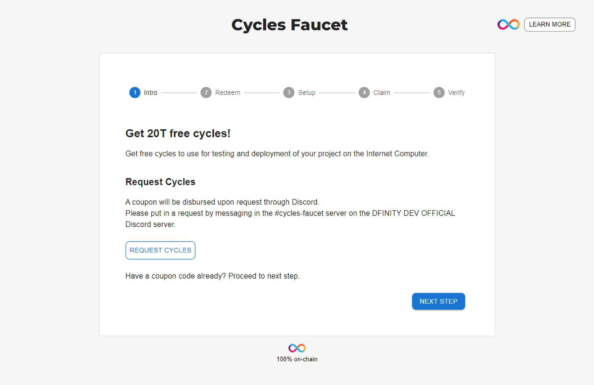
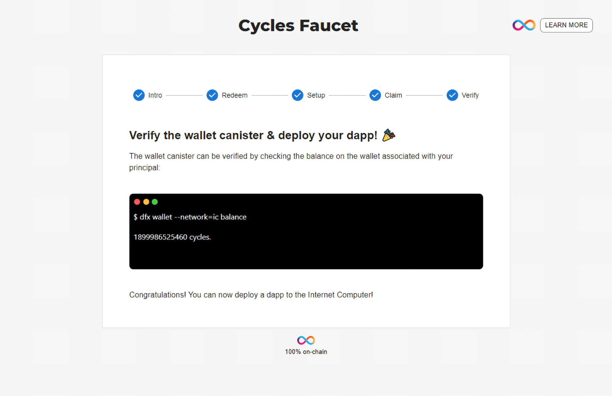

# Getting free cycles from DFINITY Cycles Faucet

This guide explains how to use Cycles Faucet to acquire your first amount of 20T free cycles that could be used to deploy your dapps on the MainNet.

### Prerequisites

You will need to install Internet Computer SDK following [this guide](/developer-docs/setup/install/index.mdx).

### Step 1: Authenticate

First, you will need to navigate to <https://faucet.dfinity.org>. You
will need to connect an active Twitter account to continue.

If the Twitter account has not been used before, you are eligible to claim the 20T cycles.

Click NEXT to continue.

### Step 2: Setup SDK

Once your eligibility has been confirmed, open up a terminal window.

If you already have created a project, go to the root of the project in the terminal, where the `dfx.json` file is located. If you haven't created a project yet, run these commands in the terminal:

    mkdir my_project && cd my_project
    echo '{}' > dfx.json

Click NEXT to continue.

### Step 3: Create Canister and Claim Cycles

The `redeem` command shown on the screen contains a unique coupon code, which with this command will be used to create a canister and load it with 20T cycles. 

After a successfully running the `redeem` command, the created canister's ID is returned. 

After runninng the `redeem` command, the created canister and it's balance can be checked using the status command. Use the canister ID returned by the `redeem` command:

    dfx canister --network=ic status <canister id>

Please note the canister ID is used in the next step, so write down the canister ID. 

Click NEXT to continue.

### Step 4: Set Wallet

The canister can now be linked to your principal ID as your wallet canister. The wallet is linked by calling a `dfx identity` command:

Click NEXT to continue.

### Step 5: Verify Wallet Canister

The last step is to verify the wallet is setup correctly, by checking its balance using the `dfx wallet` command:

### Setup Completed

Now you are ready to host a website on the IC or follow one of our dapp tutorials.

