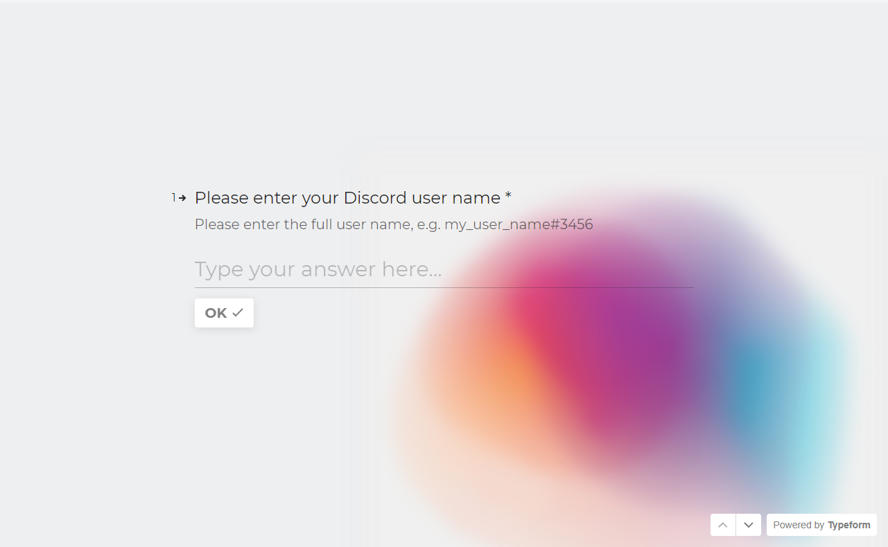

# Getting Started with Free Cycles

This guide explains how to use Cycles Faucet to acquire your first amount of 20T free cycles that could be used to deploy your dapps on the MainNet.

### Prerequisites

You will need to install Internet Computer SDK following [this guide](/developer-docs/setup/install/index.mdx).

### Step 1: Get Coupon

First, you will need to navigate to <https://faucet.dfinity.org>. You
will need to put in a request for cycles on the DFINITY DEV OFFICIAL Discord server. You can click on REQUEST CYCLES to join the discord server.

You must complete a survey sent to you by domwoe as a Direct Message. Once completed domwoe will send you a coupon.

Click NEXT STEP to continue.

### Step 2: Redeem Coupon

Once you get the coupon code, enter your coupon code.

Click NEXT STEP to continue.

### Step 3: Setup SDK

You need to make sure your computer has dfx installed.

Also, run this command to check the version of dfx on your computer:

    dfx --version

If your dfx version is below 0.12.0, please run this command:

    sudo dfx upgrade

Click NEXT STEP to continue.

### Step 4: Claim Cycles

You will need to claim your free cycles by running this command:

The next step is to link the cycles wallet canister with your Principal Identifier. Run this command in your terminal:

    dfx identify --network=ic set-wallet <canister id>

Click NEXT STEP to continue.

### Step 5: Verify Wallet Canister

The last step is to verify the wallet is setup correctly, by checking its balance using the `dfx wallet` command:

### Setup Completed

Now you are ready to host a website on the IC or follow one of our dapp tutorials.

