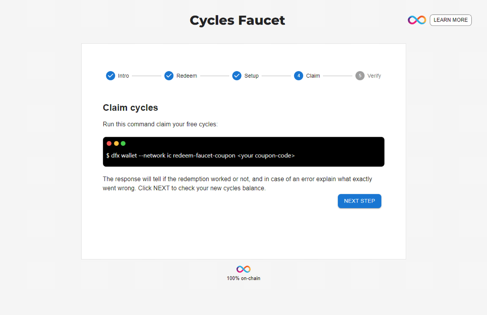

# Getting started with free cycles

## Overview

This guide explains how to use Cycles Faucet to acquire your first amount of 20T free cycles that could be used to deploy your dapps on the MainNet.

## Prerequisites

- [x] Install Internet Computer SDK following [this guide](/developer-docs/setup/install/index.mdx).

## Step 1: Get a coupon

First, you will need to navigate to <https://faucet.dfinity.org>. You
will need to put in a request for cycles on the [DFINITY dev official Discord](https://discord.gg/jnjVVQaE2C) server. You can click on the **REQUEST CYCLES** button on the faucet page to join the Discord server.

You must complete a survey that is sent to you by someone from the DFINTIY team as a **Discord direct message**. Once completed, they will send you a coupon.

Click **NEXT STEP** to continue.

## Step 2: Redeem the coupon

Once you get the coupon code, enter your coupon code.

Click NEXT STEP to continue.

## Step 3: Setup the IC SDK

Next, confirm your computer has `dfx` installed. Run this command to check the version of `dfx` on your computer:

    dfx --version

If your dfx version is below 0.12.0, please run this command:

    sudo dfx upgrade

Click **NEXT STEP** to continue.

## Step 4: Claim your cycles

You will need to claim your free cycles by running this command:

`dfx wallet --network ic redeem-faucet-coupon <your-coupon-code>`

Click **NEXT STEP** to continue.

## Step 5: Verify wallet canister

The last step is to verify the wallet is setup correctly, by checking its balance using the `dfx wallet` command:

## Conclusion

Now you are ready to host a website on the IC or follow one of our dapp tutorials.

