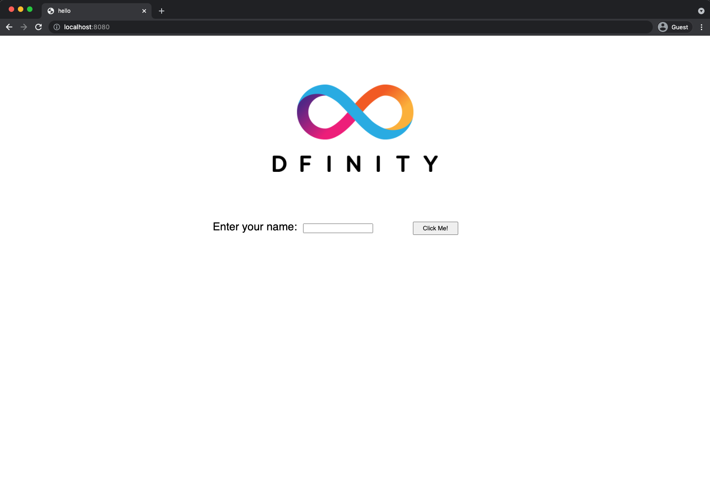

# Local deployment

## Overview

This scenario assumes that you are installing the IC SDK for the first time and want to run a canister in a **local canister execution environment** instead of deploying it to the Internet Computer blockchain.

To get started, let’s build and deploy a simple 'Hello, world!' canister that has just one function—called `greet`. The `greet` function accepts one text argument and returns the result with a greeting similar to **Hello, everyone!** in a terminal if you run the canister using the command-line or in an HTML page if you access the canister in a browser.

## Prerequisites

Before you download and install this release of the IC SDK, verify the following:

-   [x] You have an internet connection and access to a shell terminal on your local computer.

-   [x] You have `node.js` installed if you want to include the default template files for frontend development in your project.

## Download and install

You can download the latest version of the IC SDK directly from within a terminal shell on your local computer.

:::caution
These instructions are for **macOS** or **Linux** machines. For Windows instructions, please see [here](/docs/developer-docs/setup/install/index.mdx).
:::

To download and install:

- #### Step 1:  Open a terminal shell on your local computer.

    For example, open Applications > Utilities, then double-click **Terminal** or press ⌘+spacebar to open Search, then type `terminal`.

- #### Step 2:  Download and install the IC SDK package by running the following command:

        sh -ci "$(curl -fsSL https://internetcomputer.org/install.sh)"

    This command prompts you to read and accept the license agreement before installing the DFINITY execution command-line interface (CLI) and its dependencies on your local computer.

- #### Step 3:  Type `y` and press Return to continue with the installation.

    This command displays information about the components being installed on the local computer.

## Verify the IC SDK is ready to use

If the installation script runs without any errors, everything you need to start developing programs that run on ICP will be available on your local computer.

To verify the IC SDK is ready to use:

- #### Step 1:  Open a terminal shell on your local computer, if you don’t already have one open.

- #### Step 2:  Check that you have the DFINITY execution command-line interface (CLI) installed and the `dfx` executable is available in your PATH by running the following command:

        dfx --version

    The command displays version information for the `dfx` command-line executable. You can see the latest version in the [release notes](https://github.com/dfinity/sdk/releases).
    
- #### Step 3:  Preview usage information for the other `dfx` command-line sub-commands by running the following command:

        dfx --help

    The command displays usage information for the `dfx` parent command and its subcommands.

## Create a new project

Dapps on the Internet Computer start as **projects**. You create projects using the `dfx` parent command and its subcommands.

For this guide, you’ll start with the default sample dapp to illustrate creating dapp using the starter files in a project. When you create a new project, the `dfx` command-line interface adds a default project directory structure to your workspace. The previous guide covers the template files that make up a project directory in the [explore the default project](/developer-docs/backend/motoko/explore-templates.md) page.

To create a new project for your first application:

- #### Step 1:  Open a terminal shell on your local computer, if you don’t already have one open.

- #### Step 2:  Create a new project named `hello` by running the following command:

        dfx new hello

    The `dfx new hello` command creates a new `hello` project directory, template files, and a new `hello` Git repository for your project.

    If you use a different project name instead of `hello`, make note of the name you used. You’ll need to use that project name in place of the `hello` project name throughout these instructions.

- #### Step 3:  Change to your project directory by running the following command:

        cd hello

## Start the local deployment

Before you can build your first project, you need to connect to the local canister execution environment. As a best practice, this step requires you to have **two terminal shells** open, so that you can start and see canister execution operations in one terminal and manage your project in another.

To prepare the local canister execution environment:

- #### Step 1:  Open a new second terminal window or tab on your local computer.

- #### Step 2:  Navigate to the root directory for your project, if necessary.

    You should now have **two terminals** open with your **project directory** as your **current working directory** in both terminals.

- #### Step 3:  Start the local canister execution environment on your computer in your second terminal by running the following command:

        dfx start

    Depending on your platform and local security settings, you might see a warning displayed. If you are prompted to allow or deny incoming network connections, click **Allow**.

- #### Step 4:  Leave the terminal window that displays canister execution operations open and switch your focus to the first terminal window where you created your new project.

    You should perform the remaining steps in the terminal that doesn’t display canister execution operations.

## Register, build, and deploy the application

After you connect to the local canister execution environment you can register, build, and deploy your dapp locally.

To deploy your first dapp locally:

- #### Step 1:  Check that you are still in the root directory for your project, if needed.

- #### Step 2:  Ensure that `node` modules are available in your project directory, if needed, by running the following command:

        npm install

    For more information about this step, see [ensuring node is available in a project](/developer-docs/frontend/index.md#troubleshoot-node).

- #### Step 3:  Register, build, and deploy your first dapp by running the following command:

        dfx deploy

    The `dfx deploy` command output displays information about the operations it performs. For example, this step registers two identifiers. One is for the `hello_backend` main program and the other one for the `hello_frontend` frontend user interface and installation information similar to the following:

        Creating a wallet canister on the local network.
        The wallet canister on the "local" network for user "mainnet" is "rwlgt-iiaaa-aaaaa-aaaaa-cai"
        Deploying all canisters.
        Creating canisters...
        Creating canister hello_backend...
        hello_backend canister created with canister id: rrkah-fqaaa-aaaaa-aaaaq-cai
        Creating canister hello_frontend...
        hello_frontend canister created with canister id: ryjl3-tyaaa-aaaaa-aaaba-cai
        Building canisters...
        Building frontend...
        Installing canisters...
        Creating UI canister on the local network.
        The UI canister on the "local" network is "r7inp-6aaaa-aaaaa-aaabq-cai"
        Installing code for canister hello_backend, with canister ID rrkah-fqaaa-aaaaa-aaaaq-cai
        Installing code for canister hello_frontend, with canister ID ryjl3-tyaaa-aaaaa-aaaba-cai
        Uploading assets to asset canister...
        Starting batch.
        Staging contents of new and changed assets:
          /sample-asset.txt 1/1 (24 bytes)
          /logo2.svg 1/1 (15139 bytes)
          /index.js.map 1/1 (681670 bytes)
          /index.js.map (gzip) 1/1 (156940 bytes)
          /favicon.ico 1/1 (15406 bytes)
          /main.css 1/1 (537 bytes)
          /main.css (gzip) 1/1 (297 bytes)
          /index.html 1/1 (690 bytes)
          /index.html (gzip) 1/1 (386 bytes)
          /index.js (gzip) 1/1 (152884 bytes)
          /index.js 1/1 (637230 bytes)
        Committing batch.
        Deployed canisters.
        URLs:
          Frontend canister via browser
            hello_frontend: http://127.0.0.1:4943/?canisterId=ryjl3-tyaaa-aaaaa-aaaba-cai
          Backend canister via Candid interface:
            hello_backend: http://127.0.0.1:4943/?canisterId=r7inp-6aaaa-aaaaa-aaabq-cai&id=rrkah-fqaaa-aaaaa-aaaaq-cai

    If you created a project with a different name, however, your canister names will match your project name instead of `hello_backend` and `hello_frontend`.

    You should also note that the **first time you deploy**, `dfx` creates a `default` identity and a local cycle wallet controlled by your `default` identity. A cycles wallet is a special type of canister that enables you to transfer [cycles](/concepts/tokens-cycles.md) to other canisters.

    **To deploy this sample dapp locally**, you don’t need to know anything about your default developer identity, using a cycles wallet, or managing cycles. We’ll cover these topics later; for now, just note that these are created for you automatically.

- #### Step 4:  Call the `hello_backend` canister and the predefined `greet` function by running the following command:

        dfx canister call hello_backend greet everyone

    Let’s take a closer look at this example command:

    -   The `dfx canister call` command requires you to specify a canister name and a method—or function—to call.

    -   `hello_backend` specifies the name of the **canister** you want to call.

    -   `greet` specifies the name of the **function** you want to call in the `hello` canister.

    -   `everyone` is the text data type argument that you want to pass to the `greet` function.

    Remember, however, that if you created a project with a different name, the canister name will match your project name and you’ll need to modify the command line to match the name you used instead of `hello_backend`. If you were to choose `test` as the projects name, your backend canister would be called `test_backend` and the frontend canister `test_frontend`.

- #### Step 5:  Verify the command displays the return value of the `greet` function.

    For example:

        ("Hello, everyone!")

## Test the dapp frontend

Now that you have verified that your dapp has been deployed and tested its operation using the command line, let’s verify that you can access the frontend using your web browser.

- #### Step 1:  Open a browser.

- #### Step 2:  Navigate to the URL output by the `dfx deploy` command in the previous step. 

Use the URL after `Frontend canister via browser`; in our case that's `http://127.0.0.1:4943/?canisterId=ryjl3-tyaaa-aaaaa-aaaba-cai`.

Navigating to this URL displays a basic HTML page with a sample asset image file, an input field, and a button. For example:

- #### Step 3:  Type a greeting, then click **Click Me** button to return the greeting.

    For example:

    

## Stop the local canister execution environment

After testing the application in the browser, you can stop the local canister execution environment so that it doesn’t continue running in the background.

To stop the local deployment:

- #### Step 1:  In the terminal that displays the development server, press Control-C to interrupt the development server process.

- #### Step 2:  In the terminal that displays canister execution operations, press Control-C to interrupt the local network process.

- #### Step 3:  Stop the local canister execution environment running on your local computer by running the following command:

        dfx stop

## Conclusion

This guide touched on only a few key steps to introduce the basic workflow for developing dapps of your own. You can find more detailed examples and guides to help you learn about how to use Motoko and how to develop dapps to run on the Internet Computer blockchain throughout the documentation.

## Resources
Here are some suggestions for where to go next:

-   [Building on ICP](../../samples/overview.md) to explore sample dapps.

-   [Concepts](../../concepts/index.md) to learn about different ICP concepts and services. 

-   [Convert ICP tokens to cycles](./deploy-mainnet.md#convert-icp) if you have ICP tokens that you want to convert to cycles to enable you to deploy dapp to the Internet Computer blockchain.

-   [ICP glossary](../../references/glossary.md) to learn the definitions of various terms used within ICP. 

-   [On-chain deployment](./deploy-mainnet.md) if you have cycles and are ready to deploy an application to the Internet Computer blockchain mainnet.

-   [What is Candid?](/docs/developer-docs/backend/candid/candid-concepts.md) to learn how the Candid interface description language enables service interoperability and composability.

