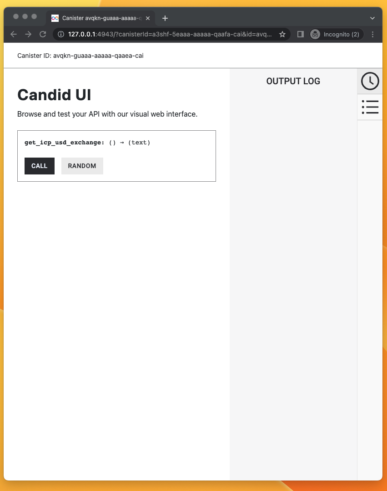

import TabItem from "@theme/TabItem";
import { AdornedTabs } from "/src/components/Tabs/AdornedTabs";
import { AdornedTab } from "/src/components/Tabs/AdornedTab";
import { BetaChip } from "/src/components/Chip/BetaChip";
import { MarkdownChipRow } from "/src/components/Chip/MarkdownChipRow";

# How to use HTTPS outcalls: GET

<MarkdownChipRow labels={["Advanced", "Tutorial"]} />

## Overview

A minimal example to make a `GET` HTTP request. The purpose of this dapp is only to show how to make HTTP requests from a canister.

The sample code is in both Motoko and Rust. This sample canister sends a `GET` request to the Coinbase API and retrieves some historical data about the ICP token.


**The main intent of this canister is to show developers how to make idempotent `GET` requests.**

This example takes less than 5 minutes to complete.

### Sample dapp

The canister in this tutorial will have only **one public method** named `get_icp_usd_exchange()` which, when called, will trigger an HTTP `GET` request to an external service. The canister will not have a frontend (only a backend), but like all canisters, you can interact with its public methods via the Candid web UI, which will look like this:




The `get_icp_usd_exchange()` method returns Coinbase data on the exchange rate between USD and ICP for a certain day. The data will look like this:

The API response looks like this:
```
  [
     [
         1682978460, <-- start timestamp
         5.714, <-- lowest price during time range
         5.718, <-- highest price during range
         5.714, <-- price at open
         5.714, <-- price at close
         243.5678 <-- volume of  traded
     ],
]
```

## Code structure

Before you dive in, here is the structure of the code you will touch:

<AdornedTabs groupId="languages">
<TabItem value="motoko" label="Motoko" default>

```motoko

//Import some custom types from `src/backend_canister/Types.mo` file
import Types "Types";

actor {

  //0. method that uses the HTTPS outcalls feature and returns a string
  public func foo() : async Text {

    //1. DECLARE MANAGEMENT CANISTER
    let ic : Types.IC = actor ("aaaaa-aa");

    //2. SETUP ARGUMENTS FOR HTTP GET request
    let request : Types.HttpRequestArgs = {
        //construct the request
    };

    //3. ADD CYCLES TO PAY FOR HTTP REQUEST
    //code to add cycles

    //4. MAKE HTTP REQUEST AND WAIT FOR RESPONSE
    let response : Types.HttpResponsePayload = await ic.http_request(request);

    //5. DECODE THE RESPONSE
    //code to decode response

    //6. RETURN RESPONSE OF THE BODY
    response
  };

  //7. CREATE TRANSFORM FUNCTION
  public query func transform(raw : Types.TransformArgs) : async Types.CanisterHttpResponsePayload {
    ////code for the transform function
  }

};
```

You will also create some custom types in `Types.mo`. It will look like this:

```motoko
module Types {

    //type declarations for s, HTTP responses, management canister, etc...

}
```

</TabItem>
<TabItem value="rust" label="Rust">

Here is how the management canister is declared in a Rust canister (e.g. `lib.rs`):

```rust
//1. DECLARE MANAGEMENT CANISTER
use ic_cdk::api::management_canister::http_request::{
    http_request, CanisterHttpRequestArgument, HttpHeader, HttpMethod, HttpResponse, TransformArgs,
    TransformContext,
};

//Update method using the HTTPS outcalls feature
#[ic_cdk::update]
async fn foo() {
    //2. SETUP ARGUMENTS FOR HTTP GET request
    let request = CanisterHttpRequestArgument {
        //instantiate the request
    };

    //3. MAKE HTTP REQUEST AND WAIT FOR RESPONSE
    //Note: in Rust, `http_request()` already sends the cycles needed
    //so no need for explicit Cycles.add() as in Motoko
    match http_request(request).await {

        //4. DECODE AND RETURN THE RESPONSE
        Ok((response,)) => {
            //Ok case
        }
        Err((r, m)) => {
            //error case
        }
    }
}

// 4. CREATE TRANSFORM FUNCTION
#[ic_cdk::query]
fn transform(raw: TransformArgs) -> HttpResponse { }
```

</TabItem>
</AdornedTabs>


- #### Step 1:  Create a new project by running the following command:

<AdornedTabs groupId="languages">
<TabItem value="motoko" label="Motoko" default>

```bash
dfx new send_http_get_motoko
cd send_http_get_motoko
npm install
```

</TabItem>
<TabItem value="rust" label="Rust">

```bash
dfx new send_http_get_rust
cd send_http_get_rust
npm install
rustup target add wasm32-unknown-unknown
```

</TabItem>
</AdornedTabs>


- #### Step 2: Edit the backend canister's code.

<AdornedTabs groupId="languages">
<TabItem value="motoko" label="Motoko" default>

Open the `src/send_http_get_motoko_backend/main.mo` file in a text editor and replace content with:

```motoko
import Debug "mo:base/Debug";
import Blob "mo:base/Blob";
import Cycles "mo:base/ExperimentalCycles";
import Error "mo:base/Error";
import Array "mo:base/Array";
import Nat8 "mo:base/Nat8";
import Nat64 "mo:base/Nat64";
import Text "mo:base/Text";

//import the custom types you have in Types.mo
import Types "Types";


//Actor
actor {

//This method sends a GET request to a URL with a free API you can test.
//This method returns Coinbase data on the exchange rate between USD and ICP
//for a certain day.
//The API response looks like this:
//  [
//     [
//         1682978460, <-- start timestamp
//         5.714, <-- lowest price during time range
//         5.718, <-- highest price during range
//         5.714, <-- price at open
//         5.714, <-- price at close
//         243.5678 <-- volume of ICP traded
//     ],
// ]

  public func get_icp_usd_exchange() : async Text {

    //1. DECLARE MANAGEMENT CANISTER
    //You need this so you can use it to make the HTTP request
    let ic : Types.IC = actor ("aaaaa-aa");

    //2. SETUP ARGUMENTS FOR HTTP GET request

    // 2.1 Setup the URL and its query parameters
    let ONE_MINUTE : Nat64 = 60;
    let start_timestamp : Types.Timestamp = 1682978460; //May 1, 2023 22:01:00 GMT
    let end_timestamp : Types.Timestamp = 1682978520;//May 1, 2023 22:02:00 GMT
    let host : Text = "api.pro.coinbase.com";
    let url = "https://" # host # "/products/ICP-USD/candles?start=" # Nat64.toText(start_timestamp) # "&end=" # Nat64.toText(start_timestamp) # "&granularity=" # Nat64.toText(ONE_MINUTE);

    // 2.2 prepare headers for the system http_request call
    let request_headers = [
        { name = "Host"; value = host # ":443" },
        { name = "User-Agent"; value = "exchange_rate_canister" },
    ];

    // 2.2.1 Transform context
    let transform_context : Types.TransformContext = {
      function = transform;
      context = Blob.fromArray([]);
    };

    // 2.3 The HTTP request
    let http_request : Types.HttpRequestArgs = {
        url = url;
        max_response_bytes = null; //optional for request
        headers = request_headers;
        body = null; //optional for request
        method = #get;
        transform = ?transform_context;
    };

    //3. ADD CYCLES TO PAY FOR HTTP REQUEST

    //The IC specification spec says, "Cycles to pay for the call must be explicitly transferred with the call"
    //The management canister will make the HTTP request so it needs cycles
    //See: /docs/current/motoko/main/canister-maintenance/cycles

    //The way Cycles.add() works is that it adds those cycles to the next asynchronous call
    //"Function add(amount) indicates the additional amount of cycles to be transferred in the next remote call"
    //See: /docs/current/references/ic-interface-spec#ic-http_request
    Cycles.add(20_949_972_000);

    //4. MAKE HTTP REQUEST AND WAIT FOR RESPONSE
    //Since the cycles were added above, you can just call the management canister with HTTPS outcalls below
    let http_response : Types.HttpResponsePayload = await ic.http_request(http_request);

    //5. DECODE THE RESPONSE

    //As per the type declarations in `src/Types.mo`, the BODY in the HTTP response
    //comes back as [Nat8s] (e.g. [2, 5, 12, 11, 23]). Type signature:

    //public type HttpResponsePayload = {
    //     status : Nat;
    //     headers : [HttpHeader];
    //     body : [Nat8];
    // };

    //You need to decode that [Nat8] array that is the body into readable text.
    //To do this, you:
    //  1. Convert the [Nat8] into a Blob
    //  2. Use Blob.decodeUtf8() method to convert the Blob to a ?Text optional
    //  3. You use a switch to explicitly call out both cases of decoding the Blob into ?Text
    let response_body: Blob = Blob.fromArray(http_response.body);
    let decoded_text: Text = switch (Text.decodeUtf8(response_body)) {
        case (null) { "No value returned" };
        case (?y) { y };
    };

    //6. RETURN RESPONSE OF THE BODY
    //The API response will looks like this:

    // ("[[1682978460,5.714,5.718,5.714,5.714,243.5678]]")

    //Which can be formatted as this
    //  [
    //     [
    //         1682978460, <-- start/timestamp
    //         5.714, <-- low
    //         5.718, <-- high
    //         5.714, <-- open
    //         5.714, <-- close
    //         243.5678 <-- volume
    //     ],
    // ]
    decoded_text
  };

  //7. CREATE TRANSFORM FUNCTION
  public query func transform(raw : Types.TransformArgs) : async Types.CanisterHttpResponsePayload {
      let transformed : Types.CanisterHttpResponsePayload = {
          status = raw.response.status;
          body = raw.response.body;
          headers = [
              {
                  name = "Content-Security-Policy";
                  value = "default-src 'self'";
              },
              { name = "Referrer-Policy"; value = "strict-origin" },
              { name = "Permissions-Policy"; value = "geolocation=(self)" },
              {
                  name = "Strict-Transport-Security";
                  value = "max-age=63072000";
              },
              { name = "X-Frame-Options"; value = "DENY" },
              { name = "X-Content-Type-Options"; value = "nosniff" },
          ];
      };
      transformed;
  };
};
```

- `get_icp_usd_exchange()` is an update call. All methods that make HTTPS outcalls must be update calls because they go through consensus, even if the HTTPS outcall is a `GET`.
- The code above adds `20_949_972_000` cycles. This is typically enough for `GET` requests, but this may need to change depending on your use case.
- The code above imports `Types.mo` to separate the custom types from the actor file (as a best practice).

</TabItem>
<TabItem value="rust" label="Rust">

Open the `/src/send_http_get_rust_backend/src/lib.rs` file in a text editor and replace the content with:

```rust
//1. IMPORT MANAGEMENT CANISTER
//This includes all methods and types needed
use ic_cdk::api::management_canister::http_request::{
    http_request, CanisterHttpRequestArgument, HttpHeader, HttpMethod, HttpResponse, TransformArgs,
    TransformContext, TransformFunc,
};


//Update method using the HTTPS outcalls feature
#[ic_cdk::update]
async fn get_icp_usd_exchange() -> String {
    //2. SETUP ARGUMENTS FOR HTTP GET request

    // 2.1 Setup the URL and its query parameters
    type Timestamp = u64;
    let start_timestamp: Timestamp = 1682978460; //May 1, 2023 22:01:00 GMT
    let seconds_of_time: u64 = 60; //start with 60 seconds
    let host = "api.pro.coinbase.com";
    let url = format!(
        "https://{}/products/ICP-USD/candles?start={}&end={}&granularity={}",
        host, start_timestamp, start_timestamp, seconds_of_time
    );

    // 2.2 Prepare headers for the system http_request call
    //Note that `HttpHeader` is declared in line 4
    let request_headers = vec![
        HttpHeader {
            name: "Host".to_string(),
            value: format!("{host}:443"),
        },
        HttpHeader {
            name: "User-Agent".to_string(),
            value: "exchange_rate_canister".to_string(),
        },
    ];

    //note "CanisterHttpRequestArgument" and "HttpMethod" are declared in line 4
    let request = CanisterHttpRequestArgument {
        url: url.to_string(),
        method: HttpMethod::GET,
        body: None,               //optional for request
        max_response_bytes: None, //optional for request
        transform: Some(TransformContext {
            // The "method" parameter needs to have the same name as the function name of your transform function
            function: TransformFunc(candid::Func {
                principal: ic_cdk::api::id(),
                method: "transform".to_string(),
            }),
            // The "TransformContext" function does need a context parameter, it can be empty
            context: vec![],
        }),
        headers: request_headers,
    };

    //3. MAKE HTTP REQUEST AND WAIT FOR RESPONSE

    //Note: in Rust, `http_request()` needs to pass cycles if you are using ic_cdk: ^0.9.0
    let cycles = 230_949_972_000;

    match http_request(request, cycles).await {
        //4. DECODE AND RETURN THE RESPONSE

        //See:https://docs.rs/ic-cdk/latest/ic_cdk/api/management_canister/http_request/struct.HttpResponse.html
        Ok((response,)) => {
            //if successful, `HttpResponse` has this structure:
            // pub struct HttpResponse {
            //     pub status: Nat,
            //     pub headers: Vec<HttpHeader>,
            //     pub body: Vec<u8>,
            // }

            //You need to decode that Vec<u8> that is the body into readable text.
            //To do this:
            //  1. Call `String::from_utf8()` on response.body
            //  3. You use a switch to explicitly call out both cases of decoding the Blob into ?Text

            //The API response will look like this:

            // ("[[1682978460,5.714,5.718,5.714,5.714,243.5678]]")

            //Which can be formatted as this
            //  [
            //     [
            //         1682978460, <-- start/timestamp
            //         5.714, <-- low
            //         5.718, <-- high
            //         5.714, <-- open
            //         5.714, <-- close
            //         243.5678 <-- volume
            //     ],
            //  ]

            //Return the body as a string and end the method
            String::from_utf8(response.body).expect("Transformed response is not UTF-8 encoded.")
        }
        Err((r, m)) => {
            let message =
                format!("The http_request resulted into error. RejectionCode: {r:?}, Error: {m}");

            //Return the error as a string and end the method
            message
        }
    }
}

// Strips all data that is not needed from the original response.
#[ic_cdk::query]
fn transform(raw: TransformArgs) -> HttpResponse {
    let headers = vec![
        HttpHeader {
            name: "Content-Security-Policy".to_string(),
            value: "default-src 'self'".to_string(),
        },
        HttpHeader {
            name: "Referrer-Policy".to_string(),
            value: "strict-origin".to_string(),
        },
        HttpHeader {
            name: "Permissions-Policy".to_string(),
            value: "geolocation=(self)".to_string(),
        },
        HttpHeader {
            name: "Strict-Transport-Security".to_string(),
            value: "max-age=63072000".to_string(),
        },
        HttpHeader {
            name: "X-Frame-Options".to_string(),
            value: "DENY".to_string(),
        },
        HttpHeader {
            name: "X-Content-Type-Options".to_string(),
            value: "nosniff".to_string(),
        },
    ];

    let mut res = HttpResponse {
        status: raw.response.status.clone(),
        body: raw.response.body.clone(),
        headers,
    };

    if res.status == 200u64 {
        res.body = raw.response.body;
    } else {
        ic_cdk::api::print(format!("Received an error from coinbase: err = {:?}", raw));
    }
    res
}
```

- `get_icp_usd_exchange() -> String` returns a `String`, but this is not necessary. In this tutorial, this is done for easier testing.
- The `lib.rs` file uses [http_request](https://docs.rs/ic-cdk/latest/ic_cdk/api/management_canister/http_request/fn.http_request.html) which is a convenient Rust CDK method that already sends cycles to the management canister under the hood. It knows how many cycles to send for a 13-node subnet in most cases. If your HTTPS outcall needs more cycles, you should use the [http_request_with_cycles()](https://docs.rs/ic-cdk/latest/ic_cdk/api/management_canister/http_request/fn.http_request_with_cycles.html) method and explicitly call the cycles needed.
- The Rust CDK method `http_request` used above wraps the management canister method [`http_request`](/docs/current/references/ic-interface-spec#ic-http_request), but it is not strictly the same.

</TabItem>
</AdornedTabs>

:::caution

Headers in the response may not always be identical across all nodes that process the request for consensus, causing the result of the call to be "No consensus could be reached." This particular error message can be hard to debug, but one method to resolve this error is to edit the response using the transform function. The transform function is run before consensus, and can be used to remove some headers from the response. For example, the following Rust variation removes all headers aside from the body and status code of the call:

```rust
use ic_cdk::{
    api::management_canister::http_request::{HttpResponse, TransformArgs},
    query,
};

#[query]
fn transform(raw: TransformArgs) -> HttpResponse {
    let mut res = HttpResponse {
        status: raw.response.status.clone(),
        body: raw.response.body.clone(),
        ..Default::default()
    };

    if i32::try_from(res.status.clone().0).unwrap() == 200 {
        res.body = raw.response.body;
    } else {
        ic_cdk::api::print(format!("Received an error from proxy: err = {:?}", raw));
    }

    res
}
```
:::


- #### Step 3: Edit the Type or Candid files.

<AdornedTabs groupId="languages">
<TabItem value="motoko" label="Motoko" default>

Open the `src/send_http_get_motoko_backend/Types.mo` file in a text editor and replace content with:

```motoko
module Types {

  public type Timestamp = Nat64;

  //1. Type that describes the Request arguments for an HTTPS outcall
    //See: /docs/current/references/ic-interface-spec#ic-http_request
    public type HttpRequestArgs = {
        url : Text;
        max_response_bytes : ?Nat64;
        headers : [HttpHeader];
        body : ?[Nat8];
        method : HttpMethod;
        transform : ?TransformRawResponseFunction;
    };

    public type HttpHeader = {
        name : Text;
        value : Text;
    };

    public type HttpMethod = {
        #get;
        #post;
        #head;
    };

    public type HttpResponsePayload = {
        status : Nat;
        headers : [HttpHeader];
        body : [Nat8];
    };

    //2. HTTPS outcalls have an optional "transform" key. These two types help describe it.
    //"The transform function may, for example, transform the body in any way, add or remove headers,
    //modify headers, etc. "
    //See: /docs/current/references/ic-interface-spec#ic-http_request


    //2.1 This type describes a function called "TransformRawResponse" used in line 14 above
    //"If provided, the calling canister itself must export this function."
    //In this minimal example for a `GET` request, you declare the type for completeness, but
    //you do not use this function. You will pass "null" to the HTTP request.
    public type TransformRawResponseFunction = {
        function : shared query TransformArgs -> async HttpResponsePayload;
        context : Blob;
    };

    //2.2 These types describes the arguments the transform function needs
    public type TransformArgs = {
        response : HttpResponsePayload;
        context : Blob;
    };

    public type CanisterHttpResponsePayload = {
        status : Nat;
        headers : [HttpHeader];
        body : [Nat8];
    };

    public type TransformContext = {
        function : shared query TransformArgs -> async HttpResponsePayload;
        context : Blob;
    };


    //3. Declaring the management canister which you use to make the HTTPS outcall
    public type IC = actor {
        http_request : HttpRequestArgs -> async HttpResponsePayload;
    };

}
```

</TabItem>
<TabItem value="rust" label="Rust">

Open the `src/send_http_get_rust_backend/send_http_get_rust_backend.did` file in a text editor and replace the content with:

You update the Candid interface file so it matches the method `get_icp_usd_exchange()` in `lib.rs`.

```
service : {
    "get_icp_usd_exchange": () -> (text);
}
```

Open the `src/send_http_get_rust_backend/Cargo.toml` file in a text editor and replace the content with:

```bash
[package]
name = "send_http_get_rust_backend"
version = "0.1.0"
edition = "2021"

# See more keys and their definitions at https://doc.rust-lang.org/cargo/reference/manifest.html

[lib]
crate-type = ["cdylib"]

[dependencies]
candid = "0.10"
ic-cdk = "0.13"
```

</TabItem>
</AdornedTabs>


- #### Step 4: Test the dapp locally.

<AdornedTabs groupId="languages">
<TabItem value="motoko" label="Motoko" default>

Deploy the dapp locally:

```bash
dfx start --clean --background
dfx deploy
```

If successful, the terminal should return canister URLs you can open:

```bash
Deployed canisters.
URLs:
  Frontend canister via browser
    send_http_get_motoko_frontend: http://127.0.0.1:4943/?canisterId=asrmz-lmaaa-aaaaa-qaaeq-cai
  Backend canister via Candid interface:
    send_http_get_motoko_backend: http://127.0.0.1:4943/?canisterId=a3shf-5eaaa-aaaaa-qaafa-cai&id=avqkn-guaaa-aaaaa-qaaea-cai
```

Open the Candid web UI for the backend (the `send_http_get_motoko_backend` one) and call the `get_icp_usd_exchange()` method:


</TabItem>
<TabItem value="rust" label="Rust">

Test the dapp locally.

Deploy the dapp locally:

```bash
dfx start --clean --background
dfx deploy
```

If successful, the terminal should return canister URLs you can open:

```bash
Deployed canisters.
URLs:
  Frontend canister via browser
    send_http_get_rust_frontend: http://127.0.0.1:4943/?canisterId=ajuq4-ruaaa-aaaaa-qaaga-cai
  Backend canister via Candid interface:
    send_http_get_rust_backend: http://127.0.0.1:4943/?canisterId=aovwi-4maaa-aaaaa-qaagq-cai&id=a4tbr-q4aaa-aaaaa-qaafq-cai
```

Open the Candid web UI for the backend (the `send_http_get_rust_backend` one) and call the `get_icp_usd_exchange()` method:


</TabItem>
</AdornedTabs>


- #### Step 5: Test the dapp on mainnet.

<AdornedTabs groupId="languages">
<TabItem value="motoko" label="Motoko" default>

Deploy the dapp locally:

```bash
dfx deploy --network ic
```

If successful, the terminal should return canister URLs you can open:

```bash
Committing batch.
Deployed canisters.
URLs:
  Frontend canister via browser
    send_http_get_motoko_frontend: https://ff5va-7qaaa-aaaap-qbona-cai.ic0.app/
  Backend canister via Candid interface:
    send_http_get_motoko_backend: https://a4gq6-oaaaa-aaaab-qaa4q-cai.raw.ic0.app/?id=fm664-jyaaa-aaaap-qbomq-cai
```

</TabItem>
<TabItem value="rust" label="Rust">

Deploy the dapp to mainnet:

```bash
dfx deploy --network ic
```

If successful, the terminal should return canister URLs you can open:

```bash
Committing batch.
Deployed canisters.
URLs:
  Frontend canister via browser
    send_http_get_rust_frontend: https://ff5va-7qaaa-aaaap-qbona-cai.ic0.app/
  Backend canister via Candid interface:
    send_http_get_rust_backend: https://a4gq6-oaaaa-aaaab-qaa4q-cai.raw.ic0.app/?id=fm664-jyaaa-aaaap-qbomq-cai
```

You can see play with the dapp's `get_icp_usd_exchange` method on-chain here: [https://a4gq6-oaaaa-aaaab-qaa4q-cai.raw.ic0.app/?id=fm664-jyaaa-aaaap-qbomq-cai](https://a4gq6-oaaaa-aaaab-qaa4q-cai.raw.ic0.app/?id=fm664-jyaaa-aaaap-qbomq-cai).

</TabItem>
</AdornedTabs>

## Additional resources

- Sample code of [HTTP `GET` requests in Rust.](https://github.com/dfinity/examples/tree/master/rust/send_http_get)
- Sample code of [HTTP `GET` requests in Motoko.](https://github.com/dfinity/examples/tree/master/motoko/send_http_get)
