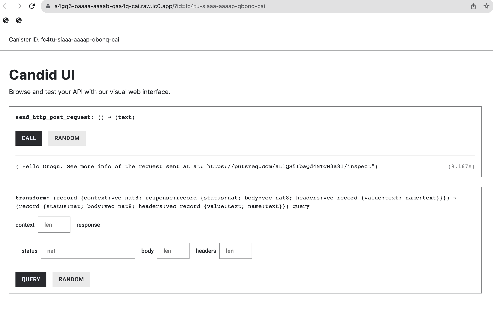
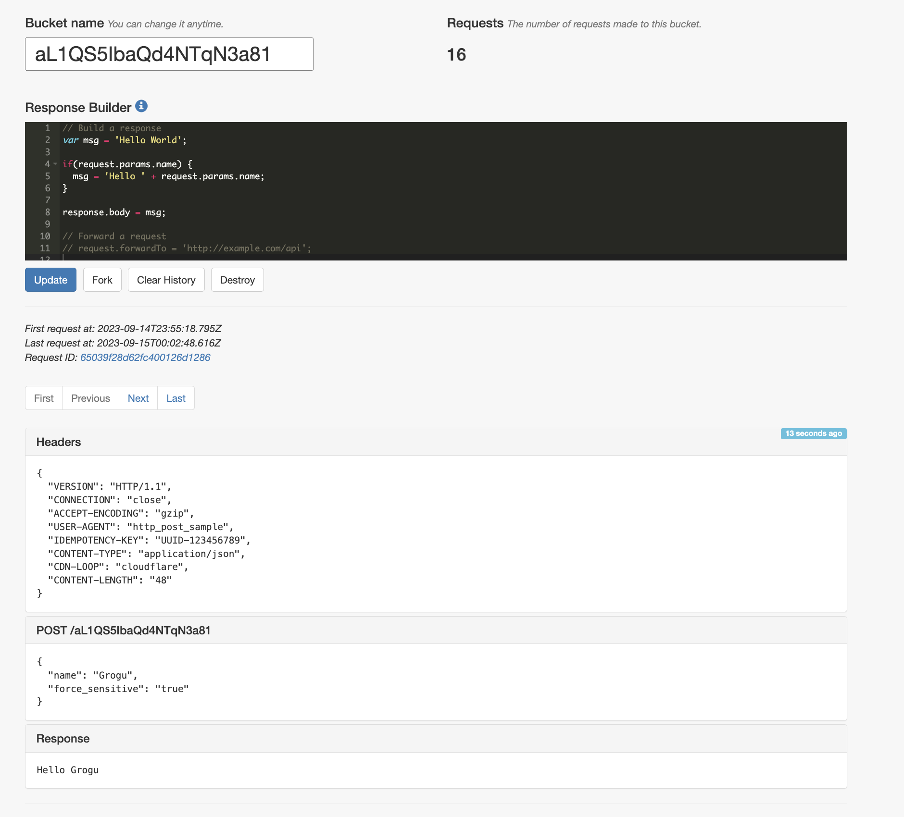

import TabItem from "@theme/TabItem";
import { AdornedTabs } from "/src/components/Tabs/AdornedTabs";
import { AdornedTab } from "/src/components/Tabs/AdornedTab";
import { BetaChip } from "/src/components/Chip/BetaChip";
import { MarkdownChipRow } from "/src/components/Chip/MarkdownChipRow";

# How to use HTTPS outcalls: POST

<MarkdownChipRow labels={["Advanced", "Tutorial"]} />

## Overview

A minimal example of how to make a `POST` HTTP request. The purpose of this dapp is only to show how to make HTTP requests from a canister.

The sample code is in both Motoko and Rust. This sample canister sends a `POST` request with some JSON to a free API where you can verify the headers and body were sent correctly.

**The main intent of this canister is to show developers how to make idempotent `POST` requests.**

This example takes less than 5 minutes to complete.

:::caution
The HTTPS outcalls feature only works for sending HTTP POST requests to servers or API endpoints that support **IPV6**.
:::

### Candid web UI of canister

The canister in this tutorial will have only **one public method** which, when called, will trigger an HTTP `POST` request. The canister will not have a frontend (only a  backend), but like all canisters, you can interact with its public methods via the Candid web UI, which will look like this:



When you call the method, the canister will send an HTTP `POST` request with the following JSON in the response body:

```json
{
    "name": "Grogu",
    "force_sensitive": "true"
}
```

### Verifying the HTTP POST request

In order to verify that your canister sent the HTTP request you expected, this canister is sending HTTP requests to a [public API service](https://putsreq.com/aL1QS5IbaQd4NTqN3a81/inspect) where the HTTP request can be inspected. As you can see the image below, the `POST` request headers and body can be inspected to make sure it is what the canister sent.



## Important notes on `POST` requests

Because HTTP outcalls go through consensus, a developer should expect any HTTP `POST` request from a canister to be sent many times to its destination. Even if you ignore the Web3 component, multiple identical POST requests are not a new problem in HTTPS where it is common for clients to retry requests for a variety of reasons (e.g. destination server being unavailable).

The recommended way for HTTP `POST` requests is to add the idempotency keys in the header so the destination server knows which `POST` requests from the client are the same.

Developers should be careful that the destination server understands and uses idempotency keys. A canister can be coded to send idempotency keys, but it is ultimately up to the recipient server to know what to do with them. Here is an [example of an API service that uses idempotency keys](https://stripe.com/docs/api/idempotent_requests).

## Code structure

Before you dive in, here is the structure of the code you will touch:

<AdornedTabs groupId="languages">
<TabItem value="motoko" label="Motoko" default>

```motoko

//Import some custom types from `src/backend_canister/Types.mo` file
import Types "Types";

actor {

//method that uses the HTTPS outcalls feature and returns a string
  public func foo() : async Text {

    //1. DECLARE MANAGEMENT CANISTER
    let ic : Types.IC = actor ("aaaaa-aa");

    //2. SETUP ARGUMENTS FOR HTTP GET request
    let request : Types.HttpRequestArgs = {
        //construct the request
    };

    //3. ADD CYCLES TO PAY FOR HTTP REQUEST
    //code to add cycles

    //4. MAKE HTTP REQUEST AND WAIT FOR RESPONSE
    let response : Types.HttpResponsePayload = await ic.http_request(request);

    //5. DECODE THE RESPONSE
    //code to decode response

    //6. RETURN RESPONSE OF THE BODY
    response
  };
};
```

You will also create some custom types in `Types.mo`. This will look like this:

```motoko
module Types {

    //type declarations for HTTP requests, HTTP responses, management canister, etc...

}
```

</TabItem>
<TabItem value="rust" label="Rust">

```rust
//1. DECLARE MANAGEMENT CANISTER
use ic_cdk::api::management_canister::http_request::{
    http_request, CanisterHttpRequestArgument, HttpHeader, HttpMethod, HttpResponse, TransformArgs,
    TransformContext,
};

//Update method using the HTTPS outcalls feature
#[ic_cdk::update]
async fn foo() {
    //2. SETUP ARGUMENTS FOR HTTP GET request
    let request = CanisterHttpRequestArgument {
        //instantiate the request
    };

    //3. MAKE HTTP REQUEST AND WAIT FOR RESPONSE
    //Note: in Rust, `http_request()` already sends the cycles needed
    //so no need for explicit Cycles.add() as in Motoko
    match http_request(request).await {

        //4. DECODE AND RETURN THE RESPONSE
        Ok((response,)) => {
            //Ok case
        }
        Err((r, m)) => {
            //error case
        }
    }
}
```

</TabItem>
</AdornedTabs>


- #### Step 1:  Create a new project by running the following command:

<AdornedTabs groupId="languages">
<TabItem value="motoko" label="Motoko" default>

```bash
dfx new send_http_post_motoko
cd send_http_post_motoko
npm install
```

</TabItem>
<TabItem value="rust" label="Rust">

```bash
dfx new --type=rust send_http_post_rust
cd send_http_post_rust
npm install
rustup target add wasm32-unknown-unknown
```

</TabItem>
</AdornedTabs>


- #### Step 2: Edit the backend canister's code.

<AdornedTabs groupId="languages">
<TabItem value="motoko" label="Motoko" default>

Open the `src/send_http_post_motoko_backend/main.mo` file in a text editor and replace content with:

```motoko
import Debug "mo:base/Debug";
import Blob "mo:base/Blob";
import Cycles "mo:base/ExperimentalCycles";
import Array "mo:base/Array";
import Nat8 "mo:base/Nat8";
import Text "mo:base/Text";

//import the custom types you have in Types.mo
import Types "Types";

actor {

  //function to transform the response
  public query func transform(raw : Types.TransformArgs) : async Types.CanisterHttpResponsePayload {
      let transformed : Types.CanisterHttpResponsePayload = {
          status = raw.response.status;
          body = raw.response.body;
          headers = [
              {
                  name = "Content-Security-Policy";
                  value = "default-src 'self'";
              },
              { name = "Referrer-Policy"; value = "strict-origin" },
              { name = "Permissions-Policy"; value = "geolocation=(self)" },
              {
                  name = "Strict-Transport-Security";
                  value = "max-age=63072000";
              },
              { name = "X-Frame-Options"; value = "DENY" },
              { name = "X-Content-Type-Options"; value = "nosniff" },
          ];
      };
      transformed;
  };

//PUBLIC METHOD
//This method sends a POST request to a URL with a free API you can test.
  public func send_http_post_request() : async Text {

    //1. DECLARE MANAGEMENT CANISTER
    //You need this so you can use it to make the HTTP request
    let ic : Types.IC = actor ("aaaaa-aa");

    //2. SETUP ARGUMENTS FOR HTTP GET request

    // 2.1 Setup the URL and its query parameters
    //This URL is used because it allows you to inspect the HTTP request sent from the canister
    let host : Text = "putsreq.com";
    let url = "https://putsreq.com/aL1QS5IbaQd4NTqN3a81"; //HTTPS that accepts IPV6

    // 2.2 Prepare headers for the system http_request call

    //idempotency keys should be unique so create a function that generates them.
    let idempotency_key: Text = generateUUID();
    let request_headers = [
        { name = "Host"; value = host # ":443" },
        { name = "User-Agent"; value = "http_post_sample" },
        { name= "Content-Type"; value = "application/json" },
        { name= "Idempotency-Key"; value = idempotency_key }
    ];

    // The request body is an array of [Nat8] (see Types.mo) so do the following:
    // 1. Write a JSON string
    // 2. Convert ?Text optional into a Blob, which is an intermediate representation before you cast it as an array of [Nat8]
    // 3. Convert the Blob into an array [Nat8]
    let request_body_json: Text = "{ \"name\" : \"Grogu\", \"force_sensitive\" : \"true\" }";
    let request_body_as_Blob: Blob = Text.encodeUtf8(request_body_json);
    let request_body_as_nat8: [Nat8] = Blob.toArray(request_body_as_Blob); // e.g [34, 34,12, 0]


    // 2.2.1 Transform context
    let transform_context : Types.TransformContext = {
      function = transform;
      context = Blob.fromArray([]);
    };

    // 2.3 The HTTP request
    let http_request : Types.HttpRequestArgs = {
        url = url;
        max_response_bytes = null; //optional for request
        headers = request_headers;
        //note: type of `body` is ?[Nat8] so it is passed here as "?request_body_as_nat8" instead of "request_body_as_nat8"
        body = ?request_body_as_nat8;
        method = #post;
        transform = ?transform_context;
        // transform = null; //optional for request
    };

    //3. ADD CYCLES TO PAY FOR HTTP REQUEST

    //The management canister will make the HTTP request so it needs cycles
    //See: /docs/current/motoko/main/canister-maintenance/cycles

    //The way Cycles.add() works is that it adds those cycles to the next asynchronous call
    //See: /docs/current/references/ic-interface-spec#ic-http_request
    Cycles.add(21_850_258_000);

    //4. MAKE HTTP REQUEST AND WAIT FOR RESPONSE
    //Since the cycles were added above, you can just call the management canister with HTTPS outcalls below
    let http_response : Types.HttpResponsePayload = await ic.http_request(http_request);

    //5. DECODE THE RESPONSE

    //As per the type declarations in `Types.mo`, the BODY in the HTTP response
    //comes back as [Nat8s] (e.g. [2, 5, 12, 11, 23]). Type signature:

    //public type HttpResponsePayload = {
    //     status : Nat;
    //     headers : [HttpHeader];
    //     body : [Nat8];
    // };

    // You need to decode that [Na8] array that is the body into readable text.
    //To do this:
    //  1. Convert the [Nat8] into a Blob
    //  2. Use Blob.decodeUtf8() method to convert the Blob to a ?Text optional
    //  3. Use Motoko syntax "Let... else" to unwrap what is returned from Text.decodeUtf8()
    let response_body: Blob = Blob.fromArray(http_response.body);
    let decoded_text: Text = switch (Text.decodeUtf8(response_body)) {
        case (null) { "No value returned" };
        case (?y) { y };
    };

    //6. RETURN RESPONSE OF THE BODY
    let result: Text = decoded_text # ". See more info of the request sent at at: " # url # "/inspect";
    result
  };

  //PRIVATE HELPER FUNCTION
  //Helper method that generates a Universally Unique Identifier
  //this method is used for the Idempotency Key used in the request headers of the POST request.
  //For the purposes of this exercise, it returns a constant, but in practice, it should return unique identifiers
  func generateUUID() : Text {
    "UUID-123456789";
  }
};
```

</TabItem>
<TabItem value="rust" label="Rust">

Open the `/src/send_http_post_rust_backend/src/lib.rs` file in a text editor and replace the content with:

```rust
//1. IMPORT MANAGEMENT CANISTER
//This includes all methods and types needed
use ic_cdk::api::management_canister::http_request::{
    http_request, CanisterHttpRequestArgument, HttpHeader, HttpMethod, HttpResponse, TransformArgs,
    TransformContext,
};

use serde::{Serialize, Deserialize};
use serde_json::{self, Value};

// This struct is legacy code and is not really used in the code.
#[derive(Serialize, Deserialize)]
struct Context {
    bucket_start_time_index: usize,
    closing_price_index: usize,
}

//Update method using the HTTPS outcalls feature
#[ic_cdk::update]
async fn send_http_post_request() -> String {
    //2. SETUP ARGUMENTS FOR HTTP GET request

    // 2.1 Setup the URL
    let host = "putsreq.com";
    let url = "https://putsreq.com/aL1QS5IbaQd4NTqN3a81";

    // 2.2 Prepare headers for the system http_request call
    //Note that `HttpHeader` is declared in line 4
    let request_headers = vec![
        HttpHeader {
            name: "Host".to_string(),
            value: format!("{host}:443"),
        },
        HttpHeader {
            name: "User-Agent".to_string(),
            value: "demo_HTTP_POST_canister".to_string(),
        },
        //For the purposes of this exercise, Idempotency-Key" is hard coded, but in practice
        //it should be generated via code and unique to each POST request. Common to create helper methods for this
        HttpHeader {
            name: "Idempotency-Key".to_string(),
            value: "UUID-123456789".to_string(),
        },
        HttpHeader {
            name: "Content-Type".to_string(),
            value: "application/json".to_string(),
        },
    ];

    //note "CanisterHttpRequestArgument" and "HttpMethod" are declared in line 4.
    //CanisterHttpRequestArgument has the following types:

    // pub struct CanisterHttpRequestArgument {
    //     pub url: String,
    //     pub max_response_bytes: Option<u64>,
    //     pub method: HttpMethod,
    //     pub headers: Vec<HttpHeader>,
    //     pub body: Option<Vec<u8>>,
    //     pub transform: Option<TransformContext>,
    // }
    //see: https://docs.rs/ic-cdk/latest/ic_cdk/api/management_canister/http_request/struct.CanisterHttpRequestArgument.html

    //Where "HttpMethod" has structure:
    // pub enum HttpMethod {
    //     GET,
    //     POST,
    //     HEAD,
    // }
    //See: https://docs.rs/ic-cdk/latest/ic_cdk/api/management_canister/http_request/enum.HttpMethod.html

    //Since the body in HTTP request has type Option<Vec<u8>> it needs to look something like this: Some(vec![104, 101, 108, 108, 111]) ("hello" in ASCII)
    //where the vector of u8s are the UTF. In order to send JSON via POST, do the following:
    //1. Declare a JSON string to send
    //2. Convert that JSON string to array of UTF8 (u8)
    //3. Wrap that array in an optional
    let json_string : String = "{ \"name\" : \"Grogu\", \"force_sensitive\" : \"true\" }".to_string();

    //note: here, r#""# is used for raw strings in Rust, which allows you to include characters like " and \ without needing to escape them.
    //You could have used "serde_json" as well.
    let json_utf8: Vec<u8> = json_string.into_bytes();
    let request_body: Option<Vec<u8>> = Some(json_utf8);

    // This struct is legacy code and is not really used in the code. Need to be removed in the future
    // The "TransformContext" function does need a CONTEXT parameter, but this implementation is not necessary
    // the TransformContext(transform, context) below accepts this "context", but it does nothing with it in this implementation.
    // bucket_start_time_index and closing_price_index are meaningless
    let context = Context {
        bucket_start_time_index: 0,
        closing_price_index: 4,
    };

    let request = CanisterHttpRequestArgument {
        url: url.to_string(),
        max_response_bytes: None, //optional for request
        method: HttpMethod::POST,
        headers: request_headers,
        body: request_body,
        transform: Some(TransformContext::new(transform, serde_json::to_vec(&context).unwrap())),
    };

    //3. MAKE HTTP REQUEST AND WAIT FOR RESPONSE

    //Note: in Rust, `http_request()` already sends the cycles needed
    //so no need for explicit Cycles.add() as in Motoko
    match http_request(request).await {
        //4. DECODE AND RETURN THE RESPONSE

        //See:https://docs.rs/ic-cdk/latest/ic_cdk/api/management_canister/http_request/struct.HttpResponse.html
        Ok((response,)) => {
            //if successful, `HttpResponse` has this structure:
            // pub struct HttpResponse {
            //     pub status: Nat,
            //     pub headers: Vec<HttpHeader>,
            //     pub body: Vec<u8>,
            // }

            //You need to decode that Vec<u8> that is the body into readable text.
            //To do this:
            //  1. Call `String::from_utf8()` on response.body
            //  3. Use a switch to explicitly call out both cases of decoding the Blob into ?Text
            let str_body = String::from_utf8(response.body)
                .expect("Transformed response is not UTF-8 encoded.");
            ic_cdk::api::print(format!("{:?}", str_body));

            //The API response will looks like this:
            // { successful: true }

            //Return the body as a string and end the method
            let result: String = format!(
                "{}. See more info of the request sent at: {}/inspect",
                str_body, url
            );
            result
        }
        Err((r, m)) => {
            let message =
                format!("The http_request resulted into error. RejectionCode: {r:?}, Error: {m}");

            //Return the error as a string and end the method
            message
        }
    }

}

// Strips all data that is not needed from the original response.
#[ic_cdk::query]
fn transform(raw: TransformArgs) -> HttpResponse {

    let headers = vec![
        HttpHeader {
            name: "Content-Security-Policy".to_string(),
            value: "default-src 'self'".to_string(),
        },
        HttpHeader {
            name: "Referrer-Policy".to_string(),
            value: "strict-origin".to_string(),
        },
        HttpHeader {
            name: "Permissions-Policy".to_string(),
            value: "geolocation=(self)".to_string(),
        },
        HttpHeader {
            name: "Strict-Transport-Security".to_string(),
            value: "max-age=63072000".to_string(),
        },
        HttpHeader {
            name: "X-Frame-Options".to_string(),
            value: "DENY".to_string(),
        },
        HttpHeader {
            name: "X-Content-Type-Options".to_string(),
            value: "nosniff".to_string(),
        },
    ];


    let mut res = HttpResponse {
        status: raw.response.status.clone(),
        body: raw.response.body.clone(),
        headers,
        ..Default::default()
    };

    if res.status == 200 {

        res.body = raw.response.body;
    } else {
        ic_cdk::api::print(format!("Received an error from coinbase: err = {:?}", raw));
    }
    res
}
```

- `send_http_post_request() -> String` returns a `String`, but this is not necessary. In this tutorial, this is done for easier testing.
- The `lib.rs` file used [http_request](https://docs.rs/ic-cdk/latest/ic_cdk/api/management_canister/http_request/fn.http_request.html) which is a convenient Rust CDK method that already sends cycles to the management canister under the hood. It knows how many cycles to send for a 13-node subnet and most cases. If your HTTPS outcall needs more cycles, you should use [http_request_with_cycles()](https://docs.rs/ic-cdk/latest/ic_cdk/api/management_canister/http_request/fn.http_request_with_cycles.html) method and explicitly call the cycles needed.
- The Rust CDK method `http_request` used above wraps the management canister method [`http_request`](/docs/current/references/ic-interface-spec#ic-http_request), but it is not strictly the same.

</TabItem>
</AdornedTabs>


- #### Step 3:  Edit the Type or Candid files.

<AdornedTabs groupId="languages">
<TabItem value="motoko" label="Motoko" default>

Create the `src/send_http_post_motoko_backend/Types.mo` file in a text editor and replace content with:

```motoko
module Types {

    //1. Type that describes the Request arguments for an HTTPS outcall
    //See: /docs/current/references/ic-interface-spec#ic-http_request
    public type HttpRequestArgs = {
        url : Text;
        max_response_bytes : ?Nat64;
        headers : [HttpHeader];
        body : ?[Nat8];
        method : HttpMethod;
        transform : ?TransformRawResponseFunction;
    };

    public type HttpHeader = {
        name : Text;
        value : Text;
    };

    public type HttpMethod = {
        #get;
        #post;
        #head;
    };

    public type HttpResponsePayload = {
        status : Nat;
        headers : [HttpHeader];
        body : [Nat8];
    };

    //2. HTTPS outcalls have an optional "transform" key. These two types help describe it.
    //"The transform function may, for example, transform the body in any way, add or remove headers,
    //modify headers, etc. "
    //See: /docs/current/references/ic-interface-spec#ic-http_request

    //2.1 This type describes a function called "TransformRawResponse" used in line 14 above
    //"If provided, the calling canister itself must export this function."
    //In this minimal example for a GET request, declare the type for completeness, but
    //you do not use this function. You will pass "null" to the HTTP request.
    public type TransformRawResponseFunction = {
        function : shared query TransformArgs -> async HttpResponsePayload;
        context : Blob;
    };

    //2.2 This type describes the arguments the transform function needs
    public type TransformArgs = {
        response : HttpResponsePayload;
        context : Blob;
    };

    public type CanisterHttpResponsePayload = {
        status : Nat;
        headers : [HttpHeader];
        body : [Nat8];
    };

    public type TransformContext = {
        function : shared query TransformArgs -> async HttpResponsePayload;
        context : Blob;
    };


    //3. Declaring the management canister which is used to make the HTTPS outcall
    public type IC = actor {
        http_request : HttpRequestArgs -> async HttpResponsePayload;
    };

}

```

</TabItem>
<TabItem value="rust" label="Rust">

Open the `src/hello_http_rust_backend/hello_http_rust_backend.did` file in a text editor and replace content with:

Update the Candid interface file so it matches the method `send_http_post_request()` in `lib.rs`.

```
service : {
    "send_http_post_request": () -> (text);
}
```

Open the `src/send_http_post_rust_backend/Cargo.toml` file in a text editor and replace content with:

```bash
[package]
name = "send_http_post_rust_backend"
version = "0.1.0"
edition = "2021"

# See more keys and their definitions at https://doc.rust-lang.org/cargo/reference/manifest.html

[lib]
crate-type = ["cdylib"]

[dependencies]
candid = "0.10"
ic-cdk = "0.13"
serde = "1.0.152"
serde_json = "1.0.93"
serde_bytes = "0.11.9"

```

</TabItem>
</AdornedTabs>


- #### Step 4: Test the dapp locally.

<AdornedTabs groupId="languages">
<TabItem value="motoko" label="Motoko" default>

Deploy the dapp locally:

```bash
dfx start --clean --background
dfx deploy
```

If successful, the terminal should return canister URLs you can open:

```bash
Deployed canisters.
URLs:
  Backend canister via Candid interface:
    send_http_post_motoko_backend: http://127.0.0.1:4943/?canisterId=dccg7-xmaaa-aaaaa-qaamq-cai&id=dfdal-2uaaa-aaaaa-qaama-cai
```

Open the candid web UI for the backend and call the `send_http_post_motoko_request()` method:


</TabItem>
<TabItem value="rust" label="Rust">

Deploy the dapp locally:

```bash
dfx start --clean --background
dfx deploy
```

If successful, the terminal should return canister URLs you can open:

```bash
Deployed canisters.
URLs:
  Backend canister via Candid interface:
    send_http_post_rust_backend: http://127.0.0.1:4943/?canisterId=dxfxs-weaaa-aaaaa-qaapa-cai&id=dzh22-nuaaa-aaaaa-qaaoa-cai
```

Open the candid web UI for backend and call the `send_http_post_request()` method:


</TabItem>
</AdornedTabs>

- #### Step 5: Test the dapp on mainnet.

<AdornedTabs groupId="languages">
<TabItem value="motoko" label="Motoko" default>

Deploy the dapp to mainnet:

```bash
dfx deploy --network ic
```

If successful, the terminal should return canister URLs you can open:

```bash
Committing batch.
Deployed canisters.
URLs:
  Frontend canister via browser
    send_http_post_motoko_frontend: https://fx3cz-taaaa-aaaap-qbooa-cai.ic0.app/
  Backend canister via Candid interface:
    send_http_post_motoko_backend: https://a4gq6-oaaaa-aaaab-qaa4q-cai.raw.ic0.app/?id=fc4tu-siaaa-aaaap-qbonq-cai
```

You can see play with the dapp's `send_http_post_request` method on-chain here: [https://a4gq6-oaaaa-aaaab-qaa4q-cai.raw.ic0.app/?id=fc4tu-siaaa-aaaap-qbonq-cai](https://a4gq6-oaaaa-aaaab-qaa4q-cai.raw.ic0.app/?id=fc4tu-siaaa-aaaap-qbonq-cai).

</TabItem>
<TabItem value="rust" label="Rust">

Deploy the dapp to mainnet:

```bash
dfx deploy --network ic
```

If successful, the terminal should return canister URLs you can open:

```bash
Committing batch.
Deployed canisters.
URLs:
  Frontend canister via browser
    send_http_post_rust_frontend: https://f6yjf-fiaaa-aaaap-qbopq-cai.ic0.app/
  Backend canister via Candid interface:
    send_http_post_rust_backend: https://a4gq6-oaaaa-aaaab-qaa4q-cai.raw.ic0.app/?id=fzzpr-iqaaa-aaaap-qbopa-cai
```

You can see play with the dapp's `send_http_post_request` method on-chain here: [https://a4gq6-oaaaa-aaaab-qaa4q-cai.raw.ic0.app/?id=fm664-jyaaa-aaaap-qbomq-cai](https://a4gq6-oaaaa-aaaab-qaa4q-cai.raw.ic0.app/?id=fm664-jyaaa-aaaap-qbomq-cai).

</TabItem>
</AdornedTabs>


## Additional resources

* Sample code of [HTTP `POST` requests in Rust](https://github.com/dfinity/examples/tree/master/rust/send_http_post)
* Sample code of [HTTP `POST` requests in Motoko](https://github.com/dfinity/examples/tree/master/motoko/send_http_post)
