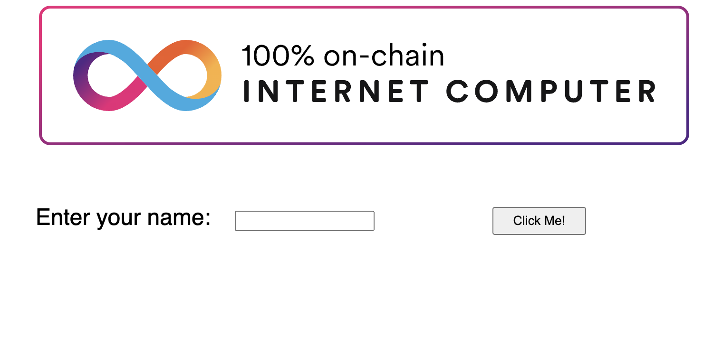
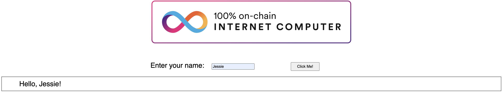

import { MarkdownChipRow } from "/src/components/Chip/MarkdownChipRow";
import { GlossaryTooltip } from "/src/components/Tooltip/GlossaryTooltip";

# Using the default frontend canister

<MarkdownChipRow labels={["Beginner", "Tutorial"]} />

## Overview

Dapps may have complex frontends that serve dynamic, interactive interfaces, or they can serve simple, static webpages such as HTML and CSS pages.

Assets can come in many forms, such as:

- CSS.

- JavaScript.

- React.

- HTML.

- Images, videos, or streaming content.

- User interfaces that combine CSS, HTML, React, or other frameworks together.

- Dynamic assets, such as dashboards that frequently update with real-time data.

- Point of sale interfaces.

When a dapp is deployed to ICP and has a frontend configured, the frontend assets will be displayed via a URL that contains the <GlossaryTooltip>canister</GlossaryTooltip>'s ID. For local deployments, canisters are accessible through local URLs such as `http://127.0.0.1:4943/?canisterId=<canister-id>`. The port `4943` is the default local deployment port, though this can be changed via the `dfx` configuration or using a `dfx` flag. [Learn more about custom local networks](/docs/current/developer-docs/developer-tools/cli-tools/advanced-dfx/networks-json).

For canisters deployed to the mainnet, the canister can be accessed in a web browser using the canister's ID followed by `.ic0.app` or `raw.ic0.app`. For example, the [playground](https://m7sm4-2iaaa-aaaab-qabra-cai.ic0.app/) is an application with a frontend user interface that can be used to deploy canisters in a temporary, sandbox environment. This dapp can be accessed via the URL `https://m7sm4-2iaaa-aaaab-qabra-cai.ic0.app/`.

The `raw.ic0.app` domain is used for canisters deployed to the mainnet, and provides a way to access the raw HTTP interface of that canister. For local deployments that want to simulate the behavior of the `raw.ic0.app` domain, you must implement a method in your canister that consumes an HTTP request and outputs an HTTP response.

By default, projects created with `dfx new` have the option to include a frontend canister that uses a template for one of several frontend frameworks. This guide illustrates using the default React template generated by `dfx new` and guides you through some basic modifications to customize the interface displayed.


### dfx v0.17.0 and newer

Projects created with `dfx` v0.17.0 and newer include the option to decide between:

- SvelteKit
- React
- Vue
- Vanilla JS
- No JS template
- No frontend canister

### dfx v0.16.1 and older

`dfx` versions v0.16.1 and older include a JavaScript template `index.js` and `webpack.config.js` file.

By default, the `index.js` file imports an agent that is located in the `src/declarations/project_frontend/` folder, where `project` is your project's name. This directory will be generated by `dfx` when you run `dfx deploy`, either locally or when deploying to the mainnet.

### Prerequisites

Before you start, verify that you have:

- [x] Node.js installed for frontend development and can install packages using `npm install` in your project. For information about installing Node for your local operating system and package manager, see the [Node](https://nodejs.org/en/) website.

- [x] Downloaded and installed [`dfx`](https://github.com/dfinity/sdk/releases/latest) version `0.17.0` or newer.

## Create a new project

To create a new project directory for your custom frontend dapp:

- #### Step 1: Open a terminal shell on your local computer.

- #### Step 2: Navigate to the directory you are using for your ICP projects, if you are using one. Otherwise, it is recommended to create a new working directory.

- #### Step 3: Check that you have `Node.js` installed locally by running the following commands:

```bash
which node
which npm
```

- #### Step 4:  Create a new project by running the following command:

```
dfx start --clean --background
dfx new custom_greeting
```

You will be prompted to select the language that your backend canister will use:

```
? Select a backend language: ›
❯ Motoko
  Rust
  TypeScript (Azle)
  Python (Kybra)
```

Then, select a frontend framework for your frontend canister. Select 'React':

```
  ? Select a frontend framework: ›
  SvelteKit
❯ React
  Vue
  Vanilla JS
  No JS template
  No frontend canister
```

Lastly, you can include extra features to be added to your project:

```
  ? Add extra features (space to select, enter to confirm) ›
⬚ Internet Identity
⬚ Bitcoin (Regtest)
⬚ Frontend tests
```

- #### Step 5:  Navigate into your project directory by running the following command:

```
cd custom_greeting
```

If you’ve never used React before, you might want to explore the [intro to React](https://reactjs.org/tutorial/tutorial.html) tutorial or the [React website](https://reactjs.org/) before editing the frontend code.

## Review the default configuration

Before you make any changes, let’s review the default frontend settings in the `dfx.json` configuration file for your project:

- #### Step 1: Open the `dfx.json` configuration file in a code editor.

- #### Step 2: Notice that the `canisters` key includes settings for a `custom_greeting_frontend` canister.

```json
{
  "canisters": {
    "custom_greeting_backend": {
      "main": "src/custom_greeting_backend/main.mo",
      "type": "motoko"
    },
    "custom_greeting_frontend": {
      "dependencies": [
        "custom_greeting_backend"
      ],
      "source": [
        "src/custom_greeting_frontend/dist"
      ],
      "type": "assets",
      "workspace": "custom_greeting_frontend"
    }
  },
  "defaults": {
    "build": {
      "args": "",
      "packtool": ""
    }
  },
  "output_env_file": ".env",
  "version": 1
}
```

Let’s take a look at the settings in this section.

- Frontend assets for your project are compiled into their own canister. In this case, a canister named `custom_greeting_frontend`.

- The `custom_greeting_frontend` canister has a default dependency on the `custom_greeting_backend` canister for the project.

- The `source` settings specify the paths to the `src` directory that is used for the static assets that will be included in your `custom_greeting_frontend` canister when you build your project. If you have CSS or JavaScript files, you would include them in this directory. After building the project, the assets are served from the `dist` directory.

- The `type` setting specifies that the `custom_greeting_frontend` should be deployed using the [asset canister](https://github.com/dfinity/sdk/tree/master/src/canisters/frontend/ic-frontend-canister), which comes with everything you need to host static assets on ICP.

## Review the default frontend files

For this guide, you are going to make calls to the default backend canister through a custom frontend. Before you make any changes, let’s take a look at the default frontend canister files.

- #### Step 1: View the contents of `src/custom_greeting_frontend/src/index.html`.

This template file is the default frontend entrypoint for the dapp. It contains standard HTML that imports the `/src/main.jsx` script that is used to serve the React application:

```html
<!DOCTYPE html>
<html lang="en">

<head>
  <meta charset="UTF-8" />
  <meta name="viewport" content="width=device-width" />
  <title>IC Hello Starter</title>
  <base href="/" />
  <link rel="icon" href="/favicon.ico" />
</head>

<body>
  <div id="root"></div>
  <script type="module" src="/src/main.jsx"></script>
</body>

</html>
```

- #### Step 2:  View the contents of `src/custom_greeting_frontend/src/main.jsx`.

```js
import React from 'react';
import ReactDOM from 'react-dom/client';
import App from './App';
import './index.scss';

ReactDOM.createRoot(document.getElementById('root')).render(
  <React.StrictMode>
    <App />
  </React.StrictMode>,
);
```

This file is imported into the `index.html` file and is used to render the App that is exported from the `App.jsx` file.

- #### Step 3:  View the contents of `src/custom_greeting_frontend/src/App.jsx`.

This file will contain the following piece of code:

```js
import { useState } from 'react';
import { custom_greeting_backend } from 'declarations/custom_greeting_backend';

function App() {
  const [greeting, setGreeting] = useState('');

  function handleSubmit(event) {
    event.preventDefault();
    const name = event.target.elements.name.value;
    custom_greeting_backend.greet(name).then((greeting) => {
      setGreeting(greeting);
    });
    return false;
  }

  return (
    <main>
      
      <br />
      <br />
      <form action="#" onSubmit={handleSubmit}>
        <label htmlFor="name">Enter your name: &nbsp;</label>
        <input id="name" alt="Name" type="text" />
        <button type="submit">Click Me!</button>
      </form>
      <section id="greeting">{greeting}</section>
    </main>
  );
}

export default App;
```

This code has the following components:

- An `import` statement points to an actor that will allow us to make calls to our `custom_greeting_backend` canister from `"../declarations"`.

- A function that handles the logic for calling the backend canister's `greeting` method when the button is pressed.

- Creates the components for the image file, input form, and clickable button.

- Returns the result of the `greeting` method along with the input from the submitted form.

## Deploy the dapp

- #### Step 1:  Check that you are still in the root directory for your project, if needed.

- #### Step 2:  Build and deploy your dapp by running the following command:

```
dfx deploy // Deploy locally
dfx deploy --network ic // Deploy to the mainnet
```

:::info
Deploying to the mainnet will cost [cycles](/docs/current/developer-docs/getting-started/cycles/overview).
:::

## View the frontend

You can now access the frontend for the default dapp by navigating to the frontend canister's generated URL.

- #### Step 1: To view the frontend locally, open a new tab or window of your terminal and run:

```
npm start
```

Then, open a browser and navigate to `http://localhost:4943`.

To view the frontend on the mainnet, navigate to the frontend canister URL returned when you ran `dfx deploy`, such as:

```
https://<canister-id>.ic0.app/
```

- #### Step 2: Verify that you are prompted to type a name.

For example:



- #### Step 3: Enter a name in the input field with the text you want to display, then click **Click Me!** to see the result.

For example:



## Revise the frontend and test your changes

After viewing the frontend, you might want to make some changes. To modify the frontend code:

- #### Step 1:  Open the `src/custom_greeting_frontend/src/App.jsx` file in a code editor to modify the application's style settings.

For example, you might want to add a placeholder for the input field or change the button text and styling by making changes such as:

```js
import { useState } from 'react';
import { custom_greeting_backend } from 'declarations/custom_greeting_backend';

function App() {
  const [greeting, setGreeting] = useState('');

  function handleSubmit(event) {
    event.preventDefault();
    const name = event.target.elements.name.value;
    custom_greeting_backend.greet(name).then((greeting) => {
      setGreeting(greeting);
    });
    return false;
  }

  return (
    <main>
      
      <br />
      <br />
      <form action="#" onSubmit={handleSubmit}>
        <label htmlFor="name">Enter your name: &nbsp;</label>
        <input id="name" placeholder="Type your name here" alt="Name" type="text" />
	<button type="submit"><strong>Click here</strong></button>
</form>
      <section id="greeting">{greeting}</section>
    </main>
  );
}

export default App;
```

- #### Step 2:  Save the file and view the updated page in your browser.

If viewing the changes locally, refresh the page, and the updates should be reflected in the browser.

If you deployed to the mainnet, you will need to run `dfx deploy` again to upgrade the canister and apply the changes.

For example:


## Next steps

You can change things such as font family, background color, button styling, and more through CSS stylesheets. [Learn how to customize the frontend with CSS](add-stylesheet.mdx).