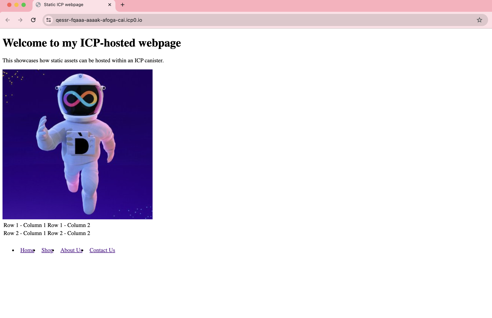

import { MarkdownChipRow } from "/src/components/Chip/MarkdownChipRow";

# Serving static assets

<MarkdownChipRow labels={["Intermediate", "Tutorial"]} />

## Overview

When a dapp is deployed to ICP and has a frontend configured, the frontend assets will be displayed via a URL that contains the canister's ID. For local deployments, canisters are accessible through local URLs such as `http://127.0.0.1:4943/?canisterId=<canister-id>`. The port `4943` is the default local deployment port, though this can be changed via the `dfx` configuration or using a `dfx` flag. [Learn more about custom local networks](/docs/current/developer-docs/developer-tools/cli-tools/advanced-dfx/networks-json).

For canisters deployed to the mainnet, the canister can be accessed in a web browser using the canister's ID followed by `.ic0.app` or `raw.ic0.app`. For example, the [playground](https://m7sm4-2iaaa-aaaab-qabra-cai.ic0.app/) is an application with a frontend user interface that can be used to deploy canisters in a temporary, sandbox environment. This dapp can be accessed via the URL `https://m7sm4-2iaaa-aaaab-qabra-cai.ic0.app/`.

The `raw.ic0.app` domain is used for canisters deployed to the mainnet, and provides a way to access the raw HTTP interface of that canister. For local deployments that want to simulate the behavior of the `raw.ic0.app` domain, you must implement a method in your canister that consumes an HTTP request and outputs an HTTP response.

Dapps may have complex frontends that serve dynamic, interactive interfaces, or they can serve simple, static webpages such as HTML and CSS pages. This guide will walk you through how to display static assets using a frontend canister.

## Types of assets

Assets can come in many forms, such as:

- CSS.

- JavaScript.

- React.

- HTML.

- Images, videos, or streaming content.

- User interfaces that combine CSS, HTML, React, or other frameworks together.

- Dynamic assets, such as dashboards that frequently update with real-time data.

- Point of sale interfaces.

This guide will focus on static assets using HTML and CSS. For more information on using other asset types, follow the [custom frontend](custom-frontend.mdx) guide or the [existing frontend](existing-frontend.mdx) guide.

## Configuring `dfx.json`

First, you will need a `dfx` project. One can be created using `dfx new` in the command line. [Learn more about `dfx` and `dfx new`](/docs/current/developer-docs/getting-started/hello-world).

Once you have a project, you can configure the frontend canister in the `dfx.json` file, such as:

```json
  "canisters": {
    "hello_world_frontend": {
      "source": [
        "src/hello_world_frontend/"
      ],
      "type": "assets",
      "workspace": "hello_world_frontend"
    },
 }
```

In this configuration, the canister named `hello_world_frontend` is configured to use the source files found in `src/hello_world_frontend/`, and is configured as `type: "assets"` to indicate that it is hosting assets.

The `src/hello_world_front/` folder contains the static assets that the canister is hosting. This file path can be changed to any of your project's subdirectories that contain your asset files. The most basic example of a static asset is an `index.html` webpage.

## Creating a static `index.html` page

In your project's asset subdirectory, create an `index.html` file that contains some HTML code, such as:

```html
<!DOCTYPE html>
<html>
<head>
<title>Static ICP webpage</title>
<meta charset="UTF-8">
<meta name="description" content="This is a static webpage hosted on ICP using a frontend canister.">
</head>
<body>
<h1>Welcome to my ICP-hosted webpage</h1>
<p>This showcases how static assets can be hosted within an ICP canister.</p>

<table>
<tr>
<td>Row 1 - Column 1</td>
<td>Row 1 - Column 2 </td>
</tr>
<tr>
<td>Row 2 - Column 1</td>
<td>Row 2 - Column 2</td>
</tr>
</table>
</body>
</html>
```

This snippet uses an image, `testpic.jpg`. You can replace this with any image asset stored in your asset subdirectory.

### Styling the page with CSS

To customize the visualization of HTML webpages, you can use CSS by editing your `index.html` file to include a style definition:

```html
<style>
    #nav {
        background: lightpurple;
        overflow: auto;
        }
    #nav li {
        float: left;
        padding: 10px;
        }
    #nav li:hover {
        background: gray;
        }
</style>
<ul id="nav">
<li><a href="">Home</a></li>
<li><a href="">Shop</a></li>
<li><a href="">About Us</a></li>
<li><a href="">Contact Us</a></li>
</ul>

```

## Deploy your webpage

Once your static website is ready to deploy, you can deploy it to the mainnet with the `dfx deploy --network ic` command.

:::caution

Deploying to the mainnet will cost [cycles](/docs/current/developer-docs/gas-cost).

:::


Once deployed, your webpage will be served at a URL such as:


```
Deployed canisters.
URLs:
  Frontend canister via browser
    hello_world_frontend: https://qessr-fqaaa-aaaak-afoga-cai.icp0.io/
```

Opening this webpage in a web browser will display your static website:



## Next steps

Here are some tutorials with example code for developing a frontend further:

- [Customize the frontend](./custom-frontend.mdx): a tutorial on building a React dapp.

- Using [Candid](/docs/current/motoko/main/getting-started/motoko-introduction) as a bare-bones interface to expose and test the functions in a canister.

- Using [raw HTML and JavaScript](/docs/current/motoko/main/getting-started/motoko-introduction) to display a simple HTML entry page.

- Using [React and compiled JavaScript](./custom-frontend.mdx) to embed HTML attributes and elements directly in a page.

- Using [React and TypeScript](./add-stylesheet.mdx) to import CSS properties from an external file.

- Deploying an [existing React application](./existing-frontend.mdx) as a frontend canister.