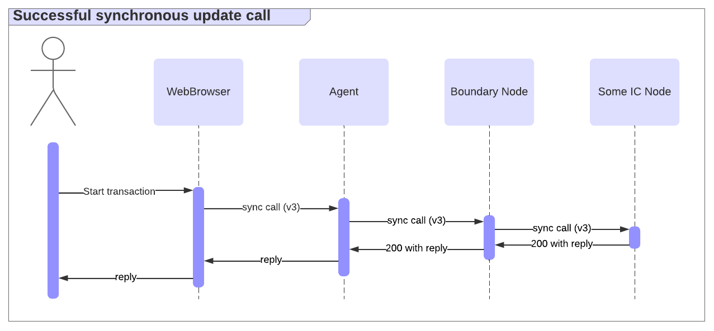
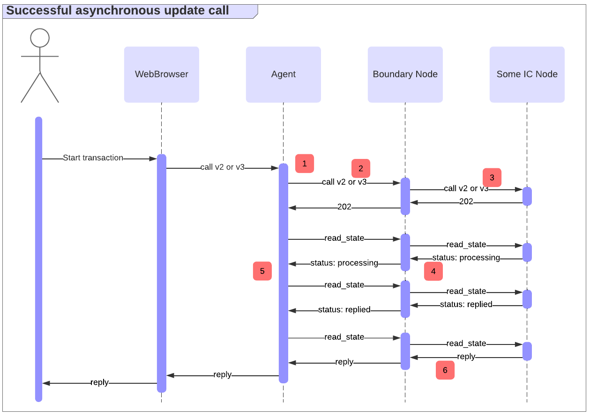

import { MarkdownChipRow } from "/src/components/Chip/MarkdownChipRow";

# Ingress Messages and Error Handling

<MarkdownChipRow labels={["Intermediate","Reference", "Security"]} />

## Overview

Ingress messages are requests to ICP canisters that are sent by external entities, such as users, usually through an [agent](/buidling-apps/interact-with-canisters/agents/overview) like [agent-js](https://github.com/dfinity/agent-js/tree/main) that runs within a web application, or [agent-rs](https://github.com/dfinity/agent-rs/tree/main) in a Rust application. See also the introductory pages on [query calls](/buidling-apps/interact-with-canisters/query-calls) and [update calls](/buidling-apps/interact-with-canisters/update-calls).

For example, you can browse what ingress messages can be sent to the ckBTC ledger by browsing through its [API using the dashboard](https://dashboard.internetcomputer.org/canister/mxzaz-hqaaa-aaaar-qaada-cai). The tool also allows you to send messages, using agent-js behind the scenes.

This page discusses ICP's ingress message APIs. While these APIs are defined in detail within the [HTTPS interface specification](/references/ic-interface-spec#http-interface), this page provides a more high-level and intuitive overview, with a special focus on error handling. That aspect is particularly important, as it can be tricky to determine if an ingress message has actually been successfully executed. Misinterpreting errors could lead to bugs such as double spending.

## Types of ingress messages

ICP supports several types of calls, as defined in the [HTTPS interface specification](/references/ic-interface-spec#http-interface). These include query and update calls.

## Query calls
Queries don't modify a canister's state and are answered and signed by a single replica. Responses can be obtained within milliseconds, but they are typically not signed by the subnet, meaning a malicious replica or boundary node could arbitrarily modify the response.

Some applications may have higher authenticity requirements for query responses. For example, if a dapp queries a proposal description that the user then votes on, it may not be acceptable that the result could be tampered with, as it could trick users to vote in the attacker's favor. As an alternative, you can issue query calls as update calls instead. While that's easy to implement, it makes the calls significantly slower.

Another alternative approach is to sign the data beforehand and provide *certified variables* (see [tutorial](/tutorials/developer-liftoff/level-3/3.3-certified-data), [security best practices](/buidling-apps/security/data-integrity-and-authenticity#certified-variables)) in query responses. While this approach has better performance than sending query calls as update calls, it can be complex to implement depending on the specific use case. An example where certified variables are used is within the [HTTP asset certification](/buidling-apps/security/data-integrity-and-authenticity#use-http-asset-certification-and-avoid-serving-your-dapp-through-rawicp0io).

Error handling for queries is typically simple: on error, one can simply retry until a successful response is received.

## Update calls
Updates can modify a canister's state and thus must go through consensus, typically taking 1-3 seconds. They return certified responses (signed by the subnet), providing authenticity within the subnet's corruption bounds.

Update calls can be [synchronous](/references/ic-interface-spec#http-sync-call-overview) or [asynchronous](/references/ic-interface-spec#http-async-call-overview).

A [synchronous `call`](/references/ic-interface-spec#http-call) follows the "call and await" pattern. In the success case, it maintains the HTTPS connection until a certified response is produced, as illustrated below.

Compared to the [asynchronous `call`](/references/ic-interface-spec#http-async-call) endpoint, where the [`read_state`](/references/ic-interface-spec#http-read-state) endpoint is used to poll for the request status and obtain the reply, the synchronous endpoint removes the need to poll for the response in the success case.

However, a response may not be produced until some implementation-specific timeout is reached. In that case, the synchronous endpoint behaves like the asynchronous one: it returns a `202` response, and the client must poll [`read_state`](/references/ic-interface-spec#http-read-state) to get the request status and eventually obtain the reply, as illustrated below.

### Update call errors and their implications

A number of errors could occur in the above flow. The following are examples of errors, indicated using the numbers in the diagram:
1. Due to misconfiguration, the agent might fail to successfully sign the update call and not even send it.
2. The call to the boundary node may fail, because, for example, the agent or the boundary node is offline and the call times out.
3. Calls (`call` or `read_state`) to the IC node may fail, due to possible reasons such as:
    1. The node is offline.
    2. An execution pre-processing error (status `200` in case of the async call) occurs.
    3. The node is incapable of handling the request (status `5xx`).
4. It could be that status responses are never received. For example, a malicious boundary node could block the status response. Thus, the agent would never see a [status like `received`, `processing`, etc.](/references/ic-interface-spec#state-tree-request-status) upon calling `read_state`.
5. The certificate in the `read_state` response could be invalid. For example, it could be malformed or have an invalid signature.
6. Finally, the call could be `rejected` (see [rejected status](/references/ic-interface-spec#state-tree-request-status) and [reject codes](/references/ic-interface-spec#reject-codes)).

When seeing errors 2-5, the call may still be successfully executed. For example, the users might lose network connectivity, or a malicious boundary node or replica could return an error but still successfully execute the request. Only if a `rejected` response is received along with a valid certificate, the subnet guarantees that the call hasn’t been executed and never will be.

Some operations, such as transfers, must not be executed multiple times. If a call was `rejected` as described above, it is safe to retry the operation. In all other error cases however, retrying can be risky because the call could still successfully execute, potentially leading to severe security vulnerabilities such as double spending.

In general, there are cases where it is impossible to determine if a call was successful. For example, suppose
* The client loses its connection until the request status has been removed from the state tree. (Recall that ICP will remove the request from the system state tree some time after ingress expiry.)
* There is no application specific way to tell if the call successfully executed. For example, the canister does not provide a way to find out if the call happened.

In this situation, it is indistinguishable if the call was successful, but all information has already been removed from the system state tree, or the call never made it into the state tree in the first place and hasn't been executed.

### Recommendations and best practices for secure update call handling

The best way to handle the aforementioned errors is to implement safe retries using idempotent calls. Idempotency and several patterns to achieve it are discussed in the [best practices on safe retries and idempotency](/buidling-apps/best-practices/idempotency).

It may not always be possible to make call endpoints idempotent. For example, an endpoint that is not under the developer’s control may simply not have this property. In this case, there is still a secure way to retry the calls by relying on built-in deduplication based on request ids, as we describe below. However, the guarantees in this case are weaker compared to using idempotent calls.

ICP provides a built-in deduplication feature. Namely, if two calls with identical [request id](/references/ic-interface-spec#request-ids) are made, the message is processed at most once. For two calls to have the same `request_id`, they must have the same values for all fields `request_type`, `sender`, `nonce`, `canister_id`, `method_name`, `arg` and **ingress_expiry**. This gives idempotency, but only until the [`ingress_expiry`](/references/ic-interface-spec#authentication) is reached, at which point the message expires and ICP [may remove the `request_id` from the system state tree](/references/ic-interface-spec#state-tree-request-status). This isn't an issue since the same request will not be accepted later, as it expired. Thus, such requests can be safely retried analogously to how it is done for [idempotent calls](/buidling-apps/best-practices/idempotency#idempotent-canister-apis), see the illustration on that page.

As ICP rejects `ingress_expiry` that is too far in the future, the time window for retrying is limited. To maximize the window, one can maximize `ingress_expiry` in this case and time out the retries after `ingress_expiry` as well.

In summary, there are two options for a client:
* _No retries, only poll `read_state`:_ Submit the `call` once, and poll `read_state` until at least one of the following conditions is met:
    * A certified response was produced. That is, the call status is `replied`, `rejected`, or `done`.
    * The subnet time exceeds`ingress_expiry`, and the call status is not `processing`.

  Evaluating the second condition may be hard if the subnet time and local time of the user differ.
* _Retry the call while polling `read_state`_ Do the same as above, but resubmit the initial `call` (same `request_id`) periodically (e.g. every `30s`) until at least one of the following conditions is met:
    * The call is known to the system. That is, the call status is `received`, `processing`, `replied`, `rejected`, or `done`.
    * `ingress_expiry` is reached.

  This can be beneficial because a call that didn’t make it is retried. For example, if the first call was dropped due to a network issue or by a malicious replica, a subsequent call could make it through e.g. if it is successfully routed to an honest replica.

At the time of writing, both agent-js (v2.1.3) and agent-rs (v0.39.1) don't retry `call`, so they follow the first option above. By default, both agent-rs and agent-js use `ingress_expiry` of four minutes and poll for five minutes. Additionally, agent-rs resets the timer to allow for an additional five minutes of polling whenever it observes a `received` or `processing` status.

Some time after expiry is reached, there is no way for the client to determine if the call was successful unless the canister’s API provides this information. In this case, the client can check the status of the call using application-specific APIs. There can be (hopefully uncommon) cases where the APIs don't allow checking this, in which case the client simply can’t tell if the message has been executed. Ideally, applications set expiry values such that under typical load timeouts are rare.