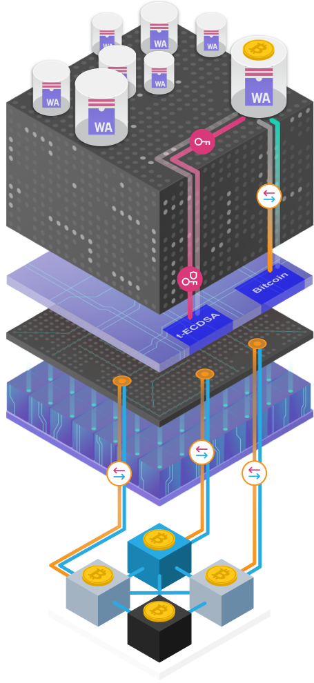

import { MarkdownChipRow } from "/src/components/Chip/MarkdownChipRow";

# Bitcoin integration

<MarkdownChipRow labels={["Reference"]} />

## Overview

The Bitcoin integration on the Internet Computer allows for direct and trustless interaction
with the Bitcoin network, enabling canister smart contracts to create Bitcoin
addresses and send and receive bitcoin directly. This opens up new possibilities
for decentralized applications and services, such as DeFi, that can leverage the
liquidity and security of Bitcoin without relying on centralized bridges, thereby
enhancing security and efficiency

Two advanced engineering challenges needed to be solve to enable Bitcoin smart contracts on ICP:
- A protocol-level integration of ICP with the Bitcoin network.
- A chain-key signatures based on a novel threshold ECDSA protocol.

This page provides a general overview of the Bitcoin integration technology. For a deeper technical explanation of ckBTC, please see the [wiki page](https://wiki.internetcomputer.org/wiki/Chain-key_Bitcoin).

## Protocol-level integration of ICP with the Bitcoin network

Through the protocol-level integration of ICP with the Bitcoin network, ICP can obtain Bitcoin blocks directly from the Bitcoin network and process the contained transactions. This integration makes it possible to maintain the full Bitcoin UTXO set on-chain on ICP. Canisters can run queries against the full Bitcoin UTXO set. This allows canisters to know about the held UTXOs, and thus balance, of any Bitcoin address, including their own addresses.

## Chain-key ECDSA signatures

Canisters themselves can have ECDSA keys using a novel chain-key ECDSA signature protocol suite for threshold ECDSA, and so can receive and hold Bitcoin. Canisters also can create Bitcoin transactions and submit them via the Bitcoin API to the Bitcoin network. They use the chain-key ECDSA functionality to request threshold ECDSA signatures to spend UTXOs in a transaction to be submitted to the Bitcoin network. Chain-key ECDSA signatures are a new member of ICP's chain-key cryptography toolbox of protocols. Chain-key ECDSA signatures are much more than just a threshold ECDSA implementation as they for example also comprise protocols for secure distributed key generation and key rotation, which are crucial from a systems perspective to make threshold signing secure and practically viable. Details regarding ICP's chain-key ECDSA signature protocol can be found on the corresponding documentation page [here](/docs/current/references/t-ecdsa-how-it-works/).

The protocol-level Bitcoin integration and chain-key ECDSA signature protocols each expose an API on the management canister. Those APIs are the system-level APIs engineers use to write Bitcoin smart contracts on ICP. The APIs are low-level APIs designed around the concepts of Bitcoin UTXOs and transactions and are non-trivial to use and require an in-depth understanding of how Bitcoin works. The chain-key ECDSA signature API is also generically useful for any ECDSA use case, e.g., integration with other blockchains such as Ethereum.

This page gives a high-level overview of the above mentioned technology behind the direct Bitcoin integration. For details, it is recommended to refer the reader to the [Bitcoin page on the Internet Computer wiki](https://wiki.internetcomputer.org/wiki/Bitcoin_integration) as well as the [threshold ECDSA documentation page](/docs/current/references/t-ecdsa-how-it-works/).

## Protocol-level integration of ICP with the Bitcoin network

The Internet Computer Protocol has been integrated with the Bitcoin protocol to obtain a direct technical integration between the two networks. This integration can be activated on any number of Internet Computer subnets. At the beginning, there will only be one dedicated Bitcoin-activated subnet and requests to the Bitcoin API from canisters on any subnet will be routed to this single Bitcoin-activated subnet using ICP's XNet communication capabilities. The integration serves two key purposes:

-   Obtaining the Bitcoin UTXO set and keeping it on chain in the replicated state of the Internet Computer to be able to answer queries for UTXO sets and balances of Bitcoin accounts issued by canisters.
-   Accepting signed Bitcoin transactions of canisters and submitting them to the Bitcoin network.

### Components

On a Bitcoin-activated subnet, a **BTC canister** (Bitcoin canister), implemented as a regular NNS-managed Wasm canister is made accessible to canisters via an API of the management canister, i.e, the interface is implemented as part of the replica. The BTC canister holds the on-chain Bitcoin-related state: the UTXO set, the most recent Bitcoin blocks to allow for fork resolution ("unstable blocks"), and outgoing transactions.

A **Bitcoin adapter** process at the networking layer connects to nodes of the Bitcoin network, much like a regular Bitcoin node does.

### Maintaining the Bitcoin UTXO set

The BTC canister and adapter are integrated and communicate with each other via ICP's protocol stack: The BTC canister requests successor blocks to the latest Bitcoin blocks it has received from the Bitcoin adapter. The adapter on each replica of the subnet obtains the requested blocks from the Bitcoin network and the adapter of a block-making replica provides a requested block to the Bitcoin canister through consensus. The Bitcoin canister processes blocks in that it validates the proof of work, extracts the block's transactions, extracts the UTXOs from the transactions, and updates the UTXO set maintained in replicated state to reflect the UTXOs consumed and the UTXOs created by the transactions. Both the UTXO set and a set of recent blocks not yet absorbed into the UTXO set (the unstable blocks) are used to respond to UTXO and balance requests.

Significant complexity of the implementation is in the area of securely resolving forks and protecting against various kinds of attacks. For example, in order to be able to resolve forks, the Bitcoin canister needs to maintain a certain number of Bitcoin blocks which are not yet absorbed into the maintained UTXO set, but UTXOs therein must be efficiently considered for calculating the UTXOs of a given address in addition to those in the UTXO set.

### Submitting transactions

Canisters can submit Bitcoin transactions to the Bitcoin canister using the corresponding management canister API. Doing so queues the transactions for being submitted to the Bitcoin network. In every subnet round, Adapters obtain the pending transactions from the Bitcoin canister and queue them for being submitted asynchronously to the Bitcoin network. This leads to an efficient and quick distribution of transactions in the Bitcoin network as every replica of the subnet submits transactions via multiple connected nodes of the Bitcoin network.

## Chain-key ECDSA signatures: a novel threshold ECDSA protocol suite

Chain-key signatures are realized with a novel threshold ECDSA protocol suite, i.e., an implementation of the ECDSA signature protocol using threshold cryptography. In a threshold ECDSA protocol, the private ECDSA key is secret shared between multiple parties and only an eligible quorum of the parties can generate a signature using their respective private key shares. The private key never exists in reconstructed form, but only in its secret-shared form. Key generation generates private key shares for the parties. But chain-key signing comprises much more than just the threshold ECDSA protocol, e.g., cryptographic multi-party computation protocols for secure threshold key generation and periodic key resharing for hardening the overall security.

The ECDSA chain-key signing protocol currently implemented uses a single master private key from which keys for canisters can be derived using BIP-32-like key derivation. Each canister has one such root key derived using the canister id and an arbitrary number of additional canister keys can be derived using a backward-compatible extension of BIP-32.

ECDSA chain-key signing is deployed on one signing subnet of the Internet Computer initially that will answer signing requests of canisters. The signing subnet enforces that only the canister that controls a key may request signatures with this key. All API calls made by canisters need to go through XNet traffic to reach the ECDSA subnet and thus incur the related extra latency accordingly to obtain a signature.

Canisters can query their own or other canisters' public keys, including further derived public keys of canisters. Canisters can request signatures with private keys they control, i.e., their root private key and derived private keys. For requests of public keys or signatures with derived keys, a derivation path can be specified in the respective API or the derivation can be done using BIP-32. You can find more details on the [ECDSA chain-key signatures page](/docs/current/references/t-ecdsa-how-it-works/).

## Deployment architecture

The Bitcoin functionality will be activated on a single subnet of ICP and API calls from canisters to the Bitcoin API are routed via XNet communication, thus some extra latency is incurred. The Bitcoin canister may, if needed, in the future be additionally activated on some (application) subnets to avoid the additional XNet latency and to be able to respond to more requests per time unit.

Threshold ECDSA requests will equally be answered by a single active signing subnet, another subnet will back up the private key in secret-shared form for disaster recovery.

## Development, pre-production, and production environment

The Bitcoin functionality including ECDSA chain-key signatures is available in all stages required for the development life cycle on ICP:
-   The **IC SDK** for local development of canisters.
-   ICP support as the pre-production environment for final testing on **Bitcoin testnet**.
-   ICP support as the production environment for the release using the **Bitcoin mainnet**.

### Local SDK

In the typical canister development workflow, canisters on ICP are compiled and run in the local environment using the [IC SDK](/docs/current/developer-docs/getting-started/install/) during their development. Thus, IC SDK is the first stage, or environment, of the development workflow. The IC SDK has been enabled to support both the Bitcoin integration and threshold ECDSA management canister APIs.

In contrast to ICP deployments of the feature, which integrate with Bitcoin Testnet and Bitcoin Mainnet, respectively, the SDK integrates with a locally-running `bitcoind` node in regression testing (regtest) mode. Using `bitcoind` in regtest mode is the preferred way for Bitcoin development. To facilitate our developers as best as possible, the Internet Computer has integrated IC SDK with `bitcoind` in regtest mode to bring the best Bitcoin development experience to ICP. Both development and automated testing of smart contracts are first done in the local environment with this setup.

The Bitcoin adapter of the single replica running the local SDK environment connects to the local `bitcoind` node instead of multiple nodes of Bitcoin Testnet or Mainnet. To see the relevant flags on dfx, please look at the output of `dfx start --help`.

### Bitcoin testnet on ICP

Once a smart contract is ready for acceptance testing, it is deployed on the mainnet (recall, there is no public ICP testnet), still using the Bitcoin API set to connect to the Bitcoin testnet. This is the same setting as used in local development. This setup is used to perform the acceptance testing of the dapp, using the Bitcoin testnet and a test chain-key ECDSA key, i.e., no real value is at stake.

### Bitcoin mainnet on ICP

The final stage of development of a Bitcoin smart contract is its deployment on ICP with the Bitcoin API set to use Bitcoin Mainnet. This is the final production environment for the smart contract and is now available.

## API fees &  pricing

The costs of API calls in cycles and USD for the Bitcoin Testnet and Bitcoin Mainnet APIs is presented in the following tables. As a general principle for the Bitcoin API, some API calls must have a minimum amount of cycles attached to the call as indicated in the column *Minimum cycles to send with call*. Cycles not consumed by the call are returned to the caller. Requiring a relatively large minimum number of cycles makes it possible to change the pricing of API calls without breaking existing smart contracts when the Bitcoin subnet grows in terms of replication factor in the future. The call for submitting a Bitcoin transaction to the Bitcoin network does not require extra cycles to be attached as the charged cost is independent of the replication factor of the subnet.

The cost per API call in USD uses the USD/XDR exchange rate of November 23, 2022.

### Bitcoin Testnet

| Transaction                          | Description                                                                                                    | Price (Cycles) | Price (USD) | Minimum cycles to send with call |
|--------------------------------------|----------------------------------------------------------------------------------------------------------------|-----------------------------|-----------------------------|------------------|
| Bitcoin UTXO set for an address      | For retrieving the UTXO set for a Bitcoin address (`bitcoin_get_utxos`)                                        | 20_000_000 + 0.4 cycles per Wasm instruction | $0.00002617720 + Wasm instruction cost | 4_000_000_000 |
| Bitcoin fee percentiles              | For obtaining the fee percentiles of the most recent transactions (`bitcoin_get_current_fee_percentiles`)       | 4_000_000                 | $0.00000523544                    | 40_000_000 |
| Bitcoin balance for an address       | For retrieving the balance of a given Bitcoin address (`bitcoin_get_balance`)                                  | 4_000_000                 | $0.00000523544                    | 40_000_000 |
| Bitcoin transaction submission       | For submitting a Bitcoin transaction to the Bitcoin network, per transaction (`bitcoin_send_transaction`)      | 2_000_000_000             | $0.00261772000                    | n.a.       |
| Bitcoin transaction payload          | For submitting a Bitcoin transaction to the Bitcoin network, per byte of payload (`bitcoin_send_transaction`)  | 8_000_000                 | $0.00001047088                    | n.a.       |

### Bitcoin Mainnet

| Transaction                          | Description                                                                                                    | Price (Cycles) | Price (USD) | Minimum cycles to send with call |
|--------------------------------------|----------------------------------------------------------------------------------------------------------------|-----------------------------|-----------------------------|------------------|
| Bitcoin UTXO set for an address      | For retrieving the UTXO set for a Bitcoin address (`bitcoin_get_utxos`)                                        | 50_000_000 + 1 cycle per Wasm instruction | $0.00006544300 + Wasm instruction cost | 10_000_000_000 |
| Bitcoin fee percentiles              | For obtaining the fee percentiles of the most recent transactions (`bitcoin_get_current_fee_percentiles`)       | 10_000_000                 | $0.00001308860 | 100_000_000 |
| Bitcoin balance for an address       | For retrieving the balance of a given Bitcoin address (`bitcoin_get_balance`)                                  | 10_000_000                 | $0.00001308860                    | 100_000_000 |
| Bitcoin transaction submission       | For submitting a Bitcoin transaction to the Bitcoin network, per transaction (`bitcoin_send_transaction`)      | 5_000_000_000             | $0.00654430000                    | n.a.       |
| Bitcoin transaction payload          | For submitting a Bitcoin transaction to the Bitcoin network, per byte of payload (`bitcoin_send_transaction`)  | 20_000_000                 | $0.00002617720                    | n.a.       |

:::note
Note that the `bitcoin_get_utxos` call is charged through a baseline fee that amortizes part of the Bitcoin block processing and the cycles cost of the actually-used Wasm instructions. This is the fairest way of charging because a flat fee would be less fair for requests returning a small number of UTXOs, while a fee scaling with the number of UTXOs is hard to define in a clean way. A few informal test measurement have yielded Wasm execution fees anywhere in the range from less than 200K to more than 1,000K cycles per returned UTXO and in addition 30M-50M cycles for processing of the unstable blocks. This wide variance per UTXO was the reason to not use a charging approach based on the number of UTXOs returned, but it should give you a rough indication of what to expect to pay in terms of fees. For queries with a small number of UTXOs, you can expect around 100M cycles as fee to be deducted from the provided cycles on the call for a majority of calls.
:::

## Resources

To start building your own apps with Bitcoin see the following tutorials:

- [Deploying your first Bitcoin dapp](https://github.com/dfinity/examples/tree/master/motoko/basic_bitcoin).

- [Local development](/docs/current/developer-docs/multi-chain/bitcoin/using-btc/local-development).
