import { MarkdownChipRow } from "/src/components/Chip/MarkdownChipRow";
import { GlossaryTooltip } from "/src/components/Tooltip/GlossaryTooltip";

# Using the dashboard

<MarkdownChipRow labels={["Beginner", "Concept"]} />

## Overview

The ICP dashboard is a graphical user interface that can be used to obtain detailed data about the ICP network architecture, canisters deployed on the network, tokenomics and token transactions, and information about each active SNS. Data displayed by the dashboard can also be obtained through one of several [data APIs](dashboard-apis.mdx). This page will detail using the graphic user interface to obtain different data.

## Home

From the ICP dashboard home, you can view data that gives you a high-level overview of the entire network.

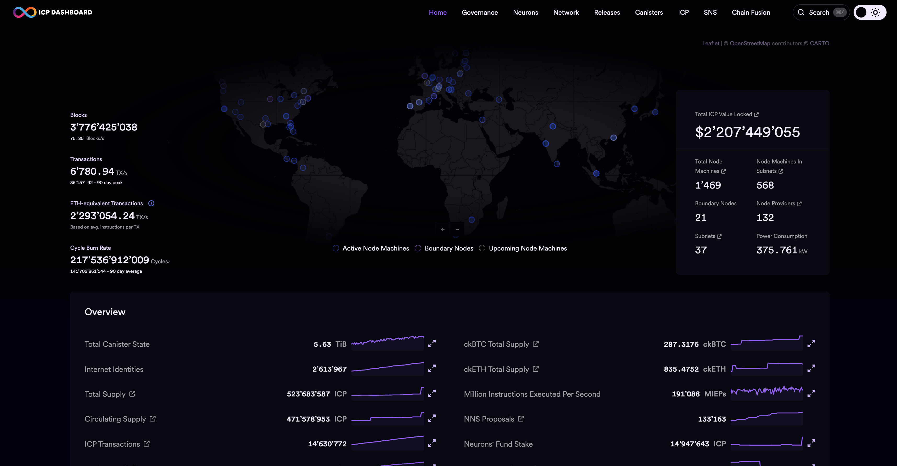

Data shown on the homepage includes:

- A network map showing the geographic location of the network's nodes and boundary nodes.

- Number of node machines, boundary nodes, node providers, and subnets.

- Network power consumption.

- Real-time data for current transactions per second, blocks per second, and cycle burn rate.

- Number of canisters deployed and current collective size of canister state.

- Number of Internet Identities.

- Total ICP supply.

- Total ICP circulating supply.

- ICP transactions.

- Total ICP burned.

- ckBTC and ckETH total supply.

- Million instructions executed per second.

- Total number of NNS proposals.

- Total ICP staked in the Neurons' fund.

- Maturity of the Neurons' fund.

- Block finalization rate.

- Cycles conversion rate.

To view detailed information about different components of ICP, click on an embedded link on the homepage or navigate to a different page using the navigation menu.

## Governance

The [governance dashboard page](https://dashboard.internetcomputer.org/governance) displays detailed information about the Network Nervous System (NNS) that governs the network.

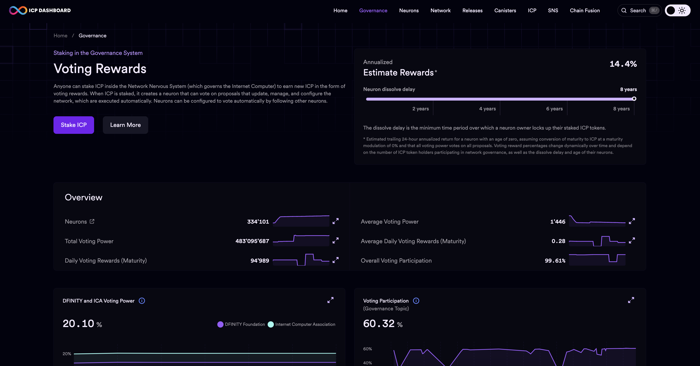

From this page, you can learn more about:

- Number of neurons.

- Total voting power.

- Total daily voting rewards.

- Average voting power per neuron.

- Average daily voting rewards.

- Overall voting participation.

- Maturity modulation.

- NNS proposals.

### Voting rewards calculator

The governance page includes a voting rewards calculator that can be used to estimate the potential annualized return for a neuron. To use the calculator, slide the bar to input a different dissolve delay value. The minimum dissolve delay is 6 months, and the maximum is 8 years.

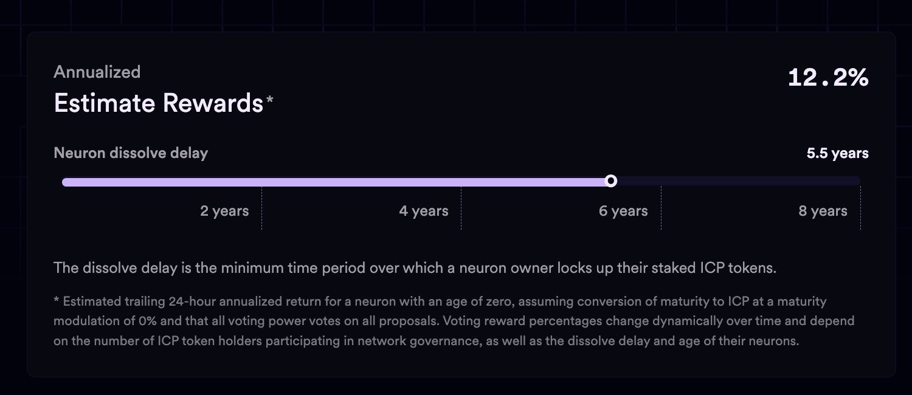

### NNS proposals

The governance page will include a high-level overview of recent proposals, including their title, topic, status, and total number of votes. To view details about a specific proposal, click on the proposal's ID.

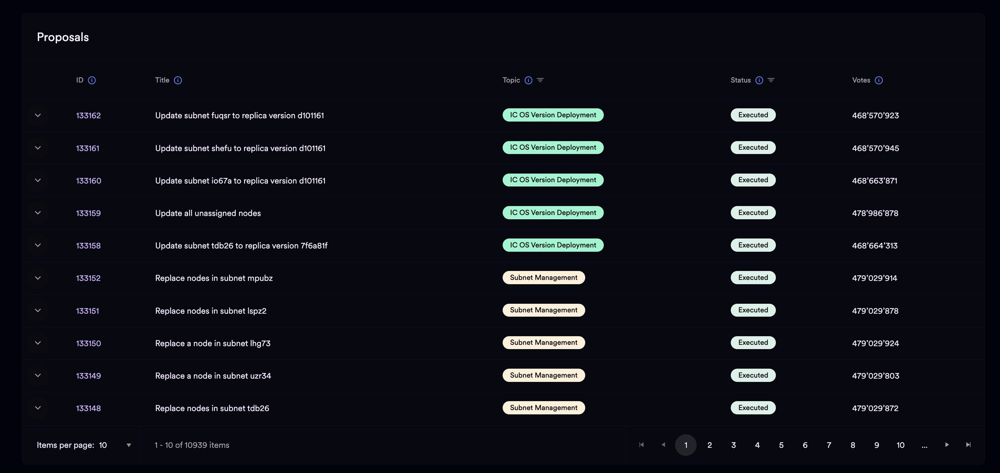

Details of the proposal will include the proposal's summary, payload, date created, date executed, voting results, a list of the Known Neurons that voted, and a link to view the proposal on the NNS dapp.

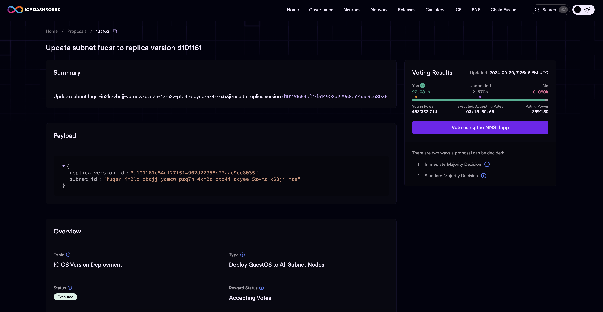

## Neurons

The [neurons dashboard page](https://dashboard.internetcomputer.org/neurons) displays information about neurons currently staked on the network. ICP token holders can stake ICP into a neuron to receive voting power in the NNS. [Learn more about neurons](/docs/current/developer-docs/daos/nns/concepts/neurons/neuron-overview).

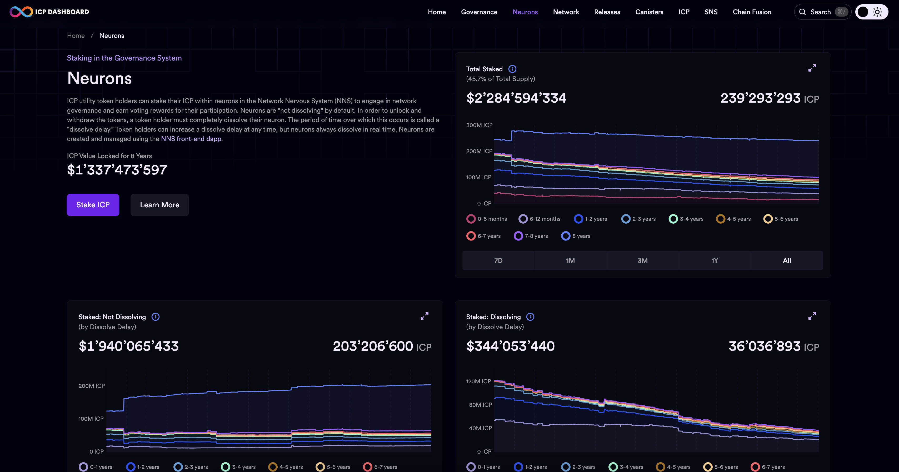

Information on this page includes the total amount of ICP staked in all neurons, then includes separate graphs for the total amount staked in neurons that are not dissolving and the total amount staked in neurons that are dissolving. This page also provides an overview of all neurons, including their ID and name, state, voting power, and dissolve delay. To view detailed information on a neuron, click on its neuron ID from the overview.

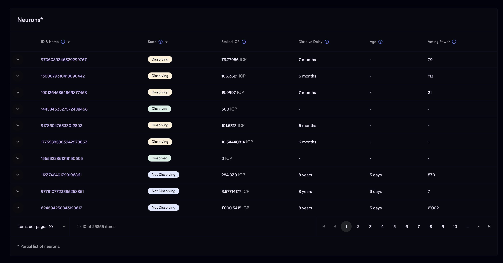

Neuron details include:

- Voting history.

- Staked ICP.

- State.

- Age.

- Dissolve delay date.

- Dissolve delay bonus.

- Age bonus.

- If the neuron is a Genesis neuron.

- If the neuron is part of the Neurons' fund.

- Voting power.

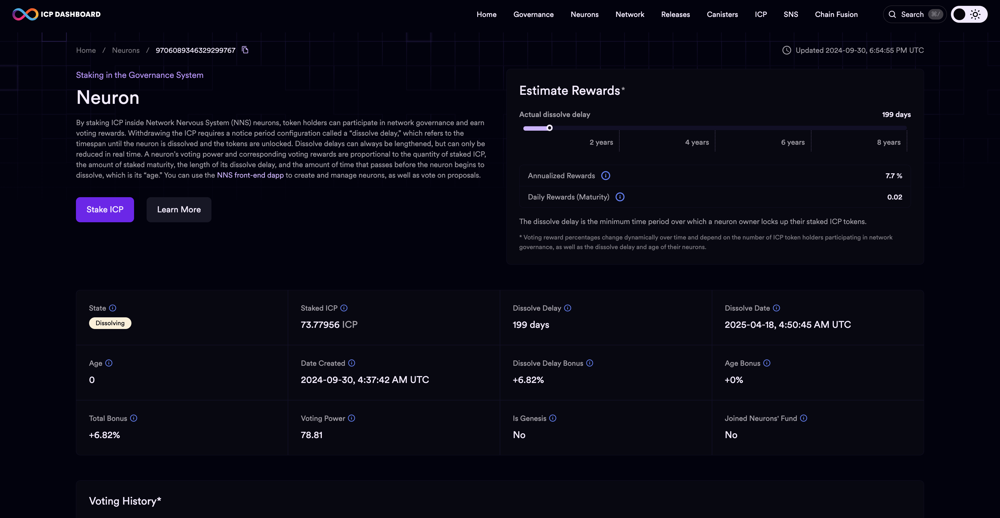

## SNS

The 'SNS' tab on the dashboard allows you to view information about each of the Service Nervous Systems (SNSs) deployed on ICP. An SNS is a DAO deployed on ICP that uses the same architecture as the NNS. [Learn more about SNSs](/docs/current/developer-docs/daos/sns/overview). Select an SNS from the menu to view details about that DAO.

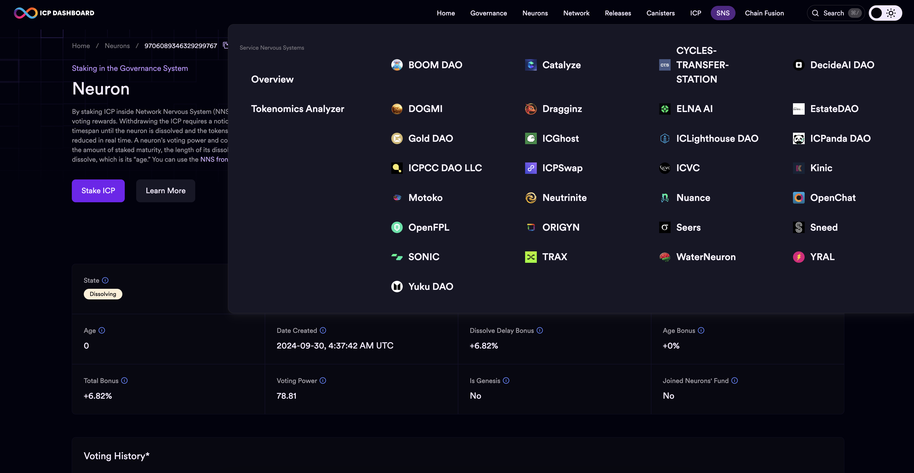

Details displayed about the SNS will include:

- SNS status.

- Token name.

- Token symbol.

- Total token supply.

- Transaction fee.

- Initial voting period.

- Max voting period.

- Proposal rejection cost.

- Minimum neuron stake.

- Minimum dissolve delay.

- Minimum dissolve delay bonus.

- Maximum dissolve delay.

- Maximum age and age bonus.

- Reward rate.

- ICP treasury.

- SNS token treasury.

- The SNS's canisters.

- The SNS's proposals.

- Transactions for the SNS's token.

- The SNS's neurons.

## SNS tokenomics analyzer

The [SNS tokenomics analyzer](https://dashboard.internetcomputer.org/sns/tokenomics) page can be used to evaluate an existing SNS's tokenomics or the proposed tokenomics of a new SNS. To run the analysis, select a data source such as an NNS proposal to create a new SNS, a file stored on GitHub that details an SNS's tokenomics, or upload a locally stored `.yaml` file that contains the necessary information.

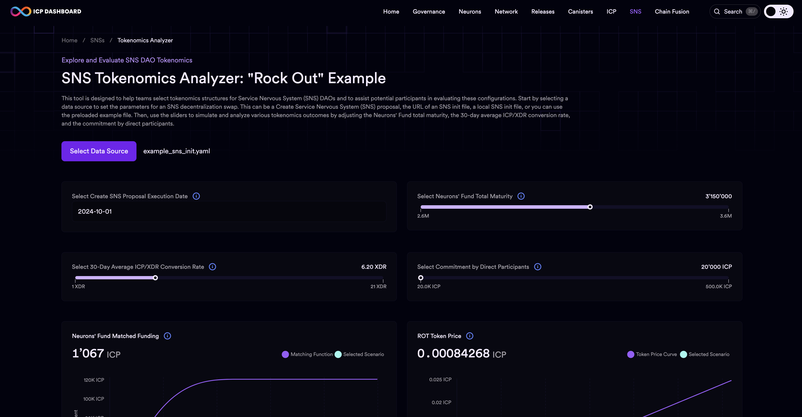

You can adjust the analysis settings, including the SNS's Neurons' Fund maturity, average ICP/CDR conversion rate, and the amount of commitment by direct participants in the SNS decentralization swap. These factors will influence the SNS's projected token price, overall commitment, and total valuation.

## Data centers

The [data centers](https://dashboard.internetcomputer.org/centers) dashboard page provides information on each data center that hosts subnets and nodes that participate in the ICP network. A high level overview of each data center is listed, including the data center's name, owner, coordinates, region, and the number of subnets and nodes that are hosted within that data center.

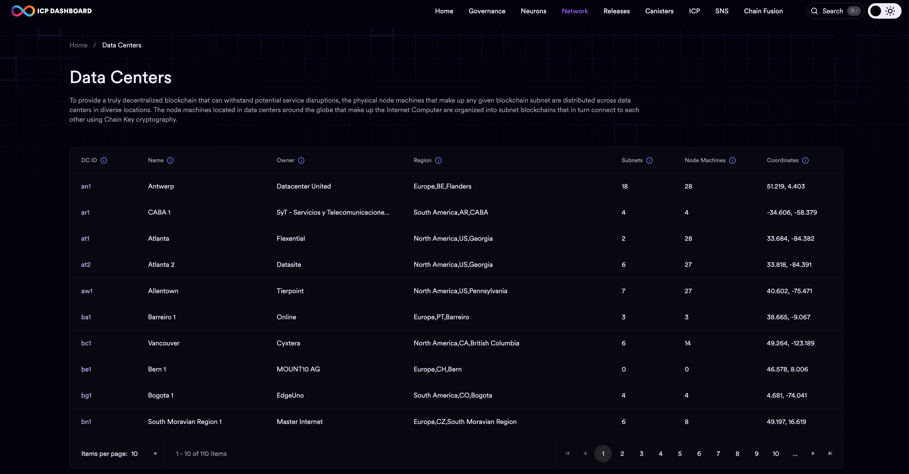

For more detailed information about a specific data center, click on the data center's ID (DC ID).

The detailed view will show the same information as the overview shown on the previous page, but also includes a list of every subnet and node machine within the data center.

## Subnets

The [subnets](https://dashboard.internetcomputer.org/subnets) overview page displays data for each subnet that is part of the network. Data on this page includes the subnet ID, type, number of node machines in the subnet, and number of canisters running on the subnet.

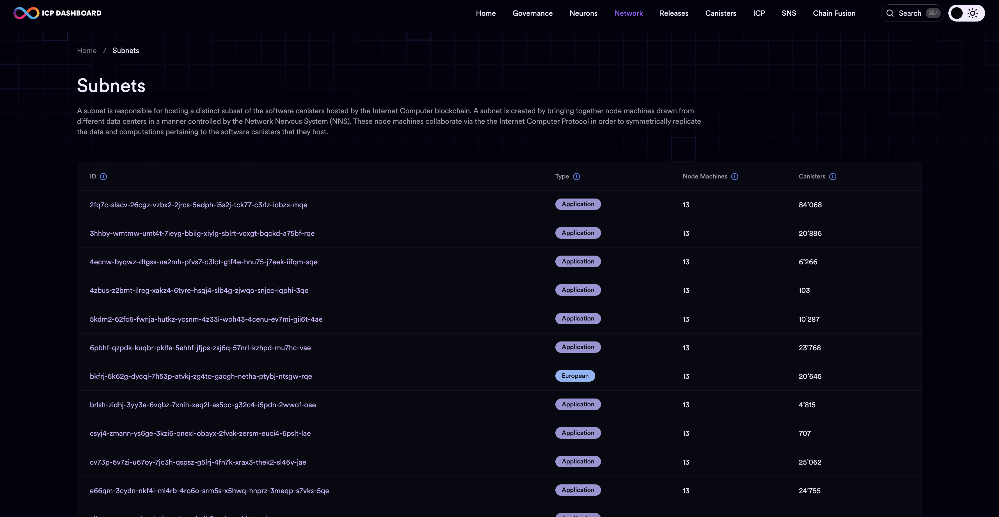

To view detailed information about a subnet, click on the subnet ID.

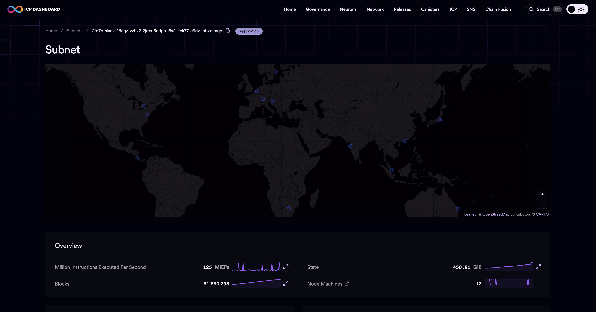

Details about the subnet will include the subnet's transactions per second, finalization rate, cycles burn rate, IDs of the nodes and canisters on the subnet, and it will show a geographic map that displays the location of each node that is part of the subnet.

## Node providers

The dashboard [node providers](https://dashboard.internetcomputer.org/providers) section provides a table that details each registered node provider on the network, including:

- Their name.

- Principal ID.

- The number of node machines that they operate.

- The number of subnets that those nodes participate in.

- The number of geographic locations (data centers) that those nodes are spread between.

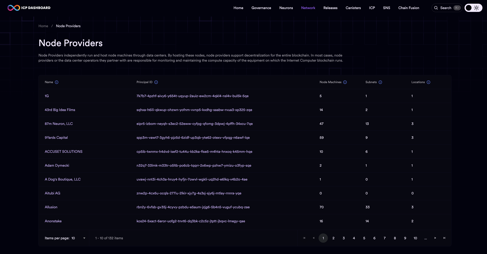

To view detailed information about a node provider, click on the node provider's name.

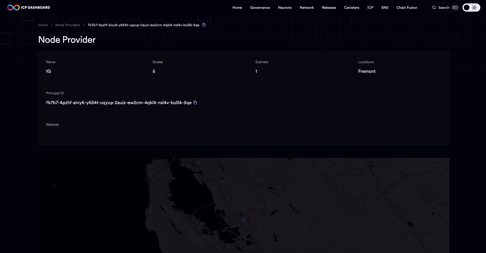

Additional information about the node provider on this page includes details about each node machine run by the node provider, such as the node machine's ID, location, data center owner, subnet ID, node type, and status.

## Node machines

The [node machines dashboard](https://dashboard.internetcomputer.org/nodes) displays information about every node machine that is part of the network, whether it is currently running or not. Node overview information includes:

- The node's ID.

- Provider.

- Location.

- Data center owner

- Status.

- Subnet ID.

- The type of node.

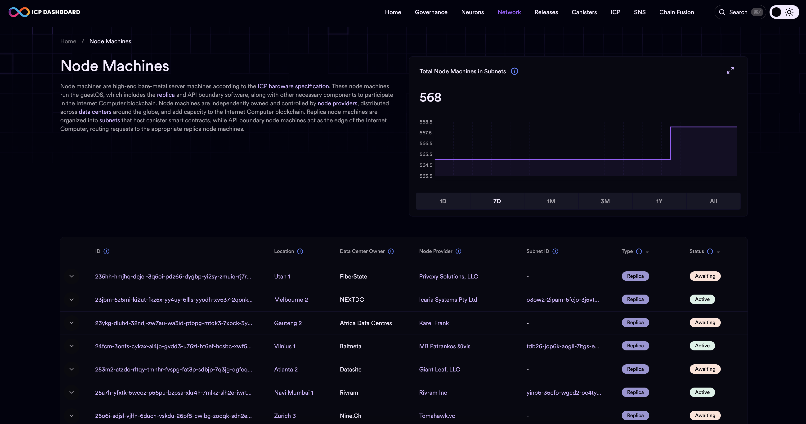

To view detailed information about a specific node, click on the node's ID.

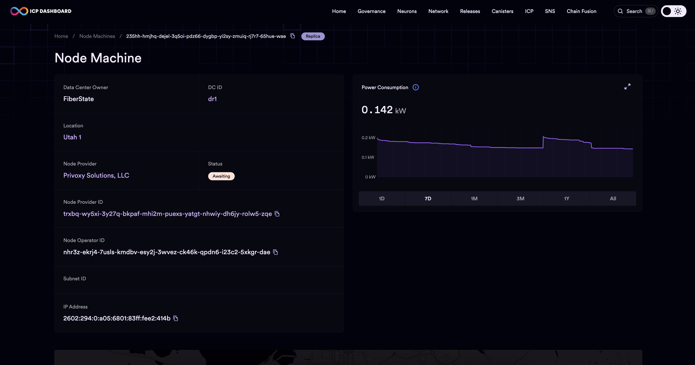

Additional details shown in the node machine's page will include its power consumption, node operator ID, and IP address.

## Replica releases

The dashboard's [releases](https://dashboard.internetcomputer.org/releases) page refers to the release of the ICP replica software, which runs on each node machine on the network. Details about each release of the replica software can be viewed on this page, including information about all past releases, change logs for each, and instructions on how to build and verify the latest release.

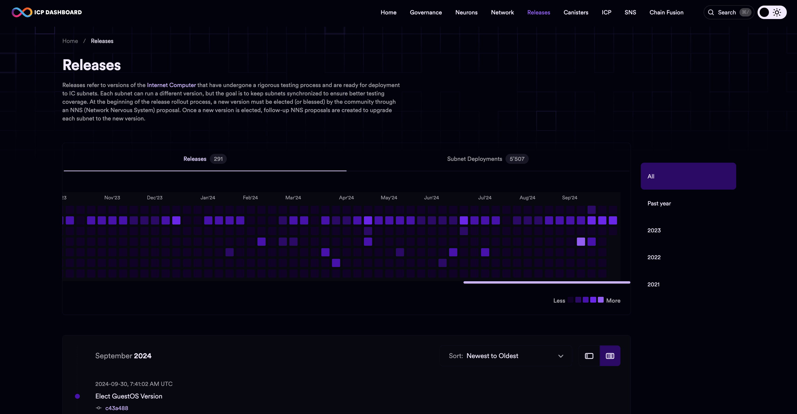

## Canisters

The [canister dashboard](https://dashboard.internetcomputer.org/canisters) provides a list of every canister running on ICP. It shows the canister's ID, the canister's controller principals, and the subnet ID that the canister is deployed on.

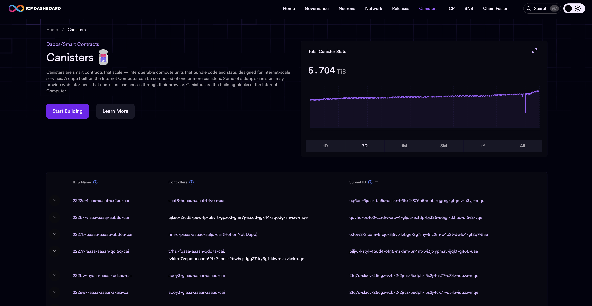

To view detailed information about a canister, click on the canister ID.

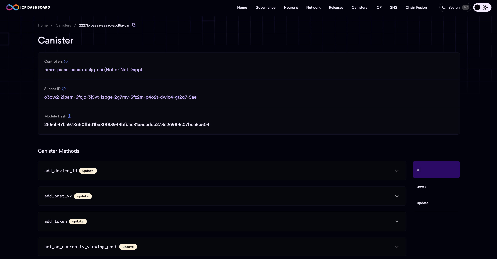

Additional details about the canister will include the canister's controllers, subnet ID, and Wasm module hash, and it will display the canister's public methods if it has any. If there is a specific canister you want to view this information about, you can use the URL `https://dashboard.internetcomputer.org/canister/CANISTER_ID`.

## ICP transactions

To view all token transactions for the ICP token, navigate to the [ICP transactions dashboard page](https://dashboard.internetcomputer.org/transactions). The chart on this page shows each ICP transaction, the transaction hash, the ICP amount, timestamp, type of transaction, and the to and from accounts involved in the transaction.

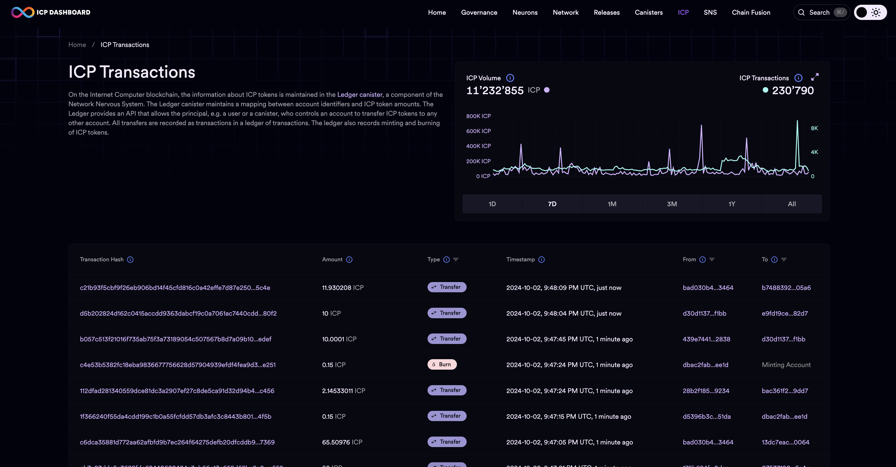

To view additional details about a transaction, click on the transaction hash.

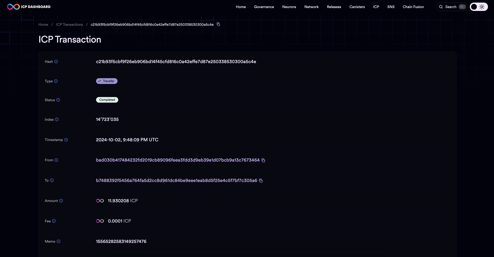

Additional details on this page include the transaction fee, spender account, transaction memo, status, and transaction index.

## Circulation

The [circulation page](https://dashboard.internetcomputer.org/circulation) displays metrics regarding ICP tokenomics, including the total ICP supply, voting rewards, disbursed voting rewards, undisbursed voting rewards, node provider rewards, and total ICP burned.

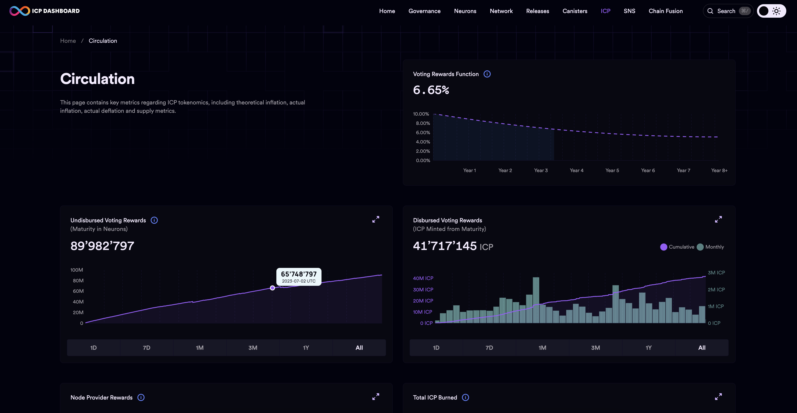

## Chain Fusion

The 'Chain Fusion' tab displays all chain-key tokens, including 'testnet' tokens that are not live on the ICP mainnet. To view details about a token, select it from the 'Chain Fusion' menu.

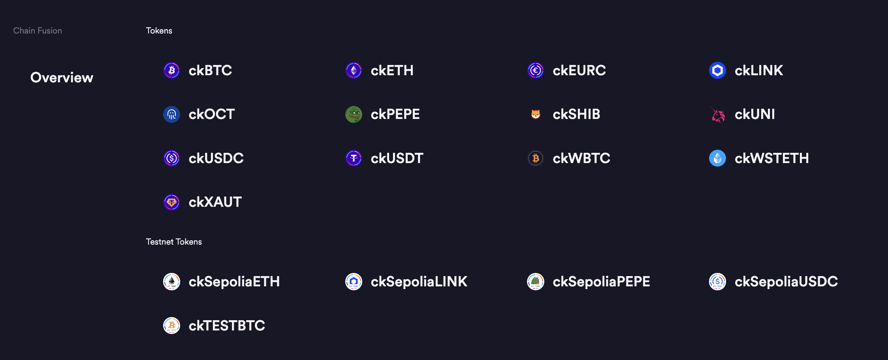

The detail page for a chain-key token will include a description of the token, the total supply, the canisters that facilitate the token's transfers on ICP, such as the archive, ledger, index, and minter canisters, and the token's transaction history.

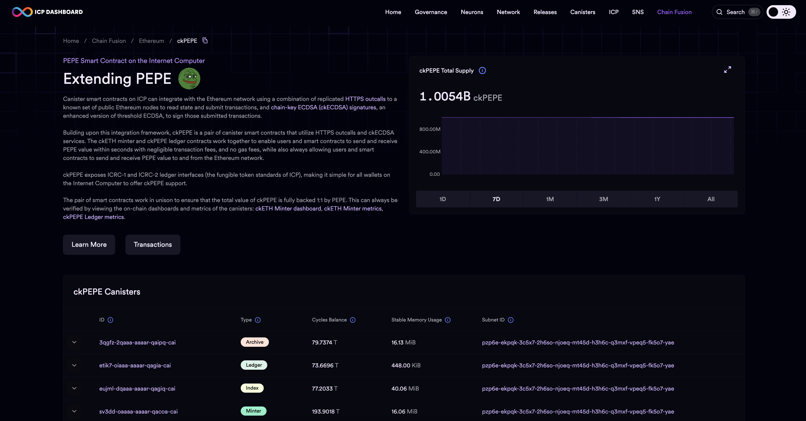

## Bitcoin

The [Bitcoin dashboard page](https://dashboard.internetcomputer.org/bitcoin) provides details about the ICP integration with Bitcoin and the chain-key token ckBTC. Details on this page include:

- ckBTC total supply.

- Tracked Bitcoin UTXOs.

- Bitcoin canister stable memory usage.

- Synced Bitcoin block height.

- ckBTC canisters, including the index, archive, ledger, and KYC canisters.

- ckBTC transactions.

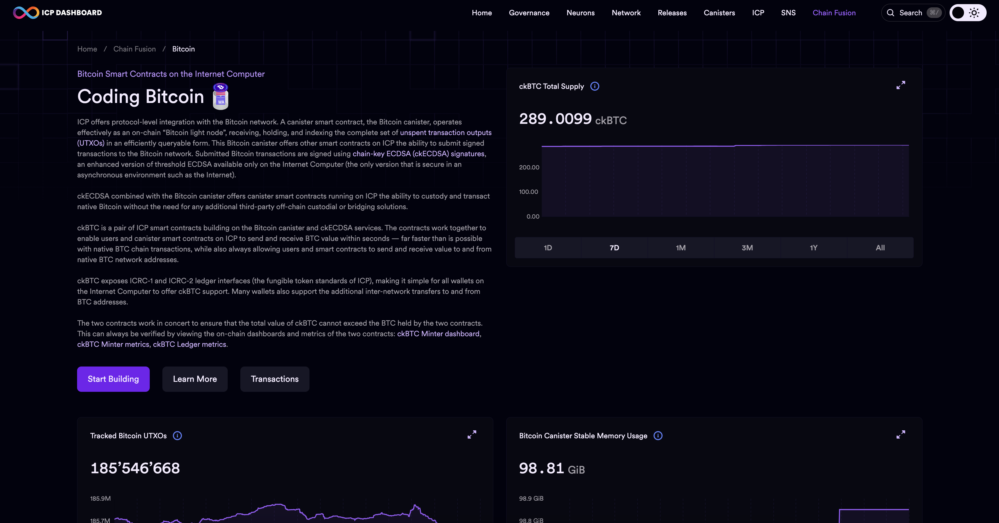

## Ethereum

The [Ethereum dashboard page](https://dashboard.internetcomputer.org/bitcoin) provides details about the ICP integration with Ethereum and the chain-key token ckETH. Details on this page include the ckETH total supply, ckETH canisters, including the index, archive, and ledger, and ckETH transactions.

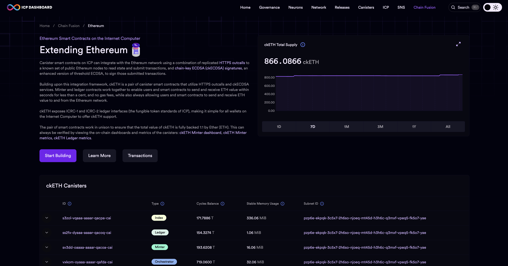

## Using the dashboard search

To find specific information, such as a transaction hash, account, canister ID, or proposal ID, select 'Search' and insert the value you'd like to search for. To refine the search, you can select which type of value you're looking for, such as 'canister':

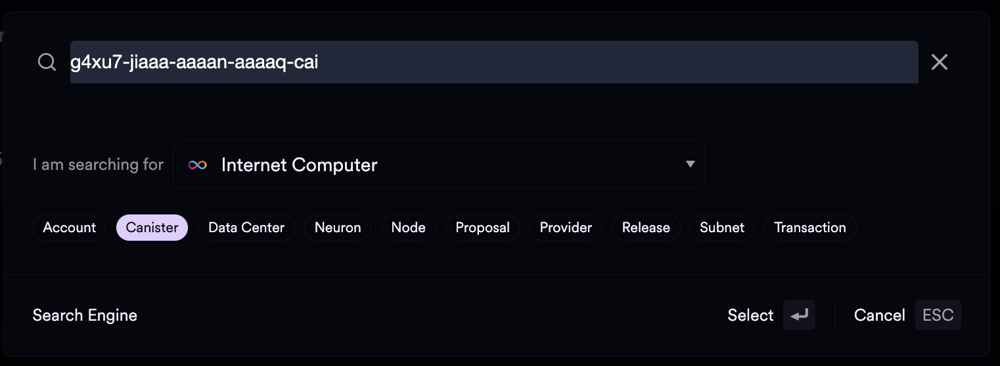