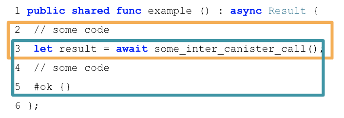
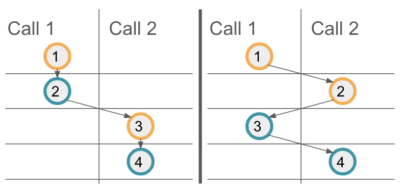

import { MarkdownChipRow } from "/src/components/Chip/MarkdownChipRow";

# Properties of message executions on ICP

<MarkdownChipRow labels={["Intermediate", "Reference", "Security"]} />

## Asynchronous messaging model

ICP relies on an asynchronous messaging model. Compared to synchronous messaging like on Ethereum, this provides performance advantages because multiple calls can be executed concurrently — and also in parallel, when multiple canisters are involved. However, asynchronous message execution can also lead to sometimes unexpected or unintuitive behavior. Therefore, it is important to understand the properties of message execution. Potential security issues that arise in this model, such as reentrancy bugs, are discussed in the [security best practices on inter-canister calls](/docs/building-apps/security/inter-canister-calls).

The [community conversation on security best practices](https://www.youtube.com/watch?v=PneRzDmf_Xw&list=PLuhDt1vhGcrez-f3I0_hvbwGZHZzkZ7Ng&index=2&t=4s) also discusses the messaging properties.

## Message execution properties

To interact with a canister's methods, there are two primary types of **entry points** or **methods** that can be called, update and query methods. If the Rust CDK is used, these are usually annotated with `#[update]` or `#[query]`, respectively. In Motoko, updates are declared as `public func`, and queries use the dedicated keyword: `public query func`.

These entry points can be called either by external users through the IC's HTTP interface, or by other canisters. ICP also supports additional [entry points](/references/ic-interface-spec.md#entry-points) such as heartbeats, timers, initialization or upgrade hooks. These cannot be called directly, but the properties listed in this document are still relevant for them, and in particular heartbeats and timers, as they behave like update methods that are called by the system.

A **message execution** is a set of consecutive instructions that a subnet executes when a canister's method is invoked. The code execution for any such method can be split into several message executions if the method makes inter-canister calls. The following properties are essential:

- **Property 1**: Only a single message execution is run at a time per canister. Message execution within a single canister is atomic and sequential, and never parallel.

Note that parallel message execution over multiple canisters is possible — this property talks about just a single canister.

- **Property 2**: Each downstream call that a canister makes, query or update, triggers a message. When using `await` on the response from an inter-canister call, the code after the `await` (the callback, highlighted in blue) is executed as a separate message execution.

    For example, consider the following Motoko code:

    

    The first message execution spans the lines 2-3, until the inter-canister call is made using the `await` syntax (orange box). The second message execution spans lines 3-5 when the inter-canister call returns (blue box). This part is called the _callback_ of the inter-canister call. The two message executions involved in this example will always be scheduled sequentially.

:::info
Note that an `await` in the code does not necessarily mean that an inter-canister call is made and thus a message execution ends and the code after the `await` is executed as a separate message execution (callback). Async code with the `await` syntax (e.g. in Rust or Motoko) can also be used "internally" in the canister, without issuing an inter-canister call. In that case, the code part including the `await` will be processed within a single message execution. For Rust, both cases are possible if `await` is used. An inter-canister call is only made if the system API `ic0.call_perform` is called, e.g. when awaiting result of the CDK's `call` method. In Motoko, `await` always commits the current state and triggers a new message send, while `await*` does not necessarily commit the current state or trigger new message sends. See [Motoko `await`](/docs/current/motoko/main/reference/language-manual#await) vs. [Motoko `await*`](/docs/current/motoko/main/reference/language-manual#await-1).
:::

:::info
Note that, in the Rust CDK, it is the `await` expression that triggers the canister call, rather than invoking the `call` function itself. That is, a call that is not `await`-ed   is never executed. In Motoko, if the code does not `await` the response of a call, the call is still made, but the code after the call is executed in the same message execution, until the next inter-canister call is triggered using `await`.
Also, multiple outgoing calls can be triggered in parallel from the same message execution; see the [Rust](https://internetcomputer.org/docs/references/samples/rust/parallel_calls/) and [Motoko](https://internetcomputer.org/docs/references/samples/motoko/parallel_calls/) examples.
:::

- **Property 3**: Successfully delivered requests are received in the order in which they were sent. In particular, if a canister A sends `m1` and `m2` to canister B in that order, then, if both are accepted, `m1` is executed before `m2`.

:::info
Note that this property only gives a guarantee on when the request messages are executed, but there is no guarantee on the ordering of the responses received.
:::

- **Property 4**: Multiple message executions, e.g., from different calls, can interleave and have no reliable execution
  ordering.

    Property 3 provides a guarantee on the order of message executions on a target canister. However, if multiple calls interleave, one cannot assume additional ordering guarantees for these interleaving calls. To illustrate this, let's consider the above example code again, and assume the method `example` is called twice in parallel, the resulting calls being Call 1 and Call 2. The following illustration shows two possible message execution orderings. On the left, the first call's message executions are scheduled first, and only then the second call's messages are executed. On the right, you can see another possible message execution scheduling, where the first messages of each call are executed first. Your code should result in a correct state regardless of the message execution ordering.

    

- **Property 5**: On a trap or panic, modifications to the canister state for the current message execution are not applied.

    For example, if a trap occurs in the execution of the second message (blue box) of the above example, canister state changes resulting from that message execution, i.e. everything in the blue box, are discarded. However, note that any state changes from earlier message executions and in particular the first message execution (orange box) have been applied, as that message executed successfully.

- **Property 6**: Inter-canister calls are not guaranteed to be delivered to the destination canister, but they are guaranteed to be delivered at most once. When a call does reach the destination canister, the destination canister may trap or return a reject response while processing the call.

    There are many reasons why a call might not be delivered to the destination canister. Some of them are under the control of the canister developers, such as the destination having sufficient cycles to process the call. Others are not; the Internet Computer may decide to fail the call under high load.

- **Property 7**: Every inter-canister call is guaranteed to receive a single response, either from the callee, or synthetically produced by the protocol.

    However, a malicious destination canister could choose to delay the response for arbitrarily long if it is willing to put in the required cycles. Also, the response does not have to be successful, but can also be a reject response. The reject may come from the called canister, but it may also be generated by ICP. Such protocol-generated rejects can occur at any time before the call reaches the callee-canister, as well as once the call does reach the callee-canister, for example if the callee-canister traps while processing the call. Thus, it's important that the calling canister handles reject responses as well. A reject response means that the message hasn't been successfully processed by the receiver but doesn't guarantee that the receiver's state wasn't changed.

- **Property 8**: If the calling canister made an unbounded-wait (as opposed to a bounded-wait) inter-canister call, if the call is delivered to the callee and the callee responds without trapping, the protocol guarantees that the first such response will get back to the caller canister. Otherwise, the caller will receive a reject response (with the code never being `SYS_UNKNOWN`).

- **Property 9**: If the calling canister makes a bounded-wait call, the system may generate a reject response and deliver it to the caller. This can happen even if the call is successfully delivered to the callee and the callee responds without trapping. But this can only happen if the reject response is `SYS_UNKNOWN`.

    Since, by property 7, the caller will only ever receive a single response, this means that the real response from the callee, if produced, will get dropped by the system if `SYS_UNKNOWN` is returned.

- **Property 10**: If cycles are attached to an unbounded-wait call, the sum of cycles accepted by the callee, and those refunded to the caller equals the amount that the caller attached.

- **Property 11**: If cycles are attached to a bounded-wait call, they may get lost whenever a `SYS_UNKNOWN` response is received by the caller. In particular, any cycles refunded by the callee are lost, and if the callee doesn't receive the call, all attached cycles are lost. If any response other than `SYS_UNKNOWN` is received, property 10 holds even for bounded-wait calls.

    Note that cycles do not necessarily get lost. Even if the caller receives `SYS_UNKNOWN`, it can happen that the callee still receives the sent cycles.

For more details, refer to the Interface Specification [section on ordering guarantees](/docs/references/ic-interface-spec#ordering_guarantees) and the section on [abstract behavior](/docs/references/ic-interface-spec#abstract-behavior) which defines message execution in more detail.
