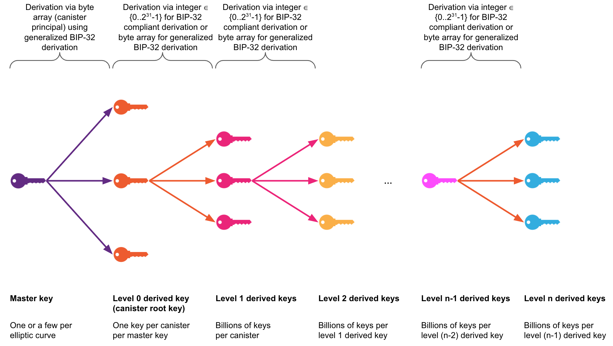

import { MarkdownChipRow } from "/src/components/Chip/MarkdownChipRow";

# Threshold signatures

<MarkdownChipRow labels={["Reference"]} />

This page gives a high-level outline of threshold signatures on ICP.
Some of the information in this section is not required to use threshold signing features but may be of interest to the technically inclined reader for obtaining background information on the technology.
ICP currently supports **threshold Schnorr** signing and **threshold ECDSA** signing.
Further research on ECDSA is described by Groth and Shoup in their [Eurocrypt 2022 paper](https://eprint.iacr.org/2021/1330). Groth and Shoup have also published a comprehensive [design and analysis](https://eprint.iacr.org/2022/506) of ECDSA.
For Schnorr, various designs were proposed by [Groth and Shoup](https://eprint.iacr.org/2023/1175) and a [security analysis of Schnorr from Shoup](https://eprint.iacr.org/2023/1019.pdf) was completed.

At a high level, the threshold signature implementations on ICP feature multiple protocols as outlined next, all of which are crucial for a secure system setup and operation. Note that this goes far beyond just threshold signing, which is the reason for calling this a protocol suite for **chain-key signatures**.
- **Key generation:** This protocol is executed on a specified subnet; it generates a new threshold key such that the private key is secret shared over the replicas of this subnet.
- **XNet key re-sharing:** This protocol re-shares a key from a source subnet to a target subnet. It results in the same key being secret shared over the replicas of the target subnet using a different random secret sharing (potentially over a different number of replicas than the sharing in the source subnet uses).
- **Periodic key re-sharing:** This protocol re-shares a key within the subnet it is secret shared on. This helps protect against an adaptive attacker that attempts to compromise replicas over time, as every key resharing makes the previously-obtained key shares worthless.
- **Computing pre-signatures, signing:** These protocols compute signatures with the secret-shared private key. A **protocol for computing pre-signatures** that is run asynchronously to the signing protocol, and it is often run before a signature is requested. This precomputation protocol computes the vast majority of the steps of creating threshold signatures. A **signing protocol** is triggered by a signing request of a canister. A signing protocol consumes one pre-signature to efficiently compute a threshold signature.
- **Public key retrieval:** allows for retrieving a public key of a canister, including key derivation on a canister-provided derivation path. Key derivation for ECDSA and BIP340 is compatible with BIP32.

It is crucial to note that the private key never exists in a reconstructed form and only in secret-shared form during its whole lifetime, whether that is the key's generation, the re-sharing of the key within a subnet or from one subnet to another, or when computing signatures.

Various NNS proposals have been implemented to perform key management, i.e., initial key generation and key re-sharing. Those proposals are used to define on which subnet to generate a master key, to which subnet to re-share the key for better availability, and which subnet to enable for answering signing requests.

## Key derivation

Threshold-signature (t-sig) enabled subnets hold what are called threshold **master keys**, generated with the key generation protocol on selected subnets of ICP. A master key is a key from which canister t-sig keys can be derived, i.e., a single master key for a given elliptic curve suffices for the derivation of a t-sig key for each canister on ICP, the *canister root key*, using a key derivation mechanism with the canister's principal as input. Key derivation is executed transparently by the protocol as part of the signing and public key retrieval APIs. See the level-0 key derivation in the below figure for the derivation of canister root keys from a master key.

From a canister root key, an unlimited number of t-sig keys can be derived for the canister. This derivation is supported by the ECDSA API through the `ecdsa_public_key` method and through the Schnorr API with the `schnorr_public_key` method.

- For ECDSA and BIP340, the key derivation uses a backward-compatible extension of the BIP-32 (non-hardened) key derivation mechanism. The extension allows not only 32-bit integers but also arbitrary-length byte arrays to be used as input for each level of the key derivation function. See the level 1 keys based on the canister root key and greater in the below figure illustrating the derivation of further canisters.

- For Ed25519, the key derivation is a custom mechanism for hierarchical key derivation that improves upon the existing solutions, which are either incompatible with this use case because they are using hardened key derivation or they are unnecessarily complex. More details can be found in the [interface specification](/docs/references/ic-interface-spec#ed25519-key-derivation).

The derivation of further t-sig public keys from a canister root key can be done without the involvement of ICP as well to facilitate certain use cases.

The picture below shows the key derivation hierarchy using extended BIP32. The derivation mechanism for Ed25519 is analogous to this, but derivation for Ed25519 via integer does not have a special meaning, since there is no standard that requires integers in Ed25519's derivation path.



Threshold master keys are always referred to through **key identifiers** in the t-sig APIs (as well as in the NNS proposals for managing the rollout). The key identifiers comprise 1) an elliptic curve name or an algorithm and 2) an identifier; e.g., an example key identifier is the 2-tuple `(secp256k1, test_key_1)` for ECDSA or `(bip340secp256k1, test_key_1)` for Schnorr. Those key identifiers are used by the system to refer to the correct key, e.g., for selecting the key
share when computing a signature or in the implementation of the XNet routing of API calls and responses to/from the t-sig-enabled subnet holding the key with the corresponding identifier.

There are currently 6 master keys deployed: 3 test keys (whose name starts with `test_key_`) and 3 production keys (whose name starts with `key_`). The keys are deployed on 2 different subnets: one activated for signing and the other one for backing up the key for better key availability. The test keys are deployed on two 13-node subnets: signing on subnet `fuqsr` and backup on subnet `2fq7c`. The production keys are deployed on two high-replication subnets: signing on subnet `pzp6e` and backup on subnet `uzr34`.

The following ECDSA master keys are currently deployed:
- `(secp256k1, test_key_1)`
- `(secp256k1, key_1)`

The following Schnorr master keys are currently deployed:
- `(bip340secp256k1, test_key_1)`
- `(bip340secp256k1, key_1)`
- `(ed25519, test_key_1)`
- `(ed25519, key_1)`

## Threshold signature APIs

Next, this guide gives an overview of the APIs for threshold signatures.
For the authoritative specification, the reader is referred to the corresponding part of the Internet Computer interface specification for [ECDSA](/docs/references/ic-interface-spec#ic-ecdsa_public_key) and [Schnorr](/docs/references/ic-interface-spec#ic-schnorr_public_key).
The ECDSA API comprises two methods: `ecdsa_public_key` for retrieving threshold ECDSA public keys and `sign_with_ecdsa` for requesting threshold ECDSA signatures to be computed from the subnet holding the secret-shared private threshold ECDSA key.
The Schnorr API comprises two methods: `schnorr_public_key` for retrieving threshold Schnorr public keys and `sign_with_schnorr` for requesting threshold Schnorr signatures to be computed from the subnet holding the secret-shared private threshold Schnorr key.

Each API call refers to a t-sig master key by virtue of a 2-part identifier comprising a curve or algorithm and a key ID as outlined above. Derivation paths are used to refer to keys below a canister's root key in the key derivation hierarchy. The key derivation from the master key to the canister root key is implicit in the API.

- [`ecdsa_public_key`](/docs/references/ic-interface-spec#ic-ecdsa_public_key): This method returns a SEC1-encoded ECDSA public key for the given canister using the given derivation path.

If the `canister_id` is unspecified, it will default to the canister ID of the caller.
The `derivation_path` is a vector of variable-length byte strings.
The `key_id` is a struct specifying both a curve and a name. The availability of a particular `key_id` depends on implementation.

For curve `secp256k1`, the public key is derived using a generalization of BIP32 (see [ia.cr/2021/1330](https://eprint.iacr.org/2021/1330), Appendix D). To derive (non-hardened) BIP-0032-compatible public keys, each byte string (blob) in the `derivation_path` must be a 4-byte big-endian encoding of an unsigned integer less than 2<sup>31</sup>.
The return result is an extended public key consisting of an ECDSA `public_key`, encoded in SEC1 compressed form, and a `chain_code`, which can be used to deterministically derive child keys of the `public_key`.
This call requires that the ECDSA feature is enabled and that the `canister_id` meets the requirement of a canister ID. Otherwise it will be rejected.

- [`sign_with_ecdsa`](/docs/references/ic-interface-spec#ic-ecdsa_public_key): This method returns a new ECDSA signature of the given `message_hash` that can be separately verified against a derived ECDSA public key.
This call requires that the ECDSA feature is enabled, the caller is a canister, and `message_hash` is 32 bytes long. Otherwise it will be rejected.

This public key can be obtained by calling `ecdsa_public_key` with the caller's `canister_id` and the same `derivation_path` and `key_id` used here.<br/>

The signatures are encoded as the concatenation of the SEC1 encodings of the two values `r` and `s`. For curve `secp256k1`, this corresponds to 32-byte big-endian encoding.<br/>

- [`schnorr_public_key`](/docs/references/ic-interface-spec#ic-sign_with_schnorr): Returns a Schnorr public key for the given canister using the given derivation path.
This call requires that the Schnorr feature is enabled and the `canister_id` meets the requirement of a canister ID. Otherwise it will be rejected.

If the `canister_id` is unspecified, it will default to the canister ID of the caller.
The `derivation_path` is a vector of variable-length byte strings.
The `key_id` is a struct specifying both an algorithm and a name. The availability of a particular `key_id` depends on implementation.

The return value is an extended Schnorr public key consisting of a Schnorr `public_key` and a `chain_code`. The chain code can be used to deterministically derive child keys of the `public_key`. Both the derivation and the encoding of the public key depend on the key ID's algorithm:

For algorithm `bip340secp256k1`, the public key is derived using the generalization of BIP32 defined in [ia.cr/2021/1330, Appendix D](https://ia.cr/2021/1330). To derive (non-hardened) [BIP32](https://github.com/bitcoin/bips/blob/master/bip-0032.mediawiki)-compatible public keys, each byte string (blob) in the `derivation_path` must be a 4-byte big-endian encoding of an unsigned integer less than 231. If the `derivation_path` contains a byte string that is not a 4-byte big-endian encoding of an unsigned integer less than 231, then a derived public key will be returned, but that key derivation process will not be compatible with the [BIP32](https://github.com/bitcoin/bips/blob/master/bip-0032.mediawiki) standard.
The public key is encoded in [SEC1](https://www.secg.org/sec1-v2.pdf) compressed form. To use BIP32 public keys to verify BIP340 Schnorr signatures, the first byte of the (33-byte) SEC1-encoded public key must be removed (see [BIP-340, Public Key Conversion](https://github.com/bitcoin/bips/blob/master/bip-0340.mediawiki#public-key-conversion)).

For algorithm `ed25519`, the public key is derived using a custom mechanism for hierarchical key derivation that, just as in extended BIP32, takes a vector of byte strings as input. The public key is encoded in standard 32-byte compressed form (see [RFC8032, 5.1.2 Encoding](https://datatracker.ietf.org/doc/html/rfc8032#section-5.1.2)) More details about the derivation mechanism can be found in the [interface specification](/docs/references/ic-interface-spec#ed25519-key-derivation).

- [`sign_with_schnorr`](/docs/references/ic-interface-spec#ic-ecdsa_public_key): Returns a new Schnorr signature of the given `message` of arbitrary size that can be separately verified against a derived Schnorr public key.
This call requires that the Schnorr feature is enabled and the caller is a canister. Otherwise it will be rejected.

This public key can be obtained by calling `schnorr_public_key` with the caller's `canister_id` and the same `derivation_path` and `key_id` used here.

For `bip340secp256k1`, the signature will be encoded according to [BIP340](https://github.com/bitcoin/bips/blob/master/bip-0340.mediawiki), using 64 bytes.
If the `aux` parameter with the `bip341` variant is provided, the distributed key is
tweaked as defined in
[BIP341](https://github.com/bitcoin/bips/blob/master/bip-0341.mediawiki) with
the `merkle_root_hash`, which must contain 0 or 32 bytes.

For `ed25519`, the signature will be encoded according to [RFC8032, 5.1.6
Sign](https://datatracker.ietf.org/doc/html/rfc8032#section-5.1.6), using 64
bytes. If the `aux` parameter is provided, the signing will fail.

An example of the ECDSA API can be found below:

```
  ecdsa_public_key : (record {
    canister_id : opt canister_id;
    derivation_path : vec blob;
    key_id : record { curve: ecdsa_curve; name: text };
  }) -> (record { public_key : blob; chain_code : blob; });
  sign_with_ecdsa : (record {
    message_hash : blob;
    derivation_path : vec blob;
    key_id : record { curve: ecdsa_curve; name: text };
  }) -> (record { signature : blob });
```

An example of the Schnorr API can be found below:

```
  schnorr_public_key : (record {
    canister_id : opt canister_id;
    derivation_path : vec blob;
    key_id : record { algorithm: schnorr_algorithm; name: text };
  }) -> (record { public_key : blob; chain_code : blob; });

  type schnorr_aux = variant {
    bip341: record {
      merkle_root_hash: blob;
   }
  };

  sign_with_schnorr : (record {
    message : blob;
    derivation_path : vec blob;
    key_id : record { algorithm: schnorr_algorithm; name: text };
    aux: opt schnorr_aux;
  }) -> (record { signature : blob });
```

Note that in case of high system load, a request to compute a threshold signature may time out. In this case, the canister may want to back off and retry the request later.

## API fees

The fees for the t-sig APIs are as defined below. The threshold ECDSA test key and Schnorr test key reside on a regular-sized (13-node) application subnet, while the threshold ECDSA production key resides on a 31-node-sized fiduciary subnet. The subnet size of the subnet where the t-sig key resides and the signatures are computed defines the resulting cost. The size of the subnet of the calling canister does not matter for the fees. For costs in USD, the USD/XDR exchange rate as of November 23, 2022, has been used.


:::note
If a canister using this feature is intended to be blackholed, but also for other canisters, it is recommended to send more cycles with the call than the advertised cost of the call so that if the subnet size of the signing subnet increases in the future, the higher costs per signature are still covered. Any cycles not charged in a call are refunded.
:::

### Fees for the t-ECDSA test key

| Transaction                          | Description                                                                                                    | Cycles (test key)                     | USD                         |
|--------------------------------------|----------------------------------------------------------------------------------------------------------------|-----------------------------|-----------------------------|
| Threshold ECDSA signing              | For computing one threshold ECDSA signature (`sign_with_ecdsa`)                                                | 10_000_000_000              | $0.0132551                  |

### Fees for the t-ECDSA production key

| Transaction                          | Description                                                                                                    | Cycles (production key)                     | USD                         |
|--------------------------------------|----------------------------------------------------------------------------------------------------------------|-----------------------------|-----------------------------|
| Threshold ECDSA signing              | For computing one threshold ECDSA signature (`sign_with_ecdsa`)                                                | 26_153_846_153              | $0.0346672                  |

### Fees for the t-Schnorr test key

| Transaction                          | Description                                                                                                    | Cycles (test key)                     | USD                         |
|--------------------------------------|----------------------------------------------------------------------------------------------------------------|-----------------------------|-----------------------------|
| Threshold Schnorr signing              | For computing one threshold Schnorr signature (`sign_with_schnorr`)                                                | 10_000_000_000              | $0.0130886                  |

### Fees for the t-Schnorr production key

| Transaction                          | Description                                                                                                    | Cycles (production key)                     | USD                         |
|--------------------------------------|----------------------------------------------------------------------------------------------------------------|-----------------------------|-----------------------------|
| Threshold Schnorr signing              | For computing one threshold Schnorr signature (`sign_with_schnorr`)                                                | 26_153_846_153              | $0.0346672                  |

## Environments

In order to facilitate developers throughout the canister development lifecycle on ICP, these features are available in both the SDK for local development and testing as well as on ICP for pre-production testing and production operation of canisters.

### SDK

The development of canisters is typically done in the developer's local environment, facilitated by the use of the SDK. The SDK has been extended such that the management canister API for threshold ECDSA and threshold Schnorr is available in the local development environment. Thus, canisters using the t-sig APIs can be run locally for development and testing purposes. They are always enabled in the SDK, so no further user action is required in order to make use of the APIs.

When the replica of the SDK environment is first started up, a new t-sig key is generated. This key is then stored in non-volatile memory so that it does not change with every restart of the replica.

For the technically interested readers, it is important to note that the SDK uses the exact same implementations of t-sigs as the mainnet, however the signing throughput and latency in the local SDK environment is not representative for the throughput and latency on ICP.

### Internet Computer

Any canister on any subnet of ICP can call the t-sig APIs exposed by the management canister. The calls are routed via XNet communication to the t-sig-enabled subnet that holds the keys referred to in the API call (only one such signing subnet holding a test key and one signing subnet holding the production key are available currently).

:::warning
Note that test keys are hosted on a subnet with a replication factor of only 13 and may be deleted in the future; thus they should not be used for anything of value but rather solely for development and testing purposes. The main intended purpose is to facilitate the development and testing of Bitcoin-enabled dapps using the Bitcoin testnet.
:::