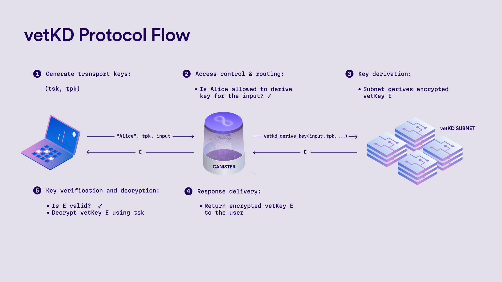

import { MarkdownChipRow } from "/src/components/Chip/MarkdownChipRow";

# How vetKeys work

<MarkdownChipRow labels={["Reference"]} />

This page outlines how **vetKeys** work and how they are integrated into the Internet Computer. While some of the information here isn’t necessary for using vetKeys, it provides helpful background for technically inclined readers who want to better understand the underlying cryptography and system design. [Learn more about what vetKeys are](/docs/building-apps/network-features/vetkeys/introduction) and how to use them in your canister.

## What is vetKD?

At the core of vetKeys there is a cryptographic protocol called [verifiably encrypted threshold Key Derivation](https://eprint.iacr.org/2023/616) (vetKD). To understand how vetKeys work, it’s helpful to first unpack the meaning of each part of this protocol’s name:

* **Key Derivation:** is a process to derive new cryptographic keys from an existing master key.  

* **Threshold:** the protocol uses threshold cryptography, meaning the master key is not held by a single party. Instead, it is split among multiple nodes. A quorum of nodes must cooperate in a protocol to derive new keys from the master key. At a high level, each node uses its share of the master key to compute a share of the derived key. Once enough shares are collected (meeting the threshold), they can be combined to produce the full derived key. This ensures there is no single point of failure or trust, and security is maintained as long as a minimum number of nodes remain honest.  

* **Encrypted:** users of the key derivation service can supply an encryption (transport) public key, which is used to securely deliver the derived key. The derived key is encrypted at all times, including during intermediate steps, and even individual shares are never revealed in plaintext. Only the requester, who holds the matching private key, can decrypt the final result.  

* **Verifiable:** the protocol provides cryptographic guarantees that the encrypted derived key is correct and has not been tampered with. Specifically, it is publicly verifiable that:  
  * The derived key was correctly computed from the master key using the user’s input and context.  
  * It was encrypted using the correct transport key provided by the user.

## Protocol overview

The Internet Computer integrates the vetKD protocol as a threshold key derivation service operated by vetkD-enabled subnets. Each such subnet maintains a vetKD master key that is threshold-shared among its nodes and generated using a [distributed key generation protocol](/docs/references/vetkeys-overview#master-key-generation). The protocol involves three main actors:

* **Users**: Typically interacting through a dapp frontend. They request derived keys and provide a public key for secure delivery.  
* **Canisters**: Perform access control and forward user requests to the vetKD protocol using the system API.  
* **Subnet Nodes**: Execute the key derivation protocol, each using its share of the vetKD master key.

The protocol proceeds as follows:

1. **Transport Key Generation:** The user generates a fresh key pair, which is referred to as a *transport* key pair. The public key is sent to the canister to be used for encrypting the derived key. The user may also supply an *input* argument of the vetKD key derivation call, such as a key ID or a session identifier, which determines the derived key and can later be used for the verification of the encrypted vetKey.  

2. **Access Control & Routing:** The canister authenticates the user and enforces any access control policies (e.g. whether the user is allowed to derive the key for the given input). If the request is authorized, the canister invokes the [vetKD system API](/docs/building-apps/network-features/vetkeys/api), specifying:  
   * **Context:** used to domain-separate the key derivation requests. This could be a key purpose, a user ID, or other application-specific identifier.   
   * **Input:** application-specific data that serves as the basis for key derivation. It can be provided by the user or determined by the canister, depending on the use case.  
   * **Transport public key:** the user’s public key, used to encrypt the derived key.  
   * **Master key ID:** identifies the vetKD master key managed by a specific subnet on the Internet Computer. 

   The canister can submit this request from any subnet, the system then routes it to the correct vetKD-enabled subnet based on the master key ID. 

3. **Key Derivation:** All the nodes in the designated vetKD subnet run the threshold key derivation protocol:  
    * **Share Computation**: Each node uses its share of the master key to compute an encrypted share of the derived key, which is encrypted with the user’s transport public key. These encrypted shares are broadcast to the other subnet nodes.  
    * **Share Combination**: Once a quorum of two-thirds is available (`2f + 1` shares in a subnet with `3f + 1` nodes, and up to `f` Byzantine nodes), any node can combine the shares into a single **encrypted derived key**. The final result remains encrypted under the user’s transport key.  
4. **Response Delivery:** The combined encrypted key is returned to the canister, which delivers it to the user.  
5. **Verification and Decryption:** The user verifies that the key is valid, i.e. that key corresponds to the provided **context** and **input** and it was encrypted with their **transport public key**. If verification passes, the user decrypts the result using their private key. The derived key can then be used, for instance, as a seed for generating user keys, session keys, or for application-specific cryptographic operations.

## Master key generation

To enable secure threshold key derivation, each vetKD master key is generated and maintained by the nodes of a dedicated subnet. For fault tolerance and resilience, the master key is also backed up on at least one additional subnet so it can be restored in the event of subnet failure or recovery. The processes of key generation, backup, and recovery are all governed by the [Network Nervous System](https://learn.internetcomputer.org/hc/en-us/articles/33692645961236-Overview) (NNS) through proposals, ensuring that these critical operations are subject to decentralized control and transparent governance.

### Distributed key generation

To eliminate single points of failure and ensure that the master key remains decentralized at all times, a **distributed key generation (DKG)** protocol is used to generate and maintain it. In a DKG protocol, there are two roles: a set of **dealers** that collaboratively generate the key, and a set of **receivers**, each of whom receives a share of the secret key. 

On the Internet Computer, DKG protocols are executed between nodes of subnets. There are two primary configurations:

* **Local DKG**: Both dealers and receivers are nodes of the same subnet. This is the common case during regular operation. The two sets may not be identical, for instance, when the subnet membership changes (e.g., nodes are added or removed).  
* **Remote DKG**: Dealers belong to one subnet, while receivers are nodes of a different subnet. This configuration is used for scenarios such as backing up a vetKD master key to another subnet or restoring a key during subnet recovery.

For vetKeys, the Internet Computer uses Jens Groth’s [non-interactive DKG protocol](https://eprint.iacr.org/2021/339). This protocol offers several important advantages that make it particularly well-suited for generating and maintaining threshold keys in a decentralized setting:

* **Non-interactive:** The protocol consists of a single communication round, where dealers broadcast their contributions which can be publicly verified. At a later stage, receivers can obtain the resulting transcript of the protocol to independently compute their key shares.  
* **High Reconstruction Threshold:** Unlike interactive protocols, it supports a higher reconstruction threshold. Specifically, it enables the reconstruction threshold of up to `2f+1` for subnets with `n ≥ 3f+1` nodes, where `f` is the number of Byzantine nodes the subnet can tolerate. For vetKeys, a high reconstruction threshold is used, meaning that two-thirds of the nodes must cooperate to reconstruct the master key.  
* **Key Resharing:** It enables not only the generation of fresh keys but also resharing of existing keys. This is essential for periodic key refreshes, subnet membership changes, and key backup and recovery operations.   
* **Forward-Secure Encryption:** The key shares are distributed using a forward-secure encryption scheme. Nodes periodically update their decryption key and erase old key shares from memory. This ensures that even if a node is later compromised, previously distributed shares cannot be recovered.

### Canister master keys

To provide a scalable and efficient key derivation service, the Internet Computer maintains a single (or a small number of) vetKD master keys within a subnet, rather than generating independent master keys for each dapp or canister. While in theory every dapp could use its own dedicated master key, this approach does not scale well in practice. In particular, resharing master keys is computationally expensive, and doing so for every canister whenever subnet membership changes would quickly become infeasible.

Instead, the system derives a single canister-level master key from the subnet’s vetKD master key using an additive key derivation scheme, similar to those used for [threshold ECDSA and Schnorr](/docs/references/t-sigs-how-it-works#key-derivation). Each canister can then derive additional subkeys by specifying a *context*, such as a user identifier or key purpose. This context acts as a domain separator, ensuring that derived subkeys are isolated and application-specific, even though they originate from the same canister master key. The canister master _public_ key can be obtained by calling the `vetkd_public_key` system API with an empty context. Subkeys can be retrieved on-chain by calling the same API with a non-empty context, or computed off-chain from the canister master public key using a key derivation library ([Rust](https://docs.rs/ic-vetkeys/latest/ic_vetkeys/), [Typescript](https://dfinity.github.io/vetkeys/modules/_dfinity_vetkeys.html)). 

Each canister-level key can then be used in the vetKD protocol to derive user-requested keys by calling the `vetkd_derive_key` system API and specifying the corresponding context. To do so, the canister supplies an input, typically user-generated or application-specific data, that serves as the basis for the derived key. This input does not need to be random or secret. Because the key derivation process is deterministic (given the same canister, context, and input), the input can effectively serve as an identifier for the derived key within the application.

