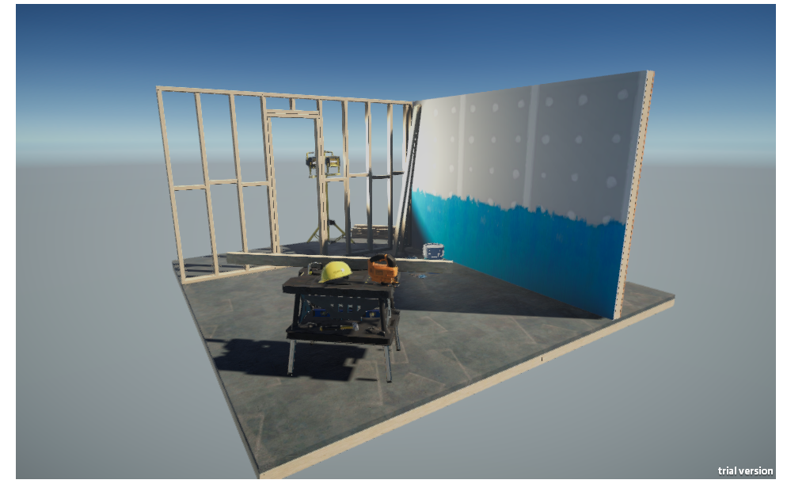
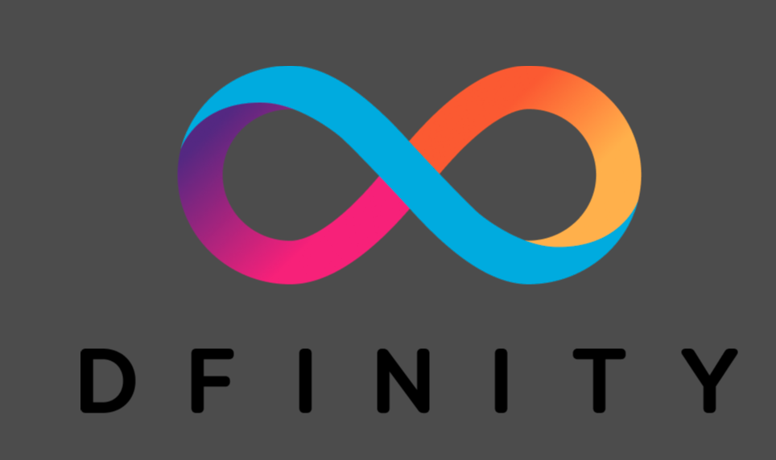

# Hosting a web game on the Internet Computer

## Overview 
This sample project demonstrates how to deploy a web game on the [Internet Computer](https://internetcomputer.org/) through [Unity](https://unity.com/) and [Godot](https://godotengine.org/) game engines.

Let’s create a web game by using Unity or Godot game engine.

## Creating a web game automatically using IC GameKit

## Prerequisites
- [x] Before you begin, make sure you have the [IC SDK](/developer-docs/setup/install/index.mdx) installed.
- [x] Download and install [git.](https://git-scm.com/downloads)

### Option 1: Unity

### Prerequisites:
- [x] Make sure you have [Unity](https://unity.com/download) installed.

- #### Step 1: Create a new Unity Project with **Universal Render Pipeline** template selected, or you can use you own game as well.
- #### Step 2: Install the **IC GameKit** package:
  - You can install the package from Unity Package Manager via using the **Add package from git URL...** menu, by inputting the following URL:
    `https://github.com/dfinity/ic-gamekit.git?path=/unity/com.ic.gamekit`
- #### Step 3: To enable `IC Connector`:
    - After installing the IC Gamekit package successfully, you can go to `Project Settings -> IC Settings` to config Internet Computer settings. The IC only supports two basic options for now:
        - Canister name: this configs the asset canister name in the `dfx.json` file for the generated IC project.
        - Enable IC connector: you can turn on/off the IC Connector. With this checked, a folder named `ic-project` will be generated under the Godot HTML5 export path. Now only Export Project is supported.
- #### Step 4: Switch to **WebGL** build target in the **Build Settings** window.
- #### Step 5: Under the **Settings for WebGL** tab in the **Player Settings** window.
  - Set **Compression Format** to **Disabled** if you are using dfx SDK with version before 0.12.0.  
    You can check [this document](https://github.com/dfinity/ic-gamekit/tree/main) for more information.
  - Choose the **Minimal** WebGL template to reduce the number of files generated.
- #### Step 6: Build to WebGL in the **Build Settings** window.  
  With **IC Connector** enabled in the previous step, a folder named `ic-project` will be generated under the WebGL build output folder.

### Option 2: Godot

### Prerequisites:
- [x] Make sure you have [Godot](https://godotengine.org/download) installed.

- #### Step 1: Create a new Godot project.
- #### Step 2: Install the IC GameKit plugin:
  - You can install the package from Unity Package Manager via using the **Add package from git URL...** menu, by inputting the following URL:
    `https://github.com/dfinity/ic-gamekit.git?path=/godot/com.ic.gamekit`
- #### Step 3: To enable `IC Connector`:
    - After installing the IC Gamekit package successfully, you can go to `Project Settings -> IC Settings` to config Internet Computer settings. The IC only supports two basic options for now:
        - Canister name: this configs the asset canister name in the `dfx.json` file for the generated IC project.
        - Enable IC connector: you can turn on/off the IC Connector. With this checked, a folder named `ic-project` will be generated under the Godot HTML5 export path. Now only Export Project is supported.
- #### Step 4: Switch to `HTML5` preset in the `Export` window
- #### Step 5: Export the project by `Export Project` button.  
  With `IC Connector` enabled in the previous step, a folder named `ic-project` will be generated under the HTML5 export folder.

## Creating a web game manually 

:::info
You may find generating the web game project manually is tedious and error-prone, it is highly recommended you to use [IC GameKit](https://github.com/dfinity/ic-gamekit) to do this automatically. The tool is still in development, let us know if you have any feedback.
:::

Since there is no backend in this sample, there is not any benefit of using the `dfx new project_name` command to set up a template. The `dfx.json` file is all that is needed.

### Option 1: Unity
- #### Step 1: Create a folder named `unity-webgl-sample`.
- #### Step 2: Create a file named `dfx.json` under the `unity-webgl-sample` folder.
- #### Step 3: Install the example dapp project:

```
git clone https://github.com/dfinity/examples
cd examples/hosting/unity-webgl-template
```

- #### Step 4: Start the local network by running this command:

```
dfx start --background
```

- #### Step 5: When the local network is up and running, run this command to deploy the canisters:

```
dfx deploy
```

:::caution
If you get error code 500 after deploying to the IC mainnet, try to use raw keyword in the URL like this: https://\<canister-id\>.raw.ic0.app.
:::

- #### Step 6: Once deployed, the terminal will output a response similar to:

```
Committing batch.
Deployed canisters.
URLs:
  Frontend canister via browser
    unity_webgl_template_assets: http://127.0.0.1:4943/?canisterId=c5kvi-uuaaa-aaaaa-qaaia-cai
```

Navigate to the frontend canister URL in a web browser. The default game will look like this:



### Option 2: Godot
- #### Step 1: Download the example dapp project:

```
git clone https://github.com/dfinity/examples
cd examples/hosting/godot-html5-template
```

- #### Step 2: Start the local network by running this command:

```
dfx start --background
```

- #### Step 3: When the local network is up and running, run this command to deploy the canisters:

```
dfx deploy
```

:::caution
If you get error code 500 after deploying to the IC mainnet, try to use raw keyword in the URL like this: https://\<canister-id\>.raw.ic0.app.
:::

- #### Step 4: Once deployed, the terminal will output a response similar to:

```
Committing batch.
Deployed canisters.
URLs:
  Frontend canister via browser
    godot_html5_assets: http://127.0.0.1:4943/?canisterId=ctiya-peaaa-aaaaa-qaaja-cai
```

Navigate to the frontend canister URL in a web browser to view your game:


