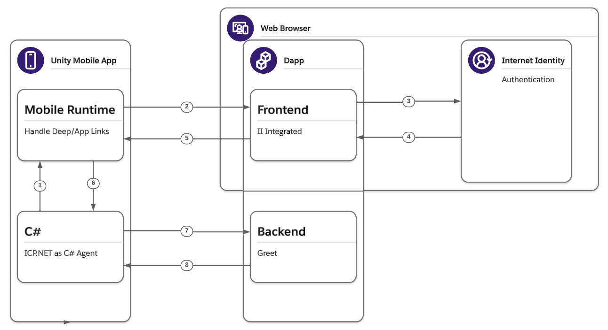

# Unity mobile integration

## Overview

[Unity mobile integration](https://github.com/dfinity/examples/tree/master/native-apps) is a collection of samples that shows one way to integrate [Internet Identity](/docs/current/references/ii-spec) (II) Unity mobile apps. For now it contains two examples: one for [Deep Links](https://github.com/dfinity/examples/tree/master/native-apps/unity_ii_deeplink), the other for [Android App Links](https://github.com/dfinity/examples/tree/master/native-apps/unity_ii_applink) (the one for iOS Universal Links is coming). Each example contains a dapp with II integrated, and a Unity Project which interacts with this dapp.

## Workflow

The basic workflow of these examples is:
- In the Unity mobile game, launch the web browser to load a dapp.
- Authenticate with II.
- Use Deep Links or App Links to return to the game with the delegation.
- Use [ICP.NET](https://github.com/BoomDAO/ICP.NET) to call the functions provided by the canisters.

Below is a diagram that shows the workflow in detail.

The steps in the diagram are described below:

1. Generate an Ed25519 key pair from C# side.
2. Open the dapp with the public key as a parameter.
3. Authenticate with II.
4. Return the delegation.
5. Restore the game with the delegation via Deep/App Links.
6. Pass the delegation back to C#.
7. Call the backend canister with DelegationIdentity provided by ICP.NET.
8. Retrieve and show the principal ID.

## Prerequisites

- [x] Install the [IC SDK](../developer-docs/setup/install/index.mdx).
- [x] Clone [the examples repo](https://github.com/dfinity/examples/).
- [x] Install [Unity](https://docs.unity3d.com/Manual/GettingStartedInstallingUnity.html).

## Deployment

### Deploying the dapp

The demo dapp mainly contains two parts:
- Frontend:
  - II authentication integrated.
  - Provide Deep/App Links.
- Backend:
  - Greet() function which returns the current principal ID.

#### Using Deep Links

If you want to deploy the dapp which supports Deep Links, please follow the [Deep Links dapp](https://github.com/dfinity/examples/blob/master/native-apps/unity_ii_deeplink/ii_integration_dapp/README.md). It's configured to launch/restore the Unity mobile game by `internetidentity://` URL scheme.

Please refer to the [README](https://github.com/dfinity/examples/blob/master/native-apps/unity_ii_deeplink/ii_integration_dapp/README.md#deployment) file for the deployment details.

#### Using App Links

***Please notice the App Links only works on Android, and Universal Links for iOS will come soon.***

If you want to deploy the dapp which supports Android App Links, please follow the [App Links dapp](https://github.com/dfinity/examples/blob/master/native-apps/unity_ii_applink/ii_integration_dapp/README.md). It's configured to launch/restore the Unity mobile game by `https://` URL scheme.

Unlike Deep Links, Android App Links requires the website to serve an `assetlinks.json` file under the `.well-known` directory. It contains package name, sha256 certificate fingerprints etc., which will be used by the Android installer to verify if the apps should be launched to handle the URL schemes defined in the Android `manifest.xml` file.

Please refer to the [README](https://github.com/dfinity/examples/blob/master/native-apps/unity_ii_applink/ii_integration_dapp/README.md#deployment) file for the deployment details.

### Deploying the Unity project

The demo Unity project has [ICP.NET](https://github.com/BoomDAO/ICP.NET) embedded, which is a C# agent that is able to communicate with ICP from C#.

#### Using Deep Links

If you want to run the Unity mobile game which supports Deep Links, please follow the [Deep Links Unity Project](https://github.com/dfinity/examples/blob/master/native-apps/unity_ii_deeplink/unity_project/README.md). It's configured to handle the `internetidentity://` URL scheme.

Please refer to the [README](https://github.com/dfinity/examples/blob/master/native-apps/unity_ii_deeplink/unity_project/README.md#deployment) file for the deployment details.

#### Using App Links

***Please notice the App Links only works on Android, and Universal Links for iOS will come soon.***

If you want to run the Unity mobile game which supports Android App Links, please follow the [App Links Unity Project](https://github.com/dfinity/examples/blob/master/native-apps/unity_ii_applink/unity_project/README.md). It's configured to handle the `https://` URL scheme.

One thing to keep in mind is the `keystore` file that is used to sign the Android APK must be the same one that is used to generate the `assetlinks.json`, otherwise the Android installer will fail to verify the app by comparing the sha256 certificates.

Please refer to the [README](https://github.com/dfinity/examples/blob/master/native-apps/unity_ii_applink/unity_project/README.md#deployment) file for the deployment details.
