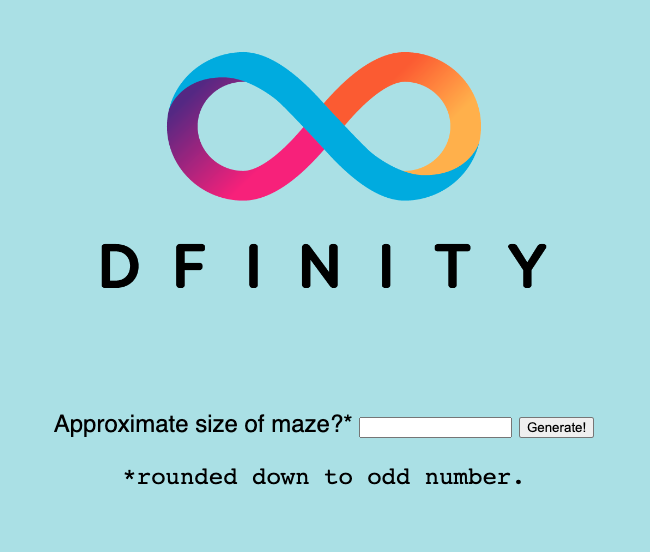
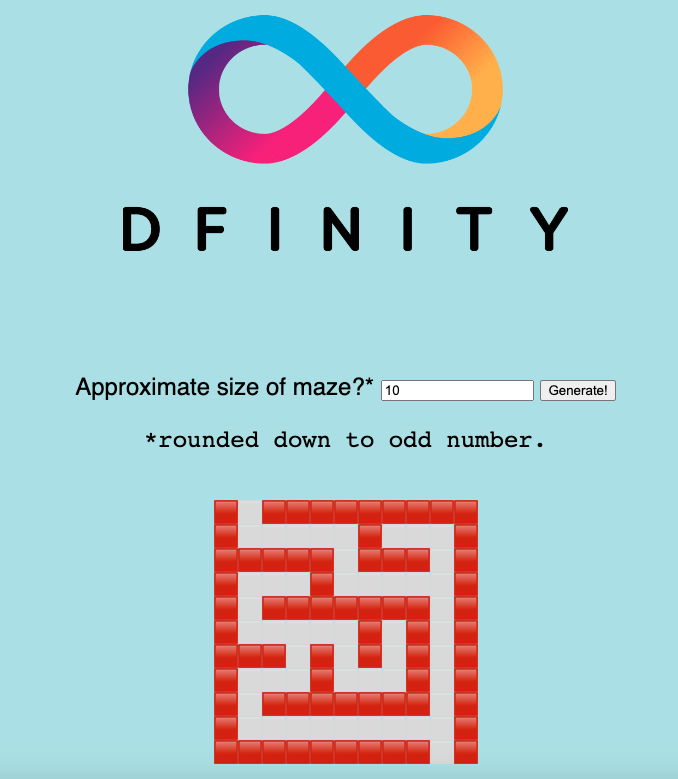

# Random maze

## Overview

The example generates a random maze using cryptographic randomness.

It illustrates:

- Importing library Random to use cryptographic randomness.
- Make asynchronous requests for entropy using shared function `Random.blob()`.
- Generating bounded, discrete random numbers using helper class `Random.Finite(entropy: blob)`. Each instance, f, of this class consumes its initially supplied entropy as it is called to sample from various distributions. Calls to, for example `f.coin()` can fail by returning `null`, requiring `f` to be discarded in favour of a fresh instance of the Finite class, constructed from a fresh blob of entropy obtained from a new call to `Random.blob()` (for example `f := Finite(await Random.blob())`).

The application is built from the following Motoko source code file:

- `main.mo`: contains the actor definition and methods exposed by this canister.

This actor use Motoko's Random library to generate a cryptographically random maze of user-specified size.

Function generate, calls library function `Random.blob()` asynchronously to obtain 256-bits of raw entropy (256 random bits as 32 bytes) from the Internet Computer. It makes these calls on demand as it is constructing a maze. The bits of these blobs are consumed to generate samples from a variety of discrete distributions using some of the other classes and functions of library Random.mo.

This is a Motoko example that does not currently have a Rust variant. 

## Prerequisites
This example requires an installation of:

- [x] Install the [IC SDK](../developer-docs/setup/install/index.mdx).
- [x] Download the following project files from GitHub: https://github.com/dfinity/examples/

Begin by opening a terminal window.

### Step 1: Navigate into the folder containing the project's files and start a local instance of the Internet Computer with the command:

`cd examples/motoko/random_maze`
`dfx start --background`

### Step 2: Install front-end dependencies:

`npm install`

### Step 3: Deploy the canister:

```
dfx deploy
```

### Step 4: Take note of the URL at which the user interface is accessible.

`echo "http://127.0.0.1:4943/?canisterId=$(dfx canister id random_maze_assets)"`



Enter a size for the maze, then select **Generate!**. The maze will be displayed below.


