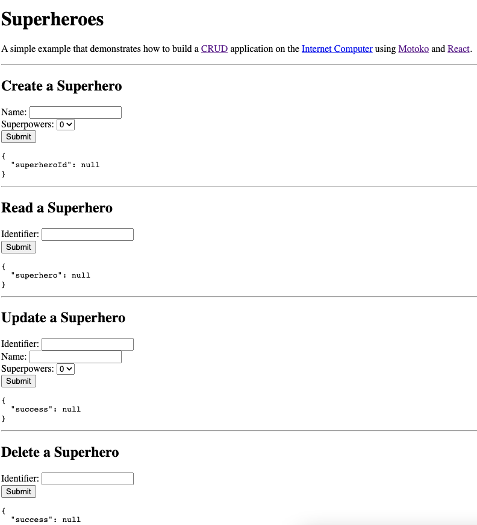

# Superheros

## Overview

This example demonstrates how to build a CRUD application on the Internet Computer using Motoko and React.

This is a Motoko example that does not currently have a Rust variant. 

## Prerequisites
This example requires an installation of:

- [x] Install the [IC SDK](../developer-docs/setup/install/index.mdx).
- [x] Download the following project files from GitHub: https://github.com/dfinity/examples/

Begin by opening a terminal window.

### Step 1: Navigate into the folder containing the project's files and start a local instance of the Internet Computer with the command:

`cd examples/motoko/superheros`
`dfx start --background`

### Step 2: Build the front-end of the application:

`npm install` 

### Step 3: Deploy the canister:

```
dfx deploy
```

### Step 4: Take note of the URL at which the canister is accessible.

`echo "http://127.0.0.1:4943/?canisterId=$(dfx canister id www)"`

### Step 5: Open the aforementioned URL in your web browser.
You will see the following interface that you can interact with:

