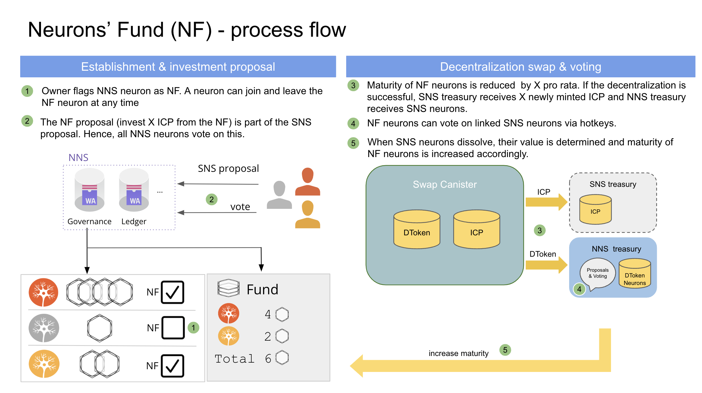

# Neurons' fund

## Overview

The Neurons' Fund (NF) facilitates bootstrapping the Internet Computer (IC) ecosystem. In this article, we explain how the process of the Neurons' Fund (NF) works.

## Background and motivation

The success of the IC is dependent on the dapps built on the IC. Similar to Ethereum, we envisage that, in the long run, the value of services built on the IC will collectively be worth more than the IC itself.
The NF introduces the concept of an NNS controlled treasury. This treasury aims to assist in the bootstrapping of the SNS DAO ecosystem. The NNS will decide how the treasury resources are allocated. The NNS treasury can be extended in the future to support additional community-developed governance and fundraising frameworks.

To build this treasury, NNS neurons flagged as NF, will expose their maturity to the risks the NF fund is taking when participating in SNSes. Maturity of NF neurons will be reduced when the NF decides to participate. At a later date NF neurons whose maturity was reduced will be rewarded with maturity increases, dependent on the success of the NF's participation.
Involving the maturity of NF neurons instead of their stake in ICP minimizes the impact on the overall ICP tokenomics.

Please note that anyone can also directly participate in an SNS via the decentralization swap.

## Neurons' fund process

The Neurons' fund (NF) process can be split into five phases: 
1. Joining the NF.
2. Making a participation decision.
3. NF participating in the decentralization swap receiving SNS neurons.
4. Participation in SNS governance.
5. Increasing maturity when SNS neurons dissolve. 

In the following we describe these five phases in more detail.

### 1: Joining and leaving the NF

Using a tick-box in the NNS front-end dapp, a neuron can join and leave the NF at any time, also while there are proposals with ongoing voting periods.

NF neurons will expose their maturity to the risks the NF fund is taking when participating in SNSes, as described in the following steps.

### 2: Voting on participation

The NF participation proposal is part of the proposal to decentralize an SNS. It is essentially a statement “Start the SNS and allocate X ICP from the NF to the SNS decentralization swap”.

As a consequence, all NNS neurons will vote on both the creation of an SNS for a dapp and on whether the NF participates in that dapp.

If NF neurons opt out of the NF whilst an SNS proposal is open for voting, then the ICP amount the NF was proposed to make is reduced proportionally.

If neurons opt in when an SNS proposal is open for voting, the ICP amount the NF allocates to an SNS remains the same, but each NF neuron will participate with less maturity (proportionally decreased).

### 3: NF participating in the decentralization swap

If a proposal to create an SNS is adopted, the decentralization swap, where initial tokens of the SNS are sold, starts. The NF participates in the decentralization swap.

The maturity of NF neurons is reduced pro rata by an amount related to X as defined in the proposal.

If the decentralization swap is successful, the NNS mints X ICP as specified in the proposal.
  * The SNS treasury receives the X ICP.
  * The NNS NF treasury receives SNS neurons corresponding to X ICP. This is provided as a basket of neurons with various dissolve delays for each participating NF neuron.

If the decentralization swap is not successful, the maturity of NF neurons is increased again by the amount it was decreased by earlier.

### 4: Participation in SNS governance

Participation in voting on the SNS proposals is passed through to the NF neurons via hotkeys on the SNS neurons owned by the NNS. This means, that NF neurons are owned by NNS but permission is given to the principals that exposed maturity to NF neurons to vote on SNS proposals.

The voting power of the SNS neurons is proportional to the amount of maturity exposed.

### 5: Increasing maturity of NF neurons

The NNS NF treasury holds SNS neurons & tokens in its treasury, to be dissolved and sold at its discretion.

When a set of neurons from a decentralization swap of an SNS dissolves, the NNS determines the value of the dissolved SNS neurons. In the first stage, this is done by a proposal. In a later stage this could be done by pulling data from a DEX.

The maturity of NF neurons whose maturity was reduced when a participation in a SNS-controlled dapp was made is increased by the amount determined by the NNS in the previous step. In the worst case this amount could also be zero.

The NNS can sell the tokens from an SNS at a later point in time. After the NNS sells tokens from an SNS, the received ICP will be burned.
