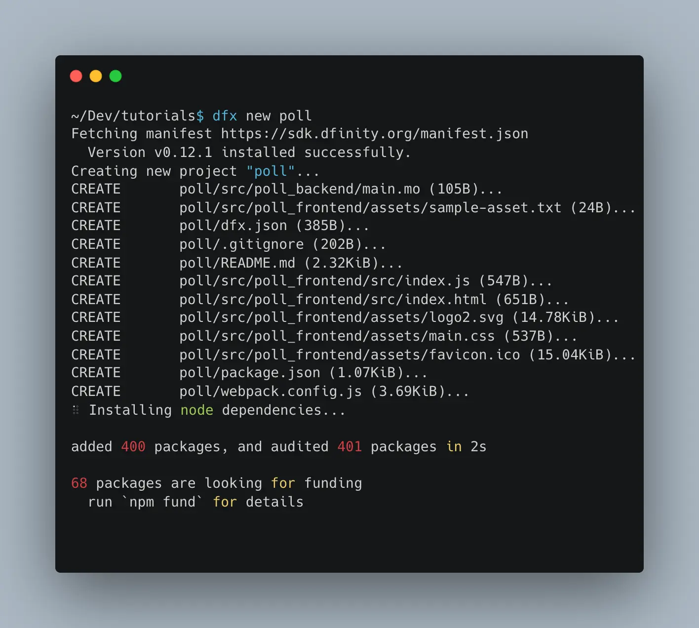

# 2: Creating a project

## Creating a project from a template

To create a project, open your terminal app and type:

```bash
dfx new poll
```

The IC SDK will create a project from a template in a folder "poll":


## Understanding the project structure

After your adpp is created you can examine the folder structure:

```
PROJECT ROOT           <-- Dapp main folder
├── README.md
├── dfx.json           <-- configuration of your Internet Computer dapp
├── package-lock.json  <-- node.js packages config
├── package.json       <-- node.js packages config
├── src
│   ├── poll_backend   <-- source code of your dapp's backend
│   │   └── main.mo    <-- WE WILL BE WORKING IN THIS FILE!
│   └── poll_frontend  <-- source code of your dapp's frontend
│       └── ...
└── webpack.config.js  <-- web dapp bundler config
```

In this tutorial will be only working in one file `main.mo` that contains the code of our dapp backend in programming
language Motoko.


