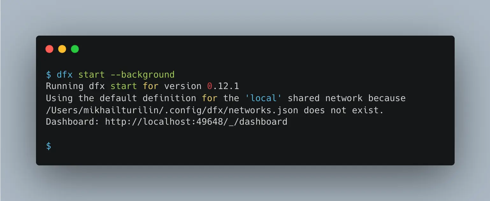
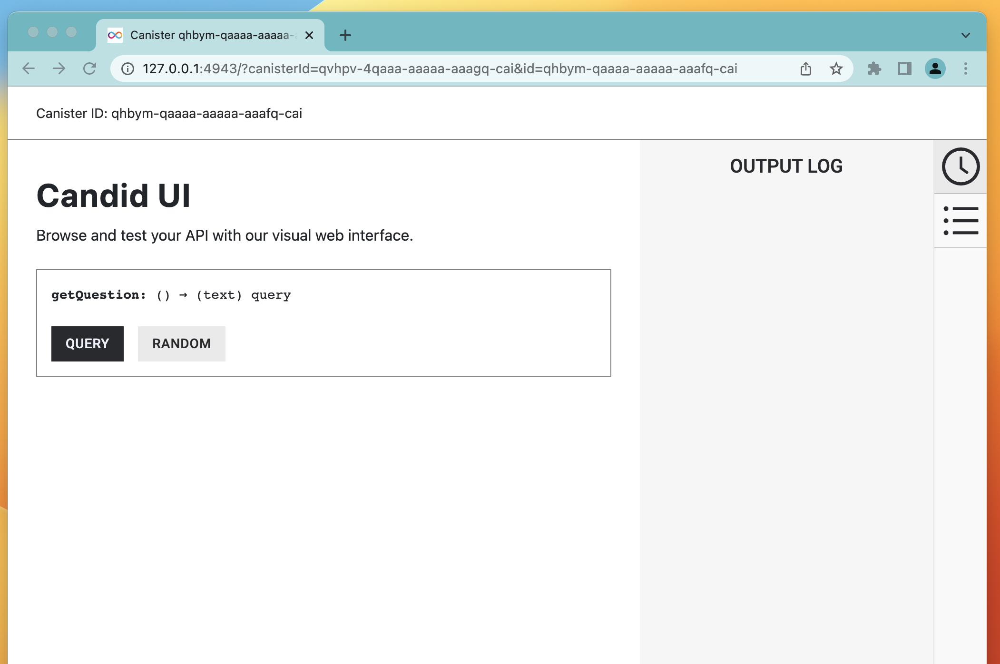

# Step 4 - Deploying locally and using Candid UI

In this article we will learn how to deploy our app locally and play with it using Candid UI.

## Starting local Internet Computer server

Before you can deploy your app, you need to start a local Internet Computer server to host the app code. To do so, open
the terminal and type this command:

```bash
dfx start --background
```

You will a result in the console similar to this:


## Deploying your app

To deploy your app you need to, change your current directory to the project root and enter:

```bash
dfx deploy
```

## Opening Candid UI

When you deployed your canister, the system displays two lines similar to this:

```shell
URLs:
  Frontend canister via browser
    poll_frontend: http://127.0.0.1:4943/?canisterId=qsgjb-riaaa-aaaaa-aaaga-cai
  Backend canister via Candid interface:
    poll_backend: http://127.0.0.1:4943/?canisterId=qvhpv-4qaaa-aaaaa-aaagq-cai&id=qhbym-qaaaa-aaaaa-aaafq-cai
```

You will need the second URL (for `poll_backend`) to access candid UI. Open this URL to your web browser to open the
Candid UI web page. You should we something like this:
)

## Using Candid UI to access the data

Candid UI allows you to access the methods of the actor that we coded at the previosus step. Try it by clicking "Query".

## Summary

During this step we learned:

- How to start the local Internet Computer environment
- How to deploy canisters to the local environment
- How to use Candid UI to quickly test your code

In the next section we will make the app much more complex by adding voting options.