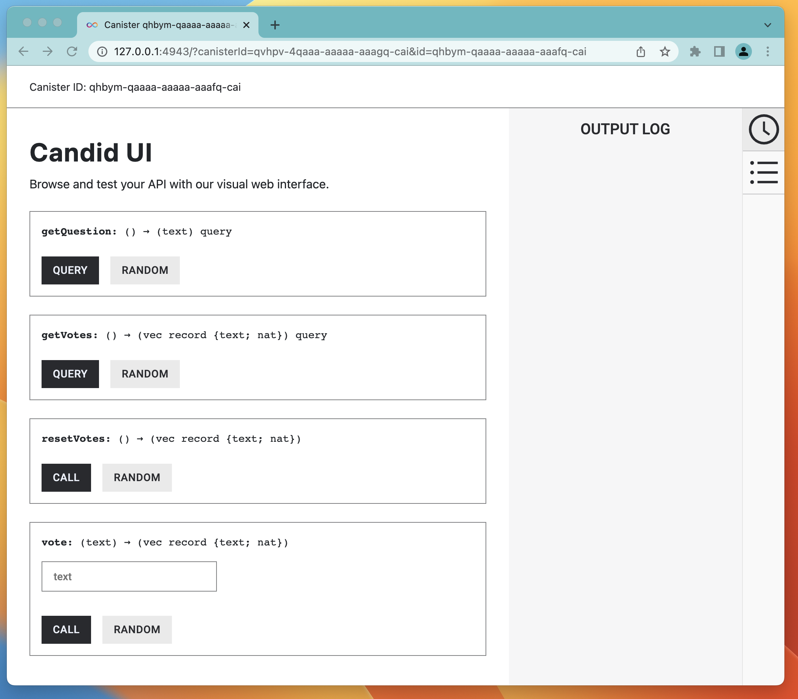

# Step 5 - Using collections

In this step we will add new variable `options` to the actor that will hold a list of the choices that users can vote for in the poll.


## Creating a "map"

Each option is a string that describes what the user is voting for. However, since we have multiple options in the poll we will need to store them in some data structure. We will use a collection called [`RBTree`](/motoko/main/base/RBTree.md) which is similar to "maps" or "dictionaries" in other languages.

The collection will "map" option identifier (a string of type `Text`) to the option value (a natural number of type `Nat`). For example, we may have this list of options if we want to vote for our favorite programming language:

| id  | Vote Count |
| --- | ------ |
| "Motoko"   | 0 |
| "Rust"   |   0 |
| "TypeScript"   |  0 |
| "Python"   | 0     |


To use RBTree we need to import it. In addition, we will need to import the standard type [`Nat`](/motoko/main/base/Nat.md) to use some of the module's functions. So first let's add an import statement to the beginning of our file `main.mo`:
```motoko
import RBTree "mo:base/RBTree";
import Nat "mo:base/Nat";
```

Next we need to declare the variable of this type inside the actor:
```motoko
    var votes: RBTree.RBTree<Text, Nat> = RBTree.RBTree(Text.compare);
```

In this snippet we create a variable `votes`, whose type is `RBTree.RBTree<Text, Nat>`.

:::note
The current version of Motoko makes collections declarations a bit verbose and difficut to understand for beginners. We are working to create a more elegant syntax.
:::

## `getVotes` method

We need a method to query the current state of vote counts. Since the data will not be altered, the method can be a query.

Here's the code with comments inline:

```motoko
 // query the list of options and votes for each one
    // Example JSON that the frontend will get using the values above
    // [["Motoko","0"],["Python","0"],["Rust","0"],["TypeScript","0"]]
    public query func getVotes() : async [(Text, Nat)] {
        Iter.toArray(votes.entries())
    }; 
```

- The method returns an array. Array is a simple container that can hold multiple values.
- The array element is a tuple, another container of fixed length that has a typed value on each of the position. For example, a tuple `(Text, Nat)` represents all potential values where the first element is a natural number and the second element is a string.
- We use a class `Iter` that represents an iterator, a pointer-like data structure that allows the developer to move over another data stucture and see values one by one in a sequential manner.
-  The  statement `Iter.toArray(options.entries())` is executed in this sequence:
    1. `options.entries()` method produces an iterator of tuples `(Text, Nat)` that represent the map's values
    2. `Iter.toArray()` is a standard function that convers `Iter<(Text,Nat)>` to array of `(Text, Nat)`


To make this method work, we also need to add a new import statement to the beginning of the file:
```motoko
import Iter "mo:base/Iter";
```

## `vote` method

We need a method to vote for an option. This should be an update call since it alters the state. 

Here's the code:
```motoko
    // This methods takes an option to vote for, updates the data and returns the updated hashmap
    // Example input: vote("Motoko")
    // Example JSON that the frontend will get using the values above
    // [["Motoko","0"],["Python","0"],["Rust","0"],["TypeScript","0"]]
    public func vote(option: Text) : async [(Text, Nat)] {

      //since ?Nat returns an optional...
      var current_votes_or_null : ?Nat = votes.get(option);
      //... we need to be explicit about what to do when it is null or a number so every case is taken care of
      let current_votes : Nat = switch current_votes_or_null {
        case null 0;
        case (?Nat) Nat;
      };

      //once we have the number, update the votes
      votes.put(option, current_votes + 1);
      Iter.toArray(votes.entries())
    };
```

## `resetVotes`  method
This method resets the state of the votes so every option goes back to 0. Here's the code:


```motoko
    //This methods reset the vote count for each option and and returns the updated hashmap
    // Example JSON that the frontend will get using the values above
    // [["Motoko","0"],["Python","0"],["Rust","0"],["TypeScript","0"]]
    public func resetVotes() : async [(Text, Nat)] {
      votes.put("Motoko", 0);
      votes.put("Rust", 0);
      votes.put("TypeScript", 0);
      votes.put("Python", 0);
      Iter.toArray(votes.entries())
    };
```

Comments about the implementation:
- The method is an update call since it updates the state


## Final code
Once you completed all the changes your code should look like this:
```motoko
import Text "mo:base/Text";
import Nat "mo:base/Nat";
import RBTree "mo:base/RBTree";
import Iter "mo:base/Iter";


actor {
    
    //1. DATA
    var question: Text = "What is your favorite programming language?";
    var votes: RBTree.RBTree<Text, Nat> = RBTree.RBTree(Text.compare);
    votes.put("Motoko", 0);
    votes.put("Rust", 0);
    votes.put("TypeScript", 0);
    votes.put("Python", 0);

    //2. METHODS

    //get the question for the poll
    public query func getQuestion() : async Text { 
      question 
    };

    // query the list of options and votes for each one
    // Example JSON that the frontend will get using the values above
    // [["Motoko","0"],["Python","0"],["Rust","0"],["TypeScript","0"]]
    public query func getVotes() : async [(Text, Nat)] {
        Iter.toArray(votes.entries())
    }; 

    // This methods takes an option to vote for, updates the data and returns the updated hashmap
    // Example input: vote("Motoko")
    // Example JSON that the frontend will get using the values above
    // [["Motoko","0"],["Python","0"],["Rust","0"],["TypeScript","0"]]
    public func vote(option: Text) : async [(Text, Nat)] {
      var current_votes_or_null : ?Nat = votes.get(option);
      let current_votes : Nat = switch current_votes_or_null {
        case null 0;
        case (?Nat) Nat;
      };
      votes.put(option, current_votes + 1);
      Iter.toArray(votes.entries())
    };

    //This methods reset the vote count for each option and and returns the updated hashmap
    // Example JSON that the frontend will get using the values above
    // [["Motoko","0"],["Python","0"],["Rust","0"],["TypeScript","0"]]
    public func resetVotes() : async [(Text, Nat)] {
      votes.put("Motoko", 0);
      votes.put("Rust", 0);
      votes.put("TypeScript", 0);
      votes.put("Python", 0);
      Iter.toArray(votes.entries())
    };
    
}


```

## Deploying and testing

You will need to deploy the updated code by typing in the terminal:
```bash
$ dfx deploy
```

After the deployment process is completed, click on the link in the "Backend canister" section of the deploy command output:
```shell
URLs:
  Frontend canister via browser
    poll_frontend: http://127.0.0.1:4943/?canisterId=qsgjb-riaaa-aaaaa-aaaga-cai
  Backend canister via Candid interface:
    poll_backend: http://127.0.0.1:4943/?canisterId=qvhpv-4qaaa-aaaaa-aaagq-cai&id=qhbym-qaaaa-aaaaa-aaafq-cai
```

After that you can open Candid UI and explore the new methods:

