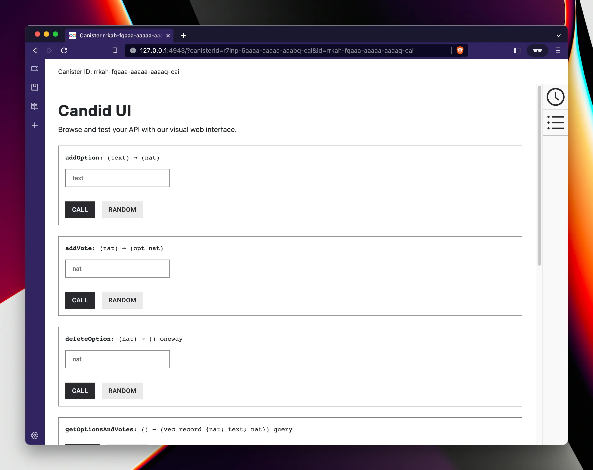

# Step 1 - Backend intro

In first part of the tutorial we will create a backend for our application that will be implemented as an ICPco
[canister smart contract](https://internetcomputer.org/how-it-works/architecture-of-the-internet-computer/#canister-smart-contracts).

Backend canisters have a default user interface called Candid UI that will allow you to interact with them without
writing any frontend code. Here's how Candid UI for our project will look like at the end of this step:

