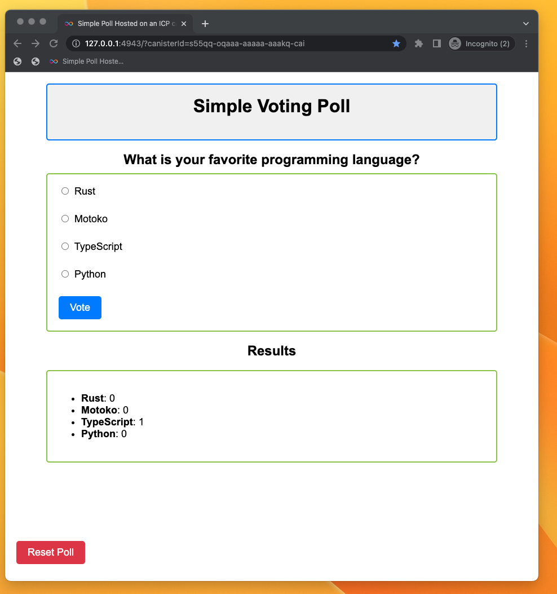

# Tutorial 2: Create your first dapp in 10 minutes

## Overview

This tutorial is a follow up to the [deploy your first dapp in 5 minutes](../deploy_sample_app.md) tutorial. 

## Introduction

This tutorial will guide you through creating a fully functioning dapp called "Poll" that allows you to host a voting poll of multiple choices and share it with other people. Both the backend and frontend will be hosted in ICP [canister smart contracts](https://internetcomputer.org/how-it-works/architecture-of-the-internet-computer/#canister-smart-contracts). The backend will be built in the [Motoko programming language](../../developer-docs/backend/choosing-language.md). To make the dapp simple to learn, this tutorial uses vanilla JavaScript for the frontend.

You finished dapp will look similar to this:
  

## Objectives
It's good to define what you are building in advance.

The dapp allow you to host only one poll and share it with other people. Some additional objectives:
- Users will be able to vote.
- Users can reset the poll to start from scratch.

## Prerequisites
To successfully complete this tutorial you will need to:
- [x] Have [Node.js](https://nodejs.org/) installed. This tutorial works best with a Node.js version higher than `16.*.*`.
- [x] Have the [IC SDK](../../developer-docs/setup/install/index.mdx) installed. You can look at [deploy your first dapp in 5 minutes](../deploy_sample_app.md) for more information.
- [x] Learn basics of the Motoko programming language. This tutorial will explain some of Motoko constructs here, however, it would not hurt to have a general feel of the language before you get started with this tutorial.
- [x] This tutorial will use Visual Studio Code to edit code, but it will work with any IDE or editor.

## Next steps
Ready to start building? Let's go!

[1: Smart contracts as a backend](01_backend-overview.md)
