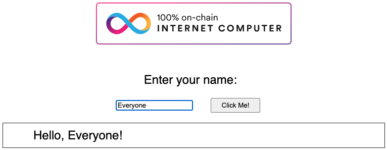
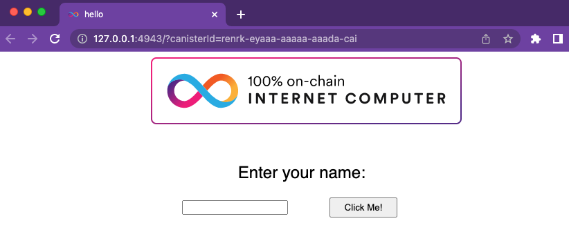
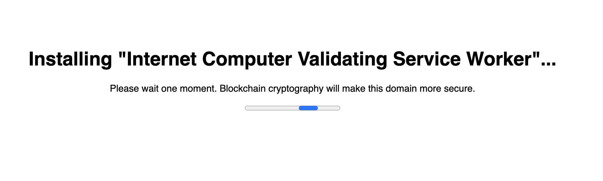

# Tutorial 1 - Deploy sample code

## 1. Introduction - what you are deploying

This is a quick tutorial to deploy a "Hello World" dapp to the Internet Computer (IC) in 5 minutes or less. Deployment of the dapp only requires basic knowledge of using a terminal. 

Before starting, take a look at a version of this dapp running on-chain: https://jqylk-byaaa-aaaal-qbymq-cai.icp0.io/

This dapp only does one thing: it accepts an text input and returns text input.



## 1. Install the canister smart contract SDK 

This tutorial use a Canister SDK called `dfx`, which is the default SDK maintained by the DFINITY foundation. 

To install `dfx`, run:

``` bash
sh -ci "$(curl -fsSL https://internetcomputer.org/install.sh)"
```

To verify that `dfx` properly installed, run:

``` bash
dfx --version
```

## 2. Create a project (1 min)

A `dfx` project is a set of artifacts, including source code and configuration files, that can be compiled to a canister smart contract. By running 

``` bash
dfx new hello
cd hello
dfx start
```

-   The `dfx new hello` command created a new project called `hello` in your local machine
-   `cd hello` navigates your terminal into the newly-created `hello` project
-   `dfx start` starts a local instance of the IC to test and deploy too

:::note

-   Depending on your platform and local security settings, you might see a warning displayed. If you are prompted to allow or deny incoming network connections, click "Allow."

:::

**🎉 Congratulations! 🎉 **

There is now a local Instance of the execution environment of the IC running on your machine! Leave this window/tab running while you continue so the tutorial can continue without issues.

## 3. Deploy the dapp locally

In a new terminal window, navigate to the root directory `hello` project, then run:

``` bash
npm install
dfx deploy
npm start
```

Output should provide a URL for where your dapp can be accessed. For example:

``` bash
URLs:
  Frontend canister via browser
    hello_frontend: http://127.0.0.1:4943/?canisterId=renrk-eyaaa-aaaaa-aaada-cai
  Backend canister via Candid interface:
    hello_backend: http://127.0.0.1:4943/?canisterId=rdmx6-jaaaa-aaaaa-aaadq-cai&id=rno2w-sqaaa-aaaaa-aaacq-cai
```

-  In the sample output above, `hello_frontend` is the frontend of the dapp, it can be accessed at http://127.0.0.1:4943/?canisterId=renrk-eyaaa-aaaaa-aaada-cai. You should have a different URL when you deploy locally.

**🎉 Success! 🎉 **

You have deployed your first ICP dapp locally.


### Test the dapp locally via the command line

Now that the canister smart contract is deployed to the local execution environment, you can interact with it by sending and receiving messages. Since the canister has a method called `greet` (which accepts a string as a parameter), we will send it a message. 

Run the following command:
``` bash
dfx canister call hello_backend greet everyone
```

-   The `dfx canister call` command requires you to specify a canister name and function to call.
-   `hello_backend` specifies the name of the canister you call.
-   `greet` specifies the function name.
-   `everyone` is the argument that you pass to the `greet` function.

### Test the dapp locally via the browser

Now that you have verified that your dapp has been deployed and tested its operation using the command line, let’s verify that you can access the frontend using your web browser.

Open a browser and navigate to the URL received for `hello_frontend` from the previous step. Every user will have a different URL. 

You should see this: 



## 4. Deploying dapp on-chain

### Acquiring cycles to deploy on-chain (5 min)

In order to run on-chain, IC dapps require cycles to pay for computation and storage. This means that the developer needs to acquire cycles and fill their canister with them. Cycles are created from ICP tokens.

This flow may be surprising to people familiar with Web2 software where they can add a credit card to a hosting provider, deploy their apps, and get charged later. In Web3, blockchains require their smart contracts consume **something** (whether it is Ethereum’s gas or the IC’s cycles). The next steps will likely be familiar to those in crypto or blockchain, who grow used to the first step of deploying a dapp being "go get tokens."

You may further wonder why dapps run on cycles rather than ICP tokens. The reason is that the cost of ICP tokens fluctuate with the crypto market, but cycles are predictable and relatively stable tokens which are pegged to [SDR](https://en.wikipedia.org/wiki/Special_drawing_rights). One trillion cycles will always cost one SDR, regardless of the price of ICP.

Practical notes about cycles:

-   There is a [free cycles faucet](/developer-docs/setup/cycles/cycles-faucet.md) that grants new developers 20 trillion cycles
-   It takes 100 billion cycles to deploy a canister, but in order to load up the canister with sufficient cycles, `dfx` injects 3 trillion cycles for any canister created (this is a parameter that can be changed).
-   You can see a table of compute and storage costs here: [Computation and storage costs](../developer-docs/gas-cost.md).

### Getting started for deploying on-chain

As a sanity check, it is good practice to check if your connection to the IC is stable by pinging it:

``` bash
dfx ping ic
```

If successful you will see an output resembling the following:

``` bash
$ {
  "ic_api_version": "0.18.0"  "impl_hash": "d639545e0f38e075ad240fd4ec45d4eeeb11e1f67a52cdd449cd664d825e7fec"  "impl_version": "8dc1a28b4fb9605558c03121811c9af9701a6142"  "replica_health_status": "healthy"  "root_key": [48, 129, 130, 48, 29, 6, 13, 43, 6, 1, 4, 1, 130, 220, 124, 5, 3, 1, 2, 1, 6, 12, 43, 6, 1, 4, 1, 130, 220, 124, 5, 3, 2, 1, 3, 97, 0, 129, 76, 14, 110, 199, 31, 171, 88, 59, 8, 189, 129, 55, 60, 37, 92, 60, 55, 27, 46, 132, 134, 60, 152, 164, 241, 224, 139, 116, 35, 93, 20, 251, 93, 156, 12, 213, 70, 217, 104, 95, 145, 58, 12, 11, 44, 197, 52, 21, 131, 191, 75, 67, 146, 228, 103, 219, 150, 214, 91, 155, 180, 203, 113, 113, 18, 248, 71, 46, 13, 90, 77, 20, 80, 95, 253, 116, 132, 176, 18, 145, 9, 28, 95, 135, 185, 136, 131, 70, 63, 152, 9, 26, 11, 170, 174]
}
```

### Acquiring cycles via the free cycles faucet (2 min)

This option is best for people who want minimal time investment and have never used cycles faucet (faucet can be used only once).

For the purposes of this tutorial, you can acquire free cycles for your `Hello` dapp from the cycles faucet. Follow the instructions here: [Claim your free cycles](/developer-docs/setup/cycles/cycles-faucet.md).

#### Check your cycles balance

Now that you have used the cycles faucet, you can check your cycles balance:

``` bash
dfx wallet --network ic balance
```

You should see around 20 trillion cycles if you run this after using the cycles wallet. If so, skip to section [5. Deploying on-chain](#5deploy-on-chain-1-min). If you do not see any cycles, deploying on-chain in the rest of the tutorial will not work. 

### Deploying on-chain (1 min)

Now that you have your [cycles](/developer-docs/setup/cycles/index.md) and your `dfx` is configured to transfer cycles, you are now ready to deploy your `hello` dapp on-chain. In terminal B, run:

``` bash
npm install
dfx deploy --network ic --with-cycles 1000000000000
```

-   The `--network` option specifies the network alias or URL for deploying the dapp.  This option is required to install on the Internet Computer blockchain mainnet.
-   The `--with-cycles` explicitly tells `dfx` how many cycles to use, otherwise it will use the default of 3 trillion.


If successful, your terminal should look like this:

``` bash
Deploying all canisters.
Creating canisters...
Creating canister hello_backend...
hello_backend canister created on network ic with canister id: jxzn6-maaaa-aaaal-qbyma-cai
Creating canister hello_frontend...
hello_frontend canister created on network ic with canister id: jqylk-byaaa-aaaal-qbymq-cai
Building canisters...
Shrink WASM module size.
Building frontend...
WARN: Building canisters before generate for Motoko
WARN: .did file for canister 'hello_frontend' does not exist.
Shrink WASM module size.
Generating type declarations for canister hello_frontend:
  src/declarations/hello_frontend/hello_frontend.did.d.ts
  src/declarations/hello_frontend/hello_frontend.did.js
  src/declarations/hello_frontend/hello_frontend.did
Generating type declarations for canister hello_backend:
  src/declarations/hello_backend/hello_backend.did.d.ts
  src/declarations/hello_backend/hello_backend.did.js
  src/declarations/hello_backend/hello_backend.did

Installing canisters...
Installing code for canister hello_backend, with canister ID jxzn6-maaaa-aaaal-qbyma-cai
Installing code for canister hello_frontend, with canister ID jqylk-byaaa-aaaal-qbymq-cai
Uploading assets to asset canister...
Fetching properties for all assets in the canister.
Starting batch.
Staging contents of new and changed assets in batch 1:
  /sample-asset.txt 1/1 (24 bytes) sha 2d523f5aaeb195da24dcff49b0d560a3d61b8af859cee78f4cff0428963929e6 (with 7 headers)
  /main.css 1/1 (537 bytes) sha 75ac0c5aea719bb2b887fffbde61867be5c3a9eceab3d75619763c28735891cb (with 7 headers)
  /index.js.LICENSE.txt 1/1 (413 bytes) sha f2dcfd36875be0296e171d0a6b1161de82510a3e60f4d54cc1b4bec0829f8b33 (with 7 headers)
  /favicon.ico 1/1 (15406 bytes) sha 4e8d31b50ffb59695389d94e393d299c5693405a12f6ccd08c31bcf9b58db2d4 (with 7 headers)
  /index.html (gzip) 1/1 (350 bytes) sha 16289744897bd78f5df24924dac6972c19e0bb56f5ddcf695de65656b942d769 (with 7 headers)
  /logo2.svg 1/1 (15139 bytes) sha 037eb7ae523403daa588cf4f47a34c56a3f5de08a5a2dd2364839e45f14f4b8b (with 7 headers)
  /index.js.LICENSE.txt (gzip) 1/1 (273 bytes) sha db89b3ccdfe399f8ef3135c0b076326a0ae9e1c96409f79f8e686031537c572c (with 7 headers)
  /index.js (gzip) 1/1 (88325 bytes) sha 37809370db58979a0bd92a68eb403eb06f9314748862376e2b4ac2d6d171e631 (with 7 headers)
  /main.css (gzip) 1/1 (299 bytes) sha b4879e7ba34e68b2965d626e48d772ce615e4f6b78b69cc8f2f91127ed18b850 (with 7 headers)
  /index.html 1/1 (539 bytes) sha 053f9dc1283c64d114d43cbf03b0b0062afae08a04a5044ae58dbc68f4a1f93f (with 7 headers)
  /index.js 1/1 (246603 bytes) sha 0de3c2e257ca0ac85423b3e4c7dc0a3aeb8906b73e3b72e47924ed6e80247406 (with 7 headers)
Committing batch.
Deployed canisters.
URLs:
  Frontend canister via browser
    hello_frontend: https://jqylk-byaaa-aaaal-qbymq-cai.icp0.io/
  Backend canister via Candid interface:
    hello_backend: https://a4gq6-oaaaa-aaaab-qaa4q-cai.raw.icp0.io/?id=jxzn6-maaaa-aaaal-qbyma-cai
```

Note the bottom of the message which returns the URL where you can see your canister’s frontend deployed on-chain: <https://jqylk-byaaa-aaaal-qbymq-cai.icp0.io/>

In the example above, we created a `hello` dapp that is composed of:

1.  `hello_backend` canister smart contract `5o6tz-saaaa-aaaaa-qaacq-cai` which contains the backend logic.

2.  `hello_frontend` canister smart contract `5h5yf-eiaaa-aaaaa-qaada-cai` which contains the frontend assets (e.g. HTML, JS, CSS).

### Testing the on-chain dapp via the command line

Like testing locally, you can ping your on-chain canister via the command line. Run this:

``` bash
dfx canister --network ic call hello_backend greet '("everyone": text)'
```

Note the way the message is constructed:

-   `dfx canister --network ic call` is the setup for calling a canister on the IC.

-   `hello_backend greet` means we are sending a message to a canister named `hello_backend` and evoking its `greet` method. `dfx` knows which `hello_backend` canister (out of the many in the IC), one refers to because a mapping of `hello_backend` to a canister id is stored locally in `.dfx/local/canister_ids.json`.
-   `'("everyone": text)'` is the parameter we are sending to `greet` (which accepts `Text` as its only input).


### See your dapp live on-chain via a browser

Navigate to and enter a name: <https://5h5yf-eiaaa-aaaaa-qaada-cai.icp0.io/>

Before your dapp loads, your browser will quickly show a message that reads: Installing "Internet Computer Validating Service Worker". This [service worker](https://developer.chrome.com/docs/workbox/service-worker-overview/) comes from the ICP network and it is used to make sure the web app the user sees is the correct, untampered frontend. Once loaded, your browser will cache the service worker and your web app will load much quicker.



After loading the service worker, your dapp will load as expected.

## Wrap-up

Congratulations! You have built a dapp fully on-chain (both backend and frontend) within 10 minutes.

Tutorial takeaways:
-   Dapps can be composed of multiple canisters
-   Dapps can be deployed locally and on-chain
-   Cycles are needed power dapps
-   Get free cycles from the cycles wallet
-   Free cycles can be used to power additional dapps

### Starting from scratch

If you wish to start from scratch, delete the SDK and associated profiles and re-install it. Follow the instructions here: [Install, upgrade, or remove software](/developer-docs/setup/install/index.mdx).

**Be sure to save any identities linked to dapps or ICP.**

### Getting Stuck?

If you get stuck or run into problems search for solutions or post questions in the [Developer forum](https://forum.dfinity.org) or [DISCORD](https://discord.com/invite/cA7y6ezyE2).

### Ready for the next challenge?

Build DAOs, NFTs and more [here](https://internetcomputer.org/samples).

### Want to learn more?

If you are looking for more information before getting started or want to view a demonstration of how to deploy before you try it for yourself, check out the following related resources:

-   [How you can use ICP tokens (overview)](/concepts/tokens-cycles.md#using-tokens)

-   [Building on the Internet Computer: Fundamentals (video)](https://www.youtube.com/watch?v=jduSMHxdYD8)

-   [What is the DFINITY Canister SDK (video)](https://www.youtube.com/watch?v=60uHQfoA8Dk)

-   [Deploying your first dapp (video)](https://www.youtube.com/watch?v=yqIoiyuGYNA)