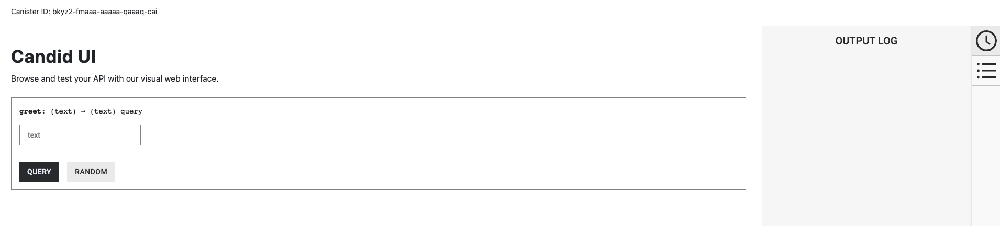
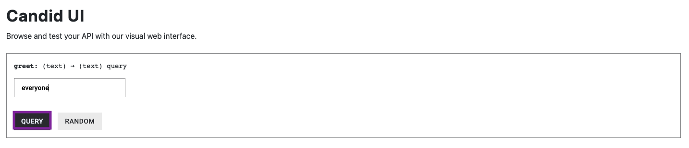

# 1.1: Exploring a live demo

## Overview

In the previous segment of our developer journey, introduction to `dfx`, we created a new `dfx` project using the default 'Hello, world' template and looked into the project's structure and code. However, we didn't build or deploy the canister. 

In this tutorial, we'll deploy the `hello_world_backend` canister from [0.6: Introduction to dfx](../level-0/06-intro-dfx.md) to the Motoko playground.

## What is the Motoko playground?

The Motoko playground is a development environment that hosts a 'canister pool' that canisters can be deployed to. When canisters are deployed to the Motoko playground, they temporarily borrow resources from the pool and are allotted a small amount of cycles that can be used during the canister's deployment. Canisters deployed to the playground can run for 20 minutes; after 20 minutes, the canister will be uninstalled and the resources borrowed are returned to the playground's canister pool. 

:::info
While the Motoko playground has 'Motoko' in the title, it can be used to deploy canisters written in any development language, not just Motoko.
:::

The playground is a great way to be able to deploy a canister quickly for short, small-scale testing, or just to get familiar with the deployment process and how to interact with a canister without needing to complete additional deployment steps, such as acquiring cycles and setting up a cycles wallet.  

Since the playground is designed for testing purposes, there are several restrictions imposed on canisters that have been deployed to the playground that you should be aware of. These restrictions are:

- Cycle transfer instructions are silently ignored by the system; you cannot transfer cycles to or from your canister on the playground. This means that you cannot use functions such as HTTPS outcalls or threshold ECDSA, since these functions require attached cycles. 
- Wasm files can't be gzipped.
- Wasm files for deployed canisters will be analyzed to remove any potentially expensive or malicious operations.
- Canisters can use at most 1GB of memory.
- Canisters can call the management canister to manage itself without being the controller.
- Deployed canisters expire after 20 minutes.

## `dfx deploy --playground`

Using the `dfx` command `dfx deploy --playground`, canisters can be deployed directly from the CLI to the Motoko playground.

First, let's take a look at how to use this command to deploy our canister. Then we'll explore how we can interact with that canister once it has been deployed. This will act as a live demo for us to explore and use to gain an understanding of the deployment and interaction process. 

### Prerequisites

Before you start, verify that you have set up your developer environment according to the instructions in [0.3: Developer environment setup](../level-0/03-dev-env.md).

This example works with the canister previously created in the [0.6: Introduction to dfx](../level-0/06-intro-dfx.md) module. We recommend completing that module before beginning the steps outlined here. 

### Deploying to the playground using `dfx`

:::info
`dfx deploy --playground` is available in `dfx` versions `v0.15.1` and above.
:::

To deploy a canister to the playground network, first open a terminal window if you do not already have one open.

Then, navigate into the project that we created in the [0.6: Introduction to dfx](../level-0/06-intro-dfx.md) module. You can use a command such as:

```sh
cd developer_journey
```

For more information on file system navigation using the CLI, check out the documentation on the [`cd` command](https://linuxcommand.org/lc3_man_pages/cdh.html). 

For a review on the project's structure and our `main.mo` source code file, you can review the [0.6: Introduction to dfx](../level-0/06-intro-dfx.md) module.

Before we can deploy the canister, we need to start the local execution environment. To do this, run the command:

```sh
dfx start --background
```

This command starts the local execution environment in the background. Without the `--background` flag, the output of the execution environment will take over the terminal window and you would need to open a second terminal window to continue running commands. 

Then, to deploy this canister to the playground, run the command:

```sh
dfx deploy developer_journey_backend --playground
```

:::info
This command deploys just the backend canister, since that will be the canister we're focused on. To deploy all canisters listed in the `dfx.json` file, which by default includes a frontend canister in addition to the backend canister, you can use the `dfx deploy --playground` command without specifying the canister's name. 
:::

The output of this command will resemble the following:

```
Deployed canisters.
URLs:
  Backend canister via Candid interface:
    developer_journey_backend: http://bkyz2-fmaaa-aaaaa-qaaaq-cai.icp0.io
```

### Interacting with the canister via the CLI

Once deployed, the canister can be interacted with from the command line, or from the URL shown in the output above that refers to the backend canister's Candid interface. First, let's look at using the command line. 

If you recall from the [0.6: Introduction to dfx](../level-0/06-intro-dfx.md) module, our canister has a single method called `greet`, which we can call using a command such as:

```sh
dfx canister --network playground call developer_journey_backend greet '("everyone")'
```

This command sends a message to the `developer_journey_backend` canister that has been deployed on the playground network (indicated by the `--network playground` flag), and calls the method `greet`, then passes the text `'("everyone")'` to the method. 

As a result, the canister should return the following reply:

```
("Hello, everyone!")
```

You can change the text portion to anything you'd like to test the method further. For example, instead of 'everyone', we can pass 'developers' into the method, such as:

```sh
dfx canister --network playground call developer_journey_backend greet '("developers")'
```

This will return the reply:

```sh
("Hello, developers!")
```

:::info
Any commands that intend to target a canister deployed to the playground must use the `--playground` or `--network playground` flag in order to target the borrowed canister(s). 
:::

### Interacting with the canister via the Candid interface

Now let's use the Candid interface instead. To use the Candid interface instead of the command line, first navigate to the URL provided in the output when the canister was deployed. This URL will look like:

```
http://bkyz2-fmaaa-aaaaa-qaaaq-cai.icp0.io
```

The user interface should resemble the following:



In this interface, you can see the single method in the canister, `greet`, and the possible parameters that can be passed, `(text)`. In the text box provided, enter the text you'd like to pass to the `greet` method. Then, select the `query` button to submit the call. 



You will see the output of the method in the output log on the right side of the interface, plus in the output below the method, as shown below. 


You can play around with this user interface by inputting different text, such as 'developers' instead of 'everyone'. 


## Next steps

Now that we've explored a live canister deployed on the Motoko playground, we'll move onto developing our own dapp rather than using the default template files. But first, let's go over the basics of Motoko in Motoko level 1. 

- [1.2: Motoko level 1](1.2-motoko-lvl1.md).