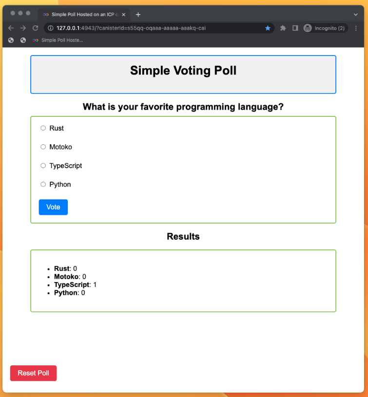

import DfxNewSnippet from "/src/components/Snippets/DfxNewSnippet.mdx";
import { MarkdownChipRow } from "/src/components/Chip/MarkdownChipRow";

# 1.3 Developing your first dapp

<MarkdownChipRow labels={["Beginner", "Tutorial"]} />

<iframe width="560" height="315" src="https://www.youtube.com/embed/nUB7_KjE-uU?si=TRqLKWJqJ-apPVxo" title="YouTube video player" frameborder="0" allow="accelerometer; autoplay; clipboard-write; encrypted-media; gyroscope; picture-in-picture; web-share" allowfullscreen></iframe>

## Overview

At this point in your developer journey, you've covered the fundamentals of canister development and deployed the default 'Hello, world' project template on the Motoko playground. It's time to get into writing code and developing your own first dapp!

For this tutorial, you'll be creating a poll dapp that includes both a backend canister and a frontend canister. To recap, backend canisters are used to host the dapp's smart contract code, while frontend canisters are used to host user interface assets, such as HTML and CSS.

The poll dapp will ask the end user a question, then have them vote on which answer they'd like to select.

## Prerequisites

Before you start, verify that you have set up your developer environment according to the instructions in [0.3 Developer environment setup](/docs/current/tutorials/developer-journey/level-0/dev-env).

## Creating a new project

First, you need to create a new `dfx` project. Open a terminal window, navigate into your working directory (`developer_journey`), then use the commands:

```bash
dfx start --clean --background
```

<DfxNewSnippet />

## Reviewing the project's file structure

Let's review the project's file structure:

```bash
poll                   # The root of the project
├── README.md
├── dfx.json           # The configuration file for your Internet Computer dapp
├── package-lock.json  # Node.js package configuration
├── package.json       # Node.js package configuration
├── src
│   ├── poll_backend   # Folder containing the source code of your dapp's backend.
│   │   └── main.mo    # The default source code file; this is what you'll primarily be working with in this tutorial.
│   └── poll_frontend  # Folder containing the frontend configuration and assets of your dapp.
│       └── ...
└── webpack.config.js  # Web dapp bundler configuration.
```

You will notice that the file structure above has two sub-directories within `src`. That is because when you created the project `poll` via `dfx new poll`, the project by default created **two** canisters that talk to each other:
- `src/poll_backend` which contains the files that serve as the backend of the dapp.
- `src/poll_frontend` which contains the files that serve as the frontend of the dapp.

This file structure is the default template `dfx` creates for a new project. If you'd like to create a project without a frontend canister, the `--no-frontend` flag can be used with the `dfx new` command.

## Writing the backend canister code

Let's start writing the code for the backend of our dapp. Open your code editor of choice, then open the file `src/poll_backend/main.mo`. By default, this file will contain the same code you reviewed in the [introduction to dfx](/docs/current/tutorials/developer-journey/level-0/intro-dfx) module. Since you want to write your own code, delete the entire contents of this file.

### Creating an actor

First, you'll create an actor. Recall that an actor is a process with an encapsulated state. Actors contain both code and data, and communicate by sending and receiving messages. A canister can only contain a single actor.

In your `src/poll_backend/main.mo` file, paste the following code:

:::caution
The following example is a **code snippet** that is part of a larger code file. This snippet may return an error if run on its own. To view the full code file that should be run, please see [final code](#final-code).
:::

```motoko
actor {

    //actor code goes here

}
```

This code defines an actor, but it is currently empty. It does not define any data or send and receive messages.

Next, let's add some code inside the actor that proposes a question for your poll app. For example, you can ask the user, "What is your favorite programming language?".

To add this question, insert the following code inside of the actor definition:

:::caution
The following example is a **code snippet** that is part of a larger code file. This snippet may return an error if run on its own. To view the full code file that should be run, please see [final code](#final-code).
:::

```motoko
    var question: Text = "What is your favorite programming language?";
```

:::info
**What does this code do?**

First, it creates a new actor variable called `question`.

Then, it declares the type of this variable as `Text`, which is the standard type for strings in Motoko.
:::

Since you are using the type `Text`, you need to import the type `Text` from the Motoko base library. To do this, add an import statement at the top of the file:

```motoko
import Text "mo:base/Text";
```

After all of these changes, your `main.mo` file should look like this:

:::caution
The following example is a **code snippet** that is part of a larger code file. This snippet may return an error if run on its own. To view the full code file that should be run, please see [final code](#final-code).
:::

```motoko
import Text "mo:base/Text";

actor {
    var question: Text = "What is your favorite programming language?";

}
```

Now, our code has an actor with one fixed variable and no methods.

For our next step, you'll add access methods. This is because in order to communicate with other canisters or any other external entity, actors must send and receive messages.

Specifically for your poll, you want to create the following functionality:

- Obtain the current poll question.
- Receive a list of possible options that can be voted on.
- Submit a vote and have the dapp save the results.
- Reset the vote counts to re-run the poll.

### Defining the `getQuestion` method

Let's start with the first functionality; obtain the current poll question. To do this, you'll create the `getQuestion` method using the following code:

:::caution
The following example is a **code snippet** that is part of a larger code file. This snippet may return an error if run on its own. To view the full code file that should be run, please see [final code](#final-code).
:::

```motoko
public query func getQuestion() : async Text {
    question
};
```

:::info
**What does this code do?**

This `getQuestion` method takes the current value of the `question` variable and returns it to the caller. There are some important things regarding methods and their behavior to be aware of, such as:

- All methods that return values on ICP have to be declared as `async` in order to allow asynchronous execution.
- Since the `getQuestion` method doesn't change any data, it can be declared as a `query` call. you'll dive further into this shortly.
- This method uses the `Text` type that you previously have already imported at the top of the file.
:::

### Query calls vs. update calls

A **query call** is executed on one node of a subnet. It is not possible to use query calls to alter data.

An **update call** is executed on all nodes of a subnet. The result must pass through consensus on the subnet and has the ability to alter data.

A detailed comparison breakdown can be found below:

|                      | Queries                    | Updates                |
|----------------------|----------------------------|------------------------|
| Resource consumption | Low                        | High                   |
| Response times       | Fast (300ms-900ms)         | Slow (2s-10s)          |
| Cost                 | Low                       | Cost cycles            |
| Data change         | Not allowed to change data | Allowed to change data |
| Security            | Results not certified by default | Results [certified by default](https://internetcomputer.org/how-it-works/asset-certification/) |


After adding the `getQuestion` method, your `main.mo` file should look like this:

```motoko
import Text "mo:base/Text";


actor {
    var question: Text = "What is your favorite programming language?";

    public query func getQuestion() : async Text {
      question
    };
}
```

### Creating a data structure to store the data

In your poll, you will be storing each poll option and a number associated with how many votes each option has. This collection of data will be in the form of a *key-value store*. In other languages, this data structure is known as a "dictionary" or a "map". In Motoko, this data structure is called an [`RBTree`](/motoko/main/base/RBTree.md).

`RBTree` maps a **vote option** of type `Text` to a **vote count** of type `Nat`. `Text` is a data type for string text values, and `Nat` is a data type for natural numbers, which are whole numbers without decimal points.

To visualize this data structure, the following table displays how a vote option `ID` can be mapped to the current `Vote count` associated with it.

For example, the data structure for our "What is your favorite programming language?" poll may look like this:

| ID  | Vote count |
| --- | ------ |
| "Motoko"   | 0 |
| "Rust"   |   0 |
| "TypeScript"   |  0 |
| "Python"   | 0     |

### Importing additional dependencies

In order to store and query the `RBTree` data structure, you need to import a few different things. These are:

- To use `RBTree`, you need to import `RBTree`.
- To use `Nat` data types, you need to import `Nat`.
- Later in this tutorial you will use `Iter`, which you will import now so that it is ready to use later.

To import these packages, add the following import statements to the beginning of the `main.mo` file:

```motoko
import RBTree "mo:base/RBTree";
import Nat "mo:base/Nat";
import Iter "mo:base/Iter";
```

### Declaring the `votes` variable
Next, you need to add some code inside the actor to declare the variable for the data structure:

```motoko
    var votes: RBTree.RBTree<Text, Nat> = RBTree.RBTree(Text.compare);
```

:::info
**What does this code do?**
In this code, you create a variable called `votes` with the type `RBTree.RBTree<Text, Nat>`.
:::

### Declaring the `getVotes` method

Now that you have the data collection structure, you need to create a method that queries the amount of vote counts per option. This will be a query call, since it will not alter the data.

Insert the following code into your `main.mo` file; there are inline comments that help explain the code's logic:

:::caution
The following example is a **code snippet** that is part of a larger code file. This snippet may return an error if run on its own. To view the full code file that should be run, please see [final code](#final-code).
:::


```motoko
// query the list of entries and votes for each one
// Example:
//      * JSON that the frontend will receive using the values above:
//      * [["Motoko","0"],["Python","0"],["Rust","0"],["TypeScript","0"]]

    public query func getVotes() : async [(Text, Nat)] {

        Iter.toArray(votes.entries())

    };

```

:::info
**What does this code do?**

First, the `getVotes` method returns an [`Array`](/docs/motoko/main/base/Array.md), which is a simple container used to store multiple values. In this code, the array holds elements in that are in the form of a `tuple`. A tuple stores multiple items in a single variable. The tuples in this code are of type `(Text, Nat)`.

Then, the class `Iter` represents an iterator, which is a pointer-like data structure allowing for the data structure's values to be parsed one by one in a sequential manner. This class uses the statement `Iter.toArray(votes.entries())` which executes the `votes.entries()` method, and then produces an iterator of tuples `(Text, Nat)` that represent the `RBTree`'s values.

Then, the `Iter.toArray()` is a standard function that converts `Iter<(Text,Nat)>` to an array of `(Text, Nat)`. This step is so that the frontend receives an array instead of an iterator.
:::


### Declaring the `votes` method

Our next step is to create a new method called `votes` that uses an update call to update the canister's state.

Insert the following code into your `main.mo` file; there are inline comments that help explain the code's logic:

:::caution
The following example is a **code snippet** that is part of a larger code file. This snippet may return an error if run on its own. To view the full code file that should be run, please see [final code](#final-code).
:::


```motoko
 // This method takes an entry to vote for, updates the data and returns the updated hashmap
// Example input: vote("Motoko")
// Example:
//      * JSON that the frontend will receive using the values above:
//      * [["Motoko","1"],["Python","0"],["Rust","0"],["TypeScript","0"]]

  public func vote(entry: Text) : async [(Text, Nat)] {

    //Check if the entry already has votes.
    //Note that "votes_for_entry" is of type ?Nat. This is because:
    // * If the entry is in the RBTree, the RBTree returns a number.
    // * If the entry is not in the RBTree, the RBTree returns `null` for the new entry.
    let votes_for_entry :?Nat = votes.get(entry);

    //Need to be explicit about what to do when it is null or a number so every case is taken care of
    let current_votes_for_entry : Nat = switch votes_for_entry {
      case null 0;
      case (?Nat) Nat;
    };

    //once you have the number of votes, update the votes for the entry
    votes.put(entry, current_votes_for_entry + 1);

    //Return the number of votes as an array (so frontend can display it)
    Iter.toArray(votes.entries())
  };
```

:::info
**What does this code do?**

The `?Nat` data type is a [Motoko optional](/docs/motoko/main/base/Option.md) data type that may be a `Nat` or a `null` value. If an entry is queried for the `RBTree` data structure titled `votes`, but the entry is not present, it will return `null`. That is why you use a Motoko optional in line 11.
:::

### Declaring the `resetVotes`  method

Lastly, you'll declare the `resetVotes` method that'll be used to reset the state of each vote option back to 0.

Insert the following code into your `main.mo` file; there are inline comments that help explain the code's logic:

:::caution
The following example is a **code snippet** that is part of a larger code file. This snippet may return an error if run on its own. To view the full code file that should be run, please see [final code](#final-code).
:::

```motoko
//This method resets the vote count for each option and returns the updated hashmap
// Example JSON that the frontend will get using the values above
// [["Motoko","0"],["Python","0"],["Rust","0"],["TypeScript","0"]]

    public func resetVotes() : async [(Text, Nat)] {

      votes.put("Motoko", 0);
      votes.put("Rust", 0);
      votes.put("TypeScript", 0);
      votes.put("Python", 0);
      Iter.toArray(votes.entries())

    };
```

:::info
**What does this code do?**
This method is an update call, as it updates the canister's state. All Motoko functions are update calls by default; they are only query calls when they have the `query` keyword before the `func` keyword.
:::

## Final code

Once you completed all of the above steps, your `main.mo` file should look like this:

```motoko
import RBTree "mo:base/RBTree";
import Nat "mo:base/Nat";
import Text "mo:base/Text";
import Iter "mo:base/Iter";


actor {

  var question: Text = "What is your favorite programming language?";
  var votes: RBTree.RBTree<Text, Nat> = RBTree.RBTree(Text.compare);


  public query func getQuestion() : async Text {
    question
  };

// query the list of entries and votes for each one
// Example:
//      * JSON that the frontend will receive using the values above:
//      * [["Motoko","0"],["Python","0"],["Rust","0"],["TypeScript","0"]]

    public query func getVotes() : async [(Text, Nat)] {

        Iter.toArray(votes.entries())

    };


 // This method takes an entry to vote for, updates the data and returns the updated hashmap
// Example input: vote("Motoko")
// Example:
//      * JSON that the frontend will receive using the values above:
//      * [["Motoko","1"],["Python","0"],["Rust","0"],["TypeScript","0"]]

  public func vote(entry: Text) : async [(Text, Nat)] {

    //Check if the entry already has votes.
    //Note that "votes_for_entry" is of type ?Nat. This is because:
    // * If the entry is in the RBTree, the RBTree returns a number.
    // * If the entry is not in the RBTree, the RBTree returns `null` for the new entry.
    let votes_for_entry :?Nat = votes.get(entry);

    //Need to be explicit about what to do when it is null or a number so every case is taken care of
    let current_votes_for_entry : Nat = switch votes_for_entry {
      case null 0;
      case (?Nat) Nat;
    };

    //once you have the number of votes, update the votes for the entry
    votes.put(entry, current_votes_for_entry + 1);

    //Return the number of votes as an array (so frontend can display it)
    Iter.toArray(votes.entries())
  };

  public func resetVotes() : async [(Text, Nat)] {
      votes.put("Motoko", 0);
      votes.put("Rust", 0);
      votes.put("TypeScript", 0);
      votes.put("Python", 0);
      Iter.toArray(votes.entries())
  };

};
```

### Deploying the dapp locally

To deploy your dapp locally, first assure that your local ICP execution environment is currently running. If you need to start the local canister execution environment, run the command:

```bash
dfx start --clean --background
```

Then, you can deploy the dapp with the command:

```bash
dfx deploy
```

You may recall that in the previous module, [exploring a live demo](/docs/current/tutorials/developer-journey/level-1/1.1-live-demo), you used the `--playground` flag to deploy your canister to the Motoko playground network. In this module, you aren't using any flags, which defaults to deploying the canister to the local environment. You can also specify this with the flag `--network local`.

Additionally, you aren't specifying a canister name in the `dfx deploy` command, which will deploy all canisters listed in the `dfx.json` file, which by default includes both the `poll_backend` and `poll_frontend` canisters.

The output of the `dfx deploy` command will resemble the following:

```bash
URLs:
  Frontend canister via browser
    poll_frontend: http://127.0.0.1:4943/?canisterId=qsgjb-riaaa-aaaaa-aaaga-cai
  Backend canister via Candid interface:
    poll_backend: http://127.0.0.1:4943/?canisterId=qvhpv-4qaaa-aaaaa-aaagq-cai&id=qhbym-qaaaa-aaaaa-aaafq-cai
```

## Adding pre-developed frontend code

Now let's create a frontend for users to interact with your dapp. You will use some basic JavaScript to keep it as simple as possible.

Start by opening the file `/src/poll_frontend/src/index.html` in your code editor, then replace the existing content with the following:

```html
<!DOCTYPE html>
<html lang="en">
<head>
    <meta charset="UTF-8">
    <meta name="viewport" content="width=device-width, initial-scale=1.0">
    <title>Simple poll dapp hosted on an ICP canister smart contract</title>

    <style>
      body {
        font-family: Arial, sans-serif;
        margin: 0;
        padding: 0;
      }

      .container {
        max-width: 800px;
        margin: 0 auto;
        padding: 20px;
        position: relative;
      }

      .title-container {
        border: 2px solid #007bff;
        background-color: #f0f0f0;
        padding: 20px;
        border-radius: 5px;
      }

      h1 {
        font-size: 32px;
        margin-bottom: 20px;
        text-align: center;
        margin-top: 0;
      }

      h2 {
        font-size: 24px;
        margin-bottom: 10px;
        text-align: center;
      }

      form {
        margin-bottom: 20px;
        border: 2px solid #8bc34a;
        padding: 20px;
        border-radius: 5px;
      }

      label {
        display: block;
        margin-bottom: 10px;
        font-size: 18px;
        text-align: left;
      }

      input[type="radio"] {
        margin-right: 5px;
      }

      button {
        padding: 10px 20px;
        background-color: #007bff;
        border: none;
        color: #fff;
        font-size: 18px;
        cursor: pointer;
        border-radius: 5px;
      }

      button#reset {
        background-color: #dc3545;
        position: absolute;
        bottom: 20px;
        left: 20px;
        margin: 10px 0; /* Add margin */
      }

      button:hover {
        background-color: #0056b3;
      }

      #results {
        margin-top: 20px;
        font-size: 18px;
        border: 2px solid #8bc34a;
        padding: 20px;
        border-radius: 5px;
        position: relative;
      }
    </style>
</head>
<body>
    <div class="container">
      <div class="title-container">
        <h1>Simple Voting Poll</h1>
      </div>
      <h2 id="question">What is your favorite programming language?</h2>

      <!-- Form where users vote -->
      <div class="form-container">
        <form id="radioForm">
            <label>
                <input type="radio" name="option" value="Rust"> Rust
            </label><br>
            <label>
                <input type="radio" name="option" value="Motoko"> Motoko
            </label><br>
            <label>
                <input type="radio" name="option" value="TypeScript"> TypeScript
            </label><br>
            <label>
                <input type="radio" name="option" value="Python"> Python
            </label><br>
            <button type="submit">Vote</button>
        </form>
      </div>

      <!-- Poll results appear here-->
      <h2 id="results-title">Results</h2>
      <div id="results"></div>
    </div>
    <button id="reset">Reset Poll</button>


</body>
</html>
```

:::info
**What does this code do?**
The HTML code above is a simple form that provides the end user with options to select using radio buttons. There is nothing 'Web3' or specific to ICP about this code.

Then, the `<head>` tag is used to include some basic CSS for the page's styling. To learn more about adding a stylesheet, see: [add a stylesheet](/docs/current/developer-docs/web-apps/application-frontends/add-stylesheet).
:::

Lastly, you need to update the `index.js` file in order for your frontend canister to communicate with our backend canister and have the result of that communication reflected within the frontend's HTML.

Open the `/src/poll_frontend/src/index.js` file in your code editor and replace the content of `index.js` with the following:


```javascript
const pollForm = document.getElementById("radioForm");
const resultsDiv = document.getElementById('results');
const resetButton = document.getElementById('reset');

import { poll_backend } from "../../declarations/poll_backend";

```

:::info
**What does this code do?**

In this code, the statement `import { poll_backend } from "../../declarations/poll_backend";` is what allows the frontend to import an interface for the backend canister and seamlessly interact with it.

:::

Next, let's add a query to our backend canister to get the poll's question, and a query to get the current vote count for each option:

```javascript
//Load the Simple Poll's question from the backend when the app loads
document.addEventListener('DOMContentLoaded', async (e) => {
   //note that this is at beginning of the submit callback, this is deliberate
  //This is so the default behavior is set BEFORE the awaits are called below
  e.preventDefault();

  // Query the question from the backend
  const question = await poll_backend.getQuestion();
  document.getElementById("question").innerText = question;

  //Query the vote counts for each option
  // Example JSON that the frontend will get using the values above
  // [["Motoko","0"],["Python","0"],["Rust","0"],["TypeScript","0"]]
  const voteCounts = await poll_backend.getVotes();
  updateLocalVoteCounts(voteCounts);
  displayResults();
  return false;
}, false);
```

To make this code fully functional, you'll need to add a few other pieces of Javascript. Ultimately, your `index.js` file will need to look like this:

```javascript
const pollForm = document.getElementById("radioForm");
const resultsDiv = document.getElementById('results');
const resetButton = document.getElementById('reset');

//Note you will use "poll_backend" in this JavaScript code a few times to call the backend
import { poll_backend } from "../../declarations/poll_backend";

//1. LOCAL DATA
const pollResults = {
    "Rust": 0,
    "Motoko": 0,
    "TypeScript": 0,
    "Python": 0
};

//2. EVENT LISTENERS

//Load the Simple Poll's question from the backend when the app loads
document.addEventListener('DOMContentLoaded', async (e) => {
   //note that this is at beginning of the submit callback, this is deliberate
  //This is so the default behavior is set BEFORE the awaits are called below
  e.preventDefault();

  // Query the question from the backend
  const question = await poll_backend.getQuestion();
  document.getElementById("question").innerText = question;

  //Query the vote counts for each option
  // Example JSON that the frontend will get using the values above
  // [["Motoko","0"],["Python","0"],["Rust","0"],["TypeScript","0"]]
  const voteCounts = await poll_backend.getVotes();
  updateLocalVoteCounts(voteCounts);
  displayResults();
  return false;
}, false);

//Event listener that listens for when the form is submitted.
//When the form is submitted with an option, it calls the backend canister
//via "await poll_backend.vote(selectedOption)"
pollForm.addEventListener('submit', async (e) => {
  //note that this is at beginning of the submit callback, this is deliberate
  //This is so the default behavior is set BEFORE the awaits are called below
  e.preventDefault();

  const formData = new FormData(pollForm);
  const checkedValue = formData.get("option");

  const updatedVoteCounts = await poll_backend.vote(checkedValue);
  console.log("Returning from await...")
  console.log(updatedVoteCounts);
  updateLocalVoteCounts(updatedVoteCounts);
  displayResults();
  return false;
}, false);

resetButton.addEventListener('click', async (e) => {

    e.preventDefault();

    //Reset the options in the backend
    await poll_backend.resetVotes();
    const voteCounts = await poll_backend.getVotes();
    updateLocalVoteCounts(voteCounts);

    //re-render the results once the votes are reset in the backend
    displayResults();
    return false;
}, false);

//3. HELPER FUNCTIONS

//Helper vanilla JS function to create the HTML to render the results of the poll
function displayResults() {
  let resultHTML = '<ul>';
  for (let key in pollResults) {
      resultHTML += '<li><strong>' + key + '</strong>: ' + pollResults[key] + '</li>';
  }
  resultHTML += '</ul>';
  resultsDiv.innerHTML = resultHTML;
};

//This helper updates the local JS object that the browser holds
// Example JSON that the frontend will get using the values above
  // [["Motoko","0"],["Python","0"],["Rust","0"],["TypeScript","0"]]
function updateLocalVoteCounts(arrayOfVoteArrays){

  for (let voteArray of arrayOfVoteArrays) {
    //Example voteArray -> ["Motoko","0"]
    let voteOption = voteArray[0];
    let voteCount = voteArray[1];
    pollResults[voteOption] = voteCount;
  }

};
```

:::info
**What does this code do?**

The remainder of this code is annotated with comments to help explain how it works. It can be helpful to read through and understand what this code does, but you will not be focusing on the fundamentals of Javascript until a later tutorial.
:::

## Re-deploying the dapp

Re-deploy the dapp locally with the command:

```bash
dfx deploy
```

Now, when the terminal's output displays the following, open the `poll_frontend` URL in a web browser:

```bash
  Frontend canister via browser
    poll_frontend: http://127.0.0.1:4943/?canisterId=avqkn-guaaa-aaaaa-qaaea-cai
  Backend canister via Candid interface:
    poll_backend: http://127.0.0.1:4943/?canisterId=asrmz-lmaaa-aaaaa-qaaeq-cai&id=by6od-j4aaa-aaaaa-qaadq-cai
```

Your finished dapp should be displayed in the browser and look like this:



Congratulations! You've just developed your first full dapp!

You can find the [finished code's repo](https://github.com/jessiemongeon1/dev-journey-poll-dapp/tree/main) for you to clone or fork.

## Need help?

Did you get stuck somewhere in this tutorial, or feel like you need additional help understanding some of the concepts? The ICP community has several resources available for developers, like working groups and bootcamps, along with our Discord community, forum, and events such as hackathons. Here are a few to check out:

- [Developer Discord community](https://discord.com/invite/cA7y6ezyE2), which is a large chatroom for ICP developers to ask questions, get help, or chat with other developers asynchronously via text chat.

- [Developer journey forum discussion](https://forum.dfinity.org/t/developer-journey-feedback-and-discussion/23893).

- [Developer tooling working group](https://www.google.com/calendar/event?eid=MHY0cjBubmlnYXY1cTkzZzVzcmozb3ZjZm5fMjAyMzEwMDVUMTcwMDAwWiBjX2Nnb2VxOTE3cnBlYXA3dnNlM2lzMWhsMzEwQGc&ctz=Europe/Zurich).

- [Motoko Bootcamp - The DAO Adventure](https://github.com/motoko-bootcamp/dao-adventure) - Discover the Motoko language in this 7 day adventure and learn to build a DAO on the Internet Computer.

- [Motoko Bootcamp - Discord community](https://discord.gg/YbksCUxdzk) - A community for and by Motoko developers to ask for advice, showcase projects and participate in collaborative events.

- [Motoko developer working group](https://www.google.com/calendar/event?eid=ZWVnb2luaHU0ZjduMTNpZHI3MWJkcWVwNWdfMjAyMzEwMTJUMTUwMDAwWiBjX2Nnb2VxOTE3cnBlYXA3dnNlM2lzMWhsMzEwQGc&ctz=Europe/Zurich).

- [Upcoming events and conferences](https://dfinity.org/events-and-news/).

- [Upcoming hackathons](https://dfinity.org/hackathons/).

- [Weekly developer office hours](https://discord.gg/4a7SZzRk?event=1164114241893187655) to ask questions, get clarification, and chat with other developers live via voice chat. This is hosted on our [developer Discord](https://discord.com/invite/cA7y6ezyE2) group.

- Submit your feedback to the [ICP Developer feedback board](http://dx.internetcomputer.org).

## Next steps

In this tutorial, you only deployed our dapp to your local environment. In the next module, you'll acquire cycles in order for you to deploy your dapp to the Internet Computer mainnet.

- [1.4 Acquiring and using cycles](/docs/current/tutorials/developer-journey/level-1/1.4-using-cycles).

