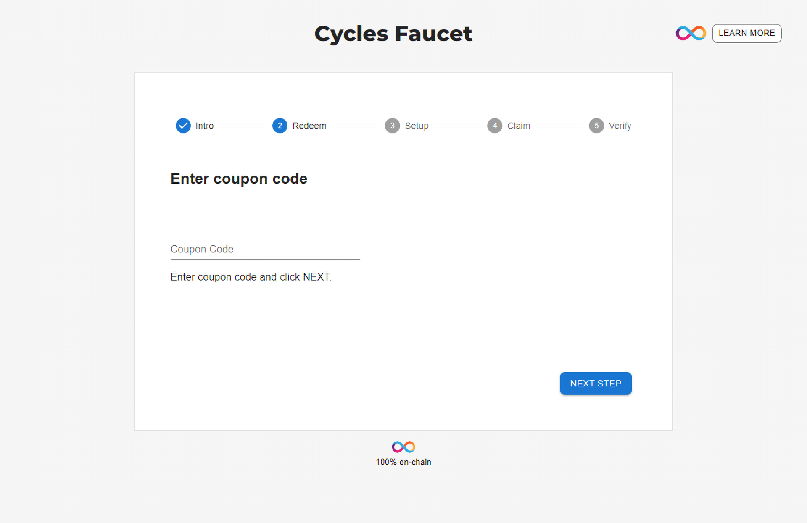

# 1.4 Acquiring and using cycles

## Overview

If you recall from the previous module, [Internet Computer terminology](../level-0/02-ic-terms.md), cycles are used to measure the resources, such as memory, storage, and compute power, that are used by a canister. When a canister is deployed on the mainnet, cycles are 'charged' for every action that a canister performs.

To obtain cycles, the IC's utility token, ICP, can be converted into cycles and transferred into a canister to be used to pay for that canister's consumed resources. Cycles have a fixed price in [XDR](https://internetcomputer.org/docs/current/references/glossary#xdr) in order to make canister costs predictable and independent of the price of ICP. One trillion cycles always correspond to one XDR.

Since cycles are not a currency and are only used to pay for a canister's consumed resources, developers manage the distribution of cycles through a special canister called a **cycles wallet**. When a canister needs to use the cycles stored in the cycles wallet, the canister's operations are executed using the canister principal of the cycles wallet, rather than your user principal. 

:::info
Recall that a principal is an entity that can be authenticated by the IC.
:::

Cycles wallets are necessary since a user's principal can't hold cycles directly; only canisters can have cycles balances. Canisters each have their own cycles balance, and don't use cycles within your cycles wallet. When you need to call a method that requires cycles, if the canister doesn't have enough cycles in it's balance or if you're creating a new canister, you will need to proxy the call through the cycles wallet in order to attach the required cycles. To assure canisters have a cycles balance, you need to deposit cycles into the canister's cycles balance, known as 'topping up' the canister. 

For local canister execution, the SDK automatically creates a default cycles wallet in every project, and operations performed using cycles are done in the background. In a production environment with canisters deployed on the mainnet, canisters will need to have cycles explicitly registered and transferred into them. Production canisters will also require principals to be configured to act as **custodians**, which are principals that have permission to send and receive cycles for the canister. 

In this tutorial, you'll learn how to set up a cycles wallet and fill it with cycles to use. Then, in the next tutorial you'll deploy a canister to the mainnet using those cycles. 

## Prerequisites

Before you start, verify that you have set up your developer environment according to the instructions in [0.3 Developer environment setup](../level-0/03-dev-env.md).

## Creating a developer identity

When you initially use `dfx`, a default developer identity is created. This identity is a `principal` data type, often referred to as your **principal identifier**. This identity is similar to a Bitcoin or Ethereum wallet address that you would use to interact with those ecosystems. 

However, your developer identity principal is not the same as your account identifier that is specified in the [ledger](../../../developer-docs/integrations/ledger/index.md). Your identity principal and your account identifier are related, but they use different formats.

:::info
Your developer identity is a private/public key pair, while your principal identity is derived from the public key. 

Each principal can control multiple accounts in the ICP (and other) ledgers.

You can learn more in the IC [specification](https://internetcomputer.org/docs/current/references/ic-interface-spec#principal).
:::

In this tutorial, you'll create a new identity principal with `dfx`, which you'll use to obtain cycles and deploy a cycles wallet. 

First, assure that `dfx` is running; if not, use the following command to start it:

```sh
dfx start --background
```

Next you will create a new developer identity with the command:

```sh
dfx identity new DevJourney
```

:::caution
This command will return a seed phrase, which will be required to recover your identity if you ever need to. This seed phrase should be backed up, so that any cycles associated with your identity are not lost.
:::

Set this identity as the one to be used by `dfx` in the current terminal session with the command:

```sh
dfx identity use DevJourney
```

You can get the principal ID of this identity with the command:

```sh
dfx identity get-principal
```

The principal will resemble the following format:

```
tsqwz-udeik-5migd-ehrev-pvoqv-szx2g-akh5s-fkyqc-zy6q7-snav6-uqe
``` 


## Acquiring cycles using a cycles coupon

Cycles can be obtained by converting ICP tokens into cycles. There are a few ways to obtain ICP tokens, such as:

- Purchasing ICP tokens directly through a crypto exchange. 
- Receiving ICP tokens as a reward for participating in the NNS governance.  
- Receiving a grant of ICP tokens through the DFINITY Foundation.
- Receiving ICP tokens in return for providing resources as a node provider. 

For new developers, a free cycles coupon can be obtained and redeemed for 10T free cycles that can be used to get started with dapp deployment. For this developer journey, you'll be obtaining and using that free cycles coupon. 

This coupon is good for new developers since it doesn't require that you transfer ICP tokens into cycles, and doesn't require a purchase of tokens to get started. 

First, navigate to the website <https://faucet.dfinity.org>. 

To obtain a coupon code to use the cycles faucet, you need to put in a written request for the coupon via the [DFINITY dev official Discord](https://discord.gg/jnjVVQaE2C) server.

Click on the **REQUEST CYCLES** button on the faucet web page to join the Discord server.


Once inside the Discord server, navigate into the `#cycles-faucet` channel. 


In this channel, execute the following slash command:

```
/request
```

This command will make a call to the IC Cycles Faucet Bot. This bot will prompt you to fill out a survey in the channel. 

Once the survey has been completed, our team will review your submission. If accepted, the faucet bot will send you a private message with a coupon code.

:::info
Please ensure that your Discord settings are set to allow direct messages from other users. If you do not have this setting enabled, you will not receive a direct message from the faucet bot.
:::

Head back to the <https://faucet.dfinity.org> webpage. 

Now, click **NEXT STEP** to continue.

Now that you have a coupon code, enter your coupon code within the faucet UI.



Click **NEXT STEP** to continue.

Return to your terminal window. If you closed the window in the process, run the following commands to start `dfx` and use your previously created identity:

```sh
dfx start --background
dfx identity use DevJourney
```

Then, redeem your coupon with the command:

```sh
dfx wallet --network ic redeem-faucet-coupon COUPON_CODE
```

Replace **COUPON_CODE** with the cycles coupon code sent to you by the DFINITY team member. 

Verify your cycles balance with the command:

```sh
dfx wallet --network ic balance
```

This should return an output showing 10T cycles in your wallet. To get the canister identifier of your new cycles wallet, run the command:

```sh
dfx identity --network ic get-wallet
```

The output of this command should resemble the following:

```
gastn-uqaaa-aaaae-aaafq-cai
```

## Converting ICP tokens to cycles

If you've already redeemed a cycles coupon in the past, or if you've already used the cycles from your coupon, you can convert ICP tokens into cycles. 

Before you can convert ICP tokens into cycles, first you need to obtain ICP tokens. ICP tokens can be purchased through a crypto exchange, or they can be received through other activities such as participating in the NNS governance and receiving grants from the DFINITY foundation. 

To get your account ID so you know where to send your ICP tokens, run the command:

```sh
dfx ledger account-id
```

This will display your account number on the ICP ledger, which will resemble the following:

```
e213184a548871a47fb526f3cba24e2ee2fbbc8129c4ab497ef2ce535130a0a4
```

Once you have sent some ICP to this account ID, you can verify that they were received by checking the balance with the command:

```sh
dfx ledger --network ic balance
```

This will output something like this:

```
12.49840000 ICP
```

Once you have your ICP tokens ready, you will need to create a cycles wallet if you haven't already. This will require your identity principal, which you can obtain by running the command:

```sh
dfx identity get-principal
```

Then, to create a cycles wallet, run the following command:

```sh
dfx ledger --network ic create-canister <PRINCIPAL_ID> --amount <ICP_TOKENS>
```

Replace the **PRINCIPAL_ID** with your identity's principal value that was returned from the `dfx identity get-principal` command, then replace **ICP_TOKENS** with the amount of tokens you'd like to convert into cycles. 

For example, if your principal is `tsqwz-udeik-5migd-ehrev-pvoqv-szx2g-akh5s-fkyqc-zy6q7-snav6-uqe` and you want to convert 3.5 ICP tokens into cycles, the command would be:

```sh
dfx ledger --network ic create-canister tsqwz-udeik-5migd-ehrev-pvoqv-szx2g-akh5s-fkyqc-zy6q7-snav6-uqe --amount 3.5
```

This command will process for a few moments, and will output something that resembles:

```
Transfer sent at BlockHeight: 351220
Canister created with id: "gastn-uqaaa-aaaae-aaafq-cai"
```

The ID in this output is the address of the canister where your wallet will live. In this example, it would be `gastn-uqaaa-aaaae-aaafq-cai`.

Now that your cycles wallet canister has been created, you need to install the wallet code with the command:

```sh
dfx identity --network ic deploy-wallet <CANISTER_ID>
```

Replace the **CANISTER_ID** with the value you received in the output of the previous command, such as:

```sh
dfx identity --network ic deploy-wallet gastn-uqaaa-aaaae-aaafq-cai
```

The output of this command will resemble the following:

```
Creating a wallet canister on the IC network.
The wallet canister on the "ic" network for user "default" is "gastn-uqaaa-aaaae-aaafq-cai"
```

To verify that your wallet is now configured and ready to use, query the balance of the wallet with the command:

```sh
dfx wallet --network ic balance
```

This should return your balance in cycles:

```
6.951 TC (trillion cycles).
```

## Resources
To further explore cycle management please see the following articles:
- **[Using a cycles wallet](/docs/developer-docs/setup/cycles/cycles-wallet.md)**.
- **[Getting free cycles from DFINITY cycles faucet](/docs/developer-docs/setup/cycles/cycles-faucet.md)**.
- **[Converting ICP tokens into cycles](/docs/developer-docs/setup/cycles/converting_icp_tokens_into_cycles.md)**.

## Need help?

Did you get stuck somewhere in this tutorial, or feel like you need additional help understanding some of the concepts? The IC community has several resources available for developers, like working groups and bootcamps, along with our Discord community, forum, and events such as hackathons. Here are a few to check out:

- [Developer Discord community](https://discord.com/invite/cA7y6ezyE2), which is a large chatroom for IC developers to ask questions, get help, or chat with other developers asynchronously via text chat. 

- [Developer journey forum discussion](https://forum.dfinity.org/t/developer-journey-feedback-and-discussion/23893).

- [Developer tooling working group](https://www.google.com/calendar/event?eid=MHY0cjBubmlnYXY1cTkzZzVzcmozb3ZjZm5fMjAyMzEwMDVUMTcwMDAwWiBjX2Nnb2VxOTE3cnBlYXA3dnNlM2lzMWhsMzEwQGc&ctz=Europe/Zurich).

- [Motoko bootcamp](https://github.com/motoko-bootcamp/bootcamp-2022), a week-long crash course to learning all things Motoko. 

- [Motoko developer working group](https://www.google.com/calendar/event?eid=ZWVnb2luaHU0ZjduMTNpZHI3MWJkcWVwNWdfMjAyMzEwMTJUMTUwMDAwWiBjX2Nnb2VxOTE3cnBlYXA3dnNlM2lzMWhsMzEwQGc&ctz=Europe/Zurich).

- [Upcoming events and conferences](https://dfinity.org/events-and-news/).

- [Upcoming hackathons](https://dfinity.org/hackathons/).

- [Weekly developer office hours](https://discord.gg/4a7SZzRk?event=1164114241893187655) to ask questions, get clarification, and chat with other developers live via voice chat. This is hosted on our [developer Discord](https://discord.com/invite/cA7y6ezyE2) group.

## Next steps

In this tutorial, you set up our identity and acquired free cycles from the cycles faucet. Now that you have cycles, you can deploy your first dapp on the IC mainnet. 

- [1.5 Deploying canisters](1.5-deploying-canisters.md).

