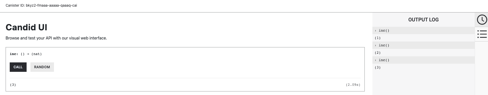
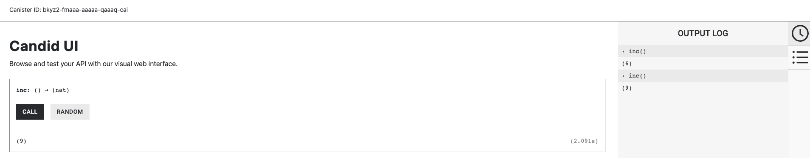

import { MarkdownChipRow } from "/src/components/Chip/MarkdownChipRow";
import '/src/components/CenterImages/center.scss';
import { GlossaryTooltip } from "/src/components/Tooltip/GlossaryTooltip";


# 2.1 Canister upgrades, storage, and persistence

<MarkdownChipRow labels={["Intermediate", "Tutorial"]} />

<iframe width="560" height="315" src="https://www.youtube.com/embed/-aXjKSz_oXc?si=Tr9dl9-fXac3SfCS" title="YouTube video player" frameborder="0" allow="accelerometer; autoplay; clipboard-write; encrypted-media; gyroscope; picture-in-picture; web-share" referrerpolicy="strict-origin-when-cross-origin" allowfullscreen></iframe>

## Overview

The Internet Computer handles persistent data storage using a feature known as **stable memory**. **Stable memory** is a unique feature of the Internet Computer that defines a data store separate from the <GlossaryTooltip>canister</GlossaryTooltip>'s regular Wasm memory data store, which is known as **heap memory**. A canister's heap memory is not persistent storage and does not persist across canister upgrades; canister data and state stored in heap memory is removed when a canister is upgraded or reinstalled. For immutable canisters that use less than the heap memory limit of 4GiB, heap memory can be used. For larger canisters, and especially those that intend to be upgraded and changed over time, stable memory is important since it persists across canister upgrades, has a much larger storage capacity than heap memory, and is very beneficial for vertically scaling a dapp.

To use stable memory requires anticipating and indicating which canister data you want to be retained after a canister upgrade. For some canisters, this data might be all of the canister's data, while for others it may be only certain parts or none. By default, stable memory starts empty, and can hold up to 400GiB as long as the <GlossaryTooltip>subnet</GlossaryTooltip> the canister is running on has the available space. If a canister uses more stable memory than 400GiB, the canister will trap and become unrecoverable.

## Memory types and terms

There are several terms associated with memory and storage on ICP. To avoid confusion between them, let's define them here.

- **Stable memory:** Stable memory refers to the Internet Computer's long-term data storage feature. Stable memory is not language specific, and can be utilized by canisters written in Motoko, Rust, or any other language. Stable memory can hold up to 400GiB if the subnet can accommodate it.

- **Heap memory:** Heap memory refers to the regular Wasm memory data store for each canister. This storage is temporary and is not persisted across canister upgrades. Data stored in heap memory is removed when the canister is upgraded or reinstalled. Heap memory is limited to 4GiB.

- **Stable storage:** Stable storage is a Motoko-specific term that refers to the Motoko stable storage feature. Stable storage uses ICP's stable memory to persist data across canister upgrades.

- **Stable variables:** Stable variables are a Motoko-specific feature that refers to variables defined in Motoko that use the `stable` modifier which indicates that the value of the variable should be persisted across canister upgrades.

To further understand stable memory and how to use it, let's learn about upgrading canisters.

## Upgrading canisters

Once a canister has been deployed and is running, there may need to be changes made to the canister's code to fix bugs or introduce new features. To make these changes, the canister must be upgraded.

Upgrading a canister is a key feature of ICP, since it allows canister smart contracts to persist using Wasm memory that utilizes ICP's stable memory feature. When a canister is upgraded, the existing state of the canister is preserved while there are changes being made to the canister's code.

### Motoko stable memory workflow

For canisters written in Motoko, stable memory can be utilized through the Motoko stable storage and stable variable features. These features are most notably used in the canister upgrade process. The upgrade process for Motoko canisters is as follows:

- First, the canister must be stopped so it does not accept any new incoming requests.
- A `pre_upgrade` hook is executed if one is defined. This hook can be used for functions such as creating a backup of data. Note: Having a `pre_upgrade` hook is not recommended, since the `pre_upgrade` hook is run in the current Wasm. If there are any bugs or errors, the canister will trap.
- Then, the system discards the canister's heap memory and initializes a new version of the canister's Wasm module. Stable memory is preserved and made available to the new Wasm module.
- Next, the new canister code is installed using the `--mode upgrade` flag.
- Then, the canister is started, now running the newly upgraded code.
- Any stable variables are re-loaded as part of the `post_upgrade` hook. After the stable variables are re-loaded, the stable memory bytes that stored those variables are overwritten with zeroes to minimize stable memory costs for the canister.

### Rust stable memory workflow

For canisters written in Rust, stable memory can be utilized through two Rust crates: [ic-stable-memory](https://github.com/seniorjoinu/ic-stable-memory) and [ic-stable-structures](https://github.com/dfinity/stable-structures). These features are most notably used in the canister upgrade process. The upgrade process for Rust canisters is as follows:

- First, the canister must be stopped so it does not accept any new incoming requests.
- A `pre_upgrade` hook is executed if one is defined. This hook can be used for functions such as creating a backup of data.
- Then, the system discards the canister's heap memory and initializes a new version of the canister's Wasm module. Stable memory is preserved and made available to the new Wasm module.
- Next, the new canister code is installed using the `--mode upgrade` flag.
- Then, the canister is started, now running the newly upgraded code.
- A `post_upgrade` hook is called on the newly created instance if one is defined. The `init` function is not executed.

## Stable storage and stable variables

Motoko supports preserving a canister's state using ICP's stable memory through a Motoko-specific feature known as **stable storage**, which is designed to accommodate changes to both the application data and the Motoko compiler. Stable storage utilizes ICP's **stable memory** feature that was discussed previously.

:::info
Upgrading canisters written in Rust and other languages use a different workflow which incorporates serialization of the canister's data. [Learn more about Rust upgrades](../../../developer-docs/backend/rust/7-upgrading.mdx).
:::

A **stable variable** is a variable defined within an actor which uses the `stable` keyword as a modifier in the variable's declaration. This indicates that the data stored in the variable should be stored using **stable storage**. If this `stable` keyword is not used, the variable is defined as `flexible` by default, which means it's data does not persist across canister upgrades.

## Interactive example
Let's take a look at defining and using a stable variable that uses Motoko's stable storage feature.

### Prerequisites

Before you start, verify that you have set up your developer environment according to the instructions in [0.3 Developer environment setup](/docs/current/tutorials/developer-journey/level-0/dev-env).

### Creating a new project

To get started, create a new project in your working directory. Open a terminal window, navigate into your working directory (`developer_journey`), then use the commands:

import TabItem from "@theme/TabItem";
import { AdornedTabs } from "/src/components/Tabs/AdornedTabs";
import { AdornedTab } from "/src/components/Tabs/AdornedTab";
import { BetaChip } from "/src/components/Chip/BetaChip";

<AdornedTabs groupId="version">
<TabItem value="0-17-0" label="dfx v0.17.0 or newer" default>

Use `dfx new <project_name>` to create a new project:

```
dfx start --clean --background
dfx new counter
```

You will be prompted to select the language that your backend canister will use. Select 'Motoko':

```
? Select a backend language: ›
❯ Motoko
  Rust
  TypeScript (Azle)
  Python (Kybra)
```

Then, select a frontend framework for your frontend canister. Select 'No frontend canister':

```
  ? Select a frontend framework: ›
  SvelteKit
  React
  Vue
  Vanilla JS
  No JS template
❯ No frontend canister
```

Lastly, you can include extra features to be added to your project:

```
  ? Add extra features (space to select, enter to confirm) ›
⬚ Internet Identity
⬚ Bitcoin (Regtest)
⬚ Frontend tests
```

Then, navigate into the new project directory:

```
cd counter
```

</TabItem>

<TabItem value="0-16-1" label="dfx v0.16.1 or older" default>

```bash
dfx start --clean --background
dfx new counter --no-frontend
cd counter
```

Remember, by default `dfx new` creates a new project in the Motoko language. If you'd like to create a Rust project, use the flag `--type=rust`.


</TabItem>
</AdornedTabs>


Then, open the file `src/counter_backend/main.mo`. Delete all of the content within this file.

### Defining a stable variable

The following code example defines an actor called `Counter`, which includes a stable variable that preserves the counter's value across upgrades. Paste this code into the `src/counter_backend/main.mo` file:

```motoko
actor Counter {

  stable var value = 0;

  public func inc() : async Nat {
    value += 1;
    return value;
  };
}
```

:::info
The `stable` or `flexible` variable modifications can only be used on `let` and `var` declarations that are within actor fields. These modifiers cannot be used elsewhere in the program.
:::

[Take a deeper dive into stable variables](https://internetcomputer.org/docs/current/motoko/main/canister-maintenance/upgrades#declaring-stable-variables).

Save this file.

### Deploying your counter dapp

To upgrade your canister, first you need to deploy the initial version of the canister. Deploy the canister with the command:

```bash
dfx deploy counter_backend
```

:::info
For this tutorial, you're using the local <GlossaryTooltip>replica</GlossaryTooltip> environment to deploy the canisters. You can deploy yours on the mainnet with the flag `--network ic`. Remember that deploying to the mainnet will cost cycles.
:::

You can interact with the counter dapp through the Candid UI URL returned in the output of the `dfx deploy` command, such as:

```bash
Deployed canisters.
URLs:
  Backend canister via Candid interface:
    counter_backend: http://127.0.0.1:4943/?canisterId=bd3sg-teaaa-aaaaa-qaaba-cai&id=bkyz2-fmaaa-aaaaa-qaaaq-cai
```

Open the URL in a web browser, then interact with the counter by clicking the 'Call' button 3 times. The counter value will now return '3':



Since this value is being stored in a stable variable, this value of '3' will persist through a canister upgrade. This is a great example of **persistent storage** using **stable variables**.

### Stable variables in action

Now, let's make some changes to upgrade the canister. First, stop the canister with the command:

```bash
dfx canister stop counter_backend
```

Then, let's alter the code of your canister. To keep things simple, you're going to change the counter increment value from '1' to '3'. Your altered code looks like this:

```motoko
actor Counter {

  stable var value = 0;

  public func inc() : async Nat {
    value += 3;
    return value;
  };
}
```

Save the file. Now, to upgrade the canister, use the command:

```bash
dfx build
dfx canister install counter_backend --mode upgrade
```

Then, to confirm the canister's code has been upgraded, start and deploy the canister again with the command:

```bash
dfx canister start counter_backend
dfx deploy counter_backend
```

This time, the output should include information about the canister's upgrade, such as:

```bash
Deploying: counter_backend
All canisters have already been created.
Building canisters...
Installing canisters...
Upgrading code for canister counter_backend, with canister ID bkyz2-fmaaa-aaaaa-qaaaq-cai
Deployed canisters.
URLs:
  Backend canister via Candid interface:
    counter_backend: http://127.0.0.1:4943/?canisterId=bd3sg-teaaa-aaaaa-qaaba-cai&id=bkyz2-fmaaa-aaaaa-qaaaq-cai
```

Now, navigate back to the Candid UI URL provided in the output and click the 'Call' button twice. This time, the counter should increment by 3, resulting in the value '9', since our stable variable held our previous counter value of '3' that was saved prior to the upgrade.



## Need help?

Did you get stuck somewhere in this tutorial, or feel like you need additional help understanding some of the concepts? The ICP community has several resources available for developers, like working groups and bootcamps, along with our Discord community, forum, and events such as hackathons. Here are a few to check out:

- [Developer Discord community](https://discord.com/invite/cA7y6ezyE2), which is a large chatroom for ICP developers to ask questions, get help, or chat with other developers asynchronously via text chat.

- [Developer journey forum discussion](https://forum.dfinity.org/t/developer-journey-feedback-and-discussion/23893).

- [Developer tooling working group](https://www.google.com/calendar/event?eid=MHY0cjBubmlnYXY1cTkzZzVzcmozb3ZjZm5fMjAyMzEwMDVUMTcwMDAwWiBjX2Nnb2VxOTE3cnBlYXA3dnNlM2lzMWhsMzEwQGc&ctz=Europe/Zurich).

- [Motoko bootcamp](https://github.com/motoko-bootcamp/bootcamp-2022), a week-long crash course to learning all things Motoko.

- [Motoko developer working group](https://www.google.com/calendar/event?eid=ZWVnb2luaHU0ZjduMTNpZHI3MWJkcWVwNWdfMjAyMzEwMTJUMTUwMDAwWiBjX2Nnb2VxOTE3cnBlYXA3dnNlM2lzMWhsMzEwQGc&ctz=Europe/Zurich).

- [Upcoming events and conferences](https://dfinity.org/events-and-news/).

- [Upcoming hackathons](https://dfinity.org/hackathons/).

- [Weekly developer office hours](https://discord.gg/4a7SZzRk?event=1164114241893187655) to ask questions, get clarification, and chat with other developers live via voice chat. This is hosted on our [developer Discord](https://discord.com/invite/cA7y6ezyE2) group.

- Submit your feedback to the [ICP Developer feedback board](http://dx.internetcomputer.org).

## Next steps

Next, you'll look at advanced canister calls, such as inter-canister calls and canister query methods.

- [2.2 Advanced canister calls](/docs/current/tutorials/developer-journey/level-2/2.2-advanced-canister-calls).


