# 5.2 Deploying an ETH starter project on the IC

## Overview

As you explored in a previous tutorial, the Internet Computer is integrated with the Bitcoin network, allowing for smart contracts to seamlessly communicate from the IC to Bitcoin, for multi-chain functionality. The ICP <> ETH native integration is currently in development, and will include extensive capabilities for Ethereum dapps and tokens on the IC. For example, when complete, the ICP <> ETH integration will include capabilities such as hosting Ethereum dapps entirely on the IC, and creating ckETH and ckERC-20 tokens, which can be swapped without gas fees. 

These capabilities will be enabled through a protocol-level ETH integration, which will initially use HTTPS outcalls to interact with Ethereum APIs to securely query and send transactions to the Ethereum network. These HTTPS outcalls will eventually be replaced by an on-chain Ethereum API on the IC, made possible by running full Ethereum nodes on each ICP replica. 

Through the IC's chain-key cryptography feature, the ETH integration will include chain-key tokens, similar to the design of ckBTC. The ETH integration will expand the possibilities of chain-key tokens to include ckETH and ckERC-20 tokens, including ckUSDC and ckUSDT.

Lastly, the ETH integration will provide developers the ability to run existing Solidity code and dapps on the IC through an on-chain EVM solution.

:::caution
As mentioned, the ICP <> ETH integration is still in development. In the future, a there will be an additional variation of this developer journey series that focuses solely on Ethereum development on the IC.
:::

For this tutorial, a sample boilerplate project will be explored that showcases the basis of ICP <> ETH integration, which uses HTTPS outcalls to query information from the Ethereum network. 

## Deploying the ETH starter project

In this tutorial, you'll use the DFINITY IC ETH starter project to deploy a boilerplate dapp that showcases how the IC can query information from the Ethereum network using HTTPS outcalls. This starter dapp is used to verify the ownership of NFTs minted on the Ethereum network, and supports queries to the Ethereum mainnet and the Sepolia and Goerli test networks. 

### Project technology stack

This starter project is comprised of 4 canisters:

- The frontend canister, which uses TypeScript, Vite and React as the core components to create the user interface.

- The backend canister, written in Motoko, that uses the Motoko package manager Mops and mo-dev, a live development server for Motoko. 

- The Ethereum integration canister, which is written in Rust to utilize the `ethers-core` library in order to interact with Ethereum data structures. This canister also includes Metamask, which is a wallet and browser extension used for interacting with Ethereum dapps. 

- The Internet Identity canister, which is used to authenticate with the dapp within the user interface. 

We'll dive deeper into the project's files in the [exploring the project's files](#exploring-the-projects-files) section below.

### Prerequisites

Before you start, verify that you have set up your developer environment according to the instructions in [0.3 Developer environment setup](../level-0/03-dev-env.md).

Additionally, this project requires the installation of Rust, since the canister responsible for communicating with the Ethereum network is written in Rust. Since this tutorial series is focused on Motoko development, we won't dive very deep into the Rust canister in this project, but you will need Rust downloaded to run the project locally. 

You can download and install Rust [here](https://www.rust-lang.org/). 

### Downloading the starter project's files

To get started, open a new terminal window, navigate into your working directory (`developer_journey`), then use the following commands to clone the DFINITY `ic-eth-starter` repo:

```
git clone https://github.com/dfinity/ic-eth-starter.git
cd ic-eth-starter
```

### Exploring the project's files

First, let's start by looking at the contents of the project's `dfx.json` file. This file will contain the following:

```json
{
  "canisters": {
    "frontend": {
      "dependencies": ["backend", "internet_identity"],
      "type": "assets",
      "frontend": {
        "entrypoint": "dist/index.html"
      },
      "source": ["dist/"]
    },
    "backend": {
      "dependencies": ["ic_eth"],
      "type": "motoko",
      "main": "canisters/backend/Main.mo"
    },
    "ic_eth": {
      "type": "rust",
      "candid": "canisters/ic_eth/ic_eth.did",
      "package": "ic_eth"
    },
    "internet_identity": {
      "type": "custom",
      "candid": "https://github.com/dfinity/internet-identity/releases/latest/download/internet_identity.did",
      "wasm": "https://github.com/dfinity/internet-identity/releases/latest/download/internet_identity_dev.wasm.gz",
      "remote": {
        "id": {
          "ic": "rdmx6-jaaaa-aaaaa-aaadq-cai"
        }
      },
      "frontend": {}
    }
  },
  "defaults": {
    "build": {
      "packtool": "npm run --silent sources"
    }
  }
}
```

In this file, you can see the definitions for the project's 4 canisters:

- `frontend`: The dapp's frontend canister, which has type "assets" to declare it as an asset canister, and uses the files stored in the `dist` directory. This canister has the dependencies of `backend` and `internet_identity`, which two of the other canisters defined in this `dfx.json` file.

- `backend`: The dapp's backend canister, which has type "motoko" since it uses Motoko source code stored in the file `canisters/backend/Main.mo`. This canister has the dependency of `ic_eth`. 

- `ic_eth`: This canister is responsible for interacting with the Ethereum network, and has type "rust" since this canister uses source code written in Rust that is stored in the `canisters/ic_eth` subdirectory. This file specifies the canister's Candid file at `canisters/ic_eth/ic_eth.did`. 

- `internet_identity`: This canister is a local instance of the Internet Identity canister, and is built from the Candid and Wasm files from the latest DFINITY Internet Identity release. 

Next, let's take a look at the source code for the backend canister. Open the `canisters/backend/Main.mo` file, which will contain the following content, which has been annotated with notes to explain the code's logic:

```motoko

// Import the necessary libraries:

import System "lib/System";
import Types "Types";
import Core "Core";
import State "State";
import History "History";
import Snapshot "Snapshot";

// Define a shared actor:
shared ({ caller = installer }) actor class Main() {

// Declare two stable variables; one for the canister's state and one of the canister's history:
  let sys = System.IC();
  stable var _state_v0 : State.Stable.State = State.Stable.initialState(sys);
  stable var _history_v0 : History.History = History.init(sys, installer);

  let core = Core.Core(installer, sys, _state_v0, _history_v0);

  /// Define a method to login and fetch user details. This will create an account if one does not exist for the caller principal.
  public shared ({ caller }) func login() : async Types.Resp.Login {
    core.login(caller);
  };

  /// If you've already created an account, you can use this method to speed up the login process:
  public query ({ caller }) func fastLogin() : async ?Types.Resp.Login {
    core.fastLogin(caller);
  };

  /// Get a list of connected Ethereum wallets:
  public query ({ caller }) func getEthWallets() : async Types.Resp.GetEthWallets {
    core.getEthWallets(caller);
  };

  /// Connect a new Ethereum wallet, using the given ECDSA signature for authorization:
  public shared ({ caller }) func connectEthWallet(wallet : Types.EthWallet, signedPrincipal : Types.SignedPrincipal) : async Types.Resp.ConnectEthWallet {
    await core.connectEthWallet(caller, wallet, signedPrincipal);
  };

  /// Define a method to check if an NFT is currently owned by the given principal:
  public shared ({ caller }) func isNftOwned(principal : Principal, nft : Types.Nft.Nft) : async Bool {
    await core.isNftOwned(caller, principal, nft);
  };

  /// Define a method to verify that the given NFTs are owned by the caller, and store the results:
  public shared ({ caller }) func addNfts(nfts : [Types.Nft.Nft]) : async Bool {
    await core.addNfts(caller, nfts);
  };

  /// Define a method to retrieve the NFTs which were previously verified via `addNfts()`:
  public query ({ caller }) func getNfts() : async [Types.Nft.Nft] {
    core.getNfts(caller);
  };

  /// Define a method to hide or show all NFTs with the given smart contract or wallet address:
  public shared ({ caller }) func setAddressFiltered(address : Types.Address.Address, filtered : Bool) : async Bool {
    await core.setAddressFiltered(caller, address, filtered);
  };

  /// Define a method to retrieve the full log for this canister:
  public query ({ caller }) func getHistory() : async ?[History.Event] {
    core.getHistory(caller);
  };

  /// Define a method to retrieve a public-facing log for this canister:
  public query ({ caller }) func getPublicHistory() : async [Types.PublicEvent] {
    core.getPublicHistory(caller);
  };

  /// Define a method to retrieve a Candid representation of the canister's internal state:
  public query ({ caller }) func getState() : async ?[Snapshot.Entry] {
    core.getState(caller);
  };

};
```

Next, take a look at the Candid file for the `ic_eth` canister. Recall that Candid is used to describe the interfaces of a canister. The Candid file for the project's `ic_eth` canister will provide insight into the functions defined within the canister that are responsible for the dapp's interactions with the Ethereum network:

```candid
service : {
  verify_ecdsa : (eth_address : text, message : text, signature : text) -> (bool) query;
  erc721_owner_of : (network : text, contract_address : text, token_id : nat64) -> (text);
  erc1155_balance_of : (network : text, contract_address : text, owner_address : text, token_id : nat64) -> (nat);
}
```

In this Candid file, you can see that there are three services defined:

- `verify_ecdsa`: This service takes input of an `eth_address`, `message`, and `signature`, all of type `text` and returns a query call of type `bool`. Type `bool` instances can have the value of either 'True' or 'False'. 

- `erc721_owner_of`: This service takes input of `network` and `contract_address` of type `text`, and `token_id` of type `nat64`, and returns a `text` value. 

- `erc1155_balance_of`: This service takes input of `network`, `contract_address`, and `owner_address` of type `text`, and `token_id` of type `nat64`, and returns a `nat` value. 

This tutorial will not dive into the frontend's configuration, as it is focused on the vetKey implementation within the backend of the dapp. If you want to learn more about frontend canisters, check out the documentation [here](/docs/current/developer-docs/frontend/index.md).
### Creating a testnet wallet

Before you can deploy this starter project, you will need an Ethereum testnet wallet. To get one, first install [MetaMask](https://metamask.io/). MetaMask is supported as a browser extension for most web browsers. 

Once installed, a MetaMask window will open prompting you to create a new wallet or import an existing one. Select 'Create a new wallet':

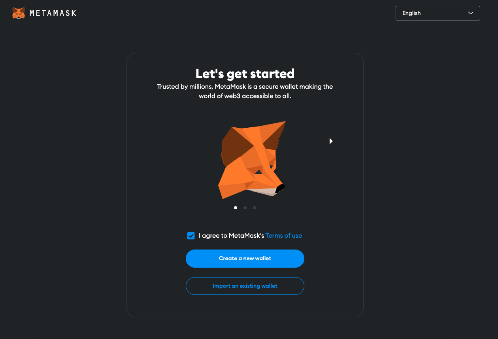

Create a password for local authentication with your wallet:

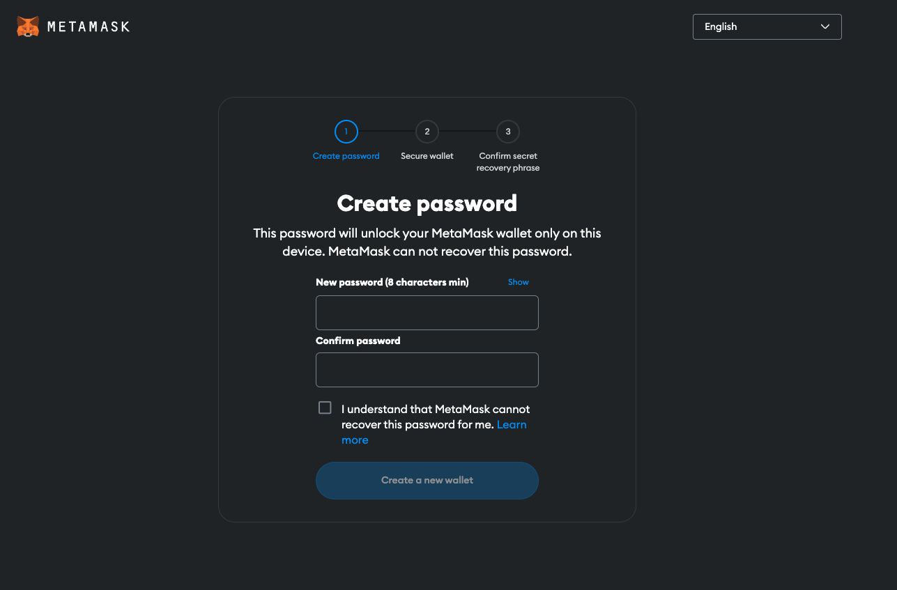

Next, you will be prompted to secure your wallet by downloading your wallet's recovery phrase. This step is recommended.

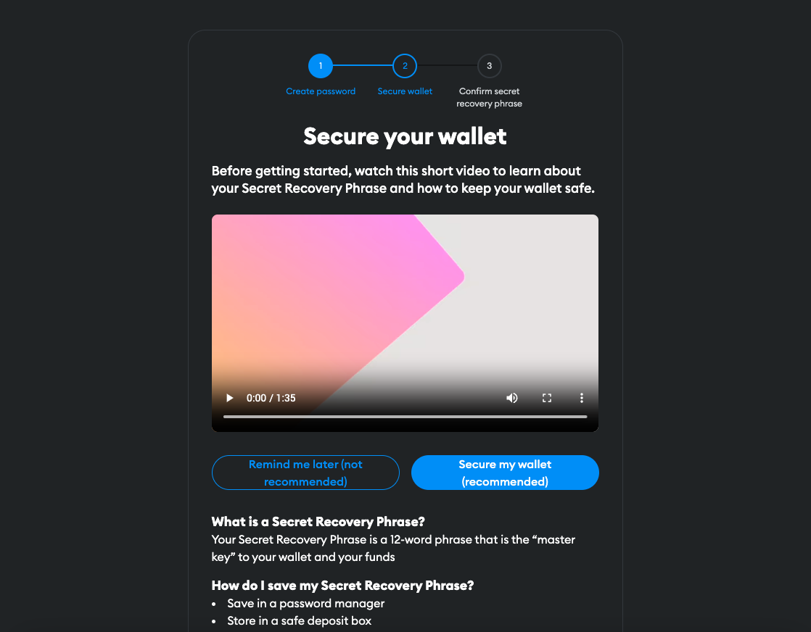

After the wallet has been created, you'll see a screen that confirms the creation was successful:

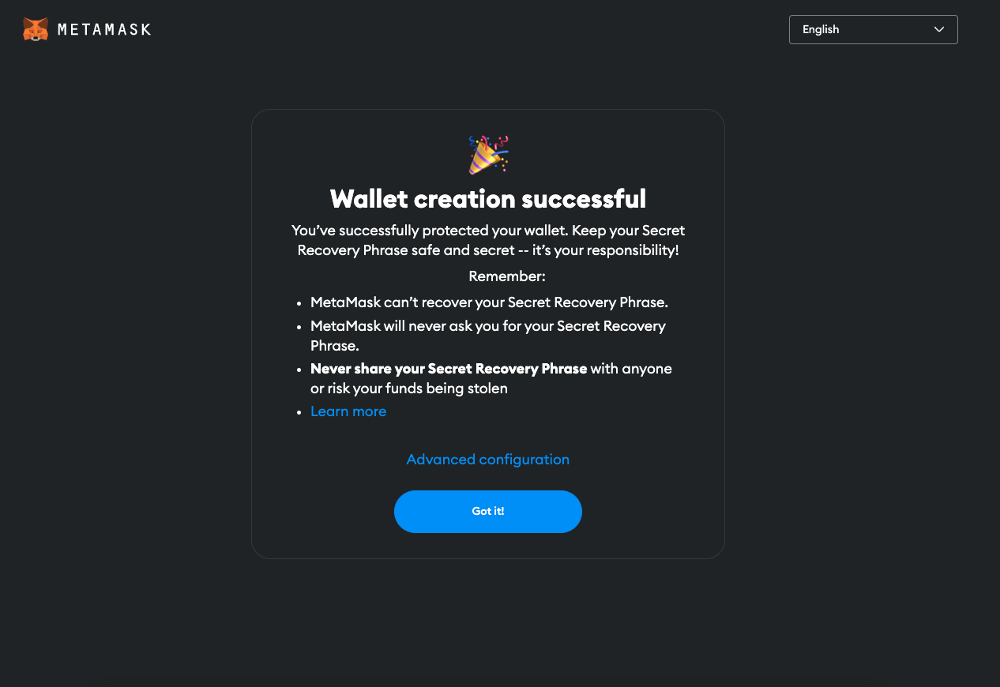

Then, you can see the account's information, such as the account's balance of tokens or NFTs, and actions such as sending or swapping assets, by clicking on the extension in your web browser:

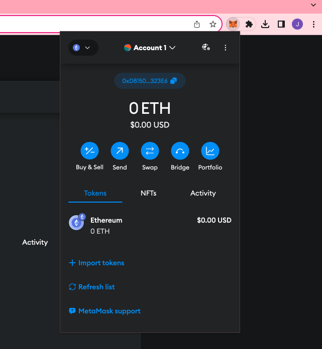

### Obtaining Sepolia testnet tokens

Next, you will need to obtain some tokens to pay for the gas fees on the Ethereum Sepolia testnet network. To do this, start by switching your MetaMask network to Sepolia through the following steps.

First, click on the extension within your web browser. Select the Ethereum icon drop down menu in the top left corner:

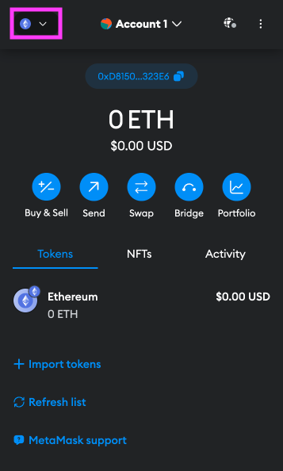

Next, toggle the 'Show test networks' button:

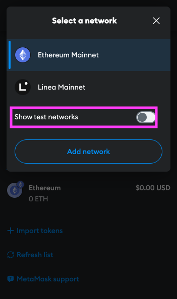

Then, select the Sepolia network:

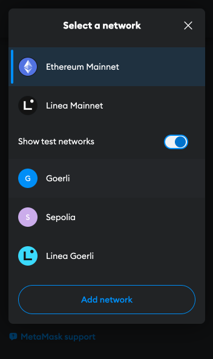

To confirm that you've switched your wallet to use Sepolia, your wallet's balance should now show SepoliaETH instead of ETH:

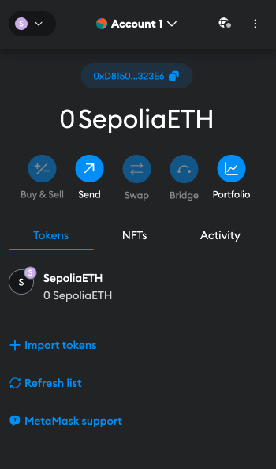

Next, navigate to the Sepolia faucet at https://sepoliafaucet.com/. 

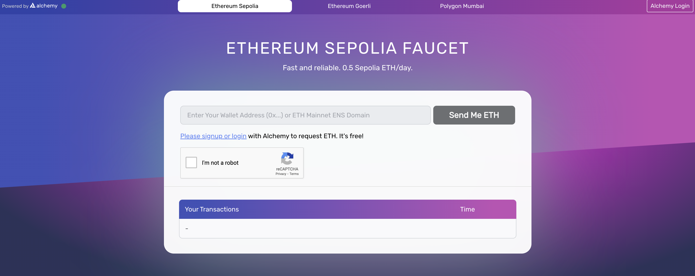

You will need to create or login to an Alchemy account to use this faucet. You can create a free Alchemy account [here](https://auth.alchemy.com/signup).

Once logged in, the Sepolia faucet will confirm that you can receive 0.5 SepoliaETH. 

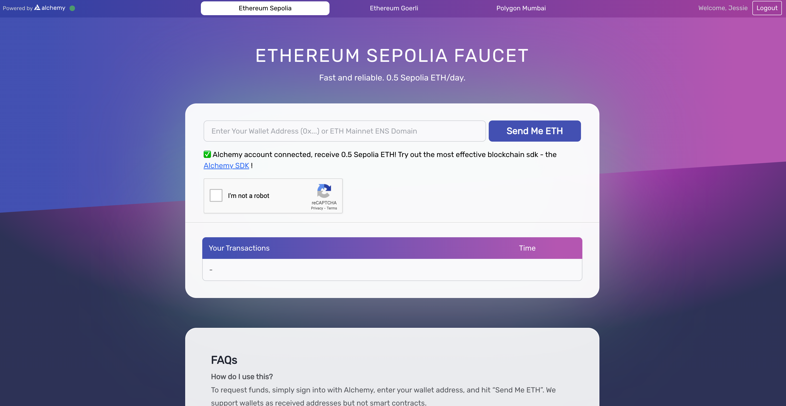

To receive the 0.5 SepoliaETH, you will need your wallet address from MetaMask. To get this wallet address, select the MetaMask extension and select the wallet address in the top center of the window to copy the address:

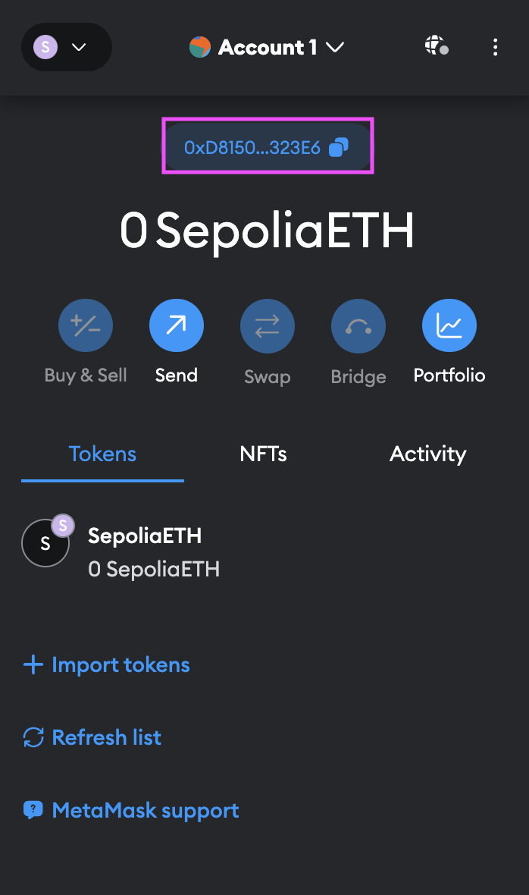

Paste this wallet address into the faucet and then select the 'Send Me ETH' button:


Once sent, you will see the transaction hash returned in the faucet window, and the balance of 0.5 SepoliaETH in the MetaMask wallet extension:


### Deploying the project

Now that you have an Ethereum wallet with some SepoliaETH testnet tokens, it's time to deploy your IC ETH starter project. To do this, first assure that dfx is running:

```
dfx start --clean --background
```

Then, set up local Rust canister development with the command:

```
rustup target add wasm32-unknown-unknown
```

Install the program's packages, generate Candid type bindings, and deploy the canisters with the command:

```
npm run setup
```

In the background, this command runs the commands `npm i && dfx canister create --all && dfx generate backend && dfx deploy`.

Then, you can start the local development server with the command:

```
npm start
```

This command will return the local URL that the dapp is running at; by default, this will be `http://localhost:3000/`. 

### Using the dapp

It's time to use the IC ETH start dapp to verify the ownership of an NFT! To get started, open the local URL that was returned by the `npm start` command, such as `http://localhost:3000`. You'll see the frontend of the dapp:

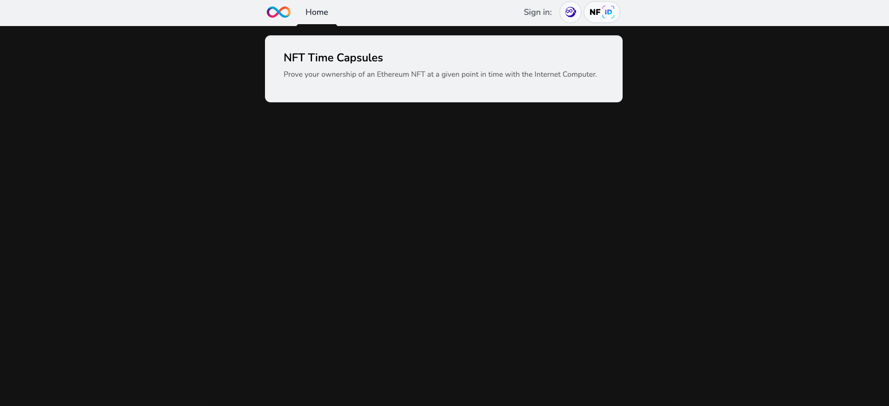

Next, you can log into the dapp with Internet Identity by selecting the II icon next to the 'Sign in' text:

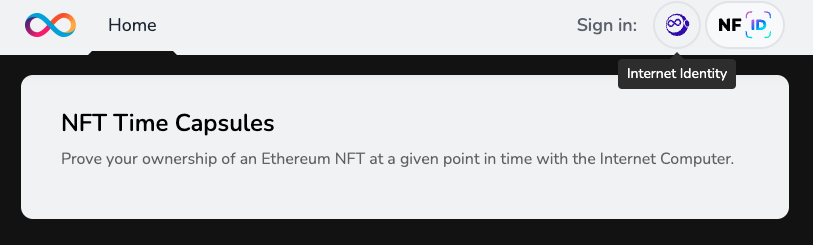

Select your local Internet Identity to authenticate with the dapp. Need a reminder on how to create an Internet Identity? Review the [3.5 Identities and authentication](../level-3/3.5-identities-and-auth.md) level of the developer journey. 

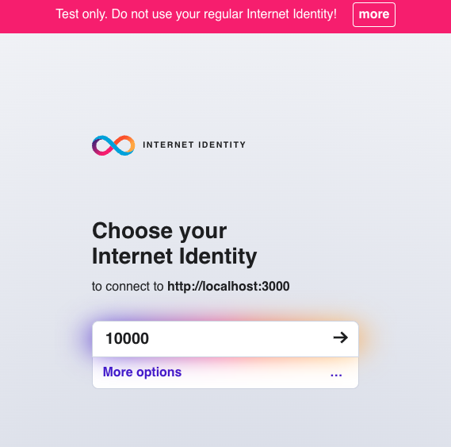

Next, you'll need to use the Ethereum 'E2E Test Dapp' at the URL https://metamask.github.io/test-dapp/. This dapp can be used to simulate different transactions and assets on the Sepolia testnet. We'll use this dapp to simulate an NFT being minted, that way we can verify that our Sepolia testnet wallet owns that test NFT. 

Once you open this dapp in a web browser, select the 'Connect' option under 'Basic actions'.


This will open a prompt through the MetaMask extension that will verify you'd like to connect your MetaMask wallet to the E2E test dapp. 

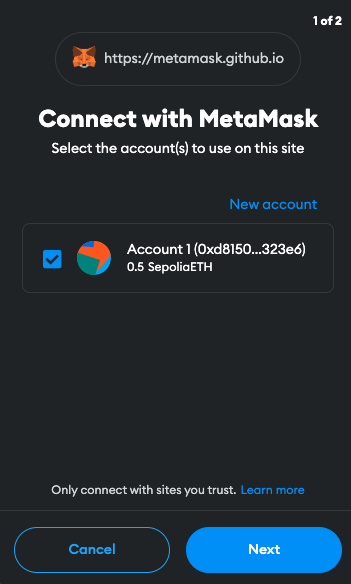

Once authenticated, scroll down on the E2E test dapp window. On the left, you will see a menu for 'NFTs', with the first option being 'Deploy'. Click 'Deploy'. 

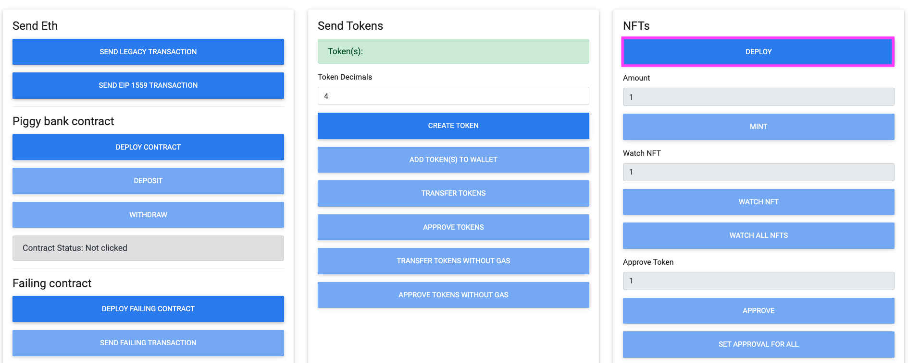

This 'Deploy' option will deploy a test Ethereum smart contract that will provide the ability for an NFT to be minted from the deployed test smart contract. You will be prompted to authenticate the deployment of this test smart contract via your MetaMask wallet. 

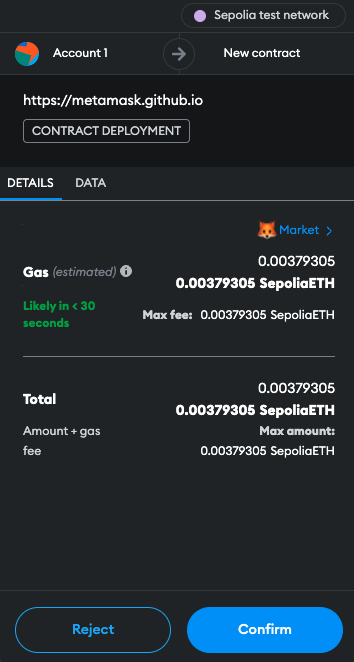

Once confirmed, you'll notice your SepoliaETH balance has decreased, since some SepoliaETH tokens were used to pay for the smart contract's gas fees.

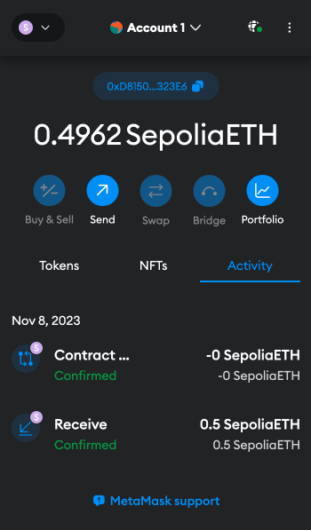

Next, back on the E2E test dapp window, select the 'Mint' option under the 'NFTs' menu. This will mint an NFT using the smart contract that you just deployed. For this example, leave the amount of NFTs to mint as the default value of `1`. 

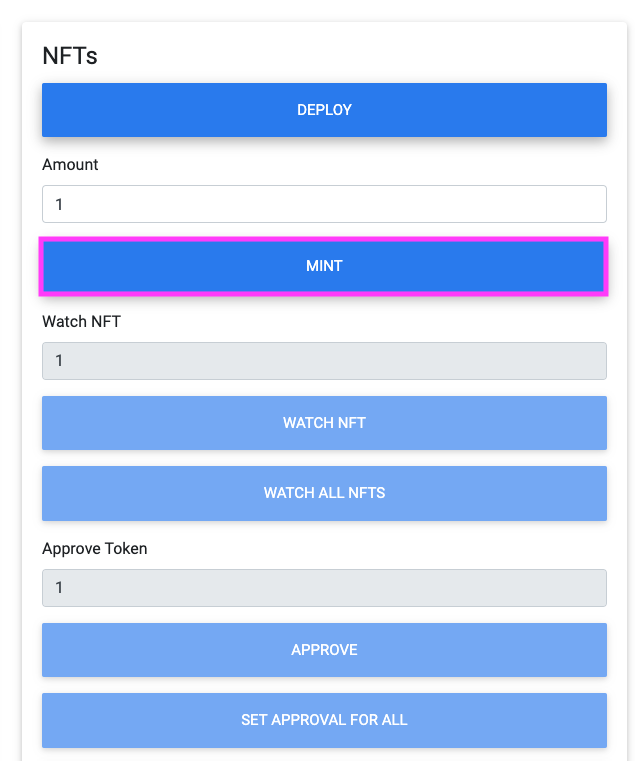

Authenticate the request through your MetaMask wallet when prompted.

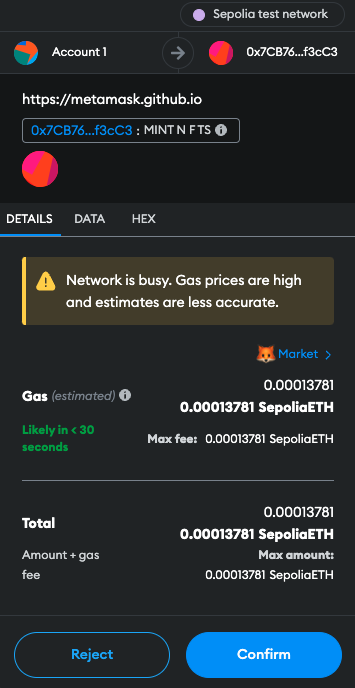

Now that you have an NFT minted, you will need to select 'Watch all NFTs' to get your test NFT in your Sepolia testnet wallet. This will watch all NFTs that you minted using this sample smart contract. 

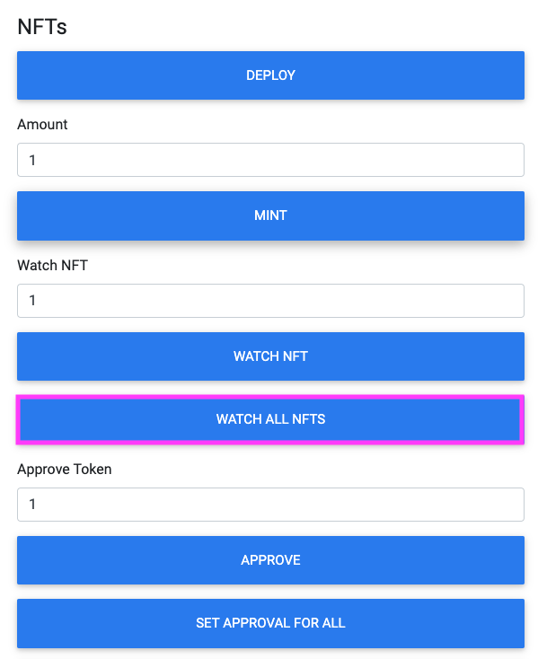

Your MetaMask wallet will prompt you to add the NFT to your wallet. Select 'Add NFT' when prompted.

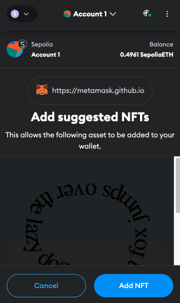

Now, in your MetaMask wallet, under the 'NFTs' tab, you will see the single NFT under a collection called 'TestDappNFTs'.


Click on the NFT, then select the NFT's menu by selecting the three dots icon next to 'Account / TestDappNFTs' in the top of the window. Select 'View on Opensea' to open the NFT's URL in a new tab. 

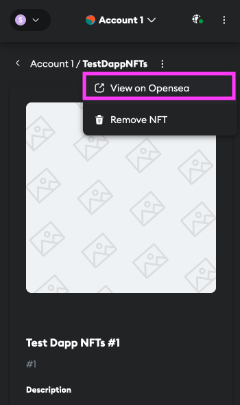

You will now have a tab open with the NFT's full URL on the Opensea testnet website. Copy the full URL shown in the navigation bar of your web browser.

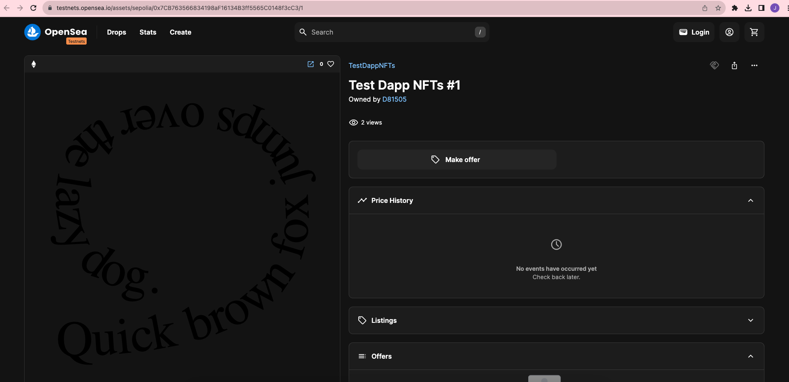

Now, head back to your local dapp at http://localhost:3000. Select the 'Verify' tab, then click the 'Connect to MetaMask' button. 

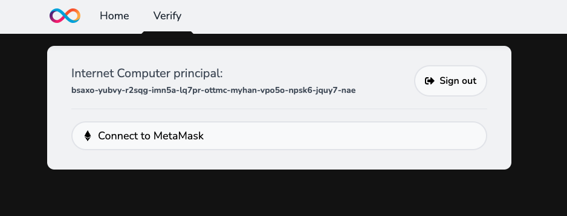

Authenticate with your MetaMask wallet, then in the dapp, select 'Verify wallet' button. Once authenticated, you will see your Ethereum address displayed in the dapp.

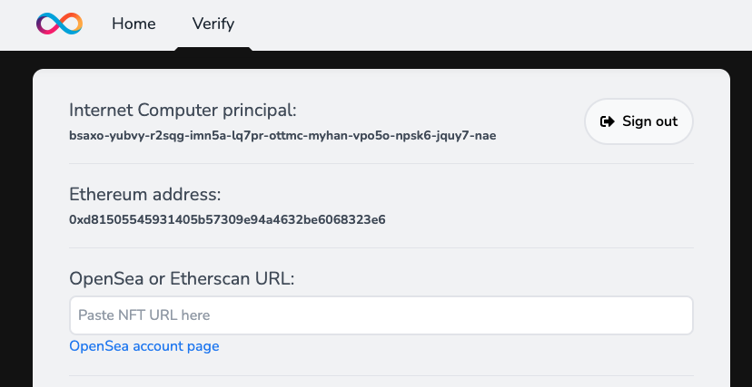

Now, you can enter the Opensea URL that you previously copied to verify that your Sepolia testnet wallet owns that testnet NFT. If successful, the text box will turn green and have a green checkmark indicating that the test is successful. 

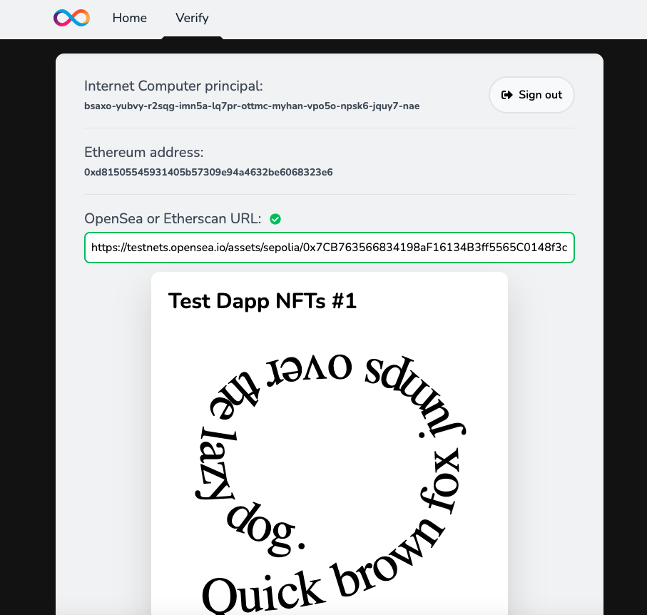

:::info
In this tutorial, you deployed this starter dapp locally. To deploy this dapp on the mainnet, run `dfx deploy --network ic`. 
:::

## Going further

Since this dapp is designed as a starter boilerplate, it is highly encouraged to build off of this template to develop your own IC <> ETH dapp. Here are some tips and tricks to help you get started:

- Customize your project's code style by editing the `.prettierrc` file and then running `npm run format`.

- Reduce the latency of update calls by passing the `--emulator` flag to `dfx start`.

- Install a Motoko package by running `npx ic-mops add <package-name>`. [Here](https://mops.one/) is a list of available packages.

- Split your frontend and backend console output by running `npm run frontend` and `npm run backend` in separate terminals.

## Resources

You can find the full Github repo for this starter project [here](https://github.com/dfinity/ic-eth-starter).

## Need help?

Did you get stuck somewhere in this tutorial, or feel like you need additional help understanding some of the concepts? The IC community has several resources available for developers, like working groups and bootcamps, along with our Discord community, forum, and events such as hackathons. Here are a few to check out:

- [Developer Discord community](https://discord.com/invite/cA7y6ezyE2), which is a large chatroom for IC developers to ask questions, get help, or chat with other developers asynchronously via text chat. 

- [Developer journey forum discussion](https://forum.dfinity.org/t/developer-journey-feedback-and-discussion/23893).

- [Developer tooling working group](https://www.google.com/calendar/event?eid=MHY0cjBubmlnYXY1cTkzZzVzcmozb3ZjZm5fMjAyMzEwMDVUMTcwMDAwWiBjX2Nnb2VxOTE3cnBlYXA3dnNlM2lzMWhsMzEwQGc&ctz=Europe/Zurich).

- [Motoko bootcamp](https://github.com/motoko-bootcamp/bootcamp-2022), a week-long crash course to learning all things Motoko. 

- [Motoko developer working group](https://www.google.com/calendar/event?eid=ZWVnb2luaHU0ZjduMTNpZHI3MWJkcWVwNWdfMjAyMzEwMTJUMTUwMDAwWiBjX2Nnb2VxOTE3cnBlYXA3dnNlM2lzMWhsMzEwQGc&ctz=Europe/Zurich).

- [Upcoming events and conferences](https://dfinity.org/events-and-news/).

- [Upcoming hackathons](https://dfinity.org/hackathons/).

- [Weekly developer office hours](https://discord.gg/4a7SZzRk?event=1164114241893187655) to ask questions, get clarification, and chat with other developers live via voice chat. This is hosted on our [developer Discord](https://discord.com/invite/cA7y6ezyE2) group.

## Next steps

- [5.3 Creating a decentralized exchange (DEX)](5.3-DEX-tutorial.md)