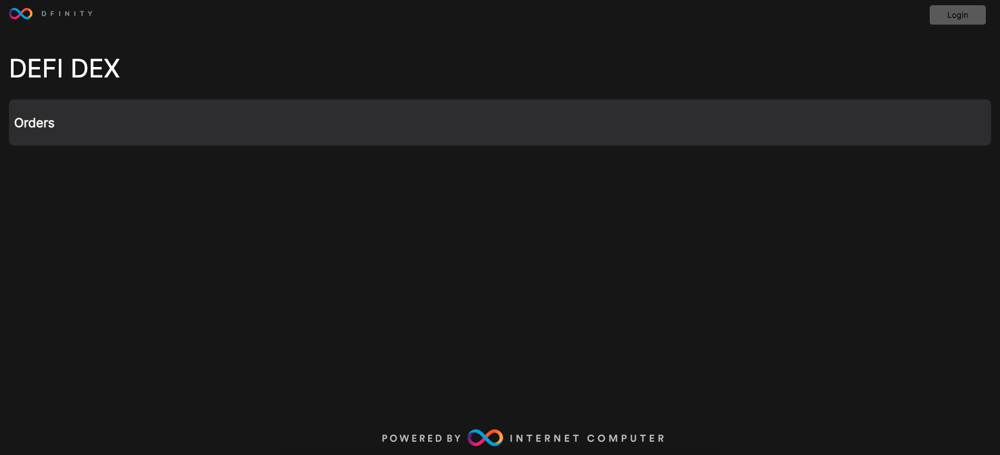
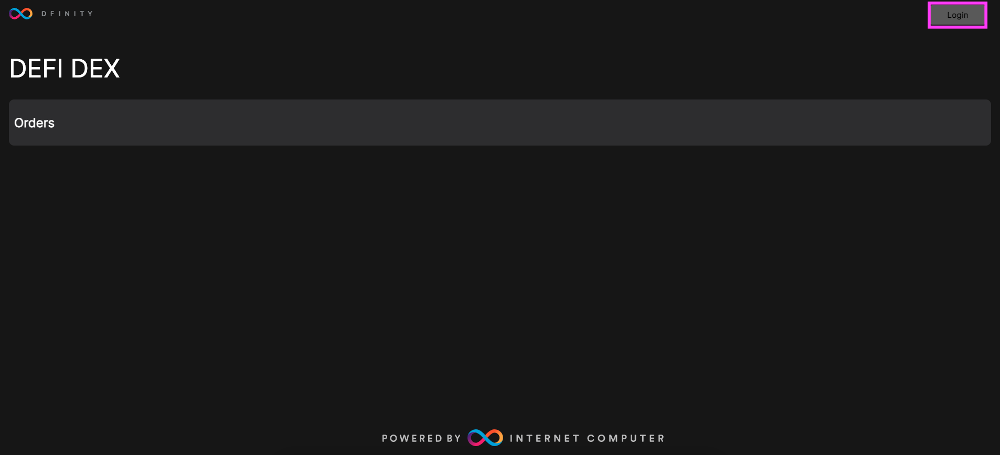
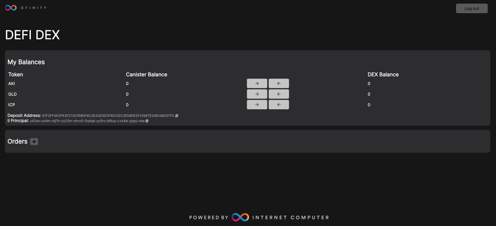
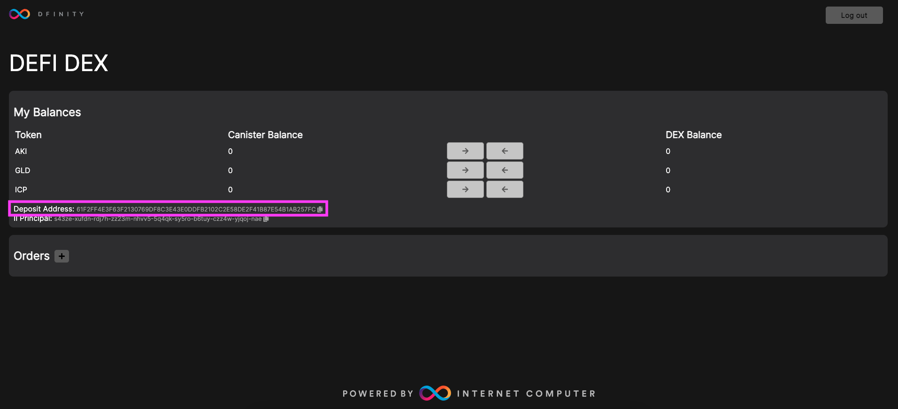
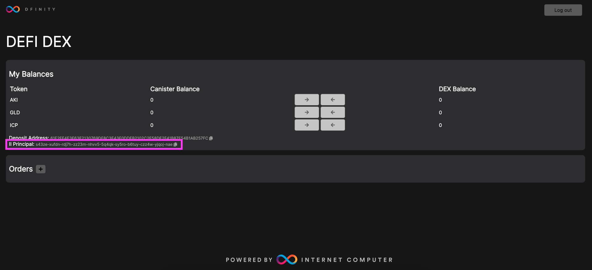
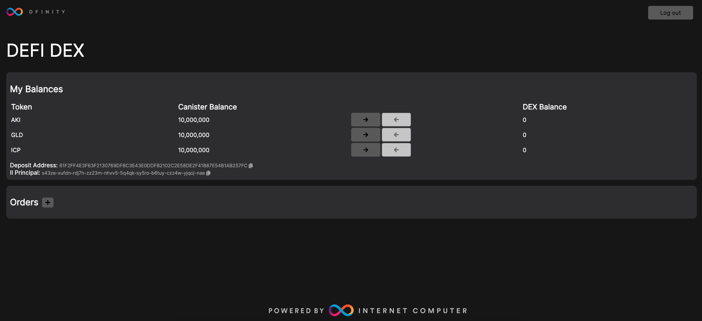
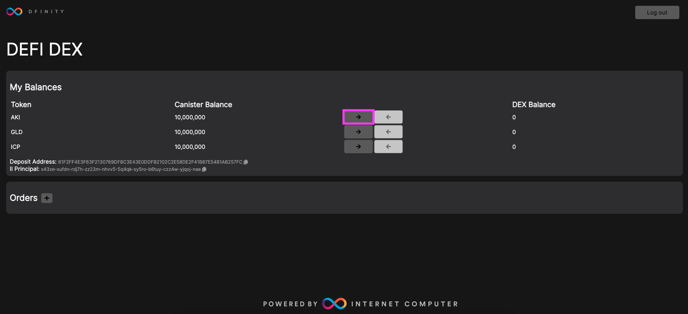
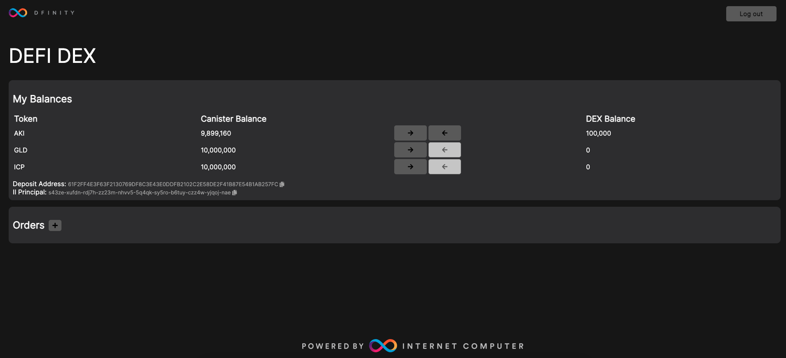
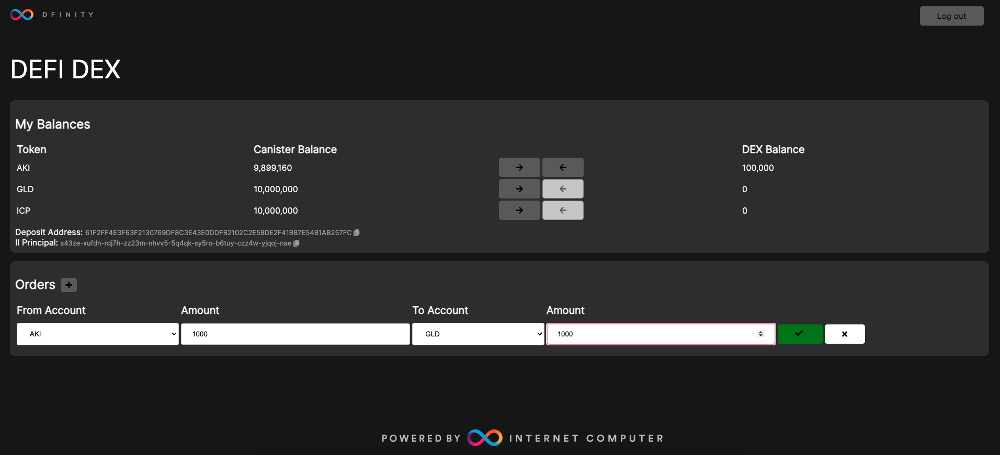
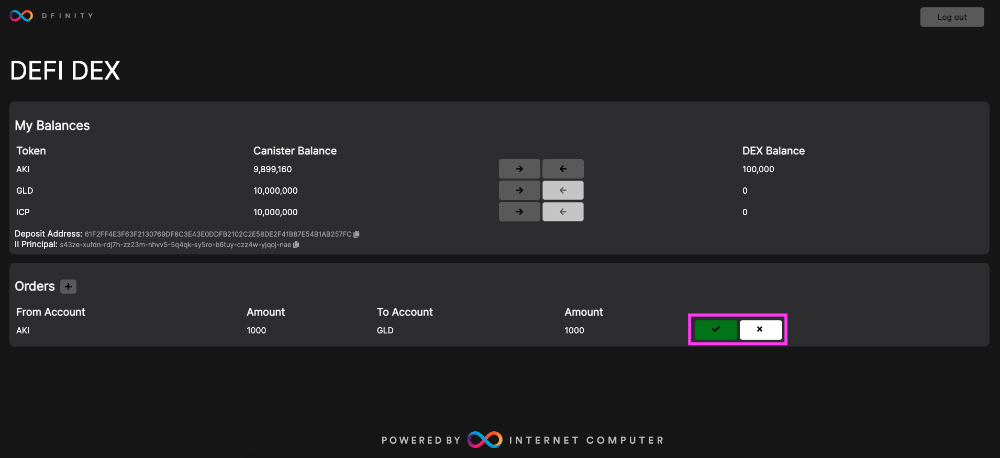

# 5.3 Creating a decentralized exchange (DEX)

## Overview

The Internet Computer enables decentralized finance (DeFi) applications through its design that includes complex, on-chain computation. One primary example of a DeFi application is a decentralized exchange (DEX). A DEX is an exchange that can be used to buy, sell, trade, and withdraw cryptocurrencies and other digital assets without a centralized authority that authorizes the trades, such as bank. Decentralized exchanges are extremely useful, as they allow users to buy and hold cryptocurrencies, trade it directly for another token or coin, then withdraw the tokens to be used in workflows such as withdrawing ICP to convert it into cycles, then use those cycles to deploy canisters on the IC mainnet. 

In this tutorial, you will learn how a DEX functions by deploying a sample project that creates a decentralized exchange and allows you to deposit ICP, then trade ICP for two locally created tokens that use the DIP20 token standard. 

:::caution
In this example, the token standard [DIP20](https://github.com/Psychedelic/DIP20) is used for the sample tokens that are used on the decentralized exchange. DIP20 was designed to resemble the fungible  token standard ERC20 on Ethereum. For creating new tokens on the IC, it is recommended to use the ICRC standard, such that we covered in [4.2 ICRC tokens](../level-4/4.2-icrc-tokens.md).
:::

## Decentralized exchange architecture

In this project, the decentralized exchange is comprised of a decentralized exchange canister that interacts with token canisters and a ledger canister. This example also includes a local instance of the Internet Identity canister to enable logging into the exchange using II. This example decentralized exchange's functionality can be described using the following steps:

- First, the exchange takes custody of funds. It uses different mechanisms for different token standards, such as ICP and DIP20. 

- Then, the exchange updates its internal balance book. 

- Users interact with the exchange for executing orders such as trades. Each order results in the exchange updating its internal balance book.

- Funds can be withdrawn from the exchange, giving custody of the funds back to the user. 

To enable this functionality, the DEX defines the following interfaces for users to interact with:

- `getDepositAddress: () -> (blob)`:  Used to request user-specific ledger account IDs from the exchange. 

- `deposit: (Token) -> (DepositReceipt)`: Used to initiate a user's deposit to the exchange. If the user wants to deposit ICP, the exchange moves the ICP tokens from the user's deposit address to its default subaddress, then adjusts the user's ICP balance on the exchange. If the user wants to deposit a different type of token, such as a DIP20 token in this example, the exchange will move toe approved funds to its token account then adjusts the user's balance.

- `withdraw: (Token, nat, principal) -> (WithdrawReceipt)`: Used to withdraw funds from the exchange. 

- `placeOrder: (Token, nat, Token, nat) -> (OrderPlacementReceipt)`: Used to place a new order on the exchange.

- `cancelOrder: (OrderId) -> (CancelOrderReceipt)`: Used to cancel a submitted order. 

- `getBalance: (Token) -> (nat) query`: Used to return the user's balance for a specific token. 

:::info
One important note about the exchange's architecture is how it handles transaction fees.

It is the exchange's responsibility to subtract fees from all trade orders, and the exchange must pay fees for withdraws and internal transfers. 
:::

To further understand the architecture of the decentralized exchange, let's go through a detailed walkthrough of how each of the exchange's core functions operates. Most of these interactions involve several steps on the backend, and are made simpler through the implementation of the DEX's frontend user interface. Users can use either the frontend UI or dfx via the CLI to interact with the sample exchange project deployed in this tutorial. 

### Depositing ICP

To deposit ICP into the exchange, the ledger canister in this project uses a unique interface so that interactions with ICP tokens are resolved separately from other tokens. 

When the user calls the `getDepositAddress` function, the response contains a unique account ID that represents a user-specific subaccount that is controlled by the decentralized exchange. Then, the exchange can use that address to identify the user responsible for deposits made through that address. 

The user can then transfer ICP to the fetched deposit address and wait for confirmation that the transfer has completed. The exchange is notified when the user calls the deposit function with the ICP token principal. To respond, the exchange looks into the user's subaccount and adjusts the user's balance within the exchange. The exchange will transfer the funds from the user's subaccount into the exchange's default subaccount, which is where the exchange keeps its balance of ICP.

### Depositing other tokens

In the sample project used in this tutorial, two DIP20 tokens are used. Remember that it is recommended that when developing new projects, including DEX and defi projects, you should use the ICRC standard.

To deposit other tokens into the exchange, first the user calls the `approve` function of the token's canister, which provides the exchange the ability to transfer funds to itself on the user's behalf.  Similar to depositing ICP, the user then calls the `deposit` function of the exchange. The exchange transfers the approved tokens to itself, then adjusts the user's exchange balance. 

### Placing orders

Once a user has deposited funds into the exchange, the user can place orders. Placing an order on the exchange refers to an order to convert one token into another. An important term in regards to placing orders is a **trading pair**. A trading pair is a set of two assets that can be traded with each other on an exchange. 

An order consists of two tuple values that represent the trading pair, such as [Token1, amount1] and [Token2, amount2]. This sample project is designed to only execute exactly matching orders to showcase simple functionality. 


### Withdrawing funds

To withdraw funds, the exchange sends the funds back to the user in response to a withdraw request. The exchange adjusts its internal balance accordingly. 

## Creating a decentralized exchange 

For this tutorial, you'll be using a sample project from the DFINITY examples repository that provides a simple decentralized exchange dapp, where you can deposit ICP then submit orders to exchange ICP into two different DIP20 tokens. 

### Prerequisites

Before you start, verify that you have set up your developer environment according to the instructions in [0.3 Developer environment setup](../level-0/03-dev-env.md).

For this project, you will also need to download and install [cmake](https://cmake.org/).

### Cloning the `defi` example

To get started, open a new terminal window, navigate into your working directory (`developer_journey`), then use the following commands to clone the DFINITY examples repo and navigate into the `defi` directory:

```
git clone https://github.com/dfinity/examples/
cd examples/motoko/defi
```

:::info
A Rust version of this project exists at `examples/rust/defi`.
:::

### Reviewing the project's files

First, let's look at the files within this project. Since there are hundreds of files within this project, for simplicity a condensed file directory listing can be found below:

```
├── Makefile
├── README.md
├── architecture.md
├── dfx.json // The project's configuration file. 
├── scripts // Scripts to deploy and initialize the project; these are ran by the 'make install' command. 
│   ├── deploy_dip20.sh
│   ├── initialize_local_balance.sh
│   ├── install.sh
│   └── principal_to_default_account_id.py
├── src // Source code files for the project's canisters. 
│   ├── DIP20 
        ├── motoko
        │   ├── demo.sh
        │   ├── dfx.json
        │   └── src
        │       ├── token.mo
        │       └── types.mo
│   ├── defi_dapp
        ├── Account.mo
        ├── CRC32.mo
        ├── SHA224.mo
        ├── book.mo
        ├── exchange.mo
        ├── main.mo
        └── types.mo
│   ├── frontend
│   ├── frontend_assets
│   └── ledger
        ├── ledger
        │   ├── index.d.ts
        │   ├── index.js
        │   ├── ledger.did.d.ts
        │   └── ledger.did.js
        ├── ledger.did
        ├── ledger.private.did
        ├── ledger.public.did
        └── ledger.wasm
└── test // Scripts used for testing.
    ├── demo.sh
    ├── trade.sh
    └── transfer.sh
```

From this output, you can see there are five subdirectories in the `src` directory. As you've seen in previous projects, the `src` directory is typically used for storing canister source code. In this project, each of these five subdirectories contain source code for this project's canisters. To see how these `src` files are used, let's take a look at the project's `dfx.json` file, which will define the project's canisters and their source code files:

```json
{
  "canisters": {
    "defi_dapp": {
      "main": "src/defi_dapp/main.mo",
      "dependencies": [
        "ledger"
      ],
      "declarations": {
        "output": "src/frontend/declarations/defi_dapp"
      }
    },
    "ledger": {
      "type": "custom",
      "candid": "src/ledger/ledger.did",
      "wasm": "src/ledger/ledger.wasm",
      "declarations": {
        "output": "src/frontend/declarations/ledger"
      }
    },
    "internet_identity": {
      "type": "custom",
      "candid": "https://github.com/dfinity/internet-identity/releases/latest/download/internet_identity.did",
      "wasm": "https://github.com/dfinity/internet-identity/releases/latest/download/internet_identity_dev.wasm.gz",
      "remote": {
        "id": {
          "ic": "rdmx6-jaaaa-aaaaa-aaadq-cai"
        }
      }
    },
    "frontend": {
      "dependencies": [
        "defi_dapp",
        "AkitaDIP20",
        "GoldenDIP20"
      ],
      "source": [
        "src/frontend_assets"
      ],
      "type": "assets"
    },
    "AkitaDIP20": {
      "main": "src/DIP20/motoko/src/token.mo",
      "declarations": {
        "output": "src/frontend/declarations/AkitaDIP20"
      }
    },
    "GoldenDIP20": {
      "main": "src/DIP20/motoko/src/token.mo",
      "declarations": {
        "output": "src/frontend/declarations/GoldenDIP20"
      }
    }
  },
  "networks": {
    "local": {
      "bind": "127.0.0.1:8000"
    }
  },
  "defaults": {
    "replica": {
      "subnet_type": "system"
    }
  },
  "version": 1
}
```

In this project configuration file, you can see there are six canisters defined. This is because two canisters use source code found in the `src/DIP20` directory. The canisters defined are:

- `defi_dapp`: This canister provides the decentralized exchange's backend functionality, with source code stored at `src/defi_dapp/main.mo`. In the `src/defi_dapp` directory, you will see other Motoko files such as `types.mo` and `exchange.mo` that the `main.mo` file makes calls to 

- `ledger`: This canister provides a local ledger that is used to process the decentralized exchange's transactions. 

- `internet_identity`: As you've seen in other projects, the Internet Identity canister's Wasm and Candid files are pulled from the DFINITY GitHub repo to be deployed locally.

- `frontend`: This canister provides the frontend of the decentralized exchange dapp, using code and files stored in the `src/frontend` and `src/frontend_assets` directories. 

- `AkitaDIP20`: This canister provides a DIP20 token called 'Akita', with currency symbol AKI, using the source code stored at `src/DIP20/motoko/src/token.mo`.

- `GoldenDIP20`: This canister provides a DIP20 token called 'Golden', with currency symbol GLD, using the same source code as the `AkitaDIP20` canister. 

Next, let's look at the source code used for the token canisters, which is stored at `src/DIP20/motoko/src/token.mo`. The code has been annotated with comments to explain the code's logic:

```motoko
/**
 * Module     : token.mo
 * Copyright  : 2021 DFinance Team
 * License    : Apache 2.0 with LLVM Exception
 * Maintainer : DFinance Team <hello@dfinance.ai>
 * Stability  : Experimental
 */

// Import the necessary packages.
import HashMap "mo:base/HashMap";
import Principal "mo:base/Principal";
import Types "./types";
import Time "mo:base/Time";
import Iter "mo:base/Iter";
import Array "mo:base/Array";
import Option "mo:base/Option";
import Order "mo:base/Order";
import Nat "mo:base/Nat";
import Result "mo:base/Result";
import ExperimentalCycles "mo:base/ExperimentalCycles";

// Create a shared actor class called 'Token'.
shared(msg) actor class Token(
    _logo: Text,
    _name: Text,
    _symbol: Text,
    _decimals: Nat8,
    _totalSupply: Nat,
    _owner: Principal,
    _fee: Nat
    ) {
    type Operation = Types.Operation;
    type TransactionStatus = Types.TransactionStatus;
    type TxRecord = Types.TxRecord;
    type Metadata = {
        logo : Text;
        name : Text;
        symbol : Text;
        decimals : Nat8;
        totalSupply : Nat;
        owner : Principal;
        fee : Nat;
    };
    // Return a transaction index or error message.
    public type TxReceipt = {
        #Ok: Nat;
        #Err: {
            #InsufficientAllowance;
            #InsufficientBalance;
            #ErrorOperationStyle;
            #Unauthorized;
            #LedgerTrap;
            #ErrorTo;
            #Other;
            #BlockUsed;
            #AmountTooSmall;
        };
    };

    // Define stable variables.
    private stable var owner_ : Principal = _owner;
    private stable var logo_ : Text = _logo;
    private stable var name_ : Text = _name;
    private stable var decimals_ : Nat8 = _decimals;
    private stable var symbol_ : Text = _symbol;
    private stable var totalSupply_ : Nat = _totalSupply;
    private stable var blackhole : Principal = Principal.fromText("aaaaa-aa");
    private stable var feeTo : Principal = owner_;
    private stable var fee : Nat = _fee;
    private stable var balanceEntries : [(Principal, Nat)] = [];
    private stable var allowanceEntries : [(Principal, [(Principal, Nat)])] = [];
    private var balances = HashMap.HashMap<Principal, Nat>(1, Principal.equal, Principal.hash);
    private var allowances = HashMap.HashMap<Principal, HashMap.HashMap<Principal, Nat>>(1, Principal.equal, Principal.hash);
    balances.put(owner_, totalSupply_);
    private stable let genesis : TxRecord = {
        caller = ?owner_;
        op = #mint;
        index = 0;
        from = blackhole;
        to = owner_;
        amount = totalSupply_;
        fee = 0;
        timestamp = Time.now();
        status = #succeeded;
    };
    private stable var ops : [TxRecord] = [genesis];

    // Define the function 'addRecord'.
    private func addRecord(
        caller: ?Principal, op: Operation, from: Principal, to: Principal, amount: Nat,
        fee: Nat, timestamp: Time.Time, status: TransactionStatus
    ): Nat {
        let index = ops.size();
        let o : TxRecord = {
            caller = caller;
            op = op;
            index = index;
            from = from;
            to = to;
            amount = amount;
            fee = fee;
            timestamp = timestamp;
            status = status;
        };
        ops := Array.append(ops, [o]);
        return index;
    };

    // Define the function '_chargeFee'.
    private func _chargeFee(from: Principal, fee: Nat) {
        if(fee > 0) {
            _transfer(from, feeTo, fee);
        };
    };

    // Define the function '_transfer'.
    private func _transfer(from: Principal, to: Principal, value: Nat) {
        let from_balance = _balanceOf(from);
        let from_balance_new : Nat = from_balance - value;
        if (from_balance_new != 0) { balances.put(from, from_balance_new); }
        else { balances.delete(from); };

        let to_balance = _balanceOf(to);
        let to_balance_new : Nat = to_balance + value;
        if (to_balance_new != 0) { balances.put(to, to_balance_new); };
    };

    // Define the function '_balanceOf'.
    private func _balanceOf(who: Principal) : Nat {
        switch (balances.get(who)) {
            case (?balance) { return balance; };
            case (_) { return 0; };
        }
    };

    // Define the function '_allowance'.
    private func _allowance(owner: Principal, spender: Principal) : Nat {
        switch(allowances.get(owner)) {
            case (?allowance_owner) {
                switch(allowance_owner.get(spender)) {
                    case (?allowance) { return allowance; };
                    case (_) { return 0; };
                }
            };
            case (_) { return 0; };
        }
    };

    /*
    *   Core interfaces:
    *       update calls:
    *           transfer/transferFrom/approve
    *       query calls:
    *           logo/name/symbol/decimal/totalSupply/balanceOf/allowance/getMetadata
    *           historySize/getTransaction/getTransactions
    */

    /// Transfers value amount of tokens to Principal to.
    public shared(msg) func transfer(to: Principal, value: Nat) : async TxReceipt {
        if (_balanceOf(msg.caller) < value + fee) { return #Err(#InsufficientBalance); };
        _chargeFee(msg.caller, fee);
        _transfer(msg.caller, to, value);
        let txid = addRecord(null, #transfer, msg.caller, to, value, fee, Time.now(), #succeeded);
        return #Ok(txid);
    };

    /// Transfers value amount of tokens from Principal from to Principal to.
    public shared(msg) func transferFrom(from: Principal, to: Principal, value: Nat) : async TxReceipt {
        if (_balanceOf(from) < value + fee) { return #Err(#InsufficientBalance); };
        let allowed : Nat = _allowance(from, msg.caller);
        if (allowed < value + fee) { return #Err(#InsufficientAllowance); };
        _chargeFee(from, fee);
        _transfer(from, to, value);
        let allowed_new : Nat = allowed - value - fee;
        if (allowed_new != 0) {
            let allowance_from = Types.unwrap(allowances.get(from));
            allowance_from.put(msg.caller, allowed_new);
            allowances.put(from, allowance_from);
        } else {
            if (allowed != 0) {
                let allowance_from = Types.unwrap(allowances.get(from));
                allowance_from.delete(msg.caller);
                if (allowance_from.size() == 0) { allowances.delete(from); }
                else { allowances.put(from, allowance_from); };
            };
        };
        let txid = addRecord(?msg.caller, #transferFrom, from, to, value, fee, Time.now(), #succeeded);
        return #Ok(txid);
    };

    /// Allows spender to withdraw from your account multiple times, up to the value amount.
    /// If this function is called again it overwrites the current allowance with value.
    public shared(msg) func approve(spender: Principal, value: Nat) : async TxReceipt {
        if(_balanceOf(msg.caller) < fee) { return #Err(#InsufficientBalance); };
        _chargeFee(msg.caller, fee);
        let v = value + fee;
        if (value == 0 and Option.isSome(allowances.get(msg.caller))) {
            let allowance_caller = Types.unwrap(allowances.get(msg.caller));
            allowance_caller.delete(spender);
            if (allowance_caller.size() == 0) { allowances.delete(msg.caller); }
            else { allowances.put(msg.caller, allowance_caller); };
        } else if (value != 0 and Option.isNull(allowances.get(msg.caller))) {
            var temp = HashMap.HashMap<Principal, Nat>(1, Principal.equal, Principal.hash);
            temp.put(spender, v);
            allowances.put(msg.caller, temp);
        } else if (value != 0 and Option.isSome(allowances.get(msg.caller))) {
            let allowance_caller = Types.unwrap(allowances.get(msg.caller));
            allowance_caller.put(spender, v);
            allowances.put(msg.caller, allowance_caller);
        };
        let txid = addRecord(null, #approve, msg.caller, spender, v, fee, Time.now(), #succeeded);
        return #Ok(txid);
    };

    public shared(msg) func mint(to: Principal, amount: Nat): async TxReceipt {
        if(msg.caller != owner_) {
            return #Err(#Unauthorized);
        };
        let to_balance = _balanceOf(to);
        totalSupply_ += amount;
        balances.put(to, to_balance + amount);
        let txid = addRecord(?msg.caller, #mint, blackhole, to, amount, 0, Time.now(), #succeeded);
        return #Ok(txid);
    };

    public shared(msg) func burn(amount: Nat): async TxReceipt {
        let from_balance = _balanceOf(msg.caller);
        if(from_balance < amount) {
            return #Err(#InsufficientBalance);
        };
        totalSupply_ -= amount;
        balances.put(msg.caller, from_balance - amount);
        let txid = addRecord(?msg.caller, #burn, msg.caller, blackhole, amount, 0, Time.now(), #succeeded);
        return #Ok(txid);
    };

    /// Define query functions for obtaining information about the token
    public query func logo() : async Text {
        return logo_;
    };

    public query func name() : async Text {
        return name_;
    };

    public query func symbol() : async Text {
        return symbol_;
    };

    public query func decimals() : async Nat8 {
        return decimals_;
    };

    public query func totalSupply() : async Nat {
        return totalSupply_;
    };

    public query func getTokenFee() : async Nat {
        return fee;
    };

    public query func balanceOf(who: Principal) : async Nat {
        return _balanceOf(who);
    };

    public query func allowance(owner: Principal, spender: Principal) : async Nat {
        return _allowance(owner, spender);
    };

    public query func getMetadata() : async Metadata {
        return {
            logo = logo_;
            name = name_;
            symbol = symbol_;
            decimals = decimals_;
            totalSupply = totalSupply_;
            owner = owner_;
            fee = fee;
        };
    };

    /// Get transaction history size.
    public query func historySize() : async Nat {
        return ops.size();
    };

    /// Get transaction by index.
    public query func getTransaction(index: Nat) : async TxRecord {
        return ops[index];
    };

    /// Get the transaction history.
    public query func getTransactions(start: Nat, limit: Nat) : async [TxRecord] {
        var ret: [TxRecord] = [];
        var i = start;
        while(i < start + limit and i < ops.size()) {
            ret := Array.append(ret, [ops[i]]);
            i += 1;
        };
        return ret;
    };

    /*
    *   Optional interfaces:
    *       setName/setLogo/setFee/setFeeTo/setOwner
    *       getUserTransactionsAmount/getUserTransactions
    *       getTokenInfo/getHolders/getUserApprovals
    */

    // Define functions to set the token's information
    public shared(msg) func setName(name: Text) {
        assert(msg.caller == owner_);
        name_ := name;
    };

    public shared(msg) func setLogo(logo: Text) {
        assert(msg.caller == owner_);
        logo_ := logo;
    };

    public shared(msg) func setFeeTo(to: Principal) {
        assert(msg.caller == owner_);
        feeTo := to;
    };

    public shared(msg) func setFee(_fee: Nat) {
        assert(msg.caller == owner_);
        fee := _fee;
    };

    public shared(msg) func setOwner(_owner: Principal) {
        assert(msg.caller == owner_);
        owner_ := _owner;
    };

    // Define the function 'getUserTransactionAmount'.
    public query func getUserTransactionAmount(a: Principal) : async Nat {
        var res: Nat = 0;
        for (i in ops.vals()) {
            if (i.caller == ?a or i.from == a or i.to == a) {
                res += 1;
            };
        };
        return res;
    };

    // Define the function 'getUserTransactions'.
    public query func getUserTransactions(a: Principal, start: Nat, limit: Nat) : async [TxRecord] {
        var res: [TxRecord] = [];
        var index: Nat = 0;
        for (i in ops.vals()) {
            if (i.caller == ?a or i.from == a or i.to == a) {
                if(index >= start and index < start + limit) {
                    res := Array.append<TxRecord>(res, [i]);
                };
                index += 1;
            };
        };
        return res;
    };

    // Define public types for the token's info.
    public type TokenInfo = {
        metadata: Metadata;
        feeTo: Principal;
        // status info
        historySize: Nat;
        deployTime: Time.Time;
        holderNumber: Nat;
        cycles: Nat;
    };
    public query func getTokenInfo(): async TokenInfo {
        {
            metadata = {
                logo = logo_;
                name = name_;
                symbol = symbol_;
                decimals = decimals_;
                totalSupply = totalSupply_;
                owner = owner_;
                fee = fee;
            };
            feeTo = feeTo;
            historySize = ops.size();
            deployTime = genesis.timestamp;
            holderNumber = balances.size();
            cycles = ExperimentalCycles.balance();
        }
    };

    // Define the function 'getHolders'.
    public query func getHolders(start: Nat, limit: Nat) : async [(Principal, Nat)] {
        let temp =  Iter.toArray(balances.entries());
        func order (a: (Principal, Nat), b: (Principal, Nat)) : Order.Order {
            return Nat.compare(b.1, a.1);
        };
        let sorted = Array.sort(temp, order);
        let limit_: Nat = if(start + limit > temp.size()) {
            temp.size() - start
        } else {
            limit
        };
        let res = Array.init<(Principal, Nat)>(limit_, (owner_, 0));
        for (i in Iter.range(0, limit_ - 1)) {
            res[i] := sorted[i+start];
        };
        return Array.freeze(res);
    };

    // Define the function 'getAllowanceSize'.
    public query func getAllowanceSize() : async Nat {
        var size : Nat = 0;
        for ((k, v) in allowances.entries()) {
            size += v.size();
        };
        return size;
    };

    // Define the function 'getUserApprovals'. 
    public query func getUserApprovals(who : Principal) : async [(Principal, Nat)] {
        switch (allowances.get(who)) {
            case (?allowance_who) {
                return Iter.toArray(allowance_who.entries());
            };
            case (_) {
                return [];
            };
        }
    };

    /*
    * Define functions for upgrading the canister.
    */
    system func preupgrade() {
        balanceEntries := Iter.toArray(balances.entries());
        var size : Nat = allowances.size();
        var temp : [var (Principal, [(Principal, Nat)])] = Array.init<(Principal, [(Principal, Nat)])>(size, (owner_, []));
        size := 0;
        for ((k, v) in allowances.entries()) {
            temp[size] := (k, Iter.toArray(v.entries()));
            size += 1;
        };
        allowanceEntries := Array.freeze(temp);
    };

    system func postupgrade() {
        balances := HashMap.fromIter<Principal, Nat>(balanceEntries.vals(), 1, Principal.equal, Principal.hash);
        balanceEntries := [];
        for ((k, v) in allowanceEntries.vals()) {
            let allowed_temp = HashMap.fromIter<Principal, Nat>(v.vals(), 1, Principal.equal, Principal.hash);
            allowances.put(k, allowed_temp);
        };
        allowanceEntries := [];
    };
};
```

Next, let's take a look at the `defi_dapp` canister's source code located at `src/defi_dapp/main.mo`:

```motoko

// Import the necessary packages.
import Array "mo:base/Array";
import Buffer "mo:base/Buffer";
import Debug "mo:base/Debug";
import Bool "mo:base/Debug";
import Float "mo:base/Float";
import Int "mo:base/Int";
import Int64 "mo:base/Int64";
import Iter "mo:base/Iter";
import M "mo:base/HashMap";
import Nat64 "mo:base/Nat64";
import Nat32 "mo:base/Nat32";
import Nat "mo:base/Nat";
import Hash "mo:base/Hash";
import Principal "mo:base/Principal";
import Text "mo:base/Text";
import Time "mo:base/Time";
import Result "mo:base/Result";

// Import 'Account' and the local ledger canister.
import Account "./Account";
import Ledger "canister:ledger";

// Import local types; these are imported from the local files book.mo, exchange.mo, and types.mo. 
import B "book";
import E "exchange";
import T "types";

// Define a shared actor class called 'Dex'.
shared(init_msg) actor class Dex() = this {
    let ledger : Principal = Principal.fromActor(Ledger);
    let icp_fee: Nat = 10_000;

    stable var orders_stable : [T.Order] = [];
    stable var lastId : Nat32 = 0;
    var exchanges = M.HashMap<E.TradingPair, E.Exchange>(10, func (k1: E.TradingPair,k2: E.TradingPair): Bool {
        Principal.equal(k1.0,k2.0) and Principal.equal(k1.1,k2.1)
    }, func (k : E.TradingPair) {
        Text.hash(Text.concat(Principal.toText(k.0),Principal.toText(k.1)))
    });

    // User balance data structure
    private var book = B.Book();
    private stable var book_stable : [var (Principal, [(T.Token, Nat)])] = [var];

    // ===== ORDER FUNCTIONS =====
    // This section of the code defines functions responsible for placing orders on the exchange. 
    public shared(msg) func placeOrder(from: T.Token, fromAmount: Nat, to: T.Token, toAmount: Nat) : async T.OrderPlacementReceipt {
        let id = nextId();
        Debug.print("");
        Debug.print("Placing order "# Nat32.toText(id) #" from user " # Principal.toText(msg.caller) # " for selling " # Nat.toText(fromAmount) # " tokens " # Principal.toText(from));
        let owner=msg.caller;
        let submitted = Time.now();

        // Construct a trading pair which is used to select correct exchange.
        // The pair is constructed as (X,Y) where X is less according to the principal compare function.
        // This is needed since buy and sell orders use the same exchange.
        var trading_pair=(from,to);
        switch(create_trading_pair(from,to)){
            case(?tp){
                trading_pair:=tp;
            };
            case(null){
                return #Err(#InvalidOrder);
            }
        };

        // Iterate all orders to only allow one sell order per token.
        for(e in exchanges.vals()) {
            for(o in e.getOrders().vals()){
                if (o.from == from and o.owner == owner ) {
                    return #Err(#OrderBookFull);
                };
            };
        };
                                                                       
        // Check if user balance in book is enough before creating the order.
        if(book.hasEnoughBalance(owner,from,fromAmount) == false) {
            Debug.print("Not enough balance for user " # Principal.toText(owner) # " in token " # Principal.toText(from));
            return #Err(#InvalidOrder);
        };

        let exchange = switch (exchanges.get(trading_pair)) {
            case null {
                Debug.print("Creating Exchange for trading pair: " # Principal.toText(trading_pair.0) # "::" # Principal.toText(trading_pair.1));
                let exchange : E.Exchange = E.Exchange(trading_pair, book);
                exchanges.put(trading_pair,exchange);
                exchange
            };
            case (?e) e
        };
        let order : T.Order = {
            id;
            owner;
            from;
            fromAmount;
            to;
            toAmount;
         };
        exchange.addOrder(Principal.fromActor(this), order);

        #Ok(exchange.getOrder(id))
    };

    // Define a function to cancel an order.
    public shared(msg) func cancelOrder(order_id: T.OrderId) : async T.CancelOrderReceipt {
        Debug.print("Cancelling order "# Nat32.toText(order_id) #"...");
        for(e in exchanges.vals()) {
            switch (e.getOrder(order_id)) {
                case (?order)
                    if(order.owner != msg.caller) {
                        return #Err(#NotAllowed);
                    } else {
                        switch (e.cancelOrder(order_id)) {
                            case (?canceled) return #Ok(canceled.id);
                            case null return #Err(#NotAllowed)
                        }
                    };
                case null {}
            };
        };
        return #Err(#NotExistingOrder);
    };

    // Define a function to retrieve order information.
    public func getOrder(order_id: T.OrderId) : async(?T.Order) {
        Debug.print("Checking order "# Nat32.toText(order_id) #"...");
        for(e in exchanges.vals()) {
            switch (e.getOrder(order_id)) {
                case (?order) return ?order;
                case null {}
            };
        };
        null;
    };

    // Define a function to get multiple orders.
    public func getOrders() : async([T.Order]) {
        Debug.print("List orders...");
        getAllOrders()
    };

    // Define a function to get all orders.
    private func getAllOrders() : [T.Order] {
        let buff : Buffer.Buffer<T.Order> = Buffer.Buffer(10);
        for(e in exchanges.vals()) {
            for(o in e.getOrders().vals()) {
                buff.add(o);
            };
        };
        buff.toArray();
    };

    private func nextId() : Nat32 {
        lastId += 1;
        lastId;
    };

    // ===== WITHDRAW FUNCTIONS =====
    // This section of the code defines the functions responsible for making withdraws on the exchange.
    public shared(msg) func withdraw(token: T.Token, amount: Nat, address: Principal) : async T.WithdrawReceipt {
        // remove user submitted orders
        for (order in getAllOrders().vals()){
            if (order.owner == msg.caller){
                // find trading pair of order. This is needed to select the correct exchange.
                var trading_pair=(order.from,order.to);
                switch(create_trading_pair(order.from,order.to)){
                    case(?tp){
                        trading_pair:=tp;
                    };
                    case _ {};
                };
                switch (exchanges.get(trading_pair)) {
                    case (?e) {
                        let _ = e.cancelOrder(order.id);
                    };
                    case _ {};
                };
            }
        };
        

        if (token == ledger) {
            let account_id = Account.accountIdentifier(address, Account.defaultSubaccount());
            await withdrawIcp(msg.caller, amount, account_id)
        } else {
            await withdrawDip(msg.caller, token, amount, address)
        }
    };

    // Define a function to withdraw ICP tokens.
    private func withdrawIcp(caller: Principal, amount: Nat, account_id: Blob) : async T.WithdrawReceipt {
        Debug.print("Withdraw...");

        // Remove withdrawal amount from book.
        switch (book.removeTokens(caller, ledger, amount+icp_fee)){
            case(null){
                return #Err(#BalanceLow)
            };
            case _ {};
        };

        // Transfer amount back to user.
        let icp_reciept =  await Ledger.transfer({
            memo: Nat64    = 0;
            from_subaccount = ?Account.defaultSubaccount();
            to = account_id;
            amount = { e8s = Nat64.fromNat(amount + icp_fee) };
            fee = { e8s = Nat64.fromNat(icp_fee) };
            created_at_time = ?{ timestamp_nanos = Nat64.fromNat(Int.abs(Time.now())) };
        });

        switch icp_reciept {
            case (#Err e) {
                // Add tokens back to user account balance.
                book.addTokens(caller,ledger,amount+icp_fee);
                return #Err(#TransferFailure);
            };
            case _ {};
        };
        #Ok(amount)
    };

    // Define a function to withdraw tokens using the DIP20 standard.
    private func withdrawDip(caller: Principal, token: T.Token, amount: Nat, address: Principal) : async T.WithdrawReceipt {

        // Cast canisterID to token interface.
        let dip20 = actor (Principal.toText(token)) : T.DIPInterface;

        // Get the DIP20 token's fee.
        let dip_fee = await fetch_dip_fee(token);

        // Remove withdrawal amount from book.
        switch (book.removeTokens(caller,token,amount+dip_fee)){
            case(null){
                return #Err(#BalanceLow)
            };
            case _ {};
        };

        // Transfer amount back to user.
        let txReceipt =  await dip20.transfer(address, amount);

        switch txReceipt {
            case (#Err e) {
                // add tokens back to user account balance
                book.addTokens(caller,token,amount + dip_fee);
                return #Err(#TransferFailure);
            };
            case _ {};
        };
        return #Ok(amount)
    };


    // ===== DEX STATE FUNCTIONS =====
    // The functions defined in this section of the code are responsible for the DEX's state. 
    public shared query (msg) func getBalance(token: T.Token) : async Nat {
        switch (book.get(msg.caller)) {
            case (?token_balance) {
                switch (token_balance.get(token)){
                    case (?balance) {
                        return balance;
                    };
                    case(null){
                        return 0;
                    };
                };
            };
            case (null) {
                return 0;
            };
        };
    };

    public shared query (msg) func getBalances() : async [T.Balance] {
        switch (book.get(msg.caller)) {
            case (?token_balance) {
                Array.map<(T.Token, Nat),T.Balance>(Iter.toArray(token_balance.entries()), func (k : T.Token, v: Nat) : T.Balance {
                    {
                        owner = msg.caller;
                        token = k;
                        amount = v;
                    }
                })
            };
            case (null) {
                return [];
            };
        };
    };


    public shared query (msg) func getAllBalances() : async [T.Balance] {
        
        // Allocates the minimum amount necessary.
        let buff : Buffer.Buffer<T.Balance> = Buffer.Buffer(book.size());
        for ((owner, user_balances) in book.entries()) {
            let b : Buffer.Buffer<T.Balance> = Buffer.Buffer(user_balances.size());
            for ((token, amount) in user_balances.entries()) {
                b.add({
                    owner;
                    token;
                    amount;
                });
            };
            buff.append(b);
        };
        buff.toArray()
    };

    public shared query (msg) func whoami() : async Principal {
        return msg.caller;
    };


    // ===== DEPOSIT FUNCTIONS =====
    // The functions defined in this section of code are responsible for depositing tokens in the DEX.

    // Return the account ID specific to this user's subaccount
    public shared(msg) func getDepositAddress(): async Blob {
        Account.accountIdentifier(Principal.fromActor(this), Account.principalToSubaccount(msg.caller));
    };

    public shared(msg) func deposit(token: T.Token): async T.DepositReceipt {
        Debug.print("Depositing Token: " # Principal.toText(token) # " LEDGER: " # Principal.toText(ledger));
        if (token == ledger) {
            await depositIcp(msg.caller)
        } else {
            await depositDip(msg.caller, token)
        }
    };

    // Define logic for after a user approves tokens to the DEX.
    private func depositDip(caller: Principal, token: T.Token): async T.DepositReceipt {
        // Cast token to actor.
        let dip20 = actor (Principal.toText(token)) : T.DIPInterface;

        // Get DIP20 fee.
        let dip_fee = await fetch_dip_fee(token);

        // Check DIP20 allowance for DEX.
        let balance : Nat = (await dip20.allowance(caller, Principal.fromActor(this)));

        // Transfer to account.
        let token_reciept = if (balance > dip_fee) {
            await dip20.transferFrom(caller, Principal.fromActor(this),balance - dip_fee);
        } else {
            return #Err(#BalanceLow);
        };

        switch token_reciept {
            case (#Err e) {
                return #Err(#TransferFailure);
            };
            case _ {};
        };
        let available = balance - dip_fee;

        // Add transferred amount to user balance.
        book.addTokens(caller,token,available);

        // Return result.
        #Ok(available)
    };

    // Define logic for after a user transfers ICP to the target subaccount.
    private func depositIcp(caller: Principal): async T.DepositReceipt {

        // Calculate target subaccount.
        let source_account = Account.accountIdentifier(Principal.fromActor(this), Account.principalToSubaccount(caller));

        // Check ledger for value.
        let balance = await Ledger.account_balance({ account = source_account });

        // Transfer to default subaccount.
        let icp_receipt = if (Nat64.toNat(balance.e8s) > icp_fee) {
            await Ledger.transfer({
                memo: Nat64    = 0;
                from_subaccount = ?Account.principalToSubaccount(caller);
                to = Account.accountIdentifier(Principal.fromActor(this), Account.defaultSubaccount());
                amount = { e8s = balance.e8s - Nat64.fromNat(icp_fee)};
                fee = { e8s = Nat64.fromNat(icp_fee) };
                created_at_time = ?{ timestamp_nanos = Nat64.fromNat(Int.abs(Time.now())) };
            })
        } else {
            return #Err(#BalanceLow);
        };

        switch icp_receipt {
            case ( #Err _) {
                return #Err(#TransferFailure);
            };
            case _ {};
        };
        let available = { e8s : Nat = Nat64.toNat(balance.e8s) - icp_fee };

        // Keep track of deposited ICP.
        book.addTokens(caller,ledger,available.e8s);

        // Return result.
        #Ok(available.e8s)
    };


    // ===== INTERNAL FUNCTIONS =====
    // The functions defined in this section of code are used for internal logic. 

    // Define a function to get the DIP20 token's fee.
    private func fetch_dip_fee(token: T.Token) : async Nat {
        let dip20 = actor (Principal.toText(token)) : T.DIPInterface;
        let metadata = await dip20.getMetadata();
        metadata.fee
    };

    // Define a function to get the token's symbol.
    public func getSymbol(token: T.Token) : async Text {
        let dip20 = actor (Principal.toText(token)) : T.DIPInterface;
        if (token==ledger){
            return "ICP"
        };
        let metadata = await dip20.getMetadata();
        metadata.symbol
    };

    // Define a function to create a trading pair.
    private func create_trading_pair(from: T.Token, to: T.Token) : ?E.TradingPair {
        switch(Principal.compare(from,to)){
            case(#less){
                ?(from,to)
            };
            case(#greater){
                ?(to,from)
            };
            case(#equal){
                null
            };
        };
    };

    // Define a function for creating a symbol for a trading pair. 
    private func create_trading_pair_symbol(from: T.Token, to: T.Token) : async ?(Text,Text) {
        let trading_pair =  switch (create_trading_pair(from,to)){
            // should not occur here since all orders already validated
            case null return null;
            case (?tp) tp;
        };
        ?(await getSymbol(trading_pair.0),await getSymbol(trading_pair.1))
    };
    
    // Define testing functions.
    public shared(msg) func credit(user: Principal, token_canister_id: T.Token, amount: Nat) {
        assert (msg.caller == init_msg.caller);
        book.addTokens(user,token_canister_id,amount);
    };

    public shared(msg) func clear() {
        assert (msg.caller == init_msg.caller);
        book.clear();

        exchanges := M.HashMap<E.TradingPair, E.Exchange>(10, func (k1: E.TradingPair,k2: E.TradingPair): Bool {
                Principal.equal(k1.0,k2.0) and Principal.equal(k1.1,k2.1)
            },
            func (k : E.TradingPair) {
                Text.hash(Text.concat(Principal.toText(k.0),Principal.toText(k.1)))
            });
    };

    // The following functions are used for upgrades.
    // Upgrades are used for development only. 
    // Defi apps are not upgradable and should have an empty controller list.
    // https://internetcomputer.org/docs/current/concepts/trust-in-canisters
    
    // Required since maps cannot be stable and need to be moved to stable memory.
    // Before canister upgrade book hashmap gets stored in stable memory such that it survives updates.
    system func preupgrade() {
        book_stable := Array.init(book.size(), (Principal.fromText(""), []));
        var i = 0;
        for ((x, y) in book.entries()) {
            book_stable[i] := (x, Iter.toArray(y.entries()));
            i += 1;
        };
        orders_stable := getAllOrders();
    };

    // After canister upgrade book map gets reconstructed from stable array.
    system func postupgrade() {
        // Reload book.
        for ((key: Principal, value: [(T.Token, Nat)]) in book_stable.vals()) {
            let tmp: M.HashMap<T.Token, Nat> = M.fromIter<T.Token, Nat>(Iter.fromArray<(T.Token, Nat)>(value), 10, Principal.equal, Principal.hash);
            book.put(key, tmp);
        };

        for(o in orders_stable.vals()) {
            let trading_pair = switch (create_trading_pair(o.from,o.to)){
                // should not occur here since all orders already validated
                case null (o.from,o.to);
                case (?tp) tp;
            };
            let exchange = switch (exchanges.get(trading_pair)) {
                case null {
                    let exchange : E.Exchange = E.Exchange(trading_pair, book);
                    exchanges.put(trading_pair,exchange);
                    exchange
                };
                case (?e) e
            };
            exchange.addOrder(Principal.fromActor(this), o);
        };

        // Clean stable memory.
        book_stable := [var];
        orders_stable := [];
    };

}
```

### Deploying the project

Now that you've taken a look at the project's primary code, let's deploy the project and start using it to demonstrate the code's functionalities. To install and deploy the code, use the following command:

```
make install
```

#### What this command does

- Starts `dfx` if it isn't already running. 

- Creates the identity `minter`. 

- Runs `dfx deploy`, which:
    
    - Installs and deploys the `ledger` canister. 

    - Installs and deploys the `AkitaDIP20` canister.

    - Installs and deploys the `GoldenDIP20` canister.

    - Installs and deploys a local instance of the `internet_identity` canister. 

    - Installs and deploys the `defi_dapp` canister. 

    - Installs and deploys the `frontend` canister.

- Runs `npm install` to install the local node packages.

- Runs `dfx generate` to generate the canister's Candid interface description files. 

- Returns the local canister IDs, such as:

```
{
  AkitaDIP20: { local: 'be2us-64aaa-aaaaa-qaabq-cai' },
  GoldenDIP20: { local: 'br5f7-7uaaa-aaaaa-qaaca-cai' },
  __Candid_UI: { local: 'bd3sg-teaaa-aaaaa-qaaba-cai' },
  defi_dapp: { local: 'b77ix-eeaaa-aaaaa-qaada-cai' },
  frontend: { local: 'by6od-j4aaa-aaaaa-qaadq-cai' },
  internet_identity: { local: 'bw4dl-smaaa-aaaaa-qaacq-cai' },
  ledger: { local: 'bkyz2-fmaaa-aaaaa-qaaaq-cai' }
}
```

- Returns the local DeFi frontend URL, such as:

```
===== VISIT DEFI FRONTEND =====
http://localhost:8000?canisterId=by6od-j4aaa-aaaaa-qaadq-cai
===== VISIT DEFI FRONTEND =====
```

### Using the decentralized exchange user interface

To demonstrate the functionality of the source code that you've reviewed, you can interact with the DEX user interface, which interacts directly with the backend source code. Navigate to the DeFi frontend URL returned previous:

```
http://localhost:8000?canisterId=by6od-j4aaa-aaaaa-qaadq-cai
```

You will see the following DEX user interface:



Then, you can login to the DEX using your Internet Identity by selecting the 'login' button in the upper right corner.



Select your local Internet Identity to authenticate with the DEX dapp. For more information on Internet Identity, refer to the previous module [3.5 Identities and authentication](../level-3/3.5-identities-and-auth.md). 

Once authenticated, you'll be redirected to the DEX's front page. 



To make trades, first you will need to deposit some ICP into your deposit address, which is displayed on the DEX UI. 



Since you are deploying this dapp locally for this tutorial and using a local Internet Identity, you shouldn't deposit real ICP tokens into this address. Instead, this sample project comes with a script that will deposit some sample ICP tokens into your deposit address using your II principal. Your II principal will also be displayed on the DEX UI:



Then, run the following command, replacing `II_PRINCIPAL` with your Internet Identity principal:

```
make init-local II_PRINCIPAL=II_PRINCIPAL
```

When you refresh the DEX UI, you will see that each account has 10,000,000 tokens. 

:::caution
Remember these are locally deployed tokens and do not have any real value. They cannot be traded on the mainnet network.
:::



To place an order on the DEX, first deposit some tokens into the exchange by using the 'deposit' arrow:



You'll see that the 'Canister Balance' goes down, while the 'DEX' balance goes up to reflect the deposit:



To place an order, select the plus (+) sign icon next to the heading 'Orders', then select the parameters for the order. These parameters include selecting trading pair by choosing the 'From Account', the amount to trade, then the 'To Account' and the amount to trade. For this example, the order of '1000 AKI' to '1000 GLD' is placed. 



Select the green check mark to confirm this order.



## Need help?

Did you get stuck somewhere in this tutorial, or feel like you need additional help understanding some of the concepts? The IC community has several resources available for developers, like working groups and bootcamps, along with our Discord community, forum, and events such as hackathons. Here are a few to check out:

- [Developer Discord community](https://discord.com/invite/cA7y6ezyE2), which is a large chatroom for IC developers to ask questions, get help, or chat with other developers asynchronously via text chat. 

- [Developer journey forum discussion](https://forum.dfinity.org/t/developer-journey-feedback-and-discussion/23893).

- [Developer tooling working group](https://www.google.com/calendar/event?eid=MHY0cjBubmlnYXY1cTkzZzVzcmozb3ZjZm5fMjAyMzEwMDVUMTcwMDAwWiBjX2Nnb2VxOTE3cnBlYXA3dnNlM2lzMWhsMzEwQGc&ctz=Europe/Zurich).

- [Motoko bootcamp](https://github.com/motoko-bootcamp/bootcamp-2022), a week-long crash course to learning all things Motoko. 

- [Motoko developer working group](https://www.google.com/calendar/event?eid=ZWVnb2luaHU0ZjduMTNpZHI3MWJkcWVwNWdfMjAyMzEwMTJUMTUwMDAwWiBjX2Nnb2VxOTE3cnBlYXA3dnNlM2lzMWhsMzEwQGc&ctz=Europe/Zurich).

- [Upcoming events and conferences](https://dfinity.org/events-and-news/).

- [Upcoming hackathons](https://dfinity.org/hackathons/).

- [Weekly developer office hours](https://discord.gg/4a7SZzRk?event=1164114241893187655) to ask questions, get clarification, and chat with other developers live via voice chat. This is hosted on our [developer Discord](https://discord.com/invite/cA7y6ezyE2) group.

## Next steps

- [5.4 Creating NFTs on the IC](5.4-NFT-tutorial.md)